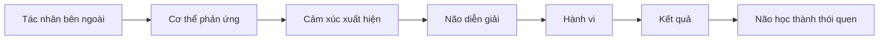
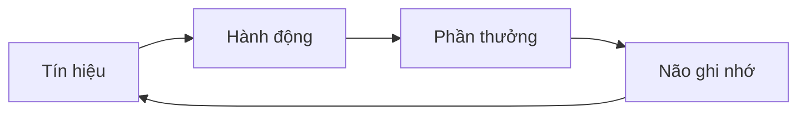

# Hiểu Con Người Từ Gốc

**Tâm lý, cảm xúc, quyết định và thói quen**  
Giáo trình ngắn gọn cho người trưởng thành, cấp quản lý/C-level

---

## 0. Cách Học Giáo Trình Này

### Mục tiêu

Không học để biết nhiều thuật ngữ.  
Học để **đọc con người rõ hơn**, **quyết định tỉnh hơn**, **lãnh đạo tốt hơn**, và **hiểu chính mình sâu hơn**.

### Cách học đúng

Mỗi bài chỉ cần trả lời 4 câu:

| Câu hỏi | Ý nghĩa |
|---|---|
| Bản chất là gì? | Nhìn xuống tầng gốc |
| Cơ chế vận hành ra sao? | Hiểu vì sao nó xảy ra |
| Biểu hiện trong đời sống thế nào? | Nhận ra trong người thật, việc thật |
| Áp dụng được gì? | Chuyển hiểu biết thành hành động |

### Công thức quan sát con người

Khi thấy một hành vi khó hiểu, đừng hỏi ngay:

> Người này đúng hay sai?

Hãy hỏi:

> Hành vi này đang giúp họ tìm điều gì, tránh điều gì, hoặc bảo vệ điều gì?

---

## 1. Bản Đồ Gốc: Con Người Vận Hành Như Thế Nào?

### Bản chất

Con người không phải là một cỗ máy lý trí.

Con người là:

> Một cơ thể sinh học có bộ não luôn tìm an toàn, phần thưởng, kiểm soát, ý nghĩa, kết nối và tiết kiệm năng lượng.

### Sáu động lực gốc

| Động lực | Nghĩa đơn giản | Ví dụ |
|---|---|---|
| An toàn | Tránh rủi ro, đau đớn, mất mát | Không dám ra quyết định lớn |
| Phần thưởng | Tìm lợi ích, khoái cảm, kết quả tốt | Chọn việc dễ có kết quả nhanh |
| Kiểm soát | Muốn cảm thấy mình làm chủ | Khó chịu khi bị áp đặt |
| Kết nối | Muốn thuộc về, được công nhận | Sợ bị loại khỏi nhóm quyền lực |
| Ý nghĩa | Muốn việc mình làm có giá trị | Cạn năng lượng khi công việc vô nghĩa |
| Tiết kiệm năng lượng | Não thích đường dễ | Trì hoãn việc phức tạp |

### Mô hình đơn giản



### Ứng dụng cho C-level

Trong tổ chức, nhiều vấn đề không phải do nhân sự "không hiểu chiến lược", mà do họ cảm thấy:

- Không an toàn
- Mất quyền kiểm soát
- Không được công nhận
- Không thấy ý nghĩa
- Bị đe dọa vị trí
- Không tin phần thưởng xứng đáng với nỗ lực

### Câu hỏi thực hành

Khi một người chống đối thay đổi, hãy hỏi:

1. Họ sợ mất điều gì?
2. Họ không tin điều gì?
3. Họ đang bảo vệ quyền lợi, hình ảnh hay cảm giác an toàn nào?

---

## 2. Cảm Xúc: Tín Hiệu, Không Phải Kẻ Thù

### Bản chất

Cảm xúc là hệ thống cảnh báo và định hướng hành động.

> Cảm xúc không sinh ra để làm ta yếu đuối. Nó sinh ra để giúp ta sống sót và phản ứng nhanh.

### Các cảm xúc chính

| Cảm xúc | Thông điệp gốc | Nếu không hiểu sẽ thành |
|---|---|---|
| Sợ | Có nguy cơ | Né tránh, co cụm |
| Giận | Ranh giới bị xâm phạm | Công kích, kiểm soát |
| Buồn | Có mất mát | Rút lui, mất động lực |
| Xấu hổ | Có nguy cơ bị đánh giá | Phòng vệ, che giấu |
| Ghen | Sợ mất vị trí/kết nối | So sánh, nghi ngờ |
| Lo âu | Não dự đoán rủi ro | Suy nghĩ quá mức |

### Điều cần nhớ

Cảm xúc thường đến trước lý trí.

Ví dụ:

Một thành viên ban điều hành phản ứng mạnh trong cuộc họp. Bề mặt là "không đồng ý". Tầng sâu có thể là:

- Sợ mất ảnh hưởng
- Sợ bị quy trách nhiệm
- Cảm thấy không được tham vấn
- Cảm thấy bị xem nhẹ trước nhóm

### Kỹ thuật 90 giây

Khi cảm xúc mạnh xuất hiện:

1. Dừng phản ứng ngay.
2. Gọi tên cảm xúc: "Tôi đang giận", "Tôi đang lo".
3. Hỏi: "Cảm xúc này đang bảo vệ điều gì?"
4. Chờ cơ thể hạ nhiệt rồi mới quyết định.

### Ứng dụng lãnh đạo

Người lãnh đạo giỏi không phải là người không có cảm xúc.  
Người lãnh đạo giỏi là người **không để cảm xúc chưa được hiểu điều khiển hành vi**.

### Bài tập

Trong 7 ngày, mỗi khi khó chịu, ghi lại:

| Tình huống | Cảm xúc | Điều bị đe dọa | Phản ứng tốt hơn |
|---|---|---|---|
| Ai đó phản biện gay gắt | Giận | Uy tín | Hỏi lại dữ kiện |

---

## 3. Suy Nghĩ: Não Không Tìm Sự Thật, Não Tìm Cách Sống Sót

### Bản chất

Não không ghi nhận thế giới như camera.  
Não diễn giải thế giới qua ký ức, niềm tin, cảm xúc và lợi ích.

> Ta không phản ứng với sự kiện. Ta phản ứng với cách ta diễn giải sự kiện.

### Một ví dụ đơn giản

Sự kiện:

> CEO không trả lời tin nhắn trong 4 giờ.

Diễn giải có thể là:

- "Ông ấy bận."
- "Ông ấy không hài lòng."
- "Dự án có vấn đề."
- "Mình sắp mất niềm tin."

Cùng một sự kiện, nhiều thực tại tâm lý khác nhau.

### Các lỗi suy nghĩ phổ biến

| Lỗi | Nghĩa đơn giản | Ví dụ |
|---|---|---|
| Xác nhận niềm tin | Chỉ thấy dữ kiện ủng hộ mình | Đã nghi ai kém thì chỉ nhìn lỗi của họ |
| Dễ nhớ thì tưởng quan trọng | Cái nổi bật lấn át dữ kiện thật | Một case thất bại làm sợ cả thị trường |
| Quy kết cá nhân | Đổ hành vi cho tính cách | "Nó lười" thay vì xem hệ thống |
| Sợ mất mát | Mất đau hơn được vui | Không dám cắt sản phẩm yếu |
| Tự bảo vệ cái tôi | Giữ hình ảnh hơn giữ sự thật | Không nhận sai dù dữ kiện rõ |

### Ứng dụng cho quyết định cấp cao

Ở cấp C-level, nguy hiểm không chỉ là thiếu dữ liệu.  
Nguy hiểm lớn hơn là **dữ liệu bị diễn giải qua ego, sợ hãi, quyền lực và lợi ích cục bộ**.

### Bộ lọc trước khi tin một suy nghĩ

Hỏi 5 câu:

1. Đây là dữ kiện hay diễn giải?
2. Tôi đang muốn điều gì là đúng?
3. Tôi đang sợ điều gì là đúng?
4. Có bằng chứng ngược lại không?
5. Người không có lợi ích trong chuyện này sẽ nhìn ra sao?

---

## 4. Ra Quyết Định: Con Người Không Tối Ưu, Con Người Chọn Cái Có Vẻ Hợp Lý

### Bản chất

Ra quyết định là quá trình cân bằng giữa:

> Lợi ích, rủi ro, cảm xúc, ký ức, năng lượng, áp lực xã hội và thời gian.

### Hai hệ thống quyết định

| Hệ | Đặc điểm | Khi nào hữu ích | Rủi ro |
|---|---|---|---|
| Nhanh | Trực giác, cảm xúc, kinh nghiệm | Tình huống quen thuộc | Dễ thiên kiến |
| Chậm | Phân tích, so sánh, kiểm chứng | Quyết định lớn, mới, phức tạp | Tốn năng lượng |

### Quyết định sai thường đến từ đâu?

| Nguồn | Ví dụ |
|---|---|
| Mệt mỏi | Chọn phương án dễ nhất |
| Áp lực thời gian | Chốt deal không đủ kiểm chứng |
| Ego | Không muốn đảo chiều quyết định cũ |
| Sợ mất mặt | Tiếp tục dự án sai |
| Nhóm đồng thuận giả | Không ai dám nói thật |
| Phần thưởng ngắn hạn | Hy sinh năng lực dài hạn |

### Công thức quyết định tỉnh

Trước quyết định lớn, viết ra:

```text
1. Quyết định cần đưa ra là gì?
2. Nếu sai, cái giá là gì?
3. Có đảo ngược được không?
4. Dữ kiện nào là chắc?
5. Giả định nào chưa được kiểm chứng?
6. Ai sẽ phản đối quyết định này, và vì sao?
7. Nếu không sợ mất mặt, tôi sẽ chọn gì?
```

### Nguyên tắc thực dụng

| Loại quyết định | Cách xử lý |
|---|---|
| Dễ đảo ngược | Quyết nhanh, thử nhỏ |
| Khó đảo ngược | Chậm lại, phản biện kỹ |
| Thiếu dữ kiện | Chạy thử nghiệm |
| Nhiều cảm xúc | Tách người khỏi vấn đề |
| Có quyền lực/ego | Mời người phản biện độc lập |

### Bài tập

Chọn một quyết định lớn gần đây. Viết lại:

- Khi đó tôi sợ mất gì?
- Tôi bị áp lực bởi ai?
- Tôi có bỏ qua dữ kiện ngược không?
- Nếu quay lại, tôi sẽ thêm bước kiểm chứng nào?

---

## 5. Thói Quen: Não Tự Động Hóa Để Tiết Kiệm Năng Lượng

### Bản chất

Thói quen là hành vi được não tự động hóa vì nó từng đem lại phần thưởng.

> Thói quen xấu thường không tồn tại vì ta ngu. Nó tồn tại vì nó giải quyết một cảm giác khó chịu nào đó rất nhanh.

### Vòng lặp thói quen



### Ví dụ

| Tín hiệu | Hành động | Phần thưởng |
|---|---|---|
| Căng thẳng | Lướt điện thoại | Dễ chịu tạm thời |
| Việc khó | Trì hoãn | Giảm lo ngay |
| Mệt | Ăn ngọt | Có năng lượng nhanh |
| Bị phê bình | Phòng vệ | Bảo vệ cái tôi |

### Muốn đổi thói quen, đừng chỉ dùng ý chí

Ý chí yếu nhất khi:

- Mệt
- Đói
- Stress
- Bị quá tải
- Cảm thấy vô nghĩa

Muốn đổi hành vi, hãy đổi hệ thống.

### Công thức đổi thói quen

| Muốn làm nhiều hơn | Muốn làm ít đi |
|---|---|
| Làm nó dễ thấy | Làm nó khuất đi |
| Làm nó dễ bắt đầu | Làm nó khó bắt đầu |
| Gắn với phần thưởng nhanh | Cắt phần thưởng nhanh |
| Gắn với danh tính | Tách khỏi danh tính |
| Làm trong môi trường hỗ trợ | Loại tín hiệu kích hoạt |

### Ứng dụng cho lãnh đạo

Văn hóa công ty thực chất là **thói quen tập thể**.

Ví dụ:

| Vấn đề văn hóa | Thói quen thật |
|---|---|
| Không dám nói thật | Nói thật từng bị phạt |
| Họp quá nhiều | Mọi người né quyết định cá nhân |
| Chạy theo việc gấp | Việc chiến lược không có phần thưởng rõ |
| Đổ lỗi | Hệ thống thưởng cho việc tự bảo vệ |

### Câu hỏi thực hành

Nếu một hành vi cứ lặp lại trong tổ chức, hãy hỏi:

1. Tín hiệu nào kích hoạt nó?
2. Nó đem lại phần thưởng gì?
3. Ai đang được lợi khi nó tiếp diễn?
4. Muốn đổi, phải đổi môi trường hay đổi KPI?

---

## 6. Quan Hệ Và Xã Hội: Con Người Cần Được Thuộc Về

### Bản chất

Con người là sinh vật xã hội.

> Bị loại trừ, bị xem thường, bị mất mặt hay mất vị trí đều có thể được não xử lý như một dạng nguy hiểm.

### Nhu cầu xã hội cốt lõi

| Nhu cầu | Khi được đáp ứng | Khi bị đe dọa |
|---|---|---|
| Được tôn trọng | Hợp tác | Phòng vệ |
| Được công nhận | Có động lực | Bất mãn |
| Thuộc về | Trung thành | Rút lui |
| Có vị trí | Chủ động | Cạnh tranh ngầm |
| Công bằng | Tin tưởng | Chống đối |
| Tự chủ | Trách nhiệm | Kháng cự |

### Vì sao người thông minh vẫn cư xử khó hiểu?

Vì lúc bị đe dọa xã hội, họ không còn vận hành bằng trí thông minh tốt nhất.  
Họ vận hành bằng cơ chế tự vệ.

Biểu hiện:

- Cãi để thắng
- Im lặng để tránh rủi ro
- Đổ lỗi để giữ hình ảnh
- Kéo phe để có an toàn
- Chống đối thụ động

### Kỹ thuật đọc xung đột

Trong một xung đột, tách 3 lớp:

| Lớp | Câu hỏi |
|---|---|
| Nội dung | Họ đang nói về việc gì? |
| Lợi ích | Họ muốn giữ hoặc đạt điều gì? |
| Bản sắc | Họ sợ bị nhìn nhận là người thế nào? |

### Ứng dụng trong đối thoại khó

Thay vì nói:

> Anh sai ở điểm này.

Hãy thử:

> Tôi muốn hiểu điều gì làm anh lo nhất trong phương án này.

Thay vì nói:

> Team này thiếu trách nhiệm.

Hãy hỏi:

> Trong hệ thống hiện tại, điều gì khiến mọi người không dám nhận trách nhiệm?

---

## 7. Nhân Cách: Mỗi Người Có Hệ Điều Hành Khác Nhau

### Bản chất

Nhân cách là khuynh hướng phản ứng ổn định của một người trước thế giới.

> Nhân cách không phải số phận. Nhưng nó tạo ra điểm mạnh, điểm mù và môi trường phù hợp.

### Mô hình Big Five

| Yếu tố | Cao thì thường | Thấp thì thường |
|---|---|---|
| Cởi mở | Thích ý tưởng mới, sáng tạo | Thực tế, thích ổn định |
| Kỷ luật | Có tổ chức, đáng tin | Linh hoạt, dễ tùy hứng |
| Hướng ngoại | Nạp năng lượng từ tương tác | Nạp năng lượng từ yên tĩnh |
| Dễ hợp tác | Mềm mỏng, tin người | Thẳng, cạnh tranh |
| Nhạy cảm cảm xúc | Dễ lo, nhạy tín hiệu | Bình tĩnh, ít dao động |

### Ứng dụng khi dùng người

Không hỏi:

> Người này tốt hay dở?

Hỏi:

> Người này mạnh trong môi trường nào, yếu trong môi trường nào?

Ví dụ:

| Kiểu người | Hợp với | Dễ yếu khi |
|---|---|---|
| Rất sáng tạo | Chiến lược, sản phẩm mới | Cần vận hành lặp lại |
| Rất kỷ luật | Scale, kiểm soát chất lượng | Môi trường quá mơ hồ |
| Rất hướng ngoại | Bán hàng, đối ngoại | Cần tập trung sâu lâu |
| Rất nhạy cảm | Nhìn rủi ro, đọc cảm xúc | Áp lực kéo dài |
| Rất cạnh tranh | Đàm phán, tăng trưởng | Cần nuôi dưỡng đội ngũ |

### Lưu ý cho lãnh đạo

Lãnh đạo yếu cố sửa mọi người thành một kiểu.  
Lãnh đạo mạnh thiết kế vai trò, môi trường và kỳ vọng phù hợp với cấu hình con người.

---

## 8. Sang Chấn, Phòng Vệ Và Những Phản Ứng Khó Hiểu

### Bản chất

Một số phản ứng hiện tại không đến từ hiện tại.  
Chúng đến từ những trải nghiệm cũ chưa được xử lý.

> Khi não từng học rằng một điều gì đó nguy hiểm, nó có thể phản ứng quá mức dù hiện tại không còn nguy hiểm thật.

### Cơ chế phòng vệ thường gặp

| Phòng vệ | Nghĩa đơn giản | Ví dụ |
|---|---|---|
| Phủ nhận | Không chấp nhận sự thật | "Không có vấn đề gì cả" |
| Hợp lý hóa | Tìm lý do nghe hợp lý | "Tôi làm vậy vì công ty" |
| Đổ lỗi | Đẩy đau đớn ra ngoài | "Tất cả là do team kia" |
| Kiểm soát | Giảm lo bằng kiểm soát người khác | Micro-management |
| Tránh né | Không chạm vào điều gây đau | Né cuộc trò chuyện khó |
| Tấn công trước | Đánh để khỏi bị đánh | Phản ứng gay gắt khi bị góp ý |

### Dấu hiệu một người đang phòng vệ

- Nghe ít, phản ứng nhanh
- Bám vào đúng/sai thay vì hiểu
- Cường độ cảm xúc lớn hơn tình huống
- Không chịu xem dữ kiện ngược
- Cố giữ hình ảnh bằng mọi giá

### Ứng dụng

Khi gặp phản ứng quá mạnh, hãy tự hỏi:

1. Mình đang thấy người này phản ứng với hiện tại hay với nỗi sợ cũ?
2. Có điều gì chạm vào tự trọng, quyền lực, an toàn hoặc ký ức thất bại của họ?
3. Mình nên tăng áp lực hay tạo thêm an toàn để họ có thể suy nghĩ lại?

### Ranh giới quan trọng

Hiểu tâm lý không có nghĩa là dung túng hành vi xấu.  
Hiểu để chọn phản ứng hiệu quả hơn.

---

## 9. Áp Dụng Vào Lãnh Đạo, Công Việc Và Đời Sống

### Mô hình 6 câu hỏi để đọc người

Khi muốn hiểu một người, hỏi:

```text
1. Họ đang muốn điều gì?
2. Họ đang sợ mất điều gì?
3. Họ đang bảo vệ hình ảnh nào?
4. Họ được thưởng bởi hành vi nào?
5. Môi trường đang khiến họ cư xử ra sao?
6. Nếu họ cảm thấy an toàn hơn, họ có hành xử khác không?
```

### Mô hình 6 câu hỏi để hiểu chính mình

```text
1. Tôi đang cảm thấy gì?
2. Cảm xúc này đang bảo vệ điều gì?
3. Tôi đang phản ứng với sự thật hay diễn giải?
4. Tôi đang tìm phần thưởng ngắn hạn nào?
5. Tôi đang né nỗi đau nào?
6. Người trưởng thành nhất trong tôi sẽ làm gì?
```

### Mô hình thay đổi hành vi trong tổ chức

Muốn đổi hành vi, đừng chỉ truyền thông. Hãy đổi hệ thống.

| Tầng | Câu hỏi |
|---|---|
| Mục tiêu | Ta muốn hành vi nào? |
| Tín hiệu | Điều gì nhắc mọi người hành xử như cũ? |
| Phần thưởng | Hành vi cũ đang được thưởng thế nào? |
| Rủi ro | Hành vi mới có làm ai mất an toàn không? |
| Môi trường | Quy trình/KPI/quyền lực có cần đổi không? |
| Lặp lại | Hành vi mới được củng cố ra sao? |

### Ví dụ: muốn đội ngũ nói thật hơn

Sai lầm phổ biến:

> "Mọi người cứ nói thẳng, đừng sợ."

Cách nhìn từ gốc:

| Câu hỏi | Câu trả lời cần tìm |
|---|---|
| Nói thật từng bị phạt chưa? | Nếu có, lời kêu gọi không đủ |
| Ai có quyền làm người khác mất mặt? | Quyền lực quyết định an toàn |
| Nói thật có được thưởng không? | Nếu không, người ta sẽ im |
| Lãnh đạo có nhận sai trước không? | Nếu không, văn hóa không đổi |

---

## 10. Lộ Trình Học 8 Tuần

### Tuần 1: Bản đồ con người

Mục tiêu:

- Hiểu 6 động lực gốc
- Tập nhìn hành vi như một chiến lược sinh tồn/tìm thưởng/tránh đau

Bài tập:

- Chọn 3 hành vi khó hiểu trong công ty/gia đình.
- Với mỗi hành vi, viết: "Người này đang tìm gì hoặc tránh gì?"

### Tuần 2: Cảm xúc

Mục tiêu:

- Gọi tên cảm xúc
- Không phản ứng ngay khi cơ thể đang căng

Bài tập:

- Ghi 5 lần cảm xúc mạnh trong tuần.
- Mỗi lần viết: cảm xúc, điều bị đe dọa, phản ứng tốt hơn.

### Tuần 3: Suy nghĩ và diễn giải

Mục tiêu:

- Tách dữ kiện khỏi diễn giải
- Nhận ra thiên kiến cá nhân

Bài tập:

- Với một vấn đề đang bận tâm, chia thành 2 cột: "Dữ kiện" và "Tôi đang diễn giải".

### Tuần 4: Ra quyết định

Mục tiêu:

- Biết khi nào dùng trực giác, khi nào cần phân tích
- Giảm quyết định do ego và sợ hãi

Bài tập:

- Dùng bộ 7 câu hỏi ở bài 4 cho một quyết định thật.

### Tuần 5: Thói quen cá nhân

Mục tiêu:

- Nhìn thói quen như vòng lặp tín hiệu - hành động - phần thưởng
- Sửa một thói quen nhỏ

Bài tập:

- Chọn một thói quen xấu.
- Xác định tín hiệu, hành động, phần thưởng.
- Đổi môi trường trong 7 ngày.

### Tuần 6: Thói quen tổ chức

Mục tiêu:

- Nhìn văn hóa như thói quen tập thể
- Tìm phần thưởng ẩn sau hành vi xấu

Bài tập:

- Chọn một hành vi tổ chức lặp lại.
- Hỏi: hành vi này đang được thưởng như thế nào?

### Tuần 7: Quan hệ và xung đột

Mục tiêu:

- Đọc được lớp nội dung, lợi ích và bản sắc
- Giảm phản ứng phòng vệ trong đối thoại khó

Bài tập:

- Trước một cuộc đối thoại khó, viết ra: họ có thể sợ mất gì?

### Tuần 8: Nhân cách và dùng người

Mục tiêu:

- Hiểu khác biệt cá nhân
- Thiết kế vai trò phù hợp hơn với con người

Bài tập:

- Chọn 3 người quan trọng trong đội ngũ.
- Viết: điểm mạnh, điểm yếu, môi trường phù hợp, cách giao tiếp phù hợp.

---

## 11. Bảng Tóm Tắt First Principles

| Chủ đề | Bản chất gốc | Câu hỏi áp dụng |
|---|---|---|
| Cảm xúc | Tín hiệu bảo vệ/hành động | Cảm xúc này bảo vệ điều gì? |
| Suy nghĩ | Diễn giải, không phải sự thật tuyệt đối | Đây là dữ kiện hay diễn giải? |
| Quyết định | Cân bằng lợi ích, sợ hãi, năng lượng, bối cảnh | Tôi đang sợ mất gì? |
| Thói quen | Vòng lặp có phần thưởng | Phần thưởng ẩn là gì? |
| Xung đột | Va chạm lợi ích, bản sắc, an toàn | Điều gì đang bị đe dọa? |
| Nhân cách | Khuynh hướng phản ứng ổn định | Người này hợp môi trường nào? |
| Văn hóa | Thói quen tập thể được thưởng/phạt | Hệ thống đang thưởng hành vi nào? |

---

## 12. Một Câu Để Nhớ Toàn Bộ Giáo Trình

> Mọi hành vi con người đều là nỗ lực tìm an toàn, phần thưởng, kiểm soát, ý nghĩa, kết nối hoặc tránh đau đớn.

Khi hiểu câu này, bạn sẽ bớt phán xét vội, bớt phản ứng cảm tính, và bắt đầu nhìn con người ở tầng cơ chế.

Đó là nền tảng của tự hiểu mình, đọc người, lãnh đạo và ra quyết định trưởng thành.

