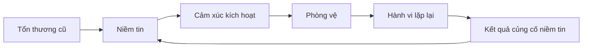

# Tập 10: Tâm Lý Chữa Lành Và Trưởng Thành Nội Tâm

**Hiểu tổn thương, phòng vệ, tự lừa mình, bản sắc và con đường trưởng thành cảm xúc**  
Giáo trình ngắn gọn cho người trưởng thành, cấp quản lý/C-level

---

## 0. Vì Sao C-level Cần Học Chữa Lành Và Trưởng Thành Nội Tâm?

### Bản chất

Người thành công vẫn có thể bị điều khiển bởi nỗi đau cũ:

- Sợ bị xem thường
- Sợ thất bại
- Sợ mất kiểm soát
- Sợ bị bỏ rơi
- Cần chứng minh liên tục
- Không cho phép mình yếu
- Dùng thành công để né trống rỗng

Chữa lành không phải là yếu đuối.  
Chữa lành là giảm mức độ quá khứ điều khiển hiện tại.

### Một câu cần nhớ

> Trưởng thành nội tâm là khả năng nhìn thấy sự thật về mình mà không phòng vệ, rồi chọn hành động theo giá trị thay vì theo vết thương.

### Mục tiêu tập này

| Năng lực | Ý nghĩa thực tế |
|---|---|
| Nhận ra vết thương cũ | Biết điều gì đang kích hoạt mình |
| Hiểu cơ chế phòng vệ | Không bị tự động hóa bởi ego |
| Tích hợp cảm xúc | Không đè nén hoặc bùng nổ |
| Viết lại bản sắc | Không sống theo vai cũ |
| Trưởng thành | Hành động theo giá trị, không theo nỗi sợ |

---

## 1. First Principles: Chữa Lành Là Gì?

### Bản chất

Chữa lành không phải là xóa quá khứ.  
Chữa lành là làm cho quá khứ không còn điều khiển hiện tại một cách vô thức.

```text
Chữa lành = Nhận diện + Cảm nhận + Hiểu nghĩa + Tích hợp + Hành vi mới
```

### Mô hình



### Câu hỏi gốc

```text
1. Phản ứng này có lớn hơn tình huống hiện tại không?
2. Nó giống cảm giác cũ nào?
3. Tôi đang bảo vệ điều gì?
4. Tôi có lựa chọn hành vi mới không?
```

---

## 2. Tổn Thương Tâm Lý Là Gì?

### Bản chất

Tổn thương tâm lý là trải nghiệm làm hệ thần kinh học rằng:

- Tôi không an toàn
- Tôi không đủ tốt
- Tôi không được yêu
- Tôi phải tự lo hết
- Tôi không được sai
- Tôi không được yếu
- Tôi phải làm hài lòng người khác

### Không chỉ là biến cố lớn

Tổn thương có thể đến từ:

- Bị xem thường kéo dài
- Không được lắng nghe
- Tình yêu có điều kiện
- Luôn phải thành công mới được công nhận
- Gia đình nhiều kiểm soát
- Bị bỏ mặc cảm xúc
- Thất bại hoặc phản bội sâu

### Dấu hiệu vết thương đang hoạt động

| Dấu hiệu | Có thể liên quan |
|---|---|
| Phản ứng quá mạnh | Cảm giác cũ bị kích hoạt |
| Cần kiểm soát | Sợ mất an toàn |
| Không nhận sai được | Sợ vô giá trị |
| Khó tin người | Từng bị phản bội/bỏ rơi |
| Luôn chứng minh | Từng thấy mình không đủ |
| Không biết nghỉ | Giá trị bản thân gắn với làm |

---

## 3. Phòng Vệ: Cách Tâm Trí Bảo Vệ Khỏi Đau

### Bản chất

Phòng vệ là chiến lược tâm lý để tránh cảm giác khó chịu hoặc sự thật đe dọa bản sắc.

Nó từng có ích.  
Nhưng nếu kéo dài, nó làm ta không trưởng thành.

### Các cơ chế phổ biến

| Phòng vệ | Biểu hiện | Điều đang né |
|---|---|---|
| Phủ nhận | "Không có vấn đề" | Sự thật đau |
| Hợp lý hóa | Lý do nghe hợp lý | Động cơ thật |
| Đổ lỗi | Tất cả do người khác | Trách nhiệm |
| Kiểm soát | Ép mọi thứ theo ý | Lo âu |
| Trí thức hóa | Phân tích thay vì cảm | Cảm xúc |
| Tấn công | Đánh trước | Xấu hổ/sợ |
| Né tránh | Không chạm vào | Đau hoặc mơ hồ |

### Câu hỏi xuyên phòng vệ

```text
1. Nếu tôi không biện minh, sự thật khó chịu là gì?
2. Tôi đang né cảm xúc nào?
3. Tôi đang đổ lỗi để khỏi nhận phần trách nhiệm nào?
4. Tôi đang phân tích để khỏi cảm nhận điều gì?
```

---

## 4. Kích Hoạt Cảm Xúc

### Bản chất

Kích hoạt là khi hiện tại chạm vào vết thương cũ, làm cơ thể phản ứng như thể nguy hiểm cũ đang quay lại.

### Ví dụ

| Sự kiện hiện tại | Vết thương có thể bị chạm |
|---|---|
| Bị phản biện | Sợ bị xem là kém |
| Người thân im lặng | Sợ bị bỏ rơi |
| Nhân sự không nghe | Sợ mất kiểm soát |
| Deal thất bại | Sợ mình vô giá trị |
| Người khác thành công hơn | Sợ thua kém |

### Quy trình 5 bước

```text
1. Dừng lại.
2. Gọi tên cảm xúc.
3. Nhận ra câu chuyện trong đầu.
4. Hỏi: chuyện này giống cảm giác cũ nào?
5. Chọn phản ứng của người trưởng thành hiện tại.
```

### Nguyên tắc

> Khi bị kích hoạt, câu hỏi không chỉ là "chuyện gì đang xảy ra?", mà là "chuyện này đang chạm vào điều gì trong tôi?"

---

## 5. Đứa Trẻ Nội Tâm Và Vai Cũ

### Bản chất

"Đứa trẻ nội tâm" là phần trong ta mang những nhu cầu, nỗi sợ và cách thích nghi từ thời nhỏ.

Nó không phải khái niệm màu mè.  
Nó là cách gọi phần cảm xúc cũ vẫn phản ứng trong hiện tại.

### Vai cũ thường gặp

| Vai | Niềm tin ngầm |
|---|---|
| Người phải giỏi | Chỉ giỏi mới được yêu |
| Người gánh vác | Nếu tôi không lo, mọi thứ sụp |
| Người làm hài lòng | Nói không sẽ bị bỏ |
| Người kiểm soát | An toàn chỉ có khi tôi nắm hết |
| Người không cần ai | Cần người khác là nguy hiểm |
| Người nổi loạn | Không ai được kiểm soát tôi |

### Câu hỏi

```text
1. Tôi học vai này từ đâu?
2. Vai này từng bảo vệ tôi thế nào?
3. Bây giờ nó đang làm tôi mất gì?
4. Người trưởng thành trong tôi muốn chọn vai nào mới?
```

---

## 6. Tự Lừa Mình

### Bản chất

Tự lừa mình là khi ta bóp méo sự thật để bảo vệ bản sắc, ham muốn hoặc nỗi sợ.

### Các câu tự lừa phổ biến

| Câu nói | Sự thật có thể là |
|---|---|
| Tôi ổn | Tôi không muốn cảm nhận |
| Tôi làm vì công ty | Tôi cũng đang bảo vệ ego |
| Tôi không có lựa chọn | Tôi sợ cái giá của lựa chọn |
| Tôi chỉ tiêu chuẩn cao | Tôi đang kiểm soát vì lo |
| Tôi bận quá | Tôi đang né điều khó hơn |
| Tôi không cần ai | Tôi sợ phụ thuộc |

### Câu hỏi sự thật

```text
1. Nếu hoàn toàn trung thực, tôi đang muốn gì?
2. Tôi đang sợ điều gì?
3. Tôi đang được lợi gì khi giữ câu chuyện này?
4. Cái giá của việc không nhìn sự thật là gì?
```

---

## 7. Tha Thứ Và Ranh Giới

### Bản chất

Tha thứ không phải là nói chuyện đã xảy ra là đúng.  
Tha thứ là không để vết thương tiếp tục chiếm quyền điều khiển đời sống bên trong.

Ranh giới vẫn cần thiết.

| Không phải tha thứ | Tha thứ trưởng thành |
|---|---|
| Quên hết | Nhớ nhưng không bị điều khiển |
| Cho phép lặp lại | Có ranh giới rõ |
| Phủ nhận đau | Công nhận đau |
| Bắt buộc hòa giải | Có thể buông mà không quay lại |

### Câu hỏi

```text
1. Tôi đang giữ điều gì vì cần công lý?
2. Tôi đang giữ điều gì vì không muốn buông vai nạn nhân?
3. Ranh giới nào cần có để tôi không bị tổn thương lại?
```

---

## 8. Trưởng Thành Cảm Xúc

### Bản chất

Trưởng thành cảm xúc là khả năng:

- Cảm nhận mà không bùng nổ
- Nhìn mình mà không sụp đổ
- Nhận sai mà không mất giá trị
- Nói nhu cầu mà không đòi hỏi
- Đặt ranh giới mà không trừng phạt
- Chọn giá trị thay vì phản xạ

### Dấu hiệu trưởng thành

| Chưa trưởng thành | Trưởng thành hơn |
|---|---|
| Phản ứng ngay | Dừng để chọn |
| Đổ lỗi | Nhận phần trách nhiệm |
| Cần thắng | Cần hiểu |
| Né cảm xúc | Gọi tên cảm xúc |
| Đồng nhất với vai trò | Có bản sắc rộng hơn |
| Kiểm soát | Tin vào ranh giới và hệ thống |

### Câu hỏi

> Người trưởng thành nhất trong tôi sẽ làm gì trong tình huống này?

---

## 9. Viết Lại Bản Sắc

### Bản chất

Ta không chỉ thay đổi hành vi.  
Ta thay đổi câu chuyện "tôi là ai".

### Từ bản sắc cũ sang mới

| Cũ | Mới |
|---|---|
| Tôi phải giỏi mới có giá trị | Tôi có giá trị và vẫn tiếp tục phát triển |
| Tôi phải kiểm soát mọi thứ | Tôi tạo hệ thống và tin người phù hợp |
| Tôi không được yếu | Tôi có thể thật và vẫn mạnh |
| Tôi phải làm hài lòng | Tôi có thể yêu thương và có ranh giới |
| Tôi là thành công của tôi | Thành công là một phần, không phải toàn bộ tôi |

### Bài tập

```text
Bản sắc cũ:
Nó từng bảo vệ tôi thế nào:
Cái giá hiện tại:
Bản sắc mới:
Hành vi nhỏ chứng minh bản sắc mới:
```

---

## 10. Khi Nào Cần Hỗ Trợ Chuyên Gia?

### Bản chất

Tự học giúp rất nhiều, nhưng có lúc cần chuyên gia tâm lý/trị liệu.

Nên cân nhắc khi:

- Mất ngủ kéo dài
- Lo âu/trầm buồn ảnh hưởng đời sống
- Cơn giận khó kiểm soát
- Sang chấn cũ tái hiện mạnh
- Quan hệ lặp lại mô hình đau
- Dùng rượu/chất kích thích để né cảm xúc
- Có ý nghĩ tự hại hoặc tuyệt vọng

### Nguyên tắc

> Tìm hỗ trợ không phải là thất bại. Đó là hành động có trách nhiệm với đời sống của mình và người xung quanh.

---

## 11. Công Cụ Thực Hành

### Công cụ 1: Bản đồ kích hoạt

```text
Tình huống:
Cảm xúc:
Cảm giác trong cơ thể:
Câu chuyện trong đầu:
Vết thương/niềm tin cũ có thể bị chạm:
Phòng vệ tôi dùng:
Phản ứng trưởng thành hơn:
```

### Công cụ 2: Xuyên phòng vệ

```text
Tôi đang biện minh điều gì?
Tôi đang né cảm xúc nào?
Tôi đang sợ sự thật nào?
Phần trách nhiệm của tôi là gì?
Hành động sửa chữa nhỏ nhất là gì?
```

### Công cụ 3: Review bản sắc

| Câu hỏi | Trả lời |
|---|---|
| Tôi đang sống theo vai cũ nào? |  |
| Vai này từng bảo vệ tôi ra sao? |  |
| Vai này đang làm tôi mất gì? |  |
| Bản sắc mới tôi muốn chọn là gì? |  |
| Hành vi nhỏ chứng minh là gì? |  |

---

## 12. Lộ Trình Thực Hành 4 Tuần

### Tuần 1: Nhận diện kích hoạt

- Ghi 3 lần phản ứng mạnh trong tuần.
- Tìm cảm xúc, câu chuyện và vết thương có thể bị chạm.

### Tuần 2: Nhìn phòng vệ

- Chọn một cơ chế phòng vệ hay dùng.
- Khi nó xuất hiện, hỏi: tôi đang né cảm xúc nào?

### Tuần 3: Sửa chữa

- Chọn một hành vi lặp lại gây tổn thương.
- Nhận trách nhiệm và thực hiện một hành vi sửa chữa nhỏ.

### Tuần 4: Bản sắc mới

- Viết lại một bản sắc cũ.
- Mỗi ngày làm một hành vi nhỏ chứng minh bản sắc mới.

---

## 13. Bảng Tóm Tắt First Principles

| Chủ đề | Bản chất | Câu hỏi áp dụng |
|---|---|---|
| Chữa lành | Quá khứ bớt điều khiển hiện tại | Phản ứng này đến từ hiện tại hay vết thương cũ? |
| Tổn thương | Hệ thần kinh học điều gì là nguy hiểm | Tôi đã học niềm tin nào? |
| Phòng vệ | Tránh đau hoặc bảo vệ bản sắc | Tôi đang né cảm xúc nào? |
| Kích hoạt | Hiện tại chạm vào quá khứ | Chuyện này giống cảm giác cũ nào? |
| Vai cũ | Chiến lược thích nghi xưa | Vai này còn phù hợp không? |
| Tự lừa mình | Bóp méo sự thật để đỡ đau | Tôi được lợi gì khi giữ câu chuyện này? |
| Tha thứ | Không để vết thương điều khiển tiếp | Ranh giới nào vẫn cần giữ? |
| Trưởng thành | Chọn giá trị thay vì phản xạ | Người trưởng thành nhất trong tôi sẽ làm gì? |
| Bản sắc | Câu chuyện "tôi là ai" | Tôi muốn sống theo bản sắc nào? |

---

## 14. Một Câu Để Nhớ Toàn Bộ Tập 10

> Trưởng thành nội tâm là đủ can đảm để nhìn sự thật về mình, đủ dịu dàng để không tự hủy vì sự thật đó, và đủ kỷ luật để chọn hành vi mới.

