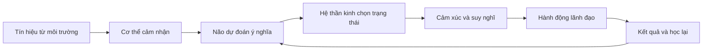
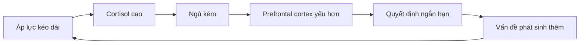

# Tập 11: Neuroscience Cơ Bản Cho Người Lãnh Đạo

**Hiểu não bộ, hệ thần kinh, stress, dopamine, cortisol, giấc ngủ, burnout và cách cơ thể ảnh hưởng đến quyết định**  
Giáo trình ngắn gọn cho người trưởng thành, cấp quản lý/C-level

---

## 0. Vì Sao C-level Cần Học Neuroscience Cơ Bản?

### Bản chất

Lãnh đạo không chỉ ra quyết định bằng lý trí.  
Lãnh đạo ra quyết định bằng cả não bộ, hệ thần kinh, cơ thể, hormone, giấc ngủ và mức độ an toàn bên trong.

Ở cấp cao, một quyết định sai thường không đến từ thiếu thông tin.  
Nó đến từ trạng thái thần kinh không phù hợp:

- Quá căng nên nhìn mọi thứ như mối đe dọa
- Quá mệt nên chọn phương án dễ nhất
- Quá hưng phấn nên đánh giá thấp rủi ro
- Quá sợ mất nên kiểm soát quá mức
- Quá thiếu ngủ nên mất kiên nhẫn
- Quá kiệt sức nên nhầm tê liệt với bình tĩnh
- Quá quen áp lực nên xem bất thường là bình thường

Neuroscience không biến lãnh đạo thành bác sĩ.  
Nó giúp lãnh đạo hiểu nền sinh học phía sau hành vi, cảm xúc và quyết định.

### Một câu cần nhớ

> Chất lượng lãnh đạo phụ thuộc rất lớn vào trạng thái hệ thần kinh tại thời điểm ra quyết định.

### Mục tiêu tập này

| Năng lực | Ý nghĩa thực tế |
|---|---|
| Hiểu não và hệ thần kinh cơ bản | Không thần bí hóa cảm xúc và phản ứng |
| Nhận diện stress | Biết khi nào cơ thể đang điều khiển quyết định |
| Hiểu fight/flight/freeze | Đọc phản ứng của mình và đội ngũ dưới áp lực |
| Quản trị dopamine/cortisol | Không bị nghiện kích thích hoặc sống bằng căng thẳng |
| Bảo vệ giấc ngủ | Giữ năng lực suy nghĩ cấp cao |
| Phòng burnout | Không nhầm kiệt sức với kỷ luật |
| Dùng neuroplasticity | Thiết kế thói quen và văn hóa học hỏi |

---

## 1. First Principles: Não Bộ Dùng Để Làm Gì?

### Bản chất

Não không được thiết kế trước hết để làm bạn hạnh phúc.  
Não được thiết kế để giúp cơ thể sống sót, tiết kiệm năng lượng, dự đoán tương lai và chọn hành động.

```text
Não bộ = Dự đoán + Bảo vệ + Tiết kiệm năng lượng + Điều phối hành động
```

Vì vậy, não thường ưu tiên:

- An toàn hơn sự thật
- Quen thuộc hơn tối ưu
- Ngắn hạn hơn dài hạn
- Năng lượng thấp hơn phân tích sâu
- Tín hiệu đe dọa hơn tín hiệu cơ hội

### Mô hình đơn giản



### Câu hỏi gốc

```text
1. Tôi đang nhìn sự thật hay nhìn qua trạng thái căng thẳng?
2. Cơ thể tôi đang báo an toàn, nguy hiểm hay kiệt sức?
3. Quyết định này cần tốc độ, bình tĩnh hay phục hồi trước?
4. Hệ thống của tôi đang huấn luyện con người sống trong trạng thái nào?
```

---

## 2. Não Và Hệ Thần Kinh Cơ Bản

### Bản chất

Não là trung tâm xử lý, nhưng nó không làm việc một mình.  
Nó liên tục trao đổi với cơ thể qua hệ thần kinh, hormone, nhịp tim, hơi thở, tiêu hóa, cơ bắp và cảm giác bên trong.

Bạn không có một "cái đầu" tách rời khỏi cơ thể.  
Bạn có một hệ thống thân - não đang cùng ra quyết định.

### Ba lớp cần hiểu

| Thành phần | Vai trò đơn giản | Khi lãnh đạo cần chú ý |
|---|---|---|
| Não sinh tồn | Phát hiện nguy hiểm, phản ứng nhanh | Khi bị kích hoạt, mất bình tĩnh |
| Não cảm xúc | Gắn ý nghĩa, ký ức, quan hệ | Khi phản ứng mạnh với người/sự kiện |
| Não điều hành | Lập kế hoạch, ức chế xung động, nhìn dài hạn | Khi cần quyết định chiến lược |

Đây là mô hình đơn giản hóa, không phải bản đồ giải phẫu tuyệt đối.  
Nó hữu ích vì giúp ta nhớ: dưới áp lực cao, phần phản ứng nhanh thường lên tiếng trước phần suy nghĩ sâu.

### Hệ thần kinh tự chủ

Hệ thần kinh tự chủ điều khiển nhiều chức năng không cần ý chí trực tiếp:

- Nhịp tim
- Hơi thở
- Tiêu hóa
- Đổ mồ hôi
- Căng cơ
- Mức cảnh giác
- Phản ứng với nguy hiểm

| Trạng thái | Biểu hiện | Quyết định dễ sinh ra |
|---|---|---|
| An toàn | Thở đều, tò mò, kết nối | Rõ ràng, cân nhắc, hợp tác |
| Huy động | Tim nhanh, căng, gấp | Tấn công, chạy, kiểm soát |
| Đóng băng | Tê, chậm, trống rỗng | Trì hoãn, né tránh, bất động |

---

## 3. Amygdala Và Prefrontal Cortex

### Bản chất

Amygdala có thể hiểu đơn giản là hệ thống cảnh báo nguy hiểm.  
Prefrontal cortex có thể hiểu đơn giản là vùng điều hành cấp cao: suy nghĩ, kiềm chế, lập kế hoạch, đổi góc nhìn và chọn hành động theo mục tiêu dài hạn.

Khi cơ thể thấy nguy hiểm, hệ cảnh báo cần phản ứng nhanh.  
Khi cần lãnh đạo tốt, vùng điều hành cần đủ năng lượng và đủ bình tĩnh để làm việc.

### Cách hiểu dễ nhớ

| Bộ phận | Vai trò dễ hiểu | Khi hoạt động quá mạnh/yếu |
|---|---|---|
| Amygdala | Báo động: "Có nguy hiểm không?" | Dễ phòng thủ, nghi ngờ, phản ứng quá mức |
| Prefrontal cortex | CEO nội tâm: "Việc đúng là gì?" | Nếu yếu đi: bốc đồng, ngắn hạn, thiếu kiểm soát |
| Hippocampus | Bối cảnh và ký ức | Stress kéo dài làm nhớ sai, học kém, khó đặt sự việc vào đúng ngữ cảnh |

### Điều quan trọng

Amygdala không xấu.  
Nó giúp ta sống sót.

Vấn đề là khi hệ báo động xem mọi thứ như nguy hiểm:

- Feedback bị hiểu thành công kích
- Rủi ro bị hiểu thành thảm họa
- Bất đồng bị hiểu thành phản bội
- Tin xấu bị hiểu thành đe dọa vị thế
- Sự im lặng của đội ngũ bị hiểu thành đồng thuận

### Câu hỏi khôi phục vùng điều hành

```text
1. Tôi có đang phản ứng như thể đây là nguy hiểm sinh tồn không?
2. Bằng chứng thật là gì?
3. Có cách giải thích nào ít đe dọa hơn không?
4. Nếu chờ 20 phút, quyết định này có khác không?
5. Người bình tĩnh nhất trong tôi sẽ hỏi câu gì?
```

---

## 4. Stress: Tín Hiệu, Không Phải Kẻ Thù

### Bản chất

Stress là phản ứng huy động năng lượng khi cơ thể cảm thấy có yêu cầu vượt mức bình thường.

Stress ngắn hạn có thể hữu ích:

- Tăng tập trung
- Tăng năng lượng
- Tăng tốc phản ứng
- Giúp vượt qua thử thách

Stress kéo dài làm hệ thống trả giá:

- Mất ngủ
- Dễ cáu
- Giảm trí nhớ
- Giảm đồng cảm
- Tăng kiểm soát
- Quyết định ngắn hạn
- Khó học điều mới

### Ba loại stress trong lãnh đạo

| Loại stress | Bản chất | Ví dụ |
|---|---|---|
| Stress nhiệm vụ | Việc khó, deadline, mục tiêu cao | Gọi vốn, ra mắt sản phẩm, tái cấu trúc |
| Stress quan hệ | Xung đột, mất niềm tin, chính trị | Co-founder bất đồng, nhân sự chủ chốt rời đi |
| Stress bản sắc | Đe dọa hình ảnh hoặc giá trị bản thân | Bị nghi ngờ năng lực, bị mất quyền, bị chê công khai |

Stress bản sắc thường nguy hiểm nhất với C-level, vì nó làm ego tham gia vào quyết định.

### Stress tốt và stress xấu

| Stress tốt | Stress xấu |
|---|---|
| Có thử thách nhưng có phục hồi | Áp lực kéo dài không hồi phục |
| Có rõ ràng | Mơ hồ, đổi liên tục |
| Có quyền kiểm soát phù hợp | Bị kẹt, không có lối ra |
| Có hỗ trợ | Cô lập |
| Có ý nghĩa | Chỉ còn chịu đựng |

---

## 5. Fight, Flight, Freeze Trong Công Việc

### Bản chất

Khi hệ thần kinh cảm thấy nguy hiểm, nó có thể chọn ba nhóm phản ứng cơ bản:

```text
Fight = Chống lại
Flight = Trốn/chạy
Freeze = Đóng băng
```

Trong văn phòng, các phản ứng này thường không lộ ra như trong phim.  
Chúng xuất hiện dưới dạng hành vi quản trị.

### Biểu hiện ở lãnh đạo

| Phản ứng | Biểu hiện bên ngoài | Câu chuyện bên trong |
|---|---|---|
| Fight | Gắt, ép, chỉ trích, micromanage | "Tôi phải kiểm soát ngay" |
| Flight | Né họp khó, chuyển chủ đề, bận giả | "Tôi không muốn chạm vào chuyện này" |
| Freeze | Im lặng, trì hoãn, tê liệt, không quyết | "Tôi không biết làm gì" |
| Fawn | Làm hài lòng, nhượng bộ quá mức | "Tôi phải giữ hòa khí để an toàn" |

Fawn không phải lúc nào cũng được nhắc trong ba phản ứng cổ điển, nhưng rất hữu ích để hiểu hành vi tổ chức: người ta nói "vâng" để giảm nguy hiểm, không phải vì thật sự đồng ý.

### Dấu hiệu đội ngũ đang ở trạng thái sinh tồn

- Ít nói thật
- Chỉ hỏi để xin phép
- Né trách nhiệm
- Đổ lỗi nhanh
- Họp nhiều nhưng quyết chậm
- Luôn cần lãnh đạo xác nhận
- Sáng tạo giảm
- Người giỏi trở nên phòng thủ

### Can thiệp của lãnh đạo

| Nếu thấy | Đừng vội | Hãy làm |
|---|---|---|
| Fight | Đấu quyền lực | Hạ nhiệt, làm rõ vấn đề và ranh giới |
| Flight | Gán nhãn thiếu trách nhiệm | Giảm mơ hồ, chia nhỏ bước tiếp theo |
| Freeze | Ép quyết ngay | Cho cấu trúc, dữ kiện và thời gian ngắn để hồi phục |
| Fawn | Tin là đã có đồng thuận | Hỏi bất đồng, rủi ro và điều họ chưa dám nói |

---

## 6. Dopamine: Động Lực, Dự Đoán Và Cạm Bẫy Kích Thích

### Bản chất

Dopamine không đơn giản là "hormone hạnh phúc".  
Nó liên quan nhiều đến động lực, dự đoán phần thưởng, tìm kiếm, học từ tín hiệu mới và muốn tiếp tục hành động.

Dopamine giúp lãnh đạo:

- Theo đuổi mục tiêu
- Chịu khó học
- Tìm cơ hội
- Có năng lượng khởi động
- Cảm thấy tiến bộ

Nhưng dopamine cũng tạo cạm bẫy:

- Nghiện tin nhắn, số liệu, dashboard
- Nghiện tăng trưởng ngắn hạn
- Nghiện deal, chiến thắng, drama
- Khó chịu với việc sâu và chậm
- Luôn cần kích thích mới

### Dopamine trong tổ chức

| Nguồn dopamine | Lợi ích | Rủi ro |
|---|---|---|
| Mục tiêu rõ | Tạo hướng và động lực | Nếu quá dày: kiệt sức |
| Thắng nhỏ | Tăng cảm giác tiến bộ | Nếu giả tạo: mất niềm tin |
| Phản hồi nhanh | Học nhanh | Nếu quá nhiều: nghiện tín hiệu |
| Cạnh tranh | Tăng năng lượng | Nếu độc hại: phá hợp tác |
| Công nhận | Củng cố hành vi tốt | Nếu lệch: chạy theo hình ảnh |

### Câu hỏi quản trị dopamine

```text
1. Tôi đang theo đuổi giá trị dài hạn hay chỉ theo kích thích mới?
2. Tổ chức đang nghiện chỉ số nào?
3. Chúng ta có đang thưởng cho tốc độ mà phạt chiều sâu không?
4. Thắng nhỏ này củng cố hành vi đúng hay hành vi lệch?
```

---

## 7. Cortisol: Căng Thẳng, Cảnh Giác Và Cái Giá Của Sống Bằng Áp Lực

### Bản chất

Cortisol là hormone quan trọng trong phản ứng stress.  
Nó giúp cơ thể huy động năng lượng, tỉnh táo và xử lý thách thức.

Cortisol không xấu.  
Vấn đề là cortisol cao kéo dài, không có nhịp phục hồi.

### Khi cortisol kéo dài

| Ảnh hưởng | Biểu hiện trong lãnh đạo |
|---|---|
| Giảm kiên nhẫn | Dễ gắt, cắt lời, quyết nhanh |
| Giảm linh hoạt | Bám vào phương án quen |
| Giảm đồng cảm | Xem con người như nguồn lực thuần túy |
| Tăng cảnh giác | Nghi ngờ động cơ của người khác |
| Giảm học hỏi | Khó tiếp nhận feedback |
| Rối loạn ngủ | Ngày sau càng kém điều hành |

### Vòng lặp nguy hiểm



### Nguyên tắc

```text
Áp lực không giết năng lực lãnh đạo.
Áp lực không có phục hồi mới làm năng lực lãnh đạo suy giảm.
```

---

## 8. Giấc Ngủ: Hạ Tầng Của Tư Duy Cấp Cao

### Bản chất

Giấc ngủ không phải là phần còn lại sau công việc.  
Giấc ngủ là hạ tầng sinh học cho trí nhớ, học hỏi, điều chỉnh cảm xúc, miễn dịch và ra quyết định.

Thiếu ngủ làm lãnh đạo dễ:

- Đánh giá sai rủi ro
- Phản ứng cảm xúc mạnh hơn
- Giảm khả năng lắng nghe
- Chọn ngắn hạn
- Ăn uống và dùng caffeine lệch
- Nhầm bận rộn với hiệu quả

### Giấc ngủ ảnh hưởng đến lãnh đạo

| Năng lực | Khi ngủ đủ | Khi thiếu ngủ |
|---|---|---|
| Kiềm chế | Có khoảng dừng | Dễ bốc đồng |
| Chiến lược | Nhìn rộng | Bị kẹt vào việc gần |
| Giao tiếp | Đọc người tốt hơn | Dễ hiểu sai |
| Học hỏi | Ghi nhớ và tích hợp | Lặp lỗi |
| Đạo đức | Giữ chuẩn tốt hơn | Dễ thỏa hiệp |

### Checklist bảo vệ giấc ngủ

```text
[ ] Có giờ tắt công việc tương đối ổn định
[ ] Không xử lý xung đột lớn sát giờ ngủ nếu không bắt buộc
[ ] Giảm caffeine sau đầu giờ chiều
[ ] Có ánh sáng tự nhiên buổi sáng
[ ] Có khoảng chuyển tiếp giữa làm việc và ngủ
[ ] Không dùng giấc ngủ làm ngân hàng để vay liên tục
```

---

## 9. Burnout: Khi Hệ Thần Kinh Không Còn Hồi Phục

### Bản chất

Burnout không chỉ là mệt.  
Burnout là trạng thái kiệt sức kéo dài, mất phục hồi, mất cảm giác hiệu quả và thường đi kèm thái độ xa cách hoặc cay đắng với công việc.

Burnout nguy hiểm với lãnh đạo vì người lãnh đạo vẫn có thể vận hành bên ngoài, nhưng bên trong đã mất sức sống, sự tinh tế và khả năng phán đoán.

### Dấu hiệu burnout

| Dấu hiệu | Câu tự nói thường gặp |
|---|---|
| Kiệt sức | "Tôi không còn gì để cho" |
| Tê cảm xúc | "Sao cũng được" |
| Cynicism | "Ai cũng vậy thôi" |
| Giảm hiệu quả | "Việc đơn giản cũng nặng" |
| Mất ý nghĩa | "Không biết làm để làm gì" |
| Cô lập | "Không ai hiểu, tự tôi xử lý" |

### Burnout khác áp lực cao

| Áp lực cao | Burnout |
|---|---|
| Mệt nhưng còn hồi phục | Nghỉ vẫn không hồi lại đủ |
| Còn thấy ý nghĩa | Mất ý nghĩa hoặc cay đắng |
| Còn linh hoạt | Cứng, tê hoặc né |
| Cần nghỉ ngắn | Cần thay đổi nhịp, tải và hệ thống |

### Câu hỏi nghiêm túc

```text
1. Tôi đang mệt, hay đang mất khả năng hồi phục?
2. Tôi còn cảm thấy ý nghĩa thật với việc đang làm không?
3. Tôi đang dùng ý chí để che một hệ thống sống sai nhịp không?
4. Nếu một nhân sự chủ chốt sống như tôi, tôi có xem là bền vững không?
```

---

## 10. Neuroplasticity: Não Có Thể Học Lại

### Bản chất

Neuroplasticity là khả năng não và hệ thần kinh thay đổi theo trải nghiệm, luyện tập, chú ý và môi trường.

Con người không cố định.  
Nhưng con người cũng không thay đổi chỉ vì hiểu một ý tưởng hay.

```text
Thay đổi thần kinh = Lặp lại + Cảm xúc đủ mạnh + Chú ý + Phản hồi + Nghỉ ngơi
```

### Điều này có nghĩa gì với lãnh đạo?

| Muốn thay đổi | Cần thiết kế |
|---|---|
| Hành vi cá nhân | Cue, hành động nhỏ, phản hồi, lặp lại |
| Văn hóa đội ngũ | Tín hiệu thưởng/phạt lặp lại |
| Năng lực mới | Luyện tập có chủ đích và feedback |
| Bình tĩnh dưới áp lực | Tập khi áp lực thấp trước, rồi tăng dần |
| Niềm tin mới | Trải nghiệm mới đủ nhất quán |

### Nguyên tắc học lại

- Não học từ điều được lặp lại, không chỉ điều được tuyên bố.
- Hệ thần kinh tin trải nghiệm hơn khẩu hiệu.
- Văn hóa là neuroplasticity ở cấp tập thể.
- Muốn đổi hành vi, phải đổi cả tín hiệu, nhịp và phần thưởng.

---

## 11. Cơ Thể Và Quyết Định

### Bản chất

Cơ thể không chỉ "đi theo" quyết định.  
Cơ thể tham gia tạo ra quyết định bằng cảm giác, năng lượng, nhịp tim, hơi thở, căng cơ và tín hiệu an toàn/nguy hiểm.

Nhiều điều ta gọi là "trực giác" thực ra là cơ thể nhận ra pattern nhanh hơn ngôn ngữ.  
Nhưng nhiều điều ta gọi là "trực giác" cũng có thể chỉ là lo âu, thành kiến hoặc ký ức cũ.

### Phân biệt trực giác và phản ứng stress

| Trực giác có chất lượng | Phản ứng stress |
|---|---|
| Rõ, tĩnh, không cần vội chứng minh | Gấp, căng, muốn hành động ngay |
| Dựa trên kinh nghiệm thật | Dựa trên sợ hãi hoặc vết thương |
| Vẫn mở với dữ kiện mới | Chỉ tìm bằng chứng xác nhận |
| Cơ thể tỉnh nhưng không hoảng | Cơ thể co, nóng, tê hoặc run |
| Có thể chờ kiểm chứng | Cảm thấy phải làm ngay để giảm khó chịu |

### Công thức quyết định thân - não

```text
Quyết định tốt = Dữ kiện + Lý trí + Trạng thái cơ thể + Giá trị + Thời điểm
```

### Câu hỏi trước quyết định lớn

```text
1. Tôi đã ngủ đủ để quyết định việc này chưa?
2. Tôi đang đói, tức, cô đơn, mệt hay bị kích hoạt không?
3. Cơ thể tôi đang mở, co, tê hay gấp?
4. Tôi muốn quyết định vì đúng, hay vì muốn giảm khó chịu?
5. Nếu ở trạng thái bình tĩnh hơn, tôi có chọn khác không?
```

---

## 12. Ứng Dụng Neuroscience Trong Lãnh Đạo

### Bản chất

Lãnh đạo tốt không chỉ quản trị mục tiêu.  
Lãnh đạo tốt quản trị trạng thái thần kinh của bản thân và thiết kế môi trường để người khác có thể suy nghĩ tốt hơn.

Không phải làm cho mọi người thoải mái mọi lúc.  
Mà là tạo đủ an toàn để nói thật, đủ áp lực để tiến bộ và đủ phục hồi để bền vững.

### Ứng dụng vào các tình huống phổ biến

| Tình huống | Rủi ro thần kinh | Cách lãnh đạo |
|---|---|---|
| Họp khủng hoảng | Fight/flight tăng | Làm rõ sự thật, nhịp quyết định, vai trò |
| Feedback khó | Amygdala bị kích hoạt | Nói cụ thể, giữ phẩm giá, hỏi phản hồi |
| Tái cấu trúc | Mất an toàn | Truyền thông rõ điều biết/chưa biết |
| Đổi chiến lược | Não bám quen thuộc | Tạo lý do, nhịp chuyển đổi, thắng nhỏ |
| Đội ngũ kiệt sức | Freeze/cynicism | Giảm tải, ưu tiên lại, phục hồi thật |
| Tăng trưởng nhanh | Dopamine cao | Giữ tiêu chuẩn, kiểm soát rủi ro, nhịp nghỉ |

### Thiết kế môi trường thần kinh tốt

| Thiết kế | Tác dụng |
|---|---|
| Rõ mục tiêu | Giảm mơ hồ, giảm stress không cần thiết |
| Rõ quyền quyết định | Giảm bất lực và chính trị |
| Nhịp họp hợp lý | Bảo vệ tập trung |
| Chuẩn phản hồi | Giảm đe dọa bản sắc |
| Phục hồi sau sprint | Ngăn cortisol kéo dài |
| Tôn trọng giấc ngủ | Bảo vệ chất lượng quyết định |
| Nói thật không bị làm nhục | Tăng an toàn tâm lý |

---

## 13. Công Cụ Thực Hành

### Công cụ 1: Check trạng thái trước quyết định

```text
Quyết định cần đưa ra:
Mức độ quan trọng:
Tôi ngủ mấy giờ đêm qua:
Mức stress hiện tại 1-10:
Cơ thể đang cảm thấy:
Cảm xúc chính:
Tôi đang sợ mất điều gì:
Dữ kiện còn thiếu:
Có cần hoãn/đổi trạng thái trước khi quyết không:
```

### Công cụ 2: Bản đồ fight/flight/freeze

| Câu hỏi | Trả lời |
|---|---|
| Khi áp lực, tôi thường fight, flight, freeze hay fawn? |  |
| Biểu hiện cụ thể của tôi là gì? |  |
| Điều gì thường kích hoạt phản ứng này? |  |
| Người khác bị ảnh hưởng thế nào? |  |
| Một hành vi thay thế trưởng thành hơn là gì? |  |

### Công cụ 3: Audit dopamine trong tổ chức

```text
Chỉ số nào đang tạo hưng phấn nhất?
Thắng nhỏ nào đang được thưởng?
Hành vi nào được củng cố dù gây hại dài hạn?
Tổ chức có nghiện tốc độ, drama, tăng trưởng hay công nhận không?
Một phần thưởng nào cần thiết kế lại?
```

### Công cụ 4: Audit cortisol và phục hồi

```text
Nguồn áp lực kéo dài nhất hiện tại:
Áp lực nào có ích:
Áp lực nào chỉ do mơ hồ/hệ thống kém:
Nhịp phục hồi hiện có:
Ai đang chịu tải quá lâu:
Việc gì cần dừng, giảm, giao lại hoặc làm rõ:
```

### Công cụ 5: Checklist phòng burnout cho lãnh đạo

```text
[ ] Tôi còn ngủ đủ phần lớn các ngày
[ ] Tôi còn thấy ý nghĩa với việc chính
[ ] Tôi còn có người nói thật với mình
[ ] Tôi còn phục hồi sau giai đoạn căng
[ ] Tôi không dùng caffeine/adrenaline để che kiệt sức liên tục
[ ] Tôi không xem cáu gắt là tiêu chuẩn lãnh đạo
[ ] Tôi có lịch không bị lấp kín 100%
[ ] Tôi biết việc gì phải bỏ để bảo vệ năng lực dài hạn
```

---

## 14. Lộ Trình Thực Hành 4 Tuần

### Tuần 1: Nhận diện trạng thái hệ thần kinh

Mục tiêu:

- Thấy mối liên hệ giữa cơ thể, cảm xúc và quyết định
- Biết pattern fight/flight/freeze của bản thân

Bài tập:

- Mỗi ngày ghi 2 lần: cơ thể đang an toàn, huy động hay đóng băng?
- Trước một quyết định quan trọng, dùng công cụ check trạng thái.

### Tuần 2: Giảm stress không cần thiết

Mục tiêu:

- Phân biệt áp lực tạo tăng trưởng và áp lực do hệ thống kém
- Giảm mơ hồ cho đội ngũ

Bài tập:

- Audit 3 nguồn cortisol lớn trong công việc.
- Chọn một nguồn đến từ mơ hồ và làm rõ mục tiêu, quyền quyết định hoặc deadline.

### Tuần 3: Bảo vệ giấc ngủ và phục hồi

Mục tiêu:

- Tăng chất lượng điều hành cấp cao
- Ngăn vòng lặp thiếu ngủ - quyết định kém - thêm vấn đề

Bài tập:

- Chọn một ranh giới ngủ trong 7 ngày.
- Sau mỗi ngày ngủ kém, tránh quyết định chiến lược nếu có thể hoãn.

### Tuần 4: Thiết kế neuroplasticity cho đội ngũ

Mục tiêu:

- Biến hiểu biết thành hành vi và văn hóa
- Tạo môi trường học hỏi bền vững

Bài tập:

- Chọn một hành vi đội ngũ cần học lại.
- Thiết kế cue, lặp lại, phản hồi, phần thưởng và nhịp review.

---

## 15. Bảng Tóm Tắt First Principles

| Chủ đề | Bản chất | Câu hỏi áp dụng |
|---|---|---|
| Não bộ | Dự đoán, bảo vệ, tiết kiệm năng lượng, điều phối hành động | Não tôi đang bảo vệ điều gì? |
| Hệ thần kinh | Chọn trạng thái an toàn, huy động hoặc đóng băng | Cơ thể tôi đang ở trạng thái nào? |
| Amygdala | Hệ cảnh báo nguy hiểm | Tôi có đang xem việc này như đe dọa sinh tồn không? |
| Prefrontal cortex | Điều hành, kiềm chế, lập kế hoạch, nhìn dài hạn | Tôi có đủ bình tĩnh để dùng phần điều hành không? |
| Stress | Huy động năng lượng trước yêu cầu cao | Đây là stress có ích hay stress phá hủy? |
| Fight/flight/freeze | Phản ứng sinh tồn dưới đe dọa | Tôi đang chống, chạy, đóng băng hay làm hài lòng? |
| Dopamine | Động lực, dự đoán phần thưởng, tìm kiếm | Tôi đang theo giá trị hay theo kích thích? |
| Cortisol | Cảnh giác và huy động trong stress | Áp lực này có nhịp phục hồi không? |
| Giấc ngủ | Hạ tầng của trí nhớ, cảm xúc và quyết định | Tôi có đang vay giấc ngủ để trả bằng quyết định kém không? |
| Burnout | Kiệt sức kéo dài và mất phục hồi | Tôi mệt tạm thời hay hệ thống đã không bền? |
| Neuroplasticity | Não học lại qua lặp lại, chú ý, phản hồi và nghỉ | Môi trường đang huấn luyện hành vi nào? |
| Cơ thể và quyết định | Cơ thể tham gia tạo cảm xúc, trực giác và lựa chọn | Tôi muốn quyết vì đúng hay vì muốn giảm khó chịu? |
| Lãnh đạo | Quản trị trạng thái của mình và môi trường của người khác | Tôi đang giúp hệ thần kinh tổ chức sáng hơn hay căng hơn? |

---

## 16. Một Câu Để Nhớ Toàn Bộ Tập 11

> Lãnh đạo giỏi không chỉ nghĩ đúng; họ biết giữ hệ thần kinh đủ an toàn, đủ tỉnh và đủ hồi phục để sự thật có thể được nhìn thấy trước khi quyền lực hành động.

