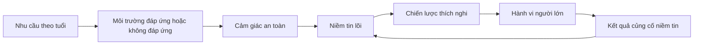
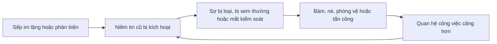

# Tập 12: Tâm Lý Học Phát Triển Và Tuổi Thơ

**Hiểu các giai đoạn phát triển, gắn bó, nhu cầu an toàn, niềm tin lõi và cách tuổi thơ tiếp tục ảnh hưởng đến lãnh đạo, quan hệ, quyết định**  
Giáo trình ngắn gọn cho người trưởng thành, cấp quản lý/C-level

---

## 0. Vì Sao C-level Cần Học Tâm Lý Phát Triển Và Tuổi Thơ?

### Bản chất

Người trưởng thành không bắt đầu từ hiện tại.

Ta mang theo:

- Cách cơ thể học về an toàn
- Cách não học về yêu thương
- Cách ta được công nhận hoặc bị xem nhẹ
- Cách ta phản ứng với quyền lực
- Cách ta tin hoặc không tin người khác
- Cách ta nhìn thành công, thất bại và giá trị bản thân

Tuổi thơ không quyết định toàn bộ đời người.  
Nhưng tuổi thơ tạo bản thiết kế đầu tiên cho cách ta hiểu chính mình, hiểu người khác và hiểu thế giới.

### Một câu cần nhớ

> Trưởng thành không phải là phủ nhận đứa trẻ từng sống trong mình, mà là không để đứa trẻ đó một mình lái toàn bộ cuộc đời người lớn.

### Mục tiêu tập này

| Năng lực | Ý nghĩa thực tế |
|---|---|
| Hiểu phát triển theo giai đoạn | Biết nhu cầu tâm lý thay đổi theo tuổi |
| Nhận ra dấu vết tuổi thơ | Không nhầm phản ứng cũ với sự thật hiện tại |
| Hiểu gắn bó và an toàn | Đọc sâu quan hệ, lãnh đạo và niềm tin |
| Nhìn vai gia đình | Biết vai cũ nào còn điều khiển mình |
| Làm cha/mẹ trưởng thành hơn | Tạo an toàn, ranh giới, tự chủ cho con |
| Trưởng thành khỏi vai cũ | Chọn bản sắc mới thay vì lặp chiến lược xưa |

---

## 1. First Principles: Phát Triển Con Người Là Gì?

### Bản chất

Phát triển con người là quá trình cơ thể, não bộ, cảm xúc, nhận thức, bản sắc và quan hệ thay đổi theo thời gian.

```text
Phát triển = Sinh học + An toàn + Gắn bó + Học hỏi + Bản sắc + Môi trường
```

Con người không phát triển trong chân không.  
Ta phát triển trong quan hệ.

### Mô hình nền



### Câu hỏi gốc

```text
1. Ở giai đoạn đó, đứa trẻ cần điều gì?
2. Nhu cầu đó được đáp ứng, thiếu hụt hay bị bóp méo?
3. Đứa trẻ đã học niềm tin nào về mình và người khác?
4. Người lớn hiện tại còn sống theo niềm tin đó không?
```

---

## 2. Các Giai Đoạn Phát Triển

### Bản chất

Mỗi giai đoạn có một nhiệm vụ tâm lý chính.  
Khi nhiệm vụ đó được nâng đỡ tốt, con người có nền vững hơn cho giai đoạn sau.

| Giai đoạn | Nhu cầu chính | Nếu được đáp ứng | Nếu thiếu hụt |
|---|---|---|---|
| 0-2 tuổi | An toàn, chăm sóc, đáp ứng | Tin cơ bản | Lo âu, khó tự dịu |
| 2-6 tuổi | Khám phá, ranh giới, được thấy | Tự chủ, tò mò | Xấu hổ, sợ sai |
| 6-12 tuổi | Năng lực, công nhận, bạn bè | Tự tin học hỏi | Tự ti, so sánh |
| 12-18 tuổi | Bản sắc, thuộc về, độc lập | Biết mình là ai | Mơ hồ, phụ thuộc nhóm |
| Trưởng thành trẻ | Thân mật, nghề nghiệp, lựa chọn | Cam kết, trách nhiệm | Né gần gũi, sợ chọn |
| Trung niên | Ý nghĩa, cống hiến, thế hệ sau | Sâu sắc, truyền trao | Trống rỗng, kiểm soát |
| Tuổi già | Tích hợp đời sống | Bình an, chấp nhận | Hối tiếc, cay đắng |

### Nguyên tắc

Không giai đoạn nào hoàn hảo.  
Nhưng những thiếu hụt lớn thường quay lại dưới dạng nhu cầu chưa được gọi tên.

### Câu hỏi áp dụng

```text
1. Tôi hay bị mắc ở nhu cầu nào: an toàn, công nhận, tự chủ, thuộc về hay ý nghĩa?
2. Khi áp lực, tôi thường trở về phản ứng của giai đoạn nào?
3. Tôi đang đòi người khác bù cho thiếu hụt cũ nào?
```

---

## 3. Tuổi Thơ: Thời Kỳ Não Học Thế Giới Có An Toàn Không

### Bản chất

Tuổi thơ là giai đoạn hệ thần kinh học các câu trả lời đầu tiên:

- Tôi có được bảo vệ không?
- Tôi có được yêu khi không hoàn hảo không?
- Cảm xúc của tôi có quan trọng không?
- Người lớn có đáng tin không?
- Tôi có quyền nói không không?
- Tôi phải làm gì để được chú ý hoặc được yên?

Đứa trẻ không chỉ nghe lời dạy.  
Đứa trẻ học từ khí hậu cảm xúc trong nhà.

### Điều trẻ thường học qua môi trường

| Môi trường | Bài học đứa trẻ có thể học |
|---|---|
| Ổn định, ấm, có ranh giới | Thế giới đủ an toàn để khám phá |
| Cha mẹ thất thường | Phải đoán cảm xúc người khác |
| Tình yêu theo thành tích | Phải giỏi mới đáng yêu |
| Hay bị phạt vì cảm xúc | Cảm xúc của mình là nguy hiểm |
| Bị bỏ mặc | Nhu cầu của mình không quan trọng |
| Bị kiểm soát quá mức | Tự chủ là nguy hiểm hoặc phải nổi loạn |

### Nguyên tắc

> Trẻ em không có đủ năng lực để kết luận "người lớn chưa trưởng thành"; trẻ thường kết luận "mình có vấn đề".

---

## 4. Gắn Bó: Bản Thiết Kế Đầu Tiên Của Quan Hệ

### Bản chất

Gắn bó là cách đứa trẻ học tìm an toàn trong quan hệ với người chăm sóc.

Khi lớn lên, mô hình này có thể xuất hiện trong:

- Tình yêu
- Hôn nhân
- Quan hệ với cấp trên
- Quan hệ với nhân sự
- Quan hệ với nhà đầu tư, đối tác
- Cách phản ứng khi bị phê bình hoặc bị im lặng

### Các kiểu gắn bó

| Kiểu gắn bó | Trẻ học điều gì | Khi thành người lớn |
|---|---|---|
| An toàn | Có thể cần người khác và vẫn ổn | Tin, nói rõ nhu cầu, sửa chữa tốt |
| Lo âu | Kết nối có thể biến mất bất cứ lúc nào | Bám, kiểm tra, sợ bị bỏ |
| Né tránh | Cần người khác là rủi ro | Tự lo hết, rút lui khi gần gũi |
| Hỗn loạn | Người cho an toàn cũng gây sợ | Vừa muốn gần vừa phá kết nối |

### Vòng lặp gắn bó trong công việc



### Câu hỏi

```text
1. Khi người quan trọng im lặng, tôi diễn giải gì?
2. Khi ai đó cần tôi, tôi thấy gần gũi hay thấy bị đòi hỏi?
3. Khi quan hệ có xung đột, tôi muốn sửa chữa hay muốn biến mất/thắng?
```

---

## 5. Nhu Cầu An Toàn

### Bản chất

An toàn là nền của phát triển.  
Không có an toàn, não ưu tiên sinh tồn hơn học hỏi, sáng tạo và kết nối.

An toàn không có nghĩa là không có ranh giới.  
An toàn là biết rằng mình không bị hủy bỏ, bỏ rơi, làm nhục hoặc đe dọa khi sai, yếu, cần giúp đỡ.

### Các tầng an toàn

| Tầng | Nghĩa thực tế | Khi thiếu |
|---|---|---|
| Thể chất | Không bị bạo lực, đe dọa | Căng, cảnh giác |
| Cảm xúc | Được phép có cảm xúc | Đè nén, bùng nổ |
| Quan hệ | Không bị bỏ rơi tùy tiện | Bám hoặc né |
| Nhận thức | Được hỏi, được hiểu | Im lặng hoặc phản kháng |
| Bản sắc | Được là mình trong ranh giới | Đóng vai để được chấp nhận |

### Ứng dụng lãnh đạo

Một tổ chức thiếu an toàn sẽ tạo nhân sự:

- Giấu lỗi
- Nói điều sếp muốn nghe
- Né trách nhiệm
- Cạnh tranh phòng vệ
- Không dám thử nghiệm
- Dùng chính trị thay cho sự thật

### Câu hỏi

```text
1. Tôi tạo an toàn hay tạo sợ hãi?
2. Người khác có dám nói sự thật với tôi không?
3. Tôi phản ứng thế nào khi người khác sai?
```

---

## 6. Vai Gia Đình Và Kịch Bản Tuổi Thơ

### Bản chất

Trong gia đình, đứa trẻ thường nhận một vai để giữ kết nối, giảm căng thẳng hoặc có vị trí.

Vai đó từng giúp sống sót về cảm xúc.  
Nhưng khi lớn lên, vai cũ có thể trở thành cái lồng.

### Các vai thường gặp

| Vai | Chiến lược xưa | Dạng người lớn |
|---|---|---|
| Đứa con ngoan | Làm hài lòng để được yêu | Khó nói không, sợ làm người khác thất vọng |
| Người gánh vác | Lo hết để gia đình ổn | Kiệt sức, khó tin người |
| Người thành tích | Giỏi để được công nhận | Giá trị bản thân gắn với thắng |
| Người hòa giải | Giảm xung đột cho cả nhà | Né đối đầu, nuốt nhu cầu |
| Người vô hình | Không gây phiền | Khó đòi hỏi, khó nhận chăm sóc |
| Người nổi loạn | Giữ tự chủ bằng chống đối | Dị ứng quyền lực, khó cam kết |

### Câu hỏi

```text
1. Trong gia đình, tôi từng phải trở thành ai để được an toàn?
2. Vai đó từng cho tôi điều gì?
3. Vai đó đang lấy đi điều gì?
4. Tôi có còn cần đóng vai đó với mọi người không?
```

---

## 7. Niềm Tin Lõi: Câu Chuyện Đầu Tiên Về Bản Thân

### Bản chất

Niềm tin lõi là kết luận sâu về bản thân, người khác và thế giới.

Nó thường không xuất hiện như một câu rõ ràng.  
Nó xuất hiện như cảm giác chắc chắn trong cơ thể.

### Các niềm tin lõi phổ biến

| Niềm tin lõi | Hành vi người lớn thường thấy |
|---|---|
| Tôi không đủ tốt | Luôn chứng minh, khó nhận lời khen |
| Tôi phải giỏi mới được yêu | Nghiện thành tích, sợ thất bại |
| Người khác sẽ bỏ tôi | Bám, kiểm tra, ghen, lo |
| Không ai thật sự đáng tin | Kiểm soát, tự làm hết |
| Nhu cầu của tôi là phiền | Không nói nhu cầu, rồi oán giận |
| Sai là nguy hiểm | Né thử nghiệm, phòng vệ khi bị góp ý |
| Tôi phải mạnh | Không nhận giúp đỡ, không cho phép mình yếu |

### Chuỗi vận hành

```text
Trải nghiệm lặp lại -> Diễn giải của trẻ -> Niềm tin lõi -> Chiến lược thích nghi -> Hành vi người lớn
```

### Câu hỏi phá niềm tin lõi

```text
1. Tôi đang tin điều gì như thể nó là sự thật tuyệt đối?
2. Niềm tin này bắt đầu từ thời điểm/giai đoạn nào?
3. Nó từng bảo vệ tôi ra sao?
4. Dữ kiện hiện tại có còn ủng hộ niềm tin đó không?
5. Niềm tin trưởng thành hơn là gì?
```

---

## 8. Parenting: Nuôi Con Là Tạo Nền, Không Phải Tạo Sản Phẩm

### Bản chất

Làm cha/mẹ không phải là thiết kế một đứa trẻ theo hình ảnh mình muốn.

Làm cha/mẹ là giúp con phát triển:

- An toàn
- Tự chủ
- Cảm xúc
- Kỷ luật
- Trách nhiệm
- Khả năng yêu thương
- Khả năng chịu thất bại

### Ba trụ cột

| Trụ cột | Nghĩa thực tế | Lệch hướng |
|---|---|---|
| Kết nối | Con biết mình được yêu | Nuông chiều nếu thiếu ranh giới |
| Ranh giới | Con biết giới hạn và hậu quả | Kiểm soát nếu thiếu tôn trọng |
| Tự chủ | Con được chọn trong khung phù hợp | Bỏ mặc nếu thiếu đồng hành |

### Parenting trưởng thành

| Phản xạ yếu | Phản ứng trưởng thành hơn |
|---|---|
| Mắng để con sợ | Giữ ranh giới và giải thích hậu quả |
| So sánh con | Nhìn nỗ lực và tiến bộ của con |
| Lấy thành tích làm tình yêu | Yêu con cả khi con thất bại |
| Làm thay để nhanh | Cho con tập năng lực |
| Xả lo âu của mình lên con | Tự điều chỉnh trước khi dạy |

### Câu hỏi trước khi dạy con

```text
1. Việc này cần kết nối, ranh giới hay kỹ năng?
2. Tôi đang dạy con hay đang xả nỗi sợ của tôi?
3. Tôi muốn con vâng lời ngay hay muốn con phát triển năng lực dài hạn?
4. Tôi đang yêu con người thật hay phiên bản làm tôi yên tâm?
```

---

## 9. Tuổi Thơ Ảnh Hưởng Đến Lãnh Đạo

### Bản chất

Lãnh đạo không chỉ là kỹ năng quản trị.  
Lãnh đạo cũng là cách một người xử lý quyền lực, sợ hãi, công nhận, xung đột và mất kiểm soát.

Tuổi thơ có thể đi vào phong cách lãnh đạo dưới dạng phản xạ.

### Dấu vết thường gặp

| Dấu vết tuổi thơ | Phong cách lãnh đạo có thể thành |
|---|---|
| Phải giỏi mới có giá trị | Cầu toàn, khó giao việc |
| Lớn lên trong bất ổn | Kiểm soát chặt, khó tin hệ thống |
| Không được lắng nghe | Áp đặt, sợ bị phản biện |
| Phải làm hài lòng | Né quyết định khó, sợ mất lòng |
| Bị chỉ trích nhiều | Phòng vệ, nhạy với feedback |
| Tự lo từ nhỏ | Gánh hết, không biết nhận hỗ trợ |

### Câu hỏi lãnh đạo

```text
1. Phong cách lãnh đạo của tôi đến từ giá trị hay từ vết thương?
2. Tôi đang tạo văn hóa người lớn hay tái tạo khí hậu gia đình cũ?
3. Tôi phản ứng với nhân sự như lãnh đạo hiện tại hay như đứa trẻ từng sợ mất kiểm soát?
```

---

## 10. Tuổi Thơ Ảnh Hưởng Đến Quan Hệ

### Bản chất

Trong quan hệ thân mật, người lớn thường không chỉ tìm người yêu, bạn đời hoặc bạn bè.  
Họ cũng tìm cảm giác an toàn mà mình từng thiếu, hoặc né cảm giác đau mà mình từng biết.

### Mô hình lặp lại

| Thiếu hụt cũ | Quan hệ người lớn có thể lặp |
|---|---|
| Bị bỏ rơi | Sợ im lặng, cần trấn an liên tục |
| Bị kiểm soát | Dị ứng gần gũi, cần khoảng cách lớn |
| Tình yêu có điều kiện | Luôn biểu diễn, khó thật |
| Không được công nhận | Dễ oán giận khi không được thấy |
| Gia đình nhiều xung đột | Né nói chuyện khó hoặc bùng nổ |
| Cảm xúc bị coi thường | Khó gọi tên nhu cầu, dễ đóng băng |

### Nguyên tắc

> Người thân không có nhiệm vụ sửa toàn bộ tuổi thơ của ta, nhưng quan hệ trưởng thành có thể giúp ta học lại an toàn.

### Câu hỏi

```text
1. Tôi đang yêu người hiện tại hay đang tìm lại một cảm giác cũ?
2. Tôi đang đòi người kia bù điều gì tôi chưa tự chăm sóc?
3. Tôi có đang trừng phạt người hiện tại vì nỗi đau từ người cũ hoặc gia đình cũ?
```

---

## 11. Tuổi Thơ Ảnh Hưởng Đến Quyết Định

### Bản chất

Quyết định không chỉ đến từ dữ kiện.  
Quyết định còn đến từ điều hệ thần kinh xem là an toàn hoặc nguy hiểm.

### Các mẫu quyết định từ tuổi thơ

| Bài học cũ | Quyết định người lớn |
|---|---|
| Sai là bị phạt | Chậm quyết, né thử nghiệm |
| Muốn được yêu phải thành công | Chọn mục tiêu để chứng minh |
| Không ai cứu mình | Không nhờ hỗ trợ, ôm rủi ro một mình |
| Mất kiểm soát là nguy hiểm | Không trao quyền, giữ mọi nút quyết định |
| Nhu cầu của mình không quan trọng | Chọn theo kỳ vọng người khác |
| Phải giữ hòa khí | Né cắt lỗ, né sa thải, né nói thật |

### Bộ lọc trước quyết định lớn

```text
1. Dữ kiện thật là gì?
2. Nỗi sợ nào đang có mặt?
3. Nỗi sợ này thuộc hiện tại hay thuộc bài học cũ?
4. Quyết định theo giá trị sẽ khác gì quyết định theo sợ hãi?
5. Người trưởng thành trong tôi chọn gì nếu không cần chứng minh?
```

---

## 12. Trưởng Thành Khỏi Vai Cũ

### Bản chất

Trưởng thành khỏi vai cũ không phải là ghét bỏ quá khứ.  
Đó là biết ơn chiến lược từng giúp mình tồn tại, rồi chọn chiến lược phù hợp hơn.

### Chuyển hóa vai cũ

| Vai cũ | Năng lực giữ lại | Điều cần buông | Vai trưởng thành |
|---|---|---|---|
| Đứa con ngoan | Biết quan tâm | Sợ làm người khác thất vọng | Người có ranh giới |
| Người gánh vác | Trách nhiệm | Cứu tất cả | Người biết trao quyền |
| Người thành tích | Kỷ luật | Đồng nhất giá trị với thắng | Người phát triển bền |
| Người hòa giải | Thấu cảm | Né sự thật | Người nói thật có tôn trọng |
| Người vô hình | Quan sát tốt | Tự xóa nhu cầu | Người hiện diện rõ |
| Người nổi loạn | Tự chủ | Chống đối tự động | Người tự do có cam kết |

### Quy trình trưởng thành

```text
1. Gọi tên vai cũ.
2. Công nhận vai đó từng bảo vệ mình.
3. Nhìn cái giá hiện tại.
4. Chọn bản sắc mới.
5. Lặp hành vi nhỏ đủ lâu để não học lại.
```

### Câu hỏi

> Nếu không cần sống để được gia đình cũ công nhận, tôi sẽ chọn đời sống nào?

---

## 13. Công Cụ Thực Hành

### Công cụ 1: Bản đồ tuổi thơ

```text
Giai đoạn tôi nhớ rõ:
Không khí gia đình lúc đó:
Nhu cầu chính của tôi:
Nhu cầu được đáp ứng:
Nhu cầu thiếu hụt:
Niềm tin tôi học về bản thân:
Niềm tin tôi học về người khác:
Chiến lược tôi dùng để thích nghi:
Chiến lược đó còn xuất hiện ở đâu hôm nay:
```

### Công cụ 2: Audit niềm tin lõi

| Câu hỏi | Trả lời |
|---|---|
| Niềm tin lõi đang điều khiển tôi là gì? |  |
| Tôi học niềm tin này từ đâu? |  |
| Nó từng giúp tôi tránh điều gì? |  |
| Nó đang làm tôi mất gì? |  |
| Niềm tin trưởng thành hơn là gì? |  |
| Hành vi nhỏ chứng minh niềm tin mới là gì? |  |

### Công cụ 3: Parenting check-in

```text
Tình huống với con:
Phản ứng đầu tiên của tôi:
Nỗi sợ của tôi:
Nhu cầu thật của con:
Ranh giới cần giữ:
Kết nối cần tạo:
Kỹ năng cần dạy:
Một câu nói trưởng thành hơn:
```

### Công cụ 4: Tách hiện tại khỏi quá khứ

```text
Tình huống hiện tại:
Phản ứng cảm xúc:
Cảm giác này giống thời điểm nào trong quá khứ?
Điều gì thật sự đang xảy ra hiện tại?
Tôi đang bảo vệ đứa trẻ nào trong mình?
Người trưởng thành hiện tại có thể làm gì?
```

---

## 14. Lộ Trình Thực Hành 4 Tuần

### Tuần 1: Nhìn bản đồ phát triển

- Chọn 3 giai đoạn tuổi thơ hoặc thiếu niên đáng nhớ.
- Viết nhu cầu chính, điều được đáp ứng và điều thiếu hụt.
- Gọi tên một niềm tin lõi có thể đã hình thành.

### Tuần 2: Quan sát gắn bó và an toàn

- Ghi lại 3 lần bạn thấy bám, né, kiểm soát hoặc phòng vệ.
- Hỏi: phản ứng này đang tìm an toàn kiểu gì?
- Thử một phản ứng mới: nói nhu cầu rõ hơn hoặc tạm dừng trước khi rút lui.

### Tuần 3: Làm việc với vai gia đình

- Gọi tên vai cũ bạn hay đóng nhất.
- Viết vai đó từng bảo vệ bạn thế nào.
- Chọn một hành vi nhỏ để bước ra khỏi vai đó.

### Tuần 4: Hành động từ người trưởng thành

- Chọn một quyết định hoặc quan hệ quan trọng.
- Tách dữ kiện hiện tại khỏi nỗi sợ cũ.
- Làm một hành động theo giá trị, không theo nhu cầu chứng minh hoặc né đau.

---

## 15. Bảng Tóm Tắt First Principles

| Chủ đề | Bản chất | Câu hỏi áp dụng |
|---|---|---|
| Phát triển | Con người thay đổi qua sinh học, an toàn, gắn bó và môi trường | Giai đoạn này cần điều gì? |
| Tuổi thơ | Não học bản thiết kế đầu tiên về thế giới | Tôi đã học thế giới có an toàn không? |
| Gắn bó | Cách tìm an toàn trong quan hệ | Khi bất an, tôi bám, né hay sửa chữa? |
| An toàn | Nền để học hỏi, kết nối và tự chủ | Tôi đang tạo an toàn hay sợ hãi? |
| Gia đình | Nơi ta học vai và kịch bản đầu tiên | Tôi từng phải trở thành ai? |
| Niềm tin lõi | Kết luận sâu về bản thân và người khác | Niềm tin này còn đúng với hiện tại không? |
| Parenting | Tạo nền an toàn, ranh giới và tự chủ | Tôi đang dạy con hay xả nỗi sợ? |
| Lãnh đạo | Quyền lực khuếch đại vết thương chưa hiểu | Tôi lãnh đạo từ giá trị hay từ vết thương? |
| Quan hệ | Hiện tại dễ kích hoạt mô hình gắn bó cũ | Tôi đang gặp người thật hay nỗi sợ cũ? |
| Quyết định | Dữ kiện đi qua bộ lọc an toàn của hệ thần kinh | Tôi chọn theo giá trị hay theo sợ hãi? |
| Trưởng thành | Biết ơn vai cũ và chọn bản sắc mới | Vai nào đã hết nhiệm vụ? |

---

## 16. Một Câu Để Nhớ Toàn Bộ Tập 12

> Tuổi thơ là nơi ta học cách sống sót, còn trưởng thành là nơi ta học cách sống thật mà không cần lặp lại mọi chiến lược cũ.
