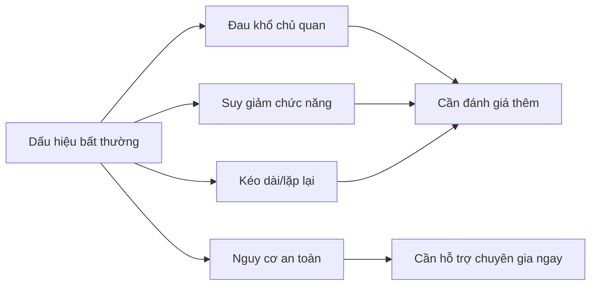
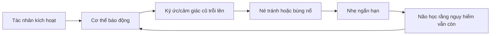

# Tập 13: Tâm Lý Lâm Sàng Nhập Môn

**Nhận diện rủi ro tâm lý, hiểu giới hạn tự học, biết khi nào cần chuyên gia và hỗ trợ người khác có trách nhiệm**  
Giáo trình ngắn gọn cho người trưởng thành, cấp quản lý/C-level

---

## 0. Vì Sao C-level Cần Học Tâm Lý Lâm Sàng Nhập Môn?

### Bản chất

Người lãnh đạo không cần trở thành nhà trị liệu.  
Nhưng người lãnh đạo cần biết khi nào một vấn đề không còn là "thiếu kỷ luật", "yếu tinh thần" hoặc "thái độ kém".

Trong tổ chức và gia đình, nhiều dấu hiệu tâm lý bị hiểu sai thành:

- Lười biếng
- Chống đối
- Thiếu động lực
- Yếu đuối
- Khó tính
- Không chuyên nghiệp
- Không biết điều

Tâm lý lâm sàng nhập môn giúp ta nhận diện rủi ro, giảm phán xét và biết giới hạn can thiệp.

### Cảnh báo quan trọng

Tập này không dùng để tự chẩn đoán, chẩn đoán người khác hoặc tự điều trị.

Mục tiêu đúng là:

- Nhận diện dấu hiệu cần chú ý
- Biết khi nào nên tìm chuyên gia
- Biết cách nói chuyện có trách nhiệm
- Không làm tình hình nặng hơn bằng lời khuyên sai
- Xây môi trường ít gây hại hơn

### Một câu cần nhớ

> Hiểu tâm lý lâm sàng không phải để dán nhãn con người, mà để biết khi nào cần dừng phán xét và mở đường cho hỗ trợ đúng.

### Mục tiêu tập này

| Năng lực | Ý nghĩa thực tế |
|---|---|
| Phân biệt khó khăn thường ngày và rủi ro lâm sàng | Không xem nhẹ dấu hiệu nghiêm trọng |
| Nhận diện lo âu, trầm cảm, sang chấn, burnout | Biết quan sát thay vì quy chụp |
| Hiểu nghiện và phòng vệ | Không chỉ dùng ý chí để giải thích |
| Nhận diện rủi ro nhân cách | Biết giữ ranh giới và tìm hỗ trợ |
| Hỗ trợ người khác có trách nhiệm | Không đóng vai chuyên gia khi không đủ năng lực |

---

## 1. First Principles: Tâm Lý Lâm Sàng Là Gì?

### Bản chất

Tâm lý lâm sàng nghiên cứu, đánh giá và hỗ trợ những khó khăn tâm lý ảnh hưởng đáng kể đến đời sống, quan hệ, công việc và an toàn của một người.

```text
Rủi ro lâm sàng = Mức độ đau khổ + Mức độ suy giảm chức năng + Thời gian kéo dài + Nguy cơ an toàn
```

Không phải cứ buồn là trầm cảm.  
Không phải cứ lo là rối loạn lo âu.  
Không phải cứ khó tính là rối loạn nhân cách.

### Bốn trục quan sát

| Trục | Câu hỏi |
|---|---|
| Cường độ | Mức độ có vượt quá phản ứng thông thường không? |
| Thời gian | Kéo dài vài ngày, vài tuần hay nhiều tháng? |
| Chức năng | Có làm suy giảm ngủ, ăn, làm việc, quan hệ không? |
| An toàn | Có nguy cơ tự hại, hại người, mất kiểm soát hoặc lạm dụng chất không? |

### Mô hình nhận diện rủi ro



### Câu hỏi gốc

```text
1. Người này đang đau khổ đến mức nào?
2. Đời sống của họ bị ảnh hưởng ra sao?
3. Tình trạng này kéo dài bao lâu?
4. Có dấu hiệu nguy hiểm cho bản thân hoặc người khác không?
5. Tôi có đang vượt quá vai trò và năng lực của mình không?
```

---

## 2. Ngưỡng Giữa Khó Khăn Bình Thường Và Rủi Ro Lâm Sàng

### Bản chất

Khó khăn tâm lý là một phần của đời sống.  
Rủi ro lâm sàng xuất hiện khi khó khăn đó kéo dài, nặng lên hoặc làm người đó mất khả năng sống và làm việc như trước.

| Khó khăn thường ngày | Rủi ro cần chú ý |
|---|---|
| Buồn sau thất bại | Buồn sâu kéo dài, mất hứng thú, tuyệt vọng |
| Lo trước quyết định lớn | Lo liên tục, khó ngủ, né tránh nhiều việc |
| Mệt sau giai đoạn căng | Kiệt sức kéo dài, tê cảm xúc, không hồi phục khi nghỉ |
| Cáu khi áp lực | Bùng nổ thường xuyên, làm hỏng quan hệ |
| Uống để thư giãn | Cần chất để hoạt động hoặc né cảm xúc |

### Sai lầm phổ biến

- Dán nhãn quá nhanh
- Xem mọi vấn đề là bệnh
- Xem mọi vấn đề là ý chí yếu
- Khuyên "nghĩ tích cực lên" khi người kia đang suy sụp
- Ép người khác kể chuyện khi họ chưa an toàn
- Giữ bí mật tuyệt đối dù có nguy cơ tự hại

### Nguyên tắc

> Không chẩn đoán khi chưa có chuyên môn. Nhưng cũng không được xem nhẹ dấu hiệu nguy hiểm.

---

## 3. Lo Âu: Khi Não Dự Đoán Nguy Hiểm Quá Mức

### Bản chất

Lo âu là hệ thống dự báo rủi ro.  
Nó có ích khi giúp ta chuẩn bị. Nó trở thành vấn đề khi não liên tục báo động dù không có nguy hiểm tương xứng.

### Biểu hiện thường gặp

| Tầng | Dấu hiệu |
|---|---|
| Cơ thể | Tim nhanh, khó thở, căng cơ, đau bụng, mất ngủ |
| Suy nghĩ | Nghĩ quá nhiều, tưởng tượng kịch bản xấu, khó dừng |
| Hành vi | Né tránh, kiểm tra liên tục, hỏi trấn an nhiều lần |
| Công việc | Trì hoãn quyết định, cầu toàn, khó tập trung |

### Cần chú ý hơn khi

- Lo âu kéo dài nhiều tuần và ảnh hưởng ngủ/làm việc
- Né tránh làm đời sống thu hẹp lại
- Có cơn hoảng sợ lặp lại
- Phải dùng rượu, thuốc hoặc chất kích thích để bình tĩnh
- Có ý nghĩ không muốn sống tiếp vì quá mệt

### Câu hỏi hỗ trợ

```text
1. Điều gì đang làm hệ thần kinh của tôi báo động?
2. Tôi đang tránh điều gì?
3. Né tránh giúp tôi nhẹ ngắn hạn nhưng làm mất gì dài hạn?
4. Tôi cần tự điều chỉnh, nói chuyện với ai, hay tìm chuyên gia?
```

---

## 4. Trầm Cảm: Khi Năng Lượng, Ý Nghĩa Và Hy Vọng Sụt Giảm

### Bản chất

Trầm cảm không đơn giản là buồn.  
Nó thường là trạng thái suy giảm sâu về năng lượng, hứng thú, động lực, cảm giác giá trị và hy vọng.

### Dấu hiệu cần nhận diện

| Nhóm dấu hiệu | Biểu hiện |
|---|---|
| Cảm xúc | Buồn sâu, trống rỗng, tê cảm xúc, dễ khóc |
| Cơ thể | Mất ngủ/ngủ quá nhiều, mệt dai dẳng, thay đổi ăn uống |
| Nhận thức | Tự trách nặng, thấy mình vô dụng, khó tập trung |
| Hành vi | Rút lui, bỏ việc quan trọng, giảm chăm sóc bản thân |
| Nguy cơ | Tuyệt vọng, nói về cái chết, ý nghĩ tự hại |

### Điều không nên nói

| Không nên | Nên hơn |
|---|---|
| "Mạnh mẽ lên" | "Tôi thấy bạn đang rất nặng, tôi ở đây với bạn" |
| "Ai cũng có vấn đề" | "Điều này có vẻ đang ảnh hưởng nhiều đến bạn" |
| "Nghĩ tích cực đi" | "Mình cùng tìm người phù hợp để hỗ trợ nhé" |
| "Bạn có mọi thứ rồi mà" | "Đau khổ không phải lúc nào cũng nhìn thấy từ bên ngoài" |

### Khi nào cần chuyên gia ngay

Nếu có ý nghĩ tự hại, kế hoạch tự hại, nói lời vĩnh biệt, cho đi tài sản bất thường, tuyệt vọng cực độ hoặc mất kiểm soát, cần liên hệ dịch vụ khẩn cấp địa phương, người thân đáng tin cậy hoặc chuyên gia sức khỏe tâm thần ngay.

### Nguyên tắc

> Với trầm cảm nặng, đừng tranh luận bằng lý lẽ. Hãy tăng an toàn, giảm cô lập và kết nối với hỗ trợ chuyên môn.

---

## 5. Sang Chấn: Khi Hệ Thần Kinh Vẫn Sống Trong Nguy Hiểm Cũ

### Bản chất

Sang chấn không chỉ là chuyện đã xảy ra.  
Sang chấn là dấu vết còn lại trong hệ thần kinh, ký ức, niềm tin và cách một người cảm thấy an toàn.

### Biểu hiện có thể gặp

| Dạng phản ứng | Biểu hiện |
|---|---|
| Tái hiện | Ác mộng, hồi tưởng, cảm giác như chuyện cũ đang xảy ra |
| Né tránh | Tránh nơi, người, chủ đề hoặc cảm xúc liên quan |
| Cảnh giác cao | Dễ giật mình, căng thẳng, khó ngủ, luôn đề phòng |
| Tê liệt | Trống rỗng, mất cảm giác, tách khỏi cơ thể |
| Niềm tin | "Tôi không an toàn", "Không thể tin ai", "Lỗi là ở tôi" |

### Vòng lặp sang chấn



### Hỗ trợ đúng

- Không ép kể chi tiết sang chấn
- Không hỏi vì tò mò
- Không phán xét phản ứng của họ là "quá nhạy"
- Tôn trọng nhịp độ và ranh giới
- Khuyến khích hỗ trợ chuyên môn nếu dấu hiệu kéo dài hoặc nặng

### Câu hỏi an toàn

```text
1. Điều gì đang làm tôi/người kia thấy không an toàn?
2. Có thể giảm kích hoạt ngay lúc này bằng cách nào?
3. Người này có quyền kiểm soát nào cần được trả lại?
4. Có cần chuyên gia về sang chấn không?
```

---

## 6. Burnout: Khi Hệ Thống Sống Bị Rút Cạn Quá Lâu

### Bản chất

Burnout là trạng thái kiệt sức do áp lực kéo dài, đặc biệt khi nỗ lực cao nhưng hồi phục, quyền kiểm soát, ý nghĩa hoặc công nhận quá thấp.

Nó không chỉ là mệt.  
Nó là mất khả năng hồi phục bình thường.

### Ba dấu hiệu lõi

| Dấu hiệu | Biểu hiện |
|---|---|
| Kiệt sức | Mệt cả khi nghỉ, khó bắt đầu việc |
| Xa cách/cay nghiệt | Mất cảm xúc với việc, khách hàng, đội nhóm |
| Giảm hiệu quả | Làm nhiều nhưng chất lượng và tập trung giảm |

### Phân biệt nhanh

| Stress | Burnout |
|---|---|
| Quá nhiều áp lực | Quá lâu không hồi phục |
| Còn cảm thấy cố được | Cảm thấy cạn và tách rời |
| Nghỉ ngắn có thể phục hồi | Nghỉ ngắn không đủ |
| Vẫn còn động lực | Mất ý nghĩa và hy vọng nghề nghiệp |

### Câu hỏi cho C-level

```text
1. Vấn đề là năng lực cá nhân hay hệ thống đang đốt người?
2. Có đủ quyền kiểm soát, nguồn lực và ưu tiên rõ không?
3. Người này cần nghỉ, giảm tải, đổi vai hay hỗ trợ chuyên môn?
4. Văn hóa công ty có đang thưởng cho tự hủy không?
```

---

## 7. Nghiện: Khi Phần Thưởng Ngắn Hạn Chiếm Quyền Điều Khiển

### Bản chất

Nghiện không chỉ là thích một thứ.  
Nghiện là khi hành vi hoặc chất gây hại rõ ràng nhưng người đó vẫn khó dừng, vì nó đang phục vụ giảm đau, tìm khoái cảm hoặc né cảm xúc.

### Có thể liên quan đến

- Rượu
- Chất kích thích
- Cờ bạc
- Game
- Tình dục/nội dung kích thích
- Mua sắm
- Công việc
- Mạng xã hội

### Dấu hiệu rủi ro

| Dấu hiệu | Câu hỏi |
|---|---|
| Mất kiểm soát | Có dùng/làm nhiều hơn dự định không? |
| Tăng liều | Có cần nhiều hơn để đạt cùng cảm giác không? |
| Cai khó | Khi dừng có bồn chồn, cáu, trống rỗng không? |
| Tiếp tục dù hại | Có ảnh hưởng sức khỏe, tiền bạc, quan hệ, công việc không? |
| Che giấu | Có nói dối hoặc giấu mức độ thật không? |

### Nguyên tắc

> Hỏi "nó đang giúp người này tránh cảm giác gì?" thường hữu ích hơn hỏi "sao thiếu ý chí vậy?"

### Khi cần chuyên gia

Cần hỗ trợ chuyên môn khi hành vi gây hại lặp lại, có triệu chứng cai, mất kiểm soát, nguy cơ y tế, nguy cơ pháp lý, bạo lực, tự hại hoặc ảnh hưởng nghiêm trọng đến gia đình/công việc.

---

## 8. Rối Loạn Nhân Cách Ở Mức Nhận Diện Rủi Ro

### Bản chất

Nhân cách là mô hình lâu dài về cách một người cảm nhận bản thân, người khác, cảm xúc và quan hệ.

Rủi ro nhân cách không nên dùng để dán nhãn.  
Chỉ nên dùng để nhận diện mô hình lặp lại gây hại và biết cần ranh giới, đánh giá chuyên môn hoặc hỗ trợ phù hợp.

### Các mô hình cần chú ý

| Mô hình | Dấu hiệu rủi ro |
|---|---|
| Bất ổn cảm xúc/quan hệ | Lý tưởng hóa rồi hạ thấp, sợ bị bỏ, phản ứng cực mạnh |
| Ái kỷ độc hại | Cần ngưỡng mộ, thiếu đồng cảm, khai thác người khác |
| Kiểm soát/cứng nhắc | Quy tắc cực đoan, khó linh hoạt, căng khi mất kiểm soát |
| Nghi ngờ cao | Diễn giải người khác là đe dọa, khó tin, dễ công kích |
| Lệ thuộc | Khó tự quyết, sợ bị bỏ, chịu đựng quan hệ hại |
| Né tránh | Sợ bị chê, rút khỏi quan hệ/cơ hội dù rất muốn kết nối |

### Điều C-level cần làm

- Quan sát mô hình lặp lại, không kết luận từ một sự kiện
- Tách con người khỏi hành vi gây hại
- Đặt ranh giới rõ, nhất quán và có bằng chứng
- Không tham gia trò kéo-đẩy cảm xúc
- Tìm tư vấn chuyên môn khi ảnh hưởng đến an toàn, pháp lý hoặc văn hóa đội nhóm

### Câu hỏi ranh giới

```text
1. Mô hình này có lặp lại qua nhiều tình huống không?
2. Ai đang bị ảnh hưởng?
3. Ranh giới nào cần rõ bằng hành vi và hệ quả?
4. Tôi có đang bị kéo vào vai cứu, phán xử hoặc đối đầu không?
```

---

## 9. Phòng Vệ Trong Bối Cảnh Lâm Sàng

### Bản chất

Phòng vệ là cách tâm trí giảm đau, xấu hổ, sợ hãi hoặc mâu thuẫn nội tâm.  
Trong bối cảnh lâm sàng, phòng vệ có thể mạnh và cứng đến mức làm người đó không nhìn được thực tế.

### Các phòng vệ cần nhận diện

| Phòng vệ | Biểu hiện | Rủi ro |
|---|---|---|
| Phủ nhận | "Tôi không có vấn đề" | Không tìm hỗ trợ |
| Chiếu phóng | Gán động cơ xấu cho người khác | Xung đột leo thang |
| Tách đôi | Người kia hoàn hảo hoặc tệ hại | Quan hệ bất ổn |
| Trí thức hóa | Phân tích lạnh để né cảm xúc | Không xử lý đau thật |
| Hợp lý hóa | Lý do nghe hợp lý che hành vi hại | Không nhận trách nhiệm |
| Công kích | Tấn công khi thấy xấu hổ | Làm người khác sợ |

### Cách phản hồi

| Khi gặp phòng vệ | Cách làm |
|---|---|
| Người kia phủ nhận | Đưa quan sát cụ thể, không tranh cãi nhãn |
| Người kia đổ lỗi | Quay lại hành vi và hệ quả |
| Người kia công kích | Dừng cuộc nói chuyện nếu mất an toàn |
| Người kia sụp đổ | Giảm áp lực, khuyến khích hỗ trợ |
| Người kia thao túng | Giữ ranh giới, không thương lượng trong hỗn loạn |

### Nguyên tắc

> Khi phòng vệ cao, mục tiêu đầu tiên không phải thắng lý luận mà là giữ an toàn, ranh giới và kết nối với thực tế.

---

## 10. Khi Nào Cần Chuyên Gia?

### Bản chất

Tự học, bạn bè, gia đình và lãnh đạo có thể hỗ trợ.  
Nhưng có những tình huống cần chuyên gia tâm lý, bác sĩ tâm thần hoặc dịch vụ khẩn cấp.

### Cần hỗ trợ chuyên gia khi

| Dấu hiệu | Ví dụ |
|---|---|
| Nguy cơ an toàn | Ý nghĩ tự hại, hại người, mất kiểm soát |
| Suy giảm chức năng | Không làm việc, không chăm sóc bản thân, quan hệ sụp |
| Kéo dài | Vấn đề nặng nhiều tuần/tháng không cải thiện |
| Lạm dụng chất | Dùng để hoạt động, cai khó, gây hại rõ |
| Triệu chứng nặng | Hoảng sợ lặp lại, ác mộng, tê liệt, tuyệt vọng |
| Thực tế bị lệch | Hoang tưởng, nghe/thấy điều người khác không thấy |
| Bạo lực/lạm dụng | Có nguy cơ bị hại hoặc làm hại |

### Đèn đỏ

Nếu có một trong các dấu hiệu sau, cần hành động ngay:

- Nói muốn chết hoặc không muốn sống
- Có kế hoạch, phương tiện hoặc thời điểm tự hại
- Đe dọa làm hại người khác
- Mất kiểm soát do chất
- Bạo lực trong gia đình hoặc nơi làm việc
- Rối loạn ý thức, hoang tưởng nặng, hành vi rất bất thường

### Nguyên tắc

> Khi có nguy cơ an toàn, giữ bí mật không còn là ưu tiên cao nhất. Ưu tiên là kết nối người đó với hỗ trợ phù hợp và bảo vệ mạng sống.

---

## 11. Hỗ Trợ Người Khác Có Trách Nhiệm

### Bản chất

Hỗ trợ có trách nhiệm là ở bên người khác mà không chiếm vai chuyên gia, không cứu bằng ego và không làm họ lệ thuộc.

### Ba vai cần tránh

| Vai | Biểu hiện | Cái giá |
|---|---|---|
| Người cứu | Gánh hết, quyết thay | Kiệt sức và làm người kia lệ thuộc |
| Người phán xử | Dạy đời, quy lỗi | Người kia phòng vệ hoặc xấu hổ hơn |
| Nhà trị liệu nghiệp dư | Phân tích, đào sâu sang chấn | Có thể làm tình trạng nặng hơn |

### Cách nói chuyện an toàn hơn

```text
1. Tôi thấy gần đây bạn có vẻ rất nặng.
2. Tôi không muốn kết luận thay bạn.
3. Tôi muốn nghe nếu bạn sẵn sàng nói.
4. Mình có thể tìm người có chuyên môn để hỗ trợ không?
5. Nếu bạn đang không an toàn, tôi cần gọi thêm người giúp.
```

### Checklist hỗ trợ

- [ ] Tôi có đang lắng nghe nhiều hơn khuyên không?
- [ ] Tôi có hỏi về an toàn nếu thấy dấu hiệu nguy hiểm không?
- [ ] Tôi có tôn trọng quyền tự chủ của họ không?
- [ ] Tôi có biết giới hạn vai trò của mình không?
- [ ] Tôi có khuyến khích hỗ trợ chuyên môn khi cần không?
- [ ] Tôi có giữ ranh giới để không tự kiệt sức không?

### Nguyên tắc

> Hỗ trợ tốt không phải là trở thành câu trả lời của người kia, mà là giúp họ đến gần nguồn lực đúng hơn.

---

## 12. Công Cụ Thực Hành

### Công cụ 1: Bản đồ rủi ro tâm lý

```text
Dấu hiệu tôi quan sát được:
Kéo dài bao lâu:
Ảnh hưởng đến ngủ/ăn/làm việc/quan hệ:
Mức độ đau khổ:
Có nguy cơ an toàn không:
Người hỗ trợ hiện có:
Bước tiếp theo có trách nhiệm:
```

### Công cụ 2: Phân biệt hỗ trợ và chẩn đoán

| Tôi có thể làm | Tôi không nên làm |
|---|---|
| Lắng nghe | Kết luận họ mắc rối loạn gì |
| Nói quan sát cụ thể | Dán nhãn nhân cách |
| Hỏi về an toàn | Hứa giữ bí mật khi có nguy cơ |
| Khuyến khích chuyên gia | Tự điều trị bằng lời khuyên |
| Giữ ranh giới | Gánh toàn bộ đời sống của họ |

### Công cụ 3: Kịch bản khuyến khích tìm chuyên gia

```text
Tôi quan tâm đến bạn.
Tôi thấy chuyện này đang ảnh hưởng nhiều đến đời sống của bạn.
Tôi không đủ chuyên môn để xử lý một mình.
Mình thử tìm một chuyên gia phù hợp nhé.
Tôi có thể hỗ trợ bạn trong bước đầu, nhưng tôi không muốn thay thế chuyên gia.
```

### Công cụ 4: Checklist đèn đỏ

| Dấu hiệu | Có/Không |
|---|---|
| Ý nghĩ tự hại hoặc không muốn sống |  |
| Kế hoạch/phương tiện tự hại |  |
| Đe dọa hại người khác |  |
| Dùng chất mất kiểm soát |  |
| Mất ngủ nặng kéo dài |  |
| Không thể làm việc/chăm sóc bản thân |  |
| Bạo lực/lạm dụng |  |
| Hoang tưởng hoặc hành vi rất bất thường |  |

---

## 13. Lộ Trình Thực Hành 4 Tuần

### Tuần 1: Học quan sát không dán nhãn

- Chọn 3 tình huống trong công việc/gia đình.
- Viết quan sát cụ thể, không dùng nhãn như "trầm cảm", "ái kỷ", "yếu".
- Phân tích theo 4 trục: cường độ, thời gian, chức năng, an toàn.

### Tuần 2: Nhận diện lo âu, trầm cảm, burnout

- Ghi lại dấu hiệu ở tầng cơ thể, suy nghĩ, hành vi.
- Phân biệt stress ngắn hạn với suy giảm kéo dài.
- Tập nói bằng ngôn ngữ quan sát: "Tôi thấy bạn ngủ ít và kiệt sức", không nói "Bạn bị bệnh rồi".

### Tuần 3: Ranh giới và hỗ trợ người khác

- Chọn một người bạn muốn hỗ trợ.
- Viết rõ: tôi có thể làm gì, không thể làm gì, khi nào cần gọi thêm người.
- Tập một cuộc trò chuyện ngắn theo kịch bản an toàn.

### Tuần 4: Xây hệ thống tìm hỗ trợ

- Lập danh sách nguồn lực: bác sĩ, nhà trị liệu, đường dây khẩn cấp địa phương, người thân đáng tin.
- Viết quy trình xử lý khi có đèn đỏ.
- Review văn hóa gia đình/công ty: điều gì đang làm người khác khó nói thật về sức khỏe tâm thần?

---

## 14. Bảng Tóm Tắt First Principles

| Chủ đề | Bản chất | Câu hỏi áp dụng |
|---|---|---|
| Tâm lý lâm sàng | Nhìn mức đau khổ, suy giảm và an toàn | Vấn đề này ảnh hưởng đời sống đến đâu? |
| Không tự chẩn đoán | Nhận diện rủi ro không đồng nghĩa kết luận bệnh | Tôi đang quan sát hay dán nhãn? |
| Lo âu | Hệ thống dự báo nguy hiểm quá mức | Lo này đang làm đời sống thu hẹp không? |
| Trầm cảm | Sụt giảm năng lượng, hứng thú và hy vọng | Có tuyệt vọng hoặc ý nghĩ tự hại không? |
| Sang chấn | Hệ thần kinh còn sống trong nguy hiểm cũ | Điều gì đang kích hoạt cảm giác không an toàn? |
| Burnout | Kiệt sức do áp lực kéo dài và thiếu hồi phục | Đây là lỗi cá nhân hay lỗi hệ thống? |
| Nghiện | Phần thưởng/giảm đau ngắn hạn chiếm quyền | Hành vi này còn nằm trong kiểm soát không? |
| Rủi ro nhân cách | Mô hình lâu dài gây hại trong quan hệ | Mô hình này có lặp lại và cần ranh giới không? |
| Phòng vệ | Tâm trí tránh đau và bảo vệ bản sắc | Tôi nên tranh luận hay giữ an toàn/ranh giới? |
| Chuyên gia | Nguồn lực cần thiết khi vượt giới hạn tự hỗ trợ | Khi nào tôi cần chuyển tuyến? |
| Hỗ trợ người khác | Lắng nghe, giữ ranh giới, kết nối nguồn lực | Tôi đang giúp hay đang đóng vai cứu? |

---

## 15. Một Câu Để Nhớ Toàn Bộ Tập 13

> Tâm lý lâm sàng nhập môn là học cách nhìn thấy đau khổ nghiêm túc mà không vội dán nhãn, hỗ trợ bằng lòng người mà không vượt quá vai trò, và biết đưa vấn đề đến đúng người khi đã vượt giới hạn tự xử lý.
