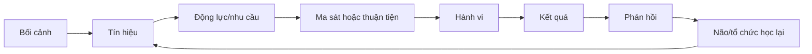
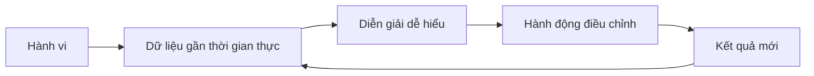

# Tập 14: Khoa Học Hành Vi Và Thiết Kế Thay Đổi

**Hiểu môi trường, ma sát, tín hiệu, khuyến khích, nudges, mặc định và cách tạo thay đổi bền vững trong sản phẩm, marketing và tổ chức**  
Giáo trình ngắn gọn cho người trưởng thành, cấp quản lý/C-level

---

## 0. Vì Sao C-level Cần Học Khoa Học Hành Vi?

### Bản chất

Ở cấp cao, vấn đề không chỉ là con người có biết điều đúng không.  
Vấn đề là hệ thống có khiến điều đúng **dễ thấy, dễ làm, đáng làm và được củng cố** hay không.

Nhiều thay đổi thất bại không phải vì con người chống đối vô lý, mà vì:

- Hành vi mới quá khó bắt đầu
- Hành vi cũ quá tiện
- Tín hiệu nhắc hành động không rõ
- Phần thưởng đến quá muộn
- Mặc định hệ thống kéo về cách cũ
- Người dùng/nhân sự không thấy tiến bộ
- Tổ chức đo kết quả nhưng không đo hành vi dẫn đến kết quả

### Một câu cần nhớ

> Hành vi không chỉ đến từ ý chí cá nhân. Hành vi là kết quả của con người trong một môi trường cụ thể, với ma sát, tín hiệu, phần thưởng và phản hồi cụ thể.

### Mục tiêu tập này

Sau tập này, bạn cần làm được 5 việc:

| Năng lực | Ý nghĩa thực tế |
|---|---|
| Nhìn hành vi như hệ thống | Không đổ lỗi vội cho thái độ |
| Thiết kế môi trường | Làm hành vi mong muốn dễ xảy ra hơn |
| Dùng ma sát và tín hiệu | Giảm hành vi xấu, kích hoạt hành vi tốt |
| Tạo vòng phản hồi | Giúp thay đổi được nhìn thấy và củng cố |
| Đo thay đổi | Biết điều gì đang đổi thật, không chỉ nghe cam kết |

---

## 1. First Principles: Hành Vi Là Gì?

### Bản chất

Hành vi là phản ứng cụ thể của con người trong một bối cảnh cụ thể.

```text
Hành vi = Con người + Mục tiêu + Môi trường + Ma sát + Tín hiệu + Phần thưởng + Phản hồi
```

Muốn đổi hành vi, đừng chỉ hỏi:

> Làm sao thuyết phục họ?

Hãy hỏi:

> Điều gì trong môi trường hiện tại đang làm hành vi cũ dễ hơn hành vi mới?

### Mô hình gốc



### Câu hỏi gốc

```text
1. Hành vi cụ thể cần thay đổi là gì?
2. Nó xảy ra ở đâu, khi nào, với ai?
3. Điều gì làm hành vi cũ dễ hơn?
4. Điều gì làm hành vi mới khó hơn?
5. Người đó nhận được phản hồi gì sau khi hành động?
```

---

## 2. Môi Trường Thắng Ý Chí

### Bản chất

Con người thường hành động theo thiết kế của môi trường hơn là theo lời tuyên bố của mình.

Môi trường gồm:

- Không gian vật lý
- Giao diện sản phẩm
- Quy trình làm việc
- Lịch họp
- KPI
- Quyền hạn
- Chuẩn văn hóa
- Thứ được khen, phạt, bỏ qua

### Ví dụ

| Muốn | Nhưng môi trường đang | Kết quả |
|---|---|---|
| Team chủ động báo rủi ro | Người báo tin xấu bị trách | Che giấu rủi ro |
| Khách hàng dùng tính năng mới | Tính năng nằm sâu trong menu | Không ai dùng |
| Nhân sự học liên tục | Lịch họp kín cả tuần | Không có thời gian học |
| Bán hàng tư vấn dài hạn | Hoa hồng chỉ tính deal ngắn hạn | Bán ép |

### Nguyên tắc

> Nếu hành vi đúng đòi hỏi nhiều ý chí hơn hành vi sai, hệ thống đang thiết kế ngược.

---

## 3. Ma Sát: Lực Cản Quyết Định Hành Vi

### Bản chất

Ma sát là mọi thứ làm hành vi khó hơn, chậm hơn, mơ hồ hơn hoặc tốn năng lượng hơn.

Có hai cách dùng ma sát:

- Giảm ma sát cho hành vi tốt
- Tăng ma sát cho hành vi xấu

### Các loại ma sát

| Loại ma sát | Ví dụ | Cách xử lý |
|---|---|---|
| Nhận thức | Không biết bước tiếp theo | Làm rõ next action |
| Thời gian | Mất quá lâu | Rút ngắn bước đầu |
| Cảm xúc | Sợ sai, sợ bị đánh giá | Tạo vùng thử nghiệm an toàn |
| Quy trình | Phải qua nhiều cấp duyệt | Cắt bước không cần thiết |
| Công cụ | Giao diện khó dùng | Đưa hành động chính ra trước |
| Xã hội | Sợ khác số đông | Cho thấy người khác cũng làm |

### Công cụ: Audit ma sát

```text
Hành vi mong muốn:
Ai cần làm:
Khi nào làm:
Bước đầu tiên là gì:
Điểm nào đang khó/phiền/mơ hồ:
Có thể bỏ bớt bước nào:
Có thể chuẩn bị sẵn điều gì:
Có thể tăng ma sát cho hành vi cũ không:
```

---

## 4. Tín Hiệu Và Prompts

### Bản chất

Tín hiệu là thứ nhắc não rằng đã đến lúc hành động.

Một hành vi tốt không có tín hiệu rõ thường không xảy ra đều.  
Một hành vi xấu có tín hiệu liên tục thường rất khó bỏ.

### Tín hiệu tốt cần có

| Tiêu chí | Ý nghĩa |
|---|---|
| Đúng lúc | Xuất hiện khi người đó có thể hành động |
| Rõ | Nói chính xác việc cần làm |
| Gần hành động | Không cách quá xa bước thực thi |
| Ít nhiễu | Không bị lẫn trong quá nhiều thông báo |
| Có ngữ cảnh | Gắn với mục tiêu hoặc hậu quả |

### Ví dụ

| Bối cảnh | Prompt yếu | Prompt tốt hơn |
|---|---|---|
| CRM | Nhắc chung "cập nhật khách hàng" | Sau cuộc gọi: "Ghi 3 ý chính và bước tiếp theo" |
| Sản phẩm | Banner nhiều chữ | Nút hành động đúng lúc người dùng cần |
| Quản lý | Nói "hãy feedback thường xuyên" | Lịch 15 phút thứ Sáu cho từng nhân sự |
| Sức khỏe | "Ăn lành mạnh hơn" | Để sẵn bữa tốt ở nơi dễ lấy |

### Nguyên tắc

> Prompt tốt không làm người ta nhớ thêm. Prompt tốt làm hành động đúng xuất hiện đúng lúc.

---

## 5. Incentives: Thứ Hệ Thống Thật Sự Thưởng

### Bản chất

Con người học rất nhanh từ thứ được thưởng, được phạt và được bỏ qua.

Tổ chức thường nói một đằng nhưng thưởng một nẻo:

| Tuyên bố | Thứ thật sự được thưởng | Hành vi sinh ra |
|---|---|---|
| Coi trọng chất lượng | Chỉ thưởng tốc độ | Làm nhanh, sửa sau |
| Coi trọng hợp tác | Thưởng thành tích cá nhân | Giữ thông tin |
| Coi trọng khách hàng | Thưởng doanh số mọi giá | Bán quá mức |
| Coi trọng đổi mới | Phạt lỗi thử nghiệm | Không ai thử |

### Phần thưởng không chỉ là tiền

Incentives gồm:

- Tiền
- Địa vị
- Sự công nhận
- Quyền quyết định
- Cơ hội phát triển
- Cảm giác thuộc về
- Tránh bị xấu hổ
- Tránh rủi ro sự nghiệp

### Câu hỏi kiểm tra

```text
1. Hành vi nào đang được khen thật?
2. Hành vi nào đang bị phạt ngầm?
3. Người làm đúng có chịu thiệt không?
4. Người làm sai có được lợi không?
5. KPI có đang tạo hành vi phụ không mong muốn không?
```

---

## 6. Nudges: Can Thiệp Nhỏ, Tác Động Lớn

### Bản chất

Nudge là thay đổi nhỏ trong cách lựa chọn được trình bày để làm hành vi tốt dễ xảy ra hơn, nhưng không tước quyền lựa chọn.

Nudge không phải là thao túng nếu:

- Mục tiêu minh bạch
- Người dùng vẫn có quyền chọn
- Lợi ích của người dùng được tôn trọng
- Dữ liệu được dùng có trách nhiệm

### Các loại nudge phổ biến

| Nudge | Cách hoạt động | Ví dụ |
|---|---|---|
| Mặc định | Lựa chọn có sẵn | Tự động tham gia tiết kiệm, có quyền rút |
| Sắp xếp | Đưa lựa chọn tốt lên trước | Món lành mạnh ở vị trí dễ thấy |
| Social proof | Cho thấy người khác đang làm | "82% khách hàng hoàn tất bước này" |
| Cam kết | Khiến lời hứa cụ thể hơn | Chọn ngày bắt đầu trước |
| Nhắc đúng lúc | Kích hoạt tại thời điểm quyết định | Nhắc nộp báo cáo trước deadline |
| Đơn giản hóa | Giảm số bước | Form ngắn hơn |

### Ranh giới đạo đức

| Thiết kế tốt | Thiết kế xấu |
|---|---|
| Giúp người dùng đạt mục tiêu của họ | Ép người dùng làm điều bất lợi |
| Dễ hiểu, dễ thoát | Che giấu lựa chọn hủy |
| Giảm lỗi | Tạo nhầm lẫn có lợi cho doanh nghiệp |
| Tăng năng lực ra quyết định | Khai thác điểm yếu để khóa người dùng |

---

## 7. Defaults: Mặc Định Là Chiến Lược Mạnh

### Bản chất

Mặc định là lựa chọn xảy ra nếu con người không làm gì thêm.

Vì con người thường:

- Bận
- Mệt
- Trì hoãn
- Sợ sai
- Tin rằng mặc định là khuyến nghị
- Không muốn tốn công đổi

Nên mặc định có sức mạnh rất lớn.

### Ví dụ

| Thiết kế mặc định | Hành vi kéo theo |
|---|---|
| Lịch họp 60 phút | Mọi cuộc họp phình ra 60 phút |
| Tất cả thông báo bật | Người dùng bị kéo liên tục |
| Form chọn gói cao nhất trước | Tăng doanh thu nhưng dễ mất niềm tin |
| Review tuần có sẵn trong lịch | Tăng xác suất phản tư |
| Mẫu báo cáo yêu cầu rủi ro | Người quản lý nói về rủi ro sớm hơn |

### Câu hỏi

```text
Nếu không ai cố gắng thêm, hệ thống sẽ tự kéo con người về hành vi nào?
```

---

## 8. Feedback Loops: Con Người Cần Thấy Hệ Quả

### Bản chất

Vòng phản hồi là cách hệ thống cho con người biết hành vi của họ tạo ra điều gì.

Nếu phản hồi nhanh, rõ và có ý nghĩa, hành vi dễ được điều chỉnh.  
Nếu phản hồi chậm, mơ hồ hoặc chỉ đến khi có lỗi lớn, thay đổi rất khó.

### Vòng phản hồi tốt



### Ví dụ

| Lĩnh vực | Phản hồi yếu | Phản hồi tốt hơn |
|---|---|---|
| Sản phẩm | Báo cáo tháng | Dashboard hành vi theo cohort |
| Sales | Chỉ nhìn doanh số cuối quý | Theo dõi số cuộc gọi chất lượng mỗi tuần |
| Văn hóa | Khảo sát năm | Pulse survey ngắn hàng tháng |
| Học tập | Thi cuối khóa | Quiz nhỏ sau từng phần |
| Sức khỏe | Cân nặng sau 3 tháng | Số bước, giấc ngủ, năng lượng mỗi ngày |

### Nguyên tắc

> Hành vi không được phản hồi sẽ khó được học lại.

---

## 9. Habit Design: Thiết Kế Thói Quen

### Bản chất

Thói quen là hành vi lặp lại trong cùng bối cảnh cho đến khi não tự động hóa.

Muốn thiết kế thói quen, cần làm rõ:

- Hành vi nhỏ
- Tín hiệu ổn định
- Ma sát thấp
- Phần thưởng gần
- Bản sắc hỗ trợ

### Công thức

```text
Sau khi [tín hiệu có sẵn], tôi sẽ [hành vi nhỏ] trong [thời lượng ngắn], rồi [phần thưởng/ghi nhận].
```

### Ví dụ

| Mục tiêu | Thói quen thiết kế |
|---|---|
| Quản lý tốt hơn | Sau họp 1-1, ghi 1 dòng cam kết tiếp theo |
| Khách hàng dùng tính năng | Sau khi tạo tài khoản, hoàn tất 1 tác vụ mẫu |
| Văn hóa học tập | Sau họp tuần, mỗi người chia sẻ 1 điều học được |
| Sức khỏe cá nhân | Sau đánh răng sáng, uống 1 ly nước |

### Checklist thiết kế thói quen

- [ ] Hành vi đủ nhỏ để làm khi bận
- [ ] Có tín hiệu rõ
- [ ] Có nơi/giờ cụ thể
- [ ] Có phần thưởng gần
- [ ] Không phụ thuộc vào động lực cao
- [ ] Có cách theo dõi đơn giản

---

## 10. Change Management: Quản Trị Thay Đổi

### Bản chất

Thay đổi tổ chức không phải là gửi thông báo.  
Thay đổi là làm cho nhóm người đủ lớn hành động khác đi đủ lâu để chuẩn mới được hình thành.

### Vì sao con người chống thay đổi?

| Lý do | Bản chất |
|---|---|
| Mất kiểm soát | Không được tham gia vào quyết định |
| Mất năng lực | Cách cũ từng làm họ giỏi |
| Mất địa vị | Thay đổi làm quyền lực dịch chuyển |
| Mơ hồ | Không biết kỳ vọng mới là gì |
| Mất niềm tin | Từng có nhiều chương trình thay đổi thất bại |
| Quá tải | Không còn năng lượng để học thêm |

### Khung thay đổi thực dụng

```text
1. Làm rõ hành vi mới, không chỉ khẩu hiệu.
2. Giải thích vì sao cần đổi.
3. Giảm ma sát cho người làm đúng.
4. Sửa incentives đang kéo ngược.
5. Tạo nhóm tiên phong có uy tín.
6. Phản hồi sớm, công nhận sớm.
7. Đo hành vi cho đến khi thành chuẩn mới.
```

### Nguyên tắc

> Người ta không chống thay đổi nói chung. Họ chống mất mát, mơ hồ, quá tải và bị ép mà không được tôn trọng.

---

## 11. Ứng Dụng Trong Sản Phẩm

### Bản chất

Sản phẩm không chỉ là tập hợp tính năng.  
Sản phẩm là môi trường hành vi của người dùng.

Một sản phẩm tốt cần trả lời:

- Người dùng đang cố đạt mục tiêu gì?
- Họ đang mắc ở đâu?
- Bước đầu tiên có rõ không?
- Hành vi cốt lõi có được lặp lại không?
- Phản hồi có làm họ thấy tiến bộ không?

### Bản đồ hành vi sản phẩm

| Giai đoạn | Câu hỏi thiết kế |
|---|---|
| Nhận biết | Người dùng có thấy vấn đề của mình không? |
| Kích hoạt | Họ có đạt giá trị đầu tiên nhanh không? |
| Lặp lại | Điều gì kéo họ quay lại? |
| Thành thạo | Họ có thấy mình giỏi hơn không? |
| Giới thiệu | Họ có lý do tự nhiên để chia sẻ không? |

### Chỉ số nên đo

| Mục tiêu | Chỉ số hành vi |
|---|---|
| Activation | Tỷ lệ hoàn thành hành động tạo giá trị đầu tiên |
| Retention | Tần suất quay lại theo cohort |
| Engagement | Số hành động cốt lõi mỗi người dùng |
| Habit | Số tuần liên tiếp lặp lại hành vi |
| Quality | Tỷ lệ hành động tạo kết quả thật, không chỉ click |

---

## 12. Ứng Dụng Trong Marketing Và Bán Hàng

### Bản chất

Marketing không chỉ là gây chú ý.  
Marketing tốt giúp người mua hiểu vấn đề, giảm rủi ro cảm nhận và đi qua các bước quyết định.

### Hành vi mua thường bị chặn bởi

- Không thấy vấn đề đủ đau
- Không tin giải pháp
- Sợ bị đánh giá nếu chọn sai
- Không biết bắt đầu thế nào
- Chi phí chuyển đổi cao
- Có quá nhiều lựa chọn
- Thiếu bằng chứng xã hội

### Công cụ: Bản đồ ma sát mua hàng

| Bước | Ma sát thường gặp | Can thiệp |
|---|---|---|
| Nhận ra nhu cầu | Vấn đề mơ hồ | Đặt tên vấn đề bằng ngôn ngữ của khách hàng |
| Tin giải pháp | Sợ bị quảng cáo | Case study, demo, bằng chứng |
| So sánh | Quá nhiều thông tin | Bảng so sánh đơn giản |
| Quyết định | Sợ rủi ro | Trial, bảo hành, cam kết rõ |
| Dùng lần đầu | Không biết bắt đầu | Onboarding ngắn |
| Duy trì | Không thấy tiến bộ | Báo cáo kết quả định kỳ |

### Nguyên tắc

> Người mua không chỉ mua lợi ích. Họ mua sự giảm bất định đủ lớn để dám hành động.

---

## 13. Ứng Dụng Trong Văn Hóa Tổ Chức

### Bản chất

Văn hóa là tập hợp hành vi được lặp lại, được chấp nhận và được truyền lại.

Văn hóa thật không nằm trong slide giá trị cốt lõi.  
Văn hóa thật nằm ở:

- Ai được thăng chức
- Ai được lắng nghe
- Điều gì bị bỏ qua
- Lỗi nào được học, lỗi nào bị che
- Tin xấu có được nói sớm không
- Lãnh đạo làm gì khi áp lực tăng

### Từ giá trị sang hành vi

| Giá trị | Hành vi quan sát được |
|---|---|
| Chính trực | Nói thật về rủi ro trước khi muộn |
| Khách hàng | Gặp khách hàng thật mỗi tuần |
| Học hỏi | Review lỗi mà không tìm người tế thần |
| Tốc độ | Quyết định với dữ liệu đủ, không chờ hoàn hảo |
| Hợp tác | Chia sẻ thông tin trước khi được hỏi |

### Công cụ: Chuyển văn hóa thành hệ thống

```text
Giá trị muốn xây:
Hành vi cụ thể:
Ai cần làm:
Khi nào quan sát được:
Điều gì đang cản:
Điều gì cần được khen:
Điều gì cần không còn được chấp nhận:
Chỉ số theo dõi:
```

---

## 14. Đo Lường Thay Đổi

### Bản chất

Không đo thay đổi bằng cảm giác "mọi người có vẻ hiểu rồi".  
Đo thay đổi bằng hành vi, kết quả trung gian và kết quả cuối.

### Ba tầng đo lường

| Tầng | Đo gì | Ví dụ |
|---|---|---|
| Hành vi | Con người có làm khác đi không? | Tỷ lệ manager feedback hàng tuần |
| Kết quả trung gian | Hành vi có tạo tín hiệu tốt không? | Rủi ro được báo sớm hơn |
| Kết quả cuối | Mục tiêu kinh doanh/xã hội có đổi không? | Giảm churn, tăng chất lượng, giảm lỗi |

### Lưu ý

Một thay đổi tốt có thể chưa tạo kết quả cuối ngay.  
Vì vậy cần đo chỉ số dẫn trước.

| Mục tiêu cuối | Chỉ số dẫn trước |
|---|---|
| Tăng doanh thu | Số cuộc trò chuyện chất lượng với đúng khách hàng |
| Giảm nghỉ việc | Tần suất 1-1, điểm an toàn tâm lý, rủi ro được nêu sớm |
| Tăng dùng sản phẩm | Hoàn thành hành động cốt lõi trong 24 giờ đầu |
| Tăng chất lượng | Tỷ lệ review trước khi giao |
| Tăng học tập | Số thử nghiệm nhỏ và bài học được ghi lại |

### Câu hỏi đo lường

```text
1. Hành vi mới có quan sát được không?
2. Bao lâu cần đo một lần?
3. Chỉ số nào dễ bị làm đẹp?
4. Chỉ số nào cho biết thay đổi đang đi đúng hướng sớm nhất?
5. Nếu chỉ số tốt lên nhưng kết quả xấu đi, hành vi phụ nào đang xuất hiện?
```

---

## 15. Công Cụ Thực Hành

### Công cụ 1: Bản đồ thiết kế hành vi

```text
Hành vi muốn tạo:
Đối tượng:
Bối cảnh xảy ra:
Động lực hiện tại:
Ma sát hiện tại:
Prompt cần thêm:
Default cần đổi:
Incentive cần sửa:
Feedback cần tạo:
Chỉ số theo dõi:
```

### Công cụ 2: Bảng giảm/tăng ma sát

| Hành vi | Muốn tăng hay giảm? | Can thiệp |
|---|---|---|
| Hành vi tốt | Giảm ma sát |  |
| Hành vi xấu | Tăng ma sát |  |
| Hành vi cũ | Làm kém tiện hơn |  |
| Hành vi mới | Làm dễ bắt đầu hơn |  |

### Công cụ 3: Checklist nudge đạo đức

- [ ] Mục tiêu có phục vụ lợi ích thật của người dùng/nhân sự không?
- [ ] Người bị tác động có còn quyền chọn không?
- [ ] Có dễ hiểu điều gì đang xảy ra không?
- [ ] Có dễ thoát hoặc đổi lựa chọn không?
- [ ] Có đo tác dụng phụ không?
- [ ] Có ai chịu thiệt vì thiết kế này không?

### Công cụ 4: Review thay đổi hàng tuần

```text
Hành vi nào đã tăng:
Hành vi nào chưa đổi:
Ma sát nào vẫn còn:
Prompt nào hoạt động tốt:
Incentive nào đang kéo ngược:
Phản hồi nào cần nhanh hơn:
Tuần tới chỉ chỉnh một điểm nào:
```

---

## 16. Lộ Trình Thực Hành 4 Tuần

### Tuần 1: Chọn hành vi đúng

Mục tiêu:

- Không chọn khẩu hiệu
- Chọn một hành vi cụ thể, quan sát được

Bài tập:

- Viết hành vi theo mẫu: ai làm gì, khi nào, ở đâu.
- Ghi lại hành vi cũ đang thay thế nó.

### Tuần 2: Thiết kế môi trường và ma sát

Mục tiêu:

- Làm hành vi mới dễ hơn hành vi cũ

Bài tập:

- Giảm ít nhất 2 lớp ma sát cho hành vi mới.
- Tăng ít nhất 1 lớp ma sát cho hành vi cũ.

### Tuần 3: Thêm prompt, default và feedback

Mục tiêu:

- Khiến hệ thống tự nhắc và tự phản hồi

Bài tập:

- Đặt prompt đúng lúc hành động.
- Sửa một mặc định đang kéo ngược.
- Tạo một chỉ số phản hồi hàng tuần.

### Tuần 4: Củng cố bằng incentives và văn hóa

Mục tiêu:

- Làm hành vi mới được công nhận và duy trì

Bài tập:

- Khen cụ thể 3 lần khi hành vi mới xuất hiện.
- Sửa một KPI hoặc chuẩn họp đang thưởng hành vi cũ.
- Review dữ liệu và chọn một điều chỉnh tiếp theo.

---

## 17. Bảng Tóm Tắt First Principles

| Chủ đề | Bản chất | Câu hỏi áp dụng |
|---|---|---|
| Hành vi | Con người trong môi trường cụ thể | Môi trường đang kéo hành vi về đâu? |
| Môi trường | Thiết kế vô hình của lựa chọn | Hành vi đúng có dễ hơn hành vi sai không? |
| Ma sát | Lực cản làm hành vi khó xảy ra | Cần giảm hay tăng ma sát ở đâu? |
| Prompt | Tín hiệu nhắc hành động | Tín hiệu có xuất hiện đúng lúc không? |
| Incentives | Thứ hệ thống thật sự thưởng | Người làm đúng có được lợi không? |
| Nudge | Can thiệp nhỏ giữ quyền chọn | Thiết kế này giúp hay thao túng? |
| Defaults | Điều xảy ra khi không ai cố thêm | Mặc định đang tạo hành vi nào? |
| Feedback loop | Hệ thống học từ phản hồi | Người hành động có thấy hệ quả không? |
| Habit design | Lặp hành vi nhỏ trong bối cảnh ổn định | Tín hiệu, hành vi, phần thưởng đã rõ chưa? |
| Change management | Tạo hành vi mới đủ lâu thành chuẩn | Mất mát và mơ hồ đã được xử lý chưa? |
| Sản phẩm | Môi trường hành vi của người dùng | Hành động cốt lõi có dễ lặp lại không? |
| Marketing | Giảm bất định để khách hàng dám hành động | Ma sát mua hàng lớn nhất là gì? |
| Văn hóa | Hành vi được lặp, thưởng và truyền lại | Giá trị này được thấy qua hành vi nào? |
| Đo lường | Theo dõi hành vi, chỉ số dẫn trước và kết quả | Thay đổi thật có quan sát được không? |

---

## 18. Một Câu Để Nhớ Toàn Bộ Tập 14

> Muốn thay đổi hành vi bền vững, đừng chỉ nói đúng hơn. Hãy thiết kế môi trường khiến hành vi đúng dễ bắt đầu, dễ lặp lại, được thưởng đúng và được phản hồi đủ nhanh.

Thay đổi trưởng thành không bắt đầu từ việc trách con người yếu ý chí.  
Nó bắt đầu từ việc thiết kế lại hệ thống đang dạy con người hành động như hiện tại.
