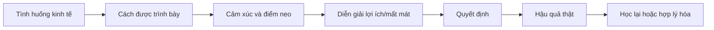
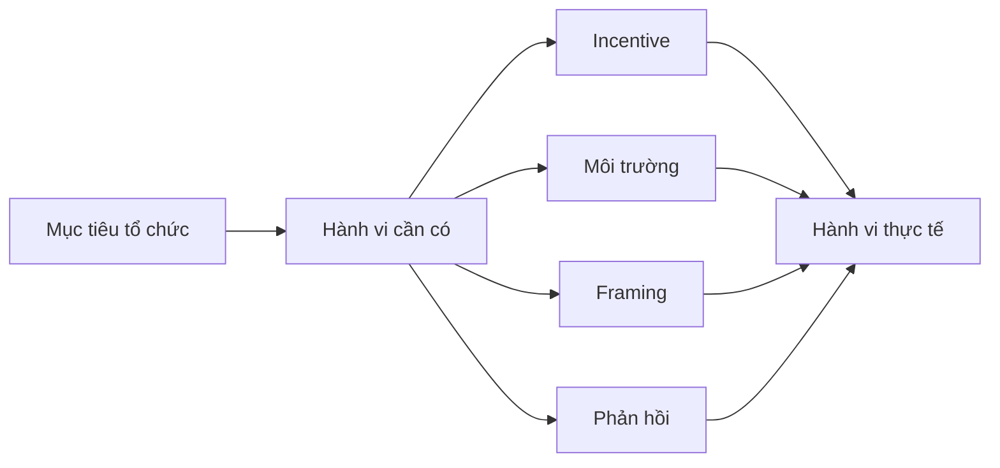

# Tập 15: Kinh Tế Học Hành Vi

**Hiểu vì sao con người không tối ưu thuần lý, và cách thiết kế quyết định kinh doanh, đầu tư, tiêu dùng, quản trị và đàm phán thực tế hơn**  
Giáo trình ngắn gọn cho người trưởng thành, cấp quản lý/C-level

---

## 0. Vì Sao C-level Cần Học Kinh Tế Học Hành Vi?

### Bản chất

Kinh tế học cổ điển thường giả định con người tối ưu lợi ích một cách lý trí.  
Nhưng trong đời thật, con người quyết định bằng:

- Cảm xúc
- Nỗi sợ mất mát
- Bối cảnh trình bày
- Điểm neo ban đầu
- Thói quen
- Áp lực xã hội
- Cảm giác công bằng
- Câu chuyện trong đầu
- Cái tôi và bản sắc

Vì vậy, chiến lược tốt trên bảng tính có thể thất bại khi gặp hành vi thật của con người.

### Một câu cần nhớ

> Con người không tối ưu như máy tính. Con người phản ứng với mất mát, bối cảnh, công bằng, thời điểm và câu chuyện họ đang tin.

### Mục tiêu tập này

| Năng lực | Ý nghĩa thực tế |
|---|---|
| Hiểu hành vi phi lý có quy luật | Không ngạc nhiên trước quyết định "khó hiểu" |
| Thiết kế lựa chọn tốt hơn | Giảm lỗi do framing, anchoring và present bias |
| Định giá và tạo ưu đãi thông minh | Tăng chuyển đổi mà không phá niềm tin |
| Quản trị đầu tư và tiêu dùng tỉnh hơn | Giảm sunk cost, loss aversion và mental accounting |
| Đàm phán thực tế hơn | Xử lý công bằng, neo giá và cảm xúc mất mát |

---

## 1. First Principles: Kinh Tế Học Hành Vi Là Gì?

### Bản chất

Kinh tế học hành vi nghiên cứu cách con người thật sự ra quyết định kinh tế khi bị ảnh hưởng bởi tâm lý, xã hội và giới hạn nhận thức.

```text
Hành vi kinh tế = Lợi ích + Cảm xúc + Bối cảnh + Thiên kiến + Chuẩn xã hội + Thời điểm
```

Con người vẫn muốn có lợi, nhưng "có lợi" không chỉ là tiền.  
Nó còn là:

- Không mất mặt
- Không hối tiếc
- Không bị thiệt
- Được thấy công bằng
- Được thấy mình đúng
- Được giữ bản sắc
- Được dễ quyết định

### Mô hình tổng quát



### Câu hỏi gốc

```text
1. Người này đang tối ưu tiền, thời gian, thể diện hay cảm giác an toàn?
2. Họ đang sợ mất điều gì?
3. Bối cảnh trình bày có đang làm lệch quyết định không?
4. Quyết định này chịu ảnh hưởng của điểm neo nào?
5. Nếu nhìn sau 6 tháng, lựa chọn này còn hợp lý không?
```

---

## 2. Con Người Không Tối Ưu Thuần Lý

### Bản chất

Con người có lý trí, nhưng lý trí hoạt động trong giới hạn.  
Ta không tính hết mọi phương án, không biết hết mọi dữ kiện và không trung lập với cảm xúc.

Thay vì tối ưu tuyệt đối, con người thường dùng lối tắt:

| Lối tắt | Lợi ích | Rủi ro |
|---|---|---|
| Chọn cái quen | Quyết nhanh | Bỏ lỡ phương án tốt hơn |
| Tin người giống mình | Giảm bất định | Thiên vị nhóm |
| Dựa vào giá đầu tiên | Có mốc so sánh | Bị neo sai |
| Sợ mất hơn thích được | Cẩn trọng | Bỏ qua cơ hội tốt |
| Trì hoãn cái khó | Giảm khó chịu hiện tại | Tăng chi phí tương lai |

### Nguyên tắc thực dụng

> Muốn dự đoán hành vi, đừng hỏi "điều gì tối ưu?". Hãy hỏi "trong bối cảnh này, con người sẽ thấy điều gì dễ, an toàn và ít mất mát nhất?".

---

## 3. Loss Aversion: Nỗi Sợ Mất Mạnh Hơn Niềm Vui Được

### Bản chất

Con người thường đau vì mất nhiều hơn vui vì được cùng một lượng tương đương.

Ví dụ:

- Mất 10 triệu thường đau hơn cảm giác vui khi được 10 triệu.
- Mất một khách hàng lớn có thể ám ảnh hơn việc ký được một khách hàng tương đương.
- Nhân sự phản ứng mạnh với mất quyền lợi hơn là không được thêm quyền lợi mới.

### Ứng dụng C-level

| Bối cảnh | Cách loss aversion xuất hiện | Cách xử lý |
|---|---|---|
| Thay đổi tổ chức | Nhân sự thấy mất quyền kiểm soát | Nói rõ cái gì được giữ, cái gì được bù |
| Pricing | Khách sợ mua sai | Bảo hành, dùng thử, hoàn tiền rõ ràng |
| Đầu tư | Sợ cắt lỗ | Đặt nguyên tắc thoát trước khi vào |
| Đàm phán | Bên kia sợ mất vị thế | Cho họ giữ thể diện và quyền lựa chọn |

### Câu hỏi tự soi

```text
1. Tôi đang phản ứng với rủi ro thật hay chỉ với cảm giác mất?
2. Nếu đây là cơ hội mới, tôi có chọn nó không?
3. Mất mát nào là không thể chấp nhận, mất mát nào chỉ gây khó chịu?
```

---

## 4. Framing: Cách Đóng Khung Thay Đổi Quyết Định

### Bản chất

Cùng một sự thật, nếu được trình bày khác nhau, có thể tạo quyết định khác nhau.

| Cách nói | Phản ứng thường gặp |
|---|---|
| "90% khách hàng hài lòng" | An tâm |
| "10% khách hàng không hài lòng" | Lo rủi ro |
| "Tiết kiệm 2 giờ mỗi tuần" | Thấy lợi ích |
| "Mất 2 giờ mỗi tuần nếu không dùng" | Thấy chi phí bỏ lỡ |

### Ứng dụng trong quản trị

Framing không phải là thao túng nếu sự thật được giữ nguyên và người nghe hiểu rõ đánh đổi.

| Việc cần làm | Frame yếu | Frame mạnh hơn |
|---|---|---|
| Đổi quy trình | "Phải làm thêm bước này" | "Giảm lỗi lặp lại và giảm việc chữa cháy" |
| Cắt sản phẩm | "Chúng ta bỏ dòng này" | "Giải phóng nguồn lực cho dòng có biên lợi nhuận tốt hơn" |
| Tăng giá | "Giá tăng 15%" | "Gói mới giữ chất lượng dịch vụ khi chi phí tăng" |

### Checklist framing

```text
[ ] Có trình bày cả lợi ích và chi phí không?
[ ] Có nói rõ điều gì không đổi không?
[ ] Có tránh làm đẹp sự thật quá mức không?
[ ] Có kiểm tra người nghe hiểu đúng đánh đổi không?
```

---

## 5. Anchoring: Điểm Neo Ban Đầu

### Bản chất

Con người bị ảnh hưởng mạnh bởi con số, thông tin hoặc đề xuất đầu tiên xuất hiện trong cuộc quyết định.

Ví dụ:

- Giá niêm yết làm giá giảm sau đó có vẻ hấp dẫn.
- Mức lương kỳ vọng đầu tiên định hình cả cuộc thương lượng.
- Dự báo doanh thu ban đầu làm đội ngũ bám vào dù dữ kiện mới đã đổi.

### Ứng dụng trong pricing và đàm phán

| Tình huống | Điểm neo tốt | Rủi ro cần tránh |
|---|---|---|
| Bán hàng B2B | Neo vào ROI, chi phí vấn đề, rủi ro không đổi | Neo vào giá phần mềm đơn thuần |
| Đàm phán lương | Neo bằng phạm vi thị trường và giá trị tạo ra | Nêu con số thiếu căn cứ |
| Gói sản phẩm | Dùng gói cao để làm rõ khác biệt giá trị | Tạo gói mồi quá lộ |
| M&A/đầu tư | Neo bằng kịch bản và giả định rõ | Bám valuation cũ vì ego |

### Câu hỏi chống neo

```text
1. Con số đầu tiên đến từ đâu?
2. Nếu chưa từng nghe con số đó, tôi sẽ ước lượng thế nào?
3. Có benchmark độc lập nào đáng tin hơn không?
4. Tôi đang bảo vệ sự thật hay bảo vệ con số ban đầu?
```

---

## 6. Mental Accounting: Tài Khoản Tâm Lý

### Bản chất

Con người chia tiền thành nhiều "ngăn" tâm lý, dù về mặt kinh tế tiền là có thể thay thế nhau.

Ví dụ:

- Tiền thưởng dễ bị tiêu thoáng hơn lương cố định.
- Lãi đầu tư được xem là "tiền lời" nên dám mạo hiểm hơn.
- Ngân sách phòng ban khiến đội ngũ tiêu để khỏi mất budget năm sau.

### Mặt tốt và mặt tối

| Mặt tốt | Mặt tối |
|---|---|
| Giúp kiểm soát chi tiêu | Nhầm tiền nào cũng có giá trị khác nhau |
| Tạo kỷ luật tiết kiệm | Tiêu hoang ở một ngăn, keo kiệt ở ngăn khác |
| Dễ phân bổ ngân sách | Bảo vệ ngân sách hơn mục tiêu chung |

### Ứng dụng

```text
Quản trị cá nhân:
- Tách quỹ sống, quỹ dự phòng, quỹ đầu tư, quỹ học tập.
- Nhưng đánh giá tổng tài sản bằng một bức tranh chung.

Quản trị doanh nghiệp:
- Dùng budget để tạo kỷ luật.
- Nhưng review định kỳ xem ngân sách có còn phục vụ chiến lược không.
```

---

## 7. Sunk Cost: Cái Giá Đã Mất Không Nên Điều Khiển Tương Lai

### Bản chất

Sunk cost là chi phí đã bỏ ra và không thể thu hồi.  
Sai lầm là tiếp tục vì đã lỡ đầu tư, thay vì vì tương lai còn đáng đầu tư.

Ví dụ:

- Tiếp tục dự án sản phẩm vì đã làm 18 tháng.
- Giữ nhân sự không phù hợp vì đã đào tạo lâu.
- Không bán khoản đầu tư xấu vì không muốn "hiện thực hóa lỗ".

### Câu hỏi quyết định

| Câu hỏi sai | Câu hỏi đúng |
|---|---|
| Ta đã bỏ vào bao nhiêu? | Từ hôm nay, bỏ thêm có đáng không? |
| Dừng lại có xấu mặt không? | Tiếp tục có làm mất thêm nguồn lực không? |
| Ai chịu trách nhiệm? | Bài học là gì và quyết định mới là gì? |

### Quy tắc

> Chi phí quá khứ chỉ có giá trị để học. Quyết định tương lai phải dựa trên lợi ích, rủi ro và chi phí cơ hội từ hôm nay trở đi.

---

## 8. Present Bias: Thiên Kiến Hiện Tại

### Bản chất

Con người thường ưu tiên phần thưởng gần và né khó chịu trước mắt, dù biết tương lai sẽ trả giá.

Ví dụ:

- Trì hoãn tập thể dục, học tập, tiết kiệm.
- Chọn khuyến mãi ngắn hạn làm hỏng biên lợi nhuận dài hạn.
- Né phản hồi khó trong tổ chức đến khi vấn đề lớn hơn.

### Cách thiết kế hành vi tốt hơn

| Mục tiêu | Thiết kế |
|---|---|
| Tiết kiệm | Tự động trích tiền ngay khi có thu nhập |
| Đầu tư | Lập lịch định kỳ thay vì chờ cảm xúc |
| Quản trị | Review rủi ro cố định mỗi tháng |
| Sức khỏe | Đặt lịch và môi trường trước, không dựa vào ý chí |
| Học tập | Chia thành phiên 25-45 phút có đầu ra rõ |

### Công thức

```text
Muốn hành vi dài hạn xảy ra:
Giảm ma sát hiện tại + Tăng phần thưởng gần + Tự động hóa + Theo dõi tiến độ
```

---

## 9. Fairness: Cảm Giác Công Bằng

### Bản chất

Con người không chỉ hỏi "tôi được bao nhiêu?".  
Họ hỏi:

- Tôi có bị đối xử tệ hơn người khác không?
- Quy trình có minh bạch không?
- Người kia có lợi dụng hoàn cảnh không?
- Cái giá này có hợp đạo lý không?
- Tôi có giữ được phẩm giá không?

### Ứng dụng

| Bối cảnh | Điều cần chú ý |
|---|---|
| Lương thưởng | Không chỉ mức tiền, mà là tiêu chí và tính nhất quán |
| Tăng giá | Giải thích lý do thật, tránh cảm giác bị ép |
| Đàm phán | Để bên kia thấy thỏa thuận có lý, không chỉ bị dồn |
| Sa thải/cắt giảm | Quy trình và cách nói ảnh hưởng mạnh đến niềm tin còn lại |
| Chính sách nội bộ | Ngoại lệ thiếu giải thích phá công bằng cảm nhận |

### Nguyên tắc

> Công bằng cảm nhận có thể không trùng với công bằng trên bảng tính, nhưng nó quyết định mức hợp tác của con người.

---

## 10. Incentives: Ưu Đãi Có Thể Làm Méo Hành Vi

### Bản chất

Incentive là tín hiệu nói với con người: "hành vi nào được thưởng, hành vi nào bị phạt".

Nhưng incentive sai sẽ tạo hành vi sai.

| Incentive | Hành vi có thể sinh ra |
|---|---|
| Thưởng doanh số ngắn hạn | Bán sai khách, chiết khấu quá mức |
| Thưởng số ticket xử lý | Đóng nhanh thay vì giải quyết gốc |
| KPI tuyển số lượng | Hạ chuẩn chất lượng |
| Thưởng lợi nhuận phòng ban | Tối ưu cục bộ, hại toàn công ty |
| Phạt lỗi quá nặng | Giấu lỗi, báo cáo muộn |

### Checklist thiết kế incentive

```text
[ ] Hành vi được thưởng có đúng là hành vi cần không?
[ ] Có tạo tối ưu cục bộ không?
[ ] Có làm người tốt phải chơi trò xấu để sống sót không?
[ ] Có đo được chất lượng, không chỉ số lượng không?
[ ] Có cơ chế phát hiện tác dụng phụ không?
```

---

## 11. Pricing, Đầu Tư, Tiêu Dùng, Quản Trị Và Đàm Phán

### Pricing

Giá không chỉ là con số. Giá là tín hiệu về giá trị, rủi ro, vị thế và niềm tin.

| Nguyên tắc | Ứng dụng |
|---|---|
| Neo vào giá trị | Nói chi phí vấn đề trước khi nói giá |
| Giảm sợ mất | Dùng thử, cam kết chất lượng, case study |
| Tạo lựa chọn rõ | 3 gói dễ so sánh thường tốt hơn quá nhiều gói |
| Giữ công bằng | Tăng giá có lý do, có lộ trình, có phân khúc |

### Đầu tư

Đầu tư tốt cần quản trị cảm xúc trước khi quản trị danh mục.

```text
Nguyên tắc:
1. Viết thesis trước khi mua.
2. Đặt điều kiện bán trước khi cảm xúc xuất hiện.
3. Không nhầm may mắn với năng lực.
4. Không tăng rủi ro chỉ vì đang "chơi bằng tiền lời".
5. Đánh giá danh mục tổng thể, không từng khoản riêng lẻ.
```

### Tiêu dùng

Người tiêu dùng không chỉ mua sản phẩm.  
Họ mua giảm đau, tăng bản sắc, tiết kiệm thời gian, cảm giác thuộc về hoặc cảm giác kiểm soát.

| Câu hỏi | Ý nghĩa |
|---|---|
| Khách đang sợ mất gì? | Thiết kế bảo đảm |
| Khách muốn trở thành ai? | Thiết kế thông điệp bản sắc |
| Ma sát mua nằm ở đâu? | Giảm bước, giảm mơ hồ |
| Sau mua họ cần tự biện minh gì? | Cung cấp bằng chứng và trải nghiệm hậu mãi |

### Quản trị

Quản trị hành vi không phải là ra thêm quy định.  
Đó là thiết kế môi trường để hành vi đúng dễ xảy ra hơn hành vi sai.



### Đàm phán

Đàm phán không chỉ là chia tiền.  
Đó là xử lý neo giá, mất mát, công bằng, thể diện và lựa chọn thay thế.

| Đòn bẩy | Cách dùng |
|---|---|
| Anchoring | Đưa mốc đầu tiên có căn cứ |
| Loss aversion | Làm rõ rủi ro nếu không đạt thỏa thuận |
| Fairness | Cho thấy tiêu chí khách quan |
| Framing | Chuyển từ giá sang tổng giá trị |
| Sunk cost | Không để thời gian đã bỏ ra ép ký thỏa thuận xấu |

---

## 12. Công Cụ Thực Hành

### Công cụ 1: Audit quyết định hành vi

```text
Quyết định đang xét:
Lợi ích lý trí:
Nỗi sợ mất mát:
Điểm neo đang ảnh hưởng:
Cách vấn đề đang được framing:
Chi phí đã mất có đang kéo tôi không:
Tác động ngắn hạn:
Tác động dài hạn:
Quyết định nếu bắt đầu lại từ hôm nay:
```

### Công cụ 2: Thiết kế lựa chọn

| Thành phần | Câu hỏi thiết kế |
|---|---|
| Mặc định | Lựa chọn mặc định có giúp hành vi tốt dễ hơn không? |
| Ma sát | Bước nào đang làm người ta bỏ cuộc? |
| Bằng chứng | Người dùng cần thấy gì để giảm sợ sai? |
| So sánh | Các lựa chọn có dễ phân biệt không? |
| Thời điểm | Khi nào họ dễ quyết định nhất? |

### Công cụ 3: Checklist trước khi tăng giá hoặc đổi chính sách

```text
[ ] Lý do thay đổi có rõ và thật không?
[ ] Nhóm bị mất quyền lợi đã được nhận diện chưa?
[ ] Có phương án chuyển tiếp không?
[ ] Có giải thích tiêu chí công bằng không?
[ ] Có đo phản ứng sau khi triển khai không?
```

---

## 13. Lộ Trình Thực Hành 4 Tuần

### Tuần 1: Nhận diện thiên kiến cá nhân

- Ghi lại 5 quyết định tiền bạc gần nhất.
- Đánh dấu loss aversion, sunk cost, anchoring hoặc present bias nếu có.

### Tuần 2: Audit pricing hoặc tiêu dùng

- Chọn một sản phẩm/dịch vụ bạn đang bán hoặc mua.
- Phân tích frame, điểm neo, ma sát, bảo đảm và cảm giác công bằng.

### Tuần 3: Thiết kế incentive

- Chọn một KPI hoặc chính sách thưởng/phạt trong tổ chức.
- Tìm hành vi phụ không mong muốn mà incentive đó có thể tạo ra.

### Tuần 4: Áp dụng vào đàm phán

- Chuẩn bị một cuộc đàm phán thật.
- Viết trước điểm neo, tiêu chí công bằng, giới hạn rút lui và cách giữ thể diện cho hai bên.

---

## 14. Bảng Tóm Tắt First Principles

| Chủ đề | Bản chất | Câu hỏi áp dụng |
|---|---|---|
| Con người không tối ưu thuần lý | Quyết định trong giới hạn cảm xúc, dữ kiện và bối cảnh | Người này thật sự đang tối ưu điều gì? |
| Loss aversion | Mất mát đau hơn đạt được | Họ đang sợ mất gì? |
| Framing | Cách trình bày thay đổi diễn giải | Vấn đề đang được đóng khung ra sao? |
| Anchoring | Mốc đầu tiên kéo toàn bộ đánh giá sau đó | Con số đầu tiên có đáng tin không? |
| Mental accounting | Tiền bị chia thành các ngăn tâm lý | Tôi có đang xem các khoản tiền khác nhau quá mức không? |
| Sunk cost | Chi phí đã mất kéo quyết định tương lai | Nếu bắt đầu từ hôm nay, tôi có tiếp tục không? |
| Present bias | Hiện tại thắng tương lai | Làm sao giảm ma sát cho hành vi dài hạn? |
| Fairness | Con người cần cảm giác được đối xử đúng | Quy trình này có được cảm nhận là công bằng không? |
| Incentives | Thưởng phạt định hình hành vi | Incentive này đang tạo hành vi phụ nào? |
| Pricing | Giá là tín hiệu giá trị và rủi ro | Giá đang neo vào chi phí hay giá trị? |
| Đầu tư | Quản trị cảm xúc trước khi quản trị danh mục | Tôi có nguyên tắc trước khi cảm xúc xuất hiện không? |
| Đàm phán | Xử lý giá trị, mất mát, công bằng và thể diện | Thỏa thuận này có hợp lý với cả lợi ích lẫn phẩm giá không? |

---

## 15. Một Câu Để Nhớ Toàn Bộ Tập 15

> Muốn quyết định kinh tế tốt hơn, hãy thiết kế cho con người thật: sợ mất, dễ bị neo, nhạy với công bằng, yếu trước hiện tại và luôn cần một câu chuyện đủ hợp lý để hành động.
