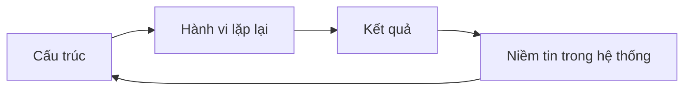
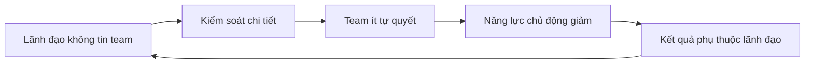
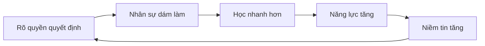
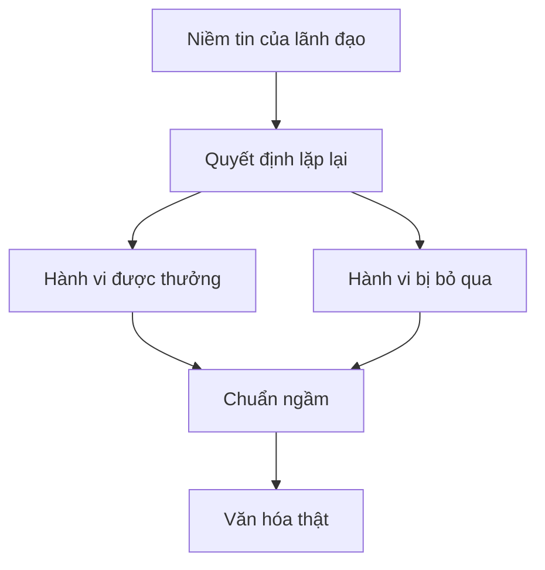
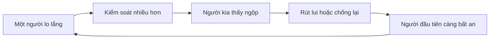
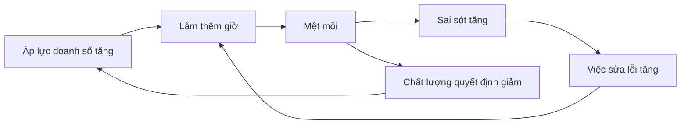

# Tập 16: Tư Duy Hệ Thống Về Con Người Và Tổ Chức

**Hiểu vòng phản hồi, độ trễ, hệ quả ngoài ý muốn, động lực ngầm, văn hóa và điểm đòn bẩy trong con người, gia đình và tổ chức**  
Giáo trình ngắn gọn cho người trưởng thành, cấp quản lý/C-level

---

## 0. Vì Sao C-level Cần Học Tư Duy Hệ Thống?

### Bản chất

Ở cấp cao, vấn đề hiếm khi nằm ở một người, một quyết định hoặc một sự kiện đơn lẻ.

Vấn đề thường nằm ở hệ thống:

- Cách thông tin chảy
- Cách quyền lực được dùng
- Cách phần thưởng được thiết kế
- Cách sai lầm bị xử lý
- Cách người giỏi được giữ hoặc bị đẩy đi
- Cách gia đình hoặc tổ chức phản ứng với căng thẳng
- Cách một giải pháp ngắn hạn tạo vấn đề dài hạn

Tư duy hệ thống giúp lãnh đạo bớt sửa triệu chứng và bắt đầu sửa cấu trúc.

### Một câu cần nhớ

> Con người không chỉ hành động theo tính cách. Con người hành động trong một hệ thống đang dạy họ nên làm gì để sống sót, được công nhận hoặc tránh bị phạt.

### Mục tiêu tập này

| Năng lực | Ý nghĩa thực tế |
|---|---|
| Nhìn hệ thống | Không đổ lỗi quá nhanh cho cá nhân |
| Đọc vòng phản hồi | Biết điều gì đang tự củng cố vấn đề |
| Hiểu độ trễ | Không kết luận sớm hoặc đổi hướng liên tục |
| Nhận ra hệ quả ngoài ý muốn | Biết vì sao giải pháp tốt có thể tạo vấn đề mới |
| Tìm điểm đòn bẩy | Can thiệp ít hơn nhưng đúng chỗ hơn |

---

## 1. First Principles: Hệ Thống Là Gì?

### Bản chất

Hệ thống là một tập hợp các phần tử có liên kết với nhau, cùng tạo ra một kiểu kết quả lặp lại.

```text
Hệ thống = Phần tử + Quan hệ + Luồng thông tin + Quy tắc + Mục tiêu ngầm
```

Nếu chỉ nhìn phần tử, ta hỏi: ai sai?  
Nếu nhìn hệ thống, ta hỏi: điều gì trong cấu trúc khiến hành vi này lặp lại?

### Mô hình đơn giản



### Câu hỏi gốc

```text
1. Vấn đề này lặp lại ở đâu?
2. Ai đang được thưởng khi vấn đề tiếp diễn?
3. Ai đang chịu chi phí?
4. Thông tin nào đến muộn hoặc bị giấu?
5. Cấu trúc nào khiến người tốt vẫn tạo kết quả xấu?
```

---

## 2. Tư Duy Tuyến Tính Và Tư Duy Hệ Thống

### Bản chất

Tư duy tuyến tính tìm một nguyên nhân gần nhất.  
Tư duy hệ thống tìm vòng tương tác tạo kết quả lặp lại.

| Tư duy tuyến tính | Tư duy hệ thống |
|---|---|
| Ai gây ra chuyện này? | Cấu trúc nào tạo chuyện này? |
| Sửa người | Sửa quan hệ, quy tắc, thông tin, incentive |
| Phản ứng nhanh | Quan sát vòng lặp |
| Tối ưu từng phần | Tối ưu toàn hệ |
| Đo kết quả tức thì | Theo dõi kết quả theo thời gian |

### Ví dụ

| Vấn đề bề mặt | Cách nhìn hệ thống |
|---|---|
| Nhân sự không chủ động | Quyền quyết định có thật sự được trao không? |
| Team hay trễ deadline | Có quá nhiều việc khẩn cấp chen ngang không? |
| Gia đình hay cãi nhau | Vòng theo đuổi - rút lui có đang lặp lại không? |
| Quản lý giấu tin xấu | Tin xấu từng bị trừng phạt thế nào? |
| Văn hóa chính trị | Quyền lực và phần thưởng đang đi qua kênh nào? |

### Nguyên tắc

> Muốn đổi hành vi bền vững, hãy đổi hệ thống khiến hành vi đó trở nên hợp lý.

---

## 3. Vòng Phản Hồi: Khi Kết Quả Quay Lại Nuôi Nguyên Nhân

### Bản chất

Vòng phản hồi là khi một hành động tạo kết quả, rồi kết quả đó quay lại làm thay đổi hành động ban đầu.

Có hai loại chính:

| Loại vòng | Bản chất | Ví dụ |
|---|---|---|
| Củng cố | Càng xảy ra càng mạnh hơn | Tin tưởng tạo trao quyền, trao quyền tạo năng lực, năng lực tạo thêm tin tưởng |
| Cân bằng | Hệ thống tự kéo về một mức | Mệt quá thì nghỉ, nghỉ đủ thì phục hồi |

### Vòng củng cố tiêu cực trong tổ chức



### Vòng củng cố tích cực



### Câu hỏi áp dụng

```text
1. Kết quả hiện tại đang củng cố hành vi nào?
2. Hành vi nào đang làm vấn đề tự sống tiếp?
3. Vòng này có điểm nào có thể cắt?
4. Nếu muốn tạo vòng tốt, tín hiệu đầu tiên cần thay đổi là gì?
```

---

## 4. Độ Trễ: Lý Do Hệ Thống Dễ Bị Điều Khiển Sai

### Bản chất

Độ trễ là khoảng cách thời gian giữa hành động và kết quả thật.

Độ trễ làm lãnh đạo dễ:

- Đổi chiến lược quá sớm
- Tưởng giải pháp không hiệu quả
- Tưởng kết quả tốt là do quyết định gần nhất
- Tưởng vấn đề mới không liên quan quyết định cũ
- Tăng liều can thiệp khi hệ thống chưa kịp phản ứng

### Ví dụ

| Hành động | Kết quả tức thì | Kết quả trễ |
|---|---|---|
| Cắt chi phí đào tạo | Lợi nhuận đẹp hơn | Năng lực quản lý giảm sau 6-18 tháng |
| Ép KPI mạnh | Doanh số tăng | Gian lận, burnout, khách hàng mất niềm tin |
| CEO xử lý mọi quyết định | Tốc độ ngắn hạn tăng | Tổ chức mất khả năng tự vận hành |
| Né xung đột gia đình | Nhà yên tạm thời | Khoảng cách cảm xúc lớn dần |

### Nguyên tắc

> Trong hệ thống có độ trễ, phản ứng quá nhanh có thể tạo dao động mạnh hơn vấn đề ban đầu.

---

## 5. Hệ Quả Ngoài Ý Muốn

### Bản chất

Hệ quả ngoài ý muốn là kết quả phụ sinh ra từ một can thiệp có vẻ hợp lý.

Nó thường xuất hiện khi ta tối ưu một mục tiêu mà bỏ qua phản ứng của con người.

### Các dạng phổ biến

| Can thiệp | Ý định | Hệ quả ngoài ý muốn |
|---|---|---|
| Thưởng theo số lượng | Tăng năng suất | Giảm chất lượng |
| Phạt lỗi nặng | Tăng trách nhiệm | Che giấu sai lầm |
| Đòi báo cáo liên tục | Tăng kiểm soát | Giảm thời gian làm việc thật |
| Khen người hy sinh quá mức | Tạo tinh thần chiến đấu | Bình thường hóa burnout |
| Can thiệp vào mâu thuẫn con cái | Giữ hòa khí | Con không học tự xử lý xung đột |

### Câu hỏi trước khi can thiệp

```text
1. Người trong hệ thống sẽ thích nghi thế nào?
2. Điều gì sẽ được làm cho đẹp số liệu nhưng xấu thực chất?
3. Ai có động cơ lách luật?
4. Chi phí bị đẩy sang đâu?
5. Nếu thành công ngắn hạn, rủi ro dài hạn là gì?
```

---

## 6. Local Optimization: Khi Từng Bộ Phận Đúng Nhưng Toàn Hệ Sai

### Bản chất

Local optimization là tối ưu từng phần đến mức làm hại toàn hệ.

Trong tổ chức, mỗi phòng ban có thể đạt KPI riêng nhưng công ty vẫn chậm, rối và mất khách hàng.

| Bộ phận | Tối ưu cục bộ | Hại toàn hệ |
|---|---|---|
| Sales | Chốt nhiều deal | Bán sai kỳ vọng, delivery quá tải |
| Finance | Cắt chi phí | Mất năng lực tương lai |
| HR | Tuyển nhanh | Giảm chất lượng văn hóa |
| Product | Thêm nhiều tính năng | Sản phẩm phức tạp, support tăng |
| Customer Service | Đóng ticket nhanh | Không xử lý gốc rễ vấn đề |

### Dấu hiệu

- Phòng ban đổ lỗi lẫn nhau
- KPI xanh nhưng khách hàng không hài lòng
- Người giỏi bận họp liên phòng liên tục
- Vấn đề bị chuyền qua lại
- Ai cũng đúng theo chỉ số của mình

### Câu hỏi lãnh đạo

> KPI nào đang làm từng phần thắng nhưng toàn hệ thua?

---

## 7. Incentives: Hệ Thống Dạy Con Người Nên Làm Gì

### Bản chất

Incentive không chỉ là tiền thưởng.  
Incentive là mọi tín hiệu cho con người biết hành vi nào được lợi, được an toàn hoặc được công nhận.

Incentive gồm:

- Lương thưởng
- Thăng tiến
- Sự chú ý của lãnh đạo
- Ai được bảo vệ
- Ai bị phạt
- Chuyện gì được kể như thành tích
- Chuyện gì bị xem là làm phiền

### Bảng đọc incentive

| Câu hỏi | Điều cần nhìn |
|---|---|
| Ai được thăng tiến? | Hệ thống thật sự coi trọng điều gì |
| Ai được lãnh đạo nghe? | Quyền lực ngầm nằm ở đâu |
| Tin xấu có bị phạt không? | Mức an toàn của sự thật |
| Người sửa lỗi gốc có được công nhận không? | Tổ chức thích chữa cháy hay xây hệ thống |
| Người nói không với việc sai có được bảo vệ không? | Chuẩn đạo đức có thật không |

### Nguyên tắc

> Văn hóa được quyết định ít hơn bởi khẩu hiệu, nhiều hơn bởi hành vi nào được thưởng và hành vi nào được bỏ qua.

---

## 8. Văn Hóa Như Một Hệ Thống

### Bản chất

Văn hóa không phải là poster trên tường.  
Văn hóa là thuật toán xã hội của tổ chức: cách mọi người dự đoán điều gì sẽ xảy ra nếu họ nói thật, nhận sai, giúp nhau, phản biện hoặc bảo vệ tiêu chuẩn.

```text
Văn hóa = Câu chuyện lặp lại + Hành vi được thưởng + Hành vi được dung túng + Cách xử lý căng thẳng
```

### Cấu trúc tạo văn hóa



### Dấu hiệu văn hóa thật

| Quan sát | Có thể cho thấy |
|---|---|
| Người mới học rất nhanh điều không nên nói | Có vùng cấm sự thật |
| Mọi người họp ngoài phòng họp chính | Quyết định thật nằm ở kênh ngầm |
| Ai cũng bận nhưng ít ai chịu trách nhiệm cuối | Accountability mờ |
| Người giỏi im lặng | Phản biện không có tác dụng |
| Lỗi lặp lại nhưng không ai sở hữu | Hệ thống học kém |

---

## 9. Family/System Dynamics: Gia Đình Cũng Là Một Hệ Thống

### Bản chất

Gia đình là hệ thống cảm xúc sâu nhất của con người.  
Mỗi người không chỉ có tính cách riêng, mà còn giữ một vai trong cân bằng của gia đình.

### Vai thường gặp trong hệ gia đình

| Vai | Chức năng hệ thống | Cái giá |
|---|---|---|
| Người gánh vác | Giữ gia đình không sụp | Kiệt sức, khó nhờ giúp |
| Người hòa giải | Giảm xung đột | Mất tiếng nói riêng |
| Người thành công | Tạo tự hào và hy vọng | Sợ thất bại, sống để chứng minh |
| Người nổi loạn | Nói thay phần bị nén | Bị xem là vấn đề |
| Người im lặng | Giữ hòa khí | Xa cách cảm xúc |

### Vòng lặp gia đình phổ biến



### Câu hỏi áp dụng

```text
1. Tôi đang giữ vai nào trong hệ gia đình?
2. Vai này giúp hệ thống ổn định ra sao?
3. Cái giá của vai này với tôi là gì?
4. Nếu tôi đổi vai, ai trong hệ thống sẽ khó chịu?
5. Tôi có thể đổi hành vi mà không cần ép cả hệ thống đổi ngay không?
```

---

## 10. Causal Loop: Bản Đồ Nhân Quả Vòng

### Bản chất

Causal loop là cách vẽ quan hệ nhân quả theo vòng, giúp ta thấy vấn đề tự duy trì thế nào.

Không cần vẽ đẹp.  
Quan trọng là thấy được biến nào tăng, biến nào giảm và vòng nào đang chạy.

### Cách vẽ nhanh

```text
1. Chọn một vấn đề lặp lại.
2. Ghi các biến có thể đo hoặc quan sát.
3. Nối mũi tên: A tăng làm B tăng hay giảm?
4. Tìm vòng quay lại điểm đầu.
5. Đánh dấu vòng củng cố hoặc cân bằng.
6. Chọn một điểm can thiệp nhỏ.
```

### Ví dụ: Burnout trong đội ngũ



### Câu hỏi khi đọc bản đồ

| Câu hỏi | Ý nghĩa |
|---|---|
| Biến nào là triệu chứng? | Tránh sửa phần ngọn |
| Biến nào là nguồn tăng tốc? | Tìm vòng củng cố |
| Biến nào có độ trễ? | Tránh kết luận sớm |
| Biến nào dễ can thiệp nhất? | Tìm bước đầu |
| Biến nào nếu đổi sẽ đổi nhiều thứ khác? | Tìm điểm đòn bẩy |

---

## 11. Điểm Đòn Bẩy: Can Thiệp Đúng Chỗ

### Bản chất

Điểm đòn bẩy là nơi một thay đổi nhỏ có thể tạo ảnh hưởng lớn vì nó chạm vào cấu trúc sâu.

Không phải mọi điểm đều mạnh như nhau.

| Mức can thiệp | Ví dụ | Sức mạnh |
|---|---|---|
| Sự kiện | Nhắc một người sửa lỗi | Thấp |
| Quy trình | Đổi cách handoff giữa team | Trung bình |
| Thông tin | Cho dữ liệu thật đến đúng người đúng lúc | Cao |
| Incentive | Đổi điều được thưởng/phạt | Rất cao |
| Quyền quyết định | Rõ ai có quyền chọn gì | Rất cao |
| Mô hình tư duy | Đổi cách lãnh đạo hiểu vấn đề | Sâu nhất |

### Ví dụ điểm đòn bẩy

| Vấn đề | Can thiệp yếu | Điểm đòn bẩy tốt hơn |
|---|---|---|
| Tin xấu đến muộn | Mắng quản lý | Tạo cơ chế báo tin xấu không bị phạt |
| Team thiếu chủ động | Kêu gọi ownership | Trao quyền quyết định thật và chấp nhận lỗi học tập |
| Văn hóa họp nhiều | Cắt số cuộc họp | Rõ quyền quyết định và chuẩn tài liệu trước họp |
| Gia đình xung đột | Khuyên mọi người bình tĩnh | Đổi vòng phản ứng của chính mình trước |

### Nguyên tắc

> Điểm đòn bẩy tốt thường không nằm ở nơi ồn ào nhất, mà nằm ở quy tắc ngầm khiến tiếng ồn tiếp tục sinh ra.

---

## 12. Ứng Dụng Trong Lãnh Đạo

### Bản chất

Lãnh đạo hệ thống là thiết kế điều kiện để hành vi đúng trở nên dễ hơn, rõ hơn và được củng cố đều hơn.

### 5 việc C-level cần làm

| Việc | Câu hỏi lãnh đạo |
|---|---|
| Làm rõ mục tiêu toàn hệ | Chúng ta đang tối ưu điều gì ở cấp công ty? |
| Làm rõ quyền quyết định | Ai có quyền chọn, ai tư vấn, ai chịu trách nhiệm? |
| Thiết kế luồng thông tin | Sự thật đi đến đâu, chậm bao lâu, bị lọc thế nào? |
| Đồng bộ incentive | Điều được thưởng có đúng với điều ta nói là quan trọng không? |
| Bảo vệ học tập | Lỗi được dùng để đổ lỗi hay để cải thiện hệ thống? |

### Checklist họp lãnh đạo hệ thống

```text
Vấn đề này lặp lại bao lâu rồi?
Vòng phản hồi nào đang giữ nó sống?
Độ trễ nằm ở đâu?
Ai đang được lợi từ hiện trạng?
Ai đang chịu chi phí thầm lặng?
KPI nào đang kéo lệch hành vi?
Điểm đòn bẩy nhỏ nhất trong 2 tuần tới là gì?
Chúng ta sẽ đo tín hiệu sớm nào?
```

### Nguyên tắc lãnh đạo

> Lãnh đạo không chỉ là ra quyết định đúng. Lãnh đạo là thiết kế hệ thống để nhiều người có thể ra quyết định đúng hơn mà không cần bạn đứng giữa mọi việc.

---

## 13. Công Cụ Thực Hành

### Công cụ 1: Bản đồ hệ thống 1 trang

```text
Vấn đề lặp lại:
Triệu chứng dễ thấy:
Kết quả thật đang xấu đi:
Các bên liên quan:
Vòng phản hồi chính:
Độ trễ:
Incentive đang kéo lệch:
Điểm đòn bẩy có thể thử:
Tín hiệu đo sau 2 tuần:
```

### Công cụ 2: Bảng hệ quả ngoài ý muốn

| Can thiệp dự định | Ai sẽ thích nghi thế nào? | Rủi ro phụ | Cách giảm rủi ro |
|---|---|---|---|
|  |  |  |  |
|  |  |  |  |
|  |  |  |  |

### Công cụ 3: Audit incentive

```text
Hành vi chúng ta nói là muốn:
Hành vi đang thật sự được thưởng:
Hành vi xấu đang được bỏ qua:
Ai được thăng tiến gần đây và vì sao?
Ai bị mất niềm tin và vì sao?
Một incentive cần sửa:
```

### Công cụ 4: Cắt vòng lặp quan hệ

```text
Vòng lặp giữa tôi và người kia:
Phản ứng tự động của tôi:
Phản ứng đó làm người kia sợ gì hơn?
Một phản ứng mới nhỏ hơn, rõ hơn, trưởng thành hơn:
Dấu hiệu cho thấy vòng lặp đang dịu lại:
```

---

## 14. Lộ Trình Thực Hành 4 Tuần

### Tuần 1: Nhìn vòng lặp

- Chọn một vấn đề lặp lại trong công việc hoặc gia đình.
- Vẽ causal loop đơn giản với 4-6 biến.
- Không vội giải quyết trước khi thấy vòng phản hồi.

### Tuần 2: Đọc độ trễ và hệ quả phụ

- Chọn một quyết định đang cân nhắc.
- Viết kết quả sau 1 tuần, 1 tháng, 6 tháng.
- Ghi ít nhất 3 hệ quả ngoài ý muốn có thể xảy ra.

### Tuần 3: Audit incentive

- Chọn một hành vi tổ chức đang than phiền.
- Hỏi: hành vi này đang được thưởng, được dung túng hoặc được bảo vệ ở đâu?
- Đổi một tín hiệu thưởng/phạt nhỏ nhưng rõ.

### Tuần 4: Thử điểm đòn bẩy

- Chọn một điểm can thiệp không quá lớn.
- Đặt tín hiệu đo trong 2 tuần.
- Review: vòng lặp yếu đi, mạnh lên hay chuyển sang chỗ khác?

---

## 15. Bảng Tóm Tắt First Principles

| Chủ đề | Bản chất | Câu hỏi áp dụng |
|---|---|---|
| Hệ thống | Cấu trúc tạo hành vi lặp lại | Điều gì khiến vấn đề này tiếp diễn? |
| Vòng phản hồi | Kết quả quay lại nuôi nguyên nhân | Vòng nào đang tự củng cố? |
| Độ trễ | Kết quả thật đến muộn hơn hành động | Ta có đang kết luận quá sớm không? |
| Hệ quả ngoài ý muốn | Giải pháp tạo vấn đề phụ | Người trong hệ sẽ thích nghi thế nào? |
| Local optimization | Từng phần thắng nhưng toàn hệ thua | KPI nào làm lệch hành vi chung? |
| Incentive | Tín hiệu dạy người ta nên làm gì | Hành vi nào thật sự được thưởng? |
| Văn hóa | Thuật toán xã hội của tổ chức | Điều gì xảy ra khi người ta nói thật? |
| Gia đình như hệ thống | Mỗi người giữ vai trong cân bằng cảm xúc | Tôi đang giữ vai nào? |
| Causal loop | Bản đồ nhân quả vòng | Biến nào quay lại nuôi vấn đề? |
| Điểm đòn bẩy | Can thiệp nhỏ chạm cấu trúc sâu | Chỗ nào đổi ít nhưng ảnh hưởng nhiều? |
| Lãnh đạo hệ thống | Thiết kế điều kiện cho hành vi đúng | Tôi đang sửa người hay sửa hệ thống? |

---

## 16. Một Câu Để Nhớ Toàn Bộ Tập 16

> Muốn hiểu con người và tổ chức, đừng chỉ hỏi ai đang làm gì; hãy hỏi hệ thống đang dạy họ làm điều đó bằng phần thưởng, nỗi sợ, độ trễ và vòng phản hồi nào.
