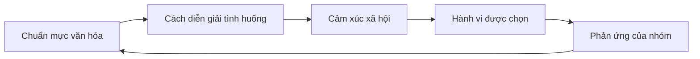
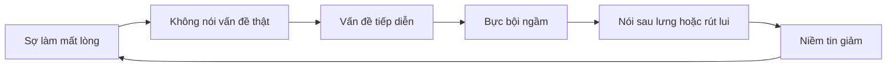

# Tập 17: Tâm Lý Văn Hóa Á Đông

**Hiểu thể diện, tập thể, thứ bậc, gia đình, hiếu, quan hệ, giao tiếp gián tiếp, quyền lực, xấu hổ, né xung đột và cách lãnh đạo thay đổi văn hóa trong bối cảnh Việt Nam/Á Đông**  
Giáo trình ngắn gọn cho người trưởng thành, cấp quản lý/C-level

---

## 0. Vì Sao C-level Cần Học Tâm Lý Văn Hóa Á Đông?

### Bản chất

Lãnh đạo ở Việt Nam và nhiều xã hội Á Đông không chỉ là quản trị mục tiêu, quy trình và năng lực cá nhân.

Lãnh đạo còn là đọc được các lực văn hóa đang vận hành ngầm:

- Thể diện
- Tình nghĩa
- Thứ bậc
- Gia đình
- Hiếu
- Quan hệ
- Nể nang
- Giữ hòa khí
- Sợ xấu hổ
- Giao tiếp gián tiếp
- Quyền lực không chính thức
- Trách nhiệm với nhóm hơn là chỉ với bản thân

Nếu không hiểu văn hóa, lãnh đạo dễ hiểu sai im lặng là đồng thuận, lễ phép là cam kết, né tránh là thiếu năng lực, phản biện ít là thiếu tư duy và quan hệ tốt là thiếu chuyên nghiệp.

### Một câu cần nhớ

> Trong văn hóa Á Đông, nhiều hành vi không nhằm tối ưu cái tôi cá nhân, mà nhằm giữ thể diện, bảo toàn quan hệ, tôn trọng thứ bậc và tránh làm hệ thống xã hội mất cân bằng.

### Mục tiêu tập này

| Năng lực | Ý nghĩa thực tế |
|---|---|
| Đọc thể diện | Biết vì sao người giỏi vẫn tránh nói thẳng |
| Hiểu tập thể và cá nhân | Không áp mô hình phương Tây một cách máy móc |
| Nhận diện thứ bậc | Biết quyền lực thật nằm ở đâu |
| Quản trị quan hệ | Dùng tình nghĩa mà không rơi vào phe cánh |
| Thay đổi văn hóa | Đổi hành vi mà không làm người trong hệ mất mặt |

---

## 1. First Principles: Văn Hóa Là Gì?

### Bản chất

Văn hóa là bộ quy tắc ngầm giúp con người biết nên hành xử thế nào để được chấp nhận, được an toàn và không làm hỏng quan hệ.

```text
Văn hóa = Chuẩn mực + Thứ bậc + Quan hệ + Cấm kỵ + Phần thưởng xã hội + Nỗi sợ xã hội
```

Văn hóa không chỉ nằm trong khẩu hiệu.  
Văn hóa nằm trong những câu hỏi không ai nói ra:

- Nói thật có bị phạt không?
- Trẻ hơn có được phản biện không?
- Làm sai có được sửa hay bị bêu tên?
- Quy trình quan trọng hơn hay quan hệ quan trọng hơn?
- Người giữ hòa khí được thưởng hay người nói vấn đề được thưởng?

### Mô hình tổng quát



### Câu hỏi gốc

```text
1. Người này đang bảo vệ kết quả, quan hệ, thể diện hay sự an toàn?
2. Nếu họ nói thẳng, họ sợ mất điều gì?
3. Ai có quyền lực chính thức, ai có quyền lực quan hệ?
4. Điều gì được xem là trưởng thành trong nhóm này?
5. Văn hóa này đang giúp gì và đang làm chậm điều gì?
```

---

## 2. Thể Diện: Đồng Tiền Xã Hội Vô Hình

### Bản chất

Thể diện là cảm giác được người khác nhìn nhận là đúng vai, đáng tôn trọng, không bị hạ thấp trước cộng đồng.

Trong nhiều bối cảnh Á Đông, thể diện không phải là sĩ diện rỗng.  
Nó là cơ chế bảo vệ vị trí xã hội, quan hệ và trật tự.

| Biểu hiện | Nhu cầu bên dưới |
|---|---|
| Không góp ý trước đông người | Tránh làm người khác mất mặt |
| Nói vòng trước khi nói vấn đề | Giảm va chạm xã hội |
| Ngại thừa nhận không biết | Tránh bị đánh giá kém năng lực |
| Không phản đối sếp trực tiếp | Giữ trật tự thứ bậc |
| Dễ tổn thương khi bị phê bình công khai | Thể diện bị đe dọa trước nhóm |

### Ứng dụng lãnh đạo

| Việc cần làm | Cách làm yếu | Cách làm tốt hơn |
|---|---|---|
| Góp ý lỗi | Chỉ trích trước họp | Góp ý riêng, rõ hành vi, giữ phẩm giá |
| Đòi phản biện | "Cứ nói thẳng đi" | Cho kênh phản biện an toàn, có cấu trúc |
| Xử lý thất bại | Tìm người chịu trách nhiệm | Review hệ thống, cho người sửa sai có đường quay lại |
| Thay đổi vai trò | Đột ngột hạ quyền | Nói rõ lý do, giữ danh dự và lối chuyển tiếp |

### Nguyên tắc

> Muốn người khác tiếp nhận sự thật, hãy bảo vệ phẩm giá của họ trong lúc nói sự thật.

---

## 3. Tập Thể Và Cá Nhân

### Bản chất

Nhiều xã hội Á Đông nghiêng về bản sắc quan hệ: con người hiểu mình qua gia đình, nhóm, vai trò và nghĩa vụ.

Điều này khác với bản sắc cá nhân thuần túy, nơi con người được khuyến khích đặt lựa chọn cá nhân lên trước.

| Trục văn hóa | Câu hỏi thường gặp | Rủi ro nếu cực đoan |
|---|---|---|
| Cá nhân | Tôi muốn gì? | Ích kỷ, rời rạc, thiếu trách nhiệm cộng đồng |
| Tập thể | Việc này ảnh hưởng ai? | Nể nang, hy sinh mù quáng, khó đổi mới |
| Vai trò | Tôi nên làm gì cho đúng vai? | Kẹt trong kỳ vọng cũ |
| Quan hệ | Làm sao giữ hòa khí? | Né sự thật, trì hoãn quyết định khó |

### Ứng dụng trong tổ chức

Người Việt Nam/Á Đông thường không chỉ hỏi "việc này đúng không?".  
Họ còn hỏi:

- Ai đề xuất?
- Sếp nghĩ gì?
- Người lâu năm có đồng ý không?
- Việc này có làm ai mất mặt không?
- Nếu thất bại, ai chịu?
- Nhóm của tôi có bị ảnh hưởng không?

### Nguyên tắc

> Trong văn hóa tập thể, thay đổi cá nhân bền hơn khi nó được gắn với trách nhiệm nhóm và danh dự chung.

---

## 4. Thứ Bậc Và Quyền Lực

### Bản chất

Thứ bậc giúp xã hội ổn định, giảm mơ hồ vai trò và giữ trật tự.  
Nhưng thứ bậc cũng có thể làm sự thật đi chậm, phản biện yếu và quyết định tập trung quá mức.

| Mặt mạnh của thứ bậc | Mặt rủi ro |
|---|---|
| Rõ vai trò | Người dưới ngại nói thật |
| Tôn trọng kinh nghiệm | Người trẻ khó đề xuất mới |
| Quyết nhanh khi khẩn cấp | Phụ thuộc vào một người |
| Giữ trật tự | Tin xấu bị lọc qua nhiều tầng |

### Quyền lực chính thức và quyền lực ngầm

| Loại quyền lực | Dấu hiệu |
|---|---|
| Chức danh | Có quyền phê duyệt, phân bổ nguồn lực |
| Thâm niên | Người khác nể vì lâu năm |
| Quan hệ | Có thể kết nối, can thiệp, bảo trợ |
| Chuyên môn | Người khác nghe vì năng lực thật |
| Đạo đức cá nhân | Có uy tín vì sống nhất quán |

### Câu hỏi lãnh đạo

```text
1. Ai có quyền ký?
2. Ai có quyền làm chậm?
3. Ai có quyền khiến người khác im lặng?
4. Ai được mọi người hỏi ý kiến trước khi quyết?
5. Sự thật đang bị lọc ở tầng nào?
```

---

## 5. Gia Đình Và Hiếu

### Bản chất

Gia đình trong văn hóa Á Đông không chỉ là quan hệ tình cảm.  
Nó là hệ thống nghĩa vụ, danh dự, an toàn và bản sắc.

Hiếu là lòng biết ơn, trách nhiệm và sự tôn trọng với cha mẹ, tổ tiên, người đi trước.  
Nhưng khi thiếu trưởng thành, hiếu có thể bị biến thành phục tùng, hy sinh bản thân hoặc không được sống đời riêng.

| Hiếu trưởng thành | Hiếu méo mó |
|---|---|
| Biết ơn nhưng có ranh giới | Không dám sống khác kỳ vọng gia đình |
| Chăm sóc nhưng không tự xóa mình | Gánh trách nhiệm quá sức |
| Tôn trọng cha mẹ như con người | Lý tưởng hóa hoặc sợ hãi cha mẹ |
| Giữ kết nối nhưng có đời sống riêng | Đồng nhất yêu thương với vâng lời |

### Ứng dụng trong nhân sự

| Tình huống | Cách hiểu văn hóa |
|---|---|
| Nhân sự ưu tiên việc nhà | Gia đình có thể là nghĩa vụ đạo đức, không chỉ là lựa chọn cá nhân |
| Ngại chuyển thành phố | Quyết định nghề nghiệp bị ảnh hưởng bởi trách nhiệm gia đình |
| Cần hỏi ý kiến người thân | Quyết định lớn thường được đưa vào hệ gia đình |
| Chịu áp lực kiếm tiền | Thành công cá nhân gắn với danh dự gia đình |

### Nguyên tắc

> Muốn hiểu một người Á Đông, đôi khi phải hiểu cả hệ gia đình đang sống trong quyết định của họ.

---

## 6. Quan Hệ: Nguồn Lực, Niềm Tin Và Rủi Ro

### Bản chất

Quan hệ là mạng lưới niềm tin, nghĩa vụ qua lại và tín hiệu an toàn.

Trong bối cảnh thiếu niềm tin thể chế, quan hệ giúp giảm rủi ro.  
Nhưng nếu bị lạm dụng, quan hệ biến thành phe cánh, đặc quyền và làm yếu công bằng.

| Quan hệ lành mạnh | Quan hệ lệch |
|---|---|
| Tăng hiểu biết và phối hợp | Quyết định theo thân quen |
| Tạo niềm tin ban đầu | Bỏ qua tiêu chuẩn năng lực |
| Giúp xử lý xung đột mềm hơn | Bao che lỗi |
| Tạo trách nhiệm qua lại | Khó nói không |

### Câu hỏi phân biệt

```text
1. Quan hệ này giúp tăng niềm tin hay thay thế tiêu chuẩn?
2. Người không có quan hệ có cơ hội công bằng không?
3. Quyết định có minh bạch đủ để người ngoài hiểu không?
4. Tình nghĩa có đang được dùng để né trách nhiệm không?
```

---

## 7. Giao Tiếp Gián Tiếp

### Bản chất

Giao tiếp gián tiếp là cách truyền ý qua ngữ cảnh, sắc thái, im lặng, thứ tự nói và quan hệ giữa người nói - người nghe.

Nó giúp giữ hòa khí, nhưng cũng dễ tạo hiểu lầm khi cần tốc độ, rõ trách nhiệm hoặc xử lý vấn đề khó.

| Tín hiệu | Có thể mang nghĩa |
|---|---|
| "Để em xem lại" | Chưa đồng ý, còn ngại từ chối |
| "Cũng được" | Chấp nhận yếu, chưa thật sự cam kết |
| Im lặng trong họp | Đồng ý, sợ nói, không hiểu hoặc phản đối ngầm |
| Cười nhẹ khi bị góp ý | Giảm căng thẳng, không nhất thiết là xem nhẹ |
| "Khó đấy" | Có thể là lời từ chối mềm |

### Công thức nói thẳng mà không làm gãy quan hệ

```text
1. Công nhận vai trò hoặc nỗ lực
2. Nêu sự thật quan sát được
3. Nói tác động cụ thể
4. Đưa lựa chọn hoặc đề nghị rõ
5. Giữ cửa cho người kia phản hồi
```

### Ví dụ

| Nói quá thẳng | Nói rõ nhưng giữ thể diện |
|---|---|
| "Bản này sai nhiều quá" | "Phần cấu trúc đã có hướng, nhưng số liệu ở mục 2-3 cần sửa vì đang làm quyết định lệch." |
| "Anh không chịu phối hợp" | "Hai lần handoff vừa rồi bị trễ, làm team sau không đủ dữ kiện. Mình cần thống nhất lại mốc gửi." |
| "Em không hiểu vấn đề" | "Có vẻ mình đang hiểu khác nhau ở giả định chính. Ta quay lại định nghĩa vấn đề trước." |

---

## 8. Xấu Hổ, Tội Lỗi Và Sợ Bị Đánh Giá

### Bản chất

Tội lỗi thường gắn với việc "tôi đã làm sai".  
Xấu hổ thường gắn với cảm giác "tôi là người kém, bị nhìn thấy là kém".

Trong văn hóa coi trọng ánh nhìn cộng đồng, xấu hổ có sức điều khiển rất mạnh.

| Cơ chế | Tác dụng tích cực | Rủi ro |
|---|---|---|
| Xấu hổ | Giữ chuẩn mực xã hội | Che lỗi, nói dối, tránh thử |
| Nể nang | Giảm va chạm | Không sửa vấn đề thật |
| Sợ bị chê | Tăng cẩn thận | Giảm sáng tạo |
| Sợ làm gia đình thất vọng | Tăng nỗ lực | Sống theo kỳ vọng ngoài |

### Ứng dụng lãnh đạo

Nếu muốn xây văn hóa học tập, lãnh đạo phải giảm xấu hổ không cần thiết.

| Việc | Cách làm |
|---|---|
| Review lỗi | Tách con người khỏi hành vi |
| Đào tạo | Cho phép hỏi câu cơ bản mà không bị chê |
| Đổi mới | Khen học nhanh, không chỉ khen thắng |
| Báo tin xấu | Cảm ơn người báo sớm trước khi xử lý trách nhiệm |

### Nguyên tắc

> Một tổ chức nhiều xấu hổ sẽ ít học thật, vì con người dùng năng lượng để che yếu thay vì sửa yếu.

---

## 9. Né Xung Đột Và Giữ Hòa Khí

### Bản chất

Né xung đột không luôn là hèn nhát.  
Nó có thể là kỹ năng giữ quan hệ trong môi trường mà xung đột công khai gây hậu quả xã hội lớn.

Nhưng né xung đột kéo dài làm vấn đề đi ngầm, tạo phe nhóm và khiến quyết định thật xảy ra ngoài phòng họp.

### Vòng lặp né xung đột



### Cách chuyển hóa

| Từ | Sang |
|---|---|
| Tránh nói | Nói riêng trước |
| Phán xét con người | Mô tả hành vi và tác động |
| Nói khi đã bùng nổ | Nói khi tín hiệu còn nhỏ |
| Cãi thắng | Làm rõ quyết định và trách nhiệm |
| Giữ hòa khí giả | Xây hòa khí thật qua sự thật được nói tử tế |

---

## 10. Lãnh Đạo Việt Nam/Á Đông

### Bản chất

Lãnh đạo hiệu quả trong bối cảnh Việt Nam/Á Đông cần kết hợp hai năng lực:

- Hiểu sâu văn hóa quan hệ, thể diện, thứ bậc
- Thiết kế tổ chức minh bạch, có trách nhiệm, biết học

Nếu chỉ dùng quyền lực mềm, tổ chức dễ nể nang và thiếu chuẩn.  
Nếu chỉ dùng quản trị cứng, tổ chức dễ lạnh, sợ hãi và chống đối ngầm.

### 5 năng lực lãnh đạo cốt lõi

| Năng lực | Hành vi cụ thể |
|---|---|
| Giữ thể diện khi sửa lỗi | Góp ý riêng, nói rõ hành vi, cho đường sửa |
| Tạo phản biện an toàn | Mời ý kiến theo vòng, cho phản hồi ẩn danh khi cần |
| Minh bạch hóa quyền quyết định | Rõ ai quyết, ai tư vấn, ai thực thi |
| Dùng quan hệ có chuẩn | Tình nghĩa không thay thế năng lực và trách nhiệm |
| Chuyển hóa thứ bậc | Người cao hơn bảo vệ sự thật, không bắt người dưới đoán ý |

### Checklist họp lãnh đạo

```text
[ ] Có ai im lặng vì sợ mất mặt không?
[ ] Người thấp quyền nhất có kênh nói sự thật không?
[ ] Quyết định đã rõ người chịu trách nhiệm chưa?
[ ] Có vấn đề nào đang được nói ngoài phòng họp không?
[ ] Quan hệ cá nhân có đang làm lệch tiêu chuẩn không?
[ ] Có cách nào góp ý mà giữ phẩm giá cho người liên quan không?
```

---

## 11. Giao Tiếp Trong Thay Đổi Văn Hóa

### Bản chất

Thay đổi văn hóa không phải là thay câu khẩu hiệu.  
Thay đổi văn hóa là thay điều được xem là bình thường, được thưởng, được nhắc lại và được bảo vệ.

Trong bối cảnh Á Đông, thay đổi cần đặc biệt xử lý ba nỗi sợ:

- Sợ mất mặt
- Sợ mất chỗ đứng
- Sợ làm trái ý người có quyền

### Khung truyền thông thay đổi

| Thành phần | Câu cần trả lời |
|---|---|
| Lý do | Vì sao phải đổi lúc này? |
| Điều giữ lại | Giá trị nào vẫn được tôn trọng? |
| Điều phải bỏ | Hành vi nào không còn phù hợp? |
| Vai trò lãnh đạo | Người có quyền sẽ làm gì trước? |
| Cách bảo vệ | Ai nói thật sẽ được bảo vệ thế nào? |
| Tín hiệu mới | Hành vi nào sẽ được công nhận từ tuần này? |

### Nguyên tắc

> Trong văn hóa coi trọng quan hệ, thay đổi bền vững phải cho người ta thấy họ không bị vứt bỏ khi hành vi cũ bị thay thế.

---

## 12. Những Bẫy Khi Hiểu Văn Hóa Á Đông

### Bản chất

Hiểu văn hóa không có nghĩa là đóng khung con người.  
Không phải người Việt Nam hoặc Á Đông nào cũng giống nhau.

Văn hóa là xu hướng nền, không phải định mệnh cá nhân.

| Bẫy | Cách sửa |
|---|---|
| Định kiến hóa | Xem văn hóa như giả thuyết cần kiểm chứng |
| Lãng mạn hóa truyền thống | Nhìn cả mặt mạnh và mặt rủi ro |
| Dùng văn hóa để bao biện | Phân biệt tôn trọng văn hóa với né trách nhiệm |
| Áp mô hình phương Tây nguyên xi | Dịch nguyên tắc sang bối cảnh quan hệ và thứ bậc |
| Chống văn hóa bằng sỉ nhục | Đổi chuẩn mực mà vẫn giữ phẩm giá |

### Câu hỏi tự kiểm

```text
1. Tôi đang hiểu người này hay đang gán nhãn văn hóa?
2. Hành vi này đến từ văn hóa, tính cách, incentive hay sợ hãi?
3. Cái gì trong văn hóa này đang bảo vệ con người?
4. Cái gì trong văn hóa này đang làm tổ chức trả giá?
```

---

## 13. Công Cụ Thực Hành

### Công cụ 1: Bản đồ thể diện

```text
Tình huống:
Ai có thể bị mất mặt?
Mất mặt trước ai?
Điều gì cần nói thật?
Cách nói riêng hay nói công khai?
Đường sửa sai nào cần mở?
Tín hiệu tôn trọng cần giữ:
```

### Công cụ 2: Audit quyền lực và quan hệ

| Người/nhóm | Quyền chính thức | Quyền ngầm | Điều họ sợ mất | Cách kéo vào thay đổi |
|---|---|---|---|---|
|  |  |  |  |  |
|  |  |  |  |  |
|  |  |  |  |  |

### Công cụ 3: Kịch bản nói thẳng tử tế

```text
Tôi ghi nhận:
Sự thật quan sát được:
Tác động:
Điều cần thay đổi:
Tôi muốn nghe góc nhìn của bạn:
Bước tiếp theo:
```

### Công cụ 4: Checklist thay đổi văn hóa

- [ ] Hành vi mới đã được định nghĩa cụ thể chưa?
- [ ] Người có quyền đã làm mẫu chưa?
- [ ] Có xử lý nỗi sợ mất mặt không?
- [ ] Có kênh nói thật an toàn không?
- [ ] Có sửa incentive đang kéo ngược không?
- [ ] Có nghi thức công nhận hành vi mới không?
- [ ] Có cách cho người cũ chuyển đổi mà không bị bẽ mặt không?

---

## 14. Lộ Trình Thực Hành 4 Tuần

### Tuần 1: Quan sát văn hóa ngầm

- Chọn một nhóm, phòng ban hoặc gia đình để quan sát.
- Ghi lại 5 tình huống người ta im lặng, nói vòng hoặc né xung đột.
- Hỏi: họ đang bảo vệ thể diện, quan hệ, thứ bậc hay an toàn?

### Tuần 2: Tạo kênh nói thật an toàn

- Chọn một cuộc họp quan trọng.
- Mời ý kiến theo vòng, bắt đầu từ người ít quyền hơn.
- Cho phép phản hồi trước bằng văn bản nếu chủ đề nhạy cảm.
- Sau họp, cảm ơn một ý kiến trái chiều cụ thể.

### Tuần 3: Góp ý không làm mất mặt

- Chọn một vấn đề hiệu suất hoặc phối hợp.
- Góp ý riêng theo kịch bản nói thẳng tử tế.
- Tách hành vi khỏi phẩm giá con người.
- Thống nhất một hành vi mới trong 7 ngày.

### Tuần 4: Đổi một tín hiệu văn hóa

- Chọn một hành vi muốn thành chuẩn.
- Người lãnh đạo làm mẫu trước.
- Công nhận công khai người thực hiện đúng.
- Review: người ta có dám nói thật hơn, phối hợp rõ hơn hoặc chịu trách nhiệm hơn không?

---

## 15. Bảng Tóm Tắt First Principles

| Chủ đề | Bản chất | Câu hỏi áp dụng |
|---|---|---|
| Văn hóa | Quy tắc ngầm về cách được chấp nhận | Nhóm này thưởng và phạt điều gì? |
| Thể diện | Phẩm giá xã hội trước ánh nhìn người khác | Ai có thể mất mặt nếu ta nói điều này? |
| Tập thể | Bản sắc gắn với nhóm và vai trò | Quyết định này ảnh hưởng quan hệ nào? |
| Cá nhân | Nhu cầu tự chủ và đời sống riêng | Người này cần không gian lựa chọn ở đâu? |
| Thứ bậc | Trật tự vai trò và quyền lực | Sự thật có đi ngược cấp được không? |
| Gia đình | Hệ nghĩa vụ, an toàn và danh dự | Gia đình đang hiện diện thế nào trong quyết định? |
| Hiếu | Biết ơn và trách nhiệm với người đi trước | Đây là biết ơn trưởng thành hay phục tùng sợ hãi? |
| Quan hệ | Mạng lưới niềm tin và nghĩa vụ qua lại | Quan hệ đang tăng niềm tin hay thay thế tiêu chuẩn? |
| Giao tiếp gián tiếp | Nói qua ngữ cảnh để giữ hòa khí | Im lặng này có nghĩa gì trong bối cảnh này? |
| Quyền lực | Khả năng ảnh hưởng quyết định và im lặng | Ai có quyền làm người khác không dám nói? |
| Xấu hổ | Sợ bị nhìn thấy là kém hoặc sai | Cách xử lý này giúp học hay khiến người ta che lỗi? |
| Né xung đột | Giữ hòa khí bằng cách tránh va chạm | Vấn đề thật đang đi ngầm ở đâu? |
| Lãnh đạo Á Đông | Kết hợp chuẩn mực rõ với phẩm giá và quan hệ | Tôi đang dùng quyền lực để mở sự thật hay đóng sự thật? |
| Thay đổi văn hóa | Đổi hành vi được thưởng và được xem là bình thường | Tín hiệu mới nào phải xuất hiện từ tuần này? |

---

## 16. Một Câu Để Nhớ Toàn Bộ Tập 17

> Muốn lãnh đạo trong văn hóa Á Đông, đừng chỉ mang sự thật đến; hãy mang sự thật đến theo cách giữ được phẩm giá, đọc đúng quan hệ, chuyển hóa thứ bậc và làm cho hành vi mới trở nên đáng tự hào.
