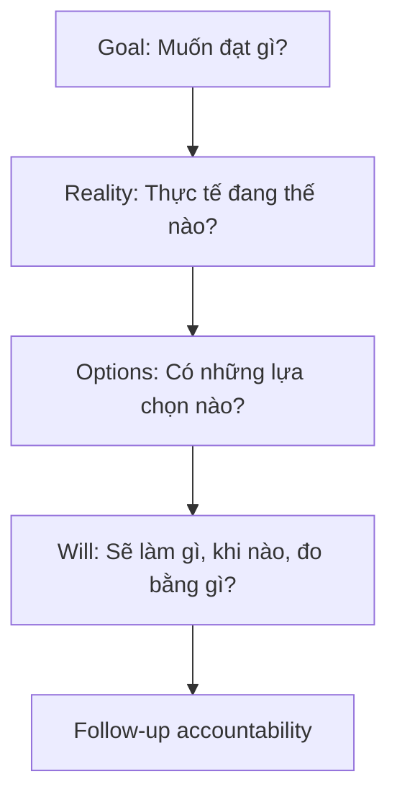
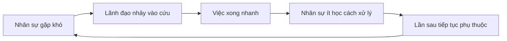

# Tập 18: Coaching, Mentoring Và Nghệ Thuật Đặt Câu Hỏi

**Giúp con người tự nhìn rõ vấn đề, tự trưởng thành, tự chịu trách nhiệm và tạo kết quả tốt hơn qua đối thoại có cấu trúc**  
Giáo trình ngắn gọn cho người trưởng thành, cấp quản lý/C-level

---

## 0. Vì Sao C-level Cần Học Coaching Và Mentoring?

### Bản chất

Ở cấp cao, lãnh đạo không thể giải mọi vấn đề bằng cách tự trả lời nhanh hơn người khác.

Nếu CEO, founder hoặc quản lý cấp cao luôn là người nghĩ thay, quyết thay và cứu thay, tổ chức sẽ có vẻ chạy nhanh trong ngắn hạn nhưng yếu dần trong dài hạn.

Người lãnh đạo trưởng thành cần biết khi nào:

- Đưa câu trả lời
- Đặt câu hỏi
- Chia sẻ kinh nghiệm
- Giữ im lặng
- Đòi hỏi accountability
- Để người khác tự học từ hậu quả thật

Coaching và mentoring không phải kỹ năng mềm phụ trợ.  
Đó là cách xây năng lực tổ chức qua từng cuộc đối thoại.

### Một câu cần nhớ

> Người lãnh đạo giỏi không chỉ tạo ra quyết định tốt. Người lãnh đạo giỏi tạo ra những con người ngày càng biết tự ra quyết định tốt hơn.

### Mục tiêu tập này

| Năng lực | Ý nghĩa thực tế |
|---|---|
| Phân biệt coaching, mentoring, consulting | Không dùng sai vai trong cuộc đối thoại |
| Lắng nghe sâu | Nghe được vấn đề thật, không chỉ nghe câu chuyện bề mặt |
| Đặt câu hỏi mở | Kích hoạt tự nhận thức và trách nhiệm |
| Phản chiếu | Giúp người đối diện thấy rõ mẫu hành vi của mình |
| Dùng GROW đơn giản | Biến cuộc nói chuyện thành tiến trình rõ ràng |
| Không cứu người | Tránh tạo phụ thuộc vào lãnh đạo |
| Xây accountability | Biến insight thành cam kết hành động |
| Phát triển người kế cận | Dùng coaching/mentoring để nhân bản năng lực lãnh đạo |

---

## 1. First Principles: Coaching Là Gì?

### Bản chất

Coaching là quá trình giúp một người tự nhìn rõ mục tiêu, thực tại, lựa chọn và cam kết hành động.

```text
Coaching = Hiện diện + Lắng nghe + Câu hỏi + Phản chiếu + Accountability
```

Coaching không phải là nói cho người khác biết phải làm gì.  
Coaching là tạo một không gian đủ rõ để người đó tự thấy mình cần làm gì và chịu trách nhiệm với lựa chọn đó.

### Mô hình tổng quát


### Câu hỏi gốc

```text
1. Người này thật sự đang muốn đạt điều gì?
2. Điều gì đang xảy ra trong thực tế?
3. Họ đã nhìn thấy lựa chọn nào và chưa nhìn thấy lựa chọn nào?
4. Họ đang tránh trách nhiệm nào?
5. Bước hành động nhỏ nhất nhưng thật nhất là gì?
```

---

## 2. Coaching, Mentoring Và Consulting Khác Nhau Thế Nào?

### Bản chất

Ba vai này đều hữu ích, nhưng khác nhau về điểm xuất phát.

| Vai | Trọng tâm | Người giữ câu trả lời chính | Khi nên dùng |
|---|---|---|---|
| Coaching | Tự nhận thức và hành động | Người được coach | Khi cần phát triển năng lực tự suy nghĩ |
| Mentoring | Kinh nghiệm và định hướng | Mentor chia sẻ kinh nghiệm, người học tự chọn | Khi người kia cần học từ trải nghiệm của người đi trước |
| Consulting | Chuyên môn và giải pháp | Consultant | Khi cần chẩn đoán chuyên môn và khuyến nghị cụ thể |

### Sai lầm phổ biến

| Sai lầm | Hậu quả |
|---|---|
| Gọi là coaching nhưng thật ra đang ra lệnh | Người nghe phục tùng, không trưởng thành |
| Gọi là mentoring nhưng chỉ kể chuyện bản thân | Người học không liên hệ được với bối cảnh của họ |
| Gọi là consulting nhưng thiếu dữ liệu | Cho lời khuyên nhanh nhưng sai |
| Dùng coaching khi có khủng hoảng cần quyết định gấp | Chậm, mơ hồ, mất kiểm soát |
| Dùng consulting cho mọi chuyện | Tạo phụ thuộc vào chuyên gia/lãnh đạo |

### Nguyên tắc chọn vai

```text
Nếu người kia thiếu năng lực suy nghĩ: coach.
Nếu người kia thiếu bản đồ kinh nghiệm: mentor.
Nếu người kia thiếu chuyên môn hoặc dữ liệu: consult.
Nếu tình huống khẩn cấp: chỉ đạo rõ, rồi coaching sau.
```

---

## 3. Người Lãnh Đạo Phải Biết Đổi Vai

### Bản chất

Một cuộc 1-1 tốt thường không thuần coaching hoặc thuần mentoring.  
Lãnh đạo cần nói rõ mình đang ở vai nào.

Ví dụ:

```text
"Đoạn này tôi sẽ coach, nên tôi sẽ hỏi nhiều hơn trả lời."
"Đoạn này tôi sẽ mentor, tôi chia sẻ kinh nghiệm của tôi để bạn tham khảo."
"Đoạn này tôi cần direct, vì rủi ro cao và deadline gần."
```

### Bảng chuyển vai

| Tình huống | Vai phù hợp | Câu mở đầu |
|---|---|---|
| Nhân sự có năng lực nhưng đang rối | Coach | "Bạn muốn làm rõ điều gì nhất trong cuộc nói chuyện này?" |
| Nhân sự mới vào vai trò | Mentor | "Tôi chia sẻ vài pattern tôi từng thấy, bạn chọn cái phù hợp." |
| Vấn đề kỹ thuật/chuyên môn sâu | Consult | "Dựa trên dữ liệu hiện có, tôi đề xuất hướng này." |
| Sai lệch đạo đức hoặc tiêu chuẩn nghiêm trọng | Direct | "Việc này không phù hợp với tiêu chuẩn của tổ chức." |
| Người kế cận cần nâng tầm ra quyết định | Coach + Mentor | "Tôi muốn nghe cách bạn nghĩ trước, sau đó tôi bổ sung góc nhìn." |

### Câu hỏi kiểm tra

```text
1. Tôi đang giúp người này trưởng thành hay chỉ giúp việc xong nhanh?
2. Vai nào phục vụ mục tiêu dài hạn tốt nhất?
3. Tôi đã nói rõ vai của mình chưa?
4. Tôi có đang dùng kinh nghiệm của mình để lấn át suy nghĩ của họ không?
5. Có rủi ro nào bắt buộc tôi phải direct không?
```

---

## 4. Lắng Nghe: Kỹ Năng Gốc Của Coaching

### Bản chất

Lắng nghe trong coaching không chỉ là im lặng chờ tới lượt nói.

Lắng nghe là chú ý đến:

- Nội dung người kia nói
- Cảm xúc phía sau nội dung
- Điều họ lặp lại nhiều lần
- Điều họ né tránh
- Giả định đang điều khiển cách họ nhìn vấn đề
- Mâu thuẫn giữa lời nói, hành động và kết quả

### Ba tầng lắng nghe

| Tầng | Dấu hiệu | Rủi ro |
|---|---|---|
| Nghe để trả lời | Nghĩ sẵn lời khuyên | Dễ cắt ngang, dễ áp đặt |
| Nghe để hiểu | Tóm tắt đúng câu chuyện | Hiểu nội dung nhưng chưa thấy mẫu sâu |
| Nghe để phản chiếu | Thấy cảm xúc, niềm tin, mẫu hành vi | Cần kiên nhẫn và không phán xét sớm |

### Câu hỏi giúp nghe sâu hơn

```text
1. Khi nói điều này, bạn đang cảm thấy gì?
2. Phần nào trong chuyện này làm bạn bận tâm nhất?
3. Bạn thấy chuyện này lặp lại ở đâu trong công việc của mình?
4. Điều gì bạn chưa nói ra vì sợ nó không hay?
5. Nếu bỏ qua phần hợp lý hóa, sự thật đơn giản nhất là gì?
```

---

## 5. Câu Hỏi Mở: Mở Tư Duy, Không Dồn Người

### Bản chất

Câu hỏi mở giúp người đối diện tự khám phá.  
Câu hỏi đóng thường chỉ tạo câu trả lời có/không hoặc phòng thủ.

| Câu hỏi yếu | Câu hỏi tốt hơn |
|---|---|
| Sao bạn lại làm vậy? | Lúc đó bạn đã cân nhắc những lựa chọn nào? |
| Bạn có thấy mình sai không? | Bạn học được gì từ kết quả này? |
| Tại sao chưa xong? | Điều gì đang cản tiến độ thật sự? |
| Bạn có cần tôi giúp không? | Bạn cần rõ thêm điều gì để tự xử lý bước tiếp theo? |
| Bạn định làm A đúng không? | Theo bạn, lựa chọn nào tốt nhất lúc này? |

### Năm nhóm câu hỏi mở

| Nhóm | Mục đích | Ví dụ |
|---|---|---|
| Làm rõ | Tách sự kiện khỏi diễn giải | "Sự kiện cụ thể là gì?" |
| Mục tiêu | Tìm điều thật sự muốn đạt | "Kết quả tốt trông như thế nào?" |
| Trách nhiệm | Đưa quyền chủ động về người nói | "Phần nào nằm trong quyền kiểm soát của bạn?" |
| Lựa chọn | Mở thêm hướng hành động | "Còn phương án nào bạn chưa thử?" |
| Cam kết | Chuyển insight thành hành động | "Bạn sẽ làm gì trước thứ Sáu?" |

### Nguyên tắc

> Câu hỏi tốt không làm người khác thấy bị điều tra. Câu hỏi tốt làm họ thấy mình đang nghĩ rõ hơn.

---

## 6. Phản Chiếu: Giúp Người Khác Nhìn Thấy Chính Mình

### Bản chất

Phản chiếu là nói lại điều mình quan sát được một cách trung tính, cụ thể và có ích.

Phản chiếu không phải phán xét.  
Phản chiếu là đưa một chiếc gương sạch.

### Các dạng phản chiếu

| Dạng | Cách nói |
|---|---|
| Phản chiếu nội dung | "Tôi nghe bạn nói vấn đề chính là thiếu quyền quyết định." |
| Phản chiếu cảm xúc | "Có vẻ bạn khá thất vọng khi nhắc đến chuyện này." |
| Phản chiếu mâu thuẫn | "Bạn nói muốn giao quyền, nhưng cũng nói vẫn muốn duyệt mọi quyết định." |
| Phản chiếu mẫu lặp lại | "Đây là lần thứ ba bạn mô tả tình huống mình ôm việc thay team." |
| Phản chiếu tác động | "Khi bạn can thiệp muộn, team có vẻ chờ bạn quyết thay." |

### Cấu trúc phản chiếu an toàn

```text
Tôi quan sát thấy... 
Tôi có thể sai...
Điều đó có đúng với trải nghiệm của bạn không?
```

Ví dụ:

```text
"Tôi quan sát thấy mỗi khi team chậm, bạn nhảy vào sửa rất nhanh.
Tôi có thể sai, nhưng việc đó có thể làm họ chờ bạn giải cứu.
Điều này có đúng không?"
```

---

## 7. GROW Đơn Giản

### Bản chất

GROW là khung coaching giúp cuộc trò chuyện không trôi lan man.

```text
G = Goal: Mục tiêu
R = Reality: Thực tại
O = Options: Lựa chọn
W = Will: Cam kết hành động
```

### Mô hình



### Bộ câu hỏi GROW

| Bước | Câu hỏi |
|---|---|
| Goal | "Bạn muốn kết quả nào sau cuộc nói chuyện này?" |
| Goal | "Nếu vấn đề được giải quyết tốt, điều gì sẽ khác?" |
| Reality | "Hiện tại điều gì đang thật sự xảy ra?" |
| Reality | "Dữ liệu nào xác nhận điều đó?" |
| Options | "Bạn có những lựa chọn nào?" |
| Options | "Nếu không bị giới hạn bởi thói quen cũ, bạn sẽ thử gì?" |
| Will | "Bạn chọn bước nào?" |
| Will | "Khi nào tôi có thể kiểm tra lại tiến độ với bạn?" |

### Lưu ý

GROW không phải kịch bản cứng.  
GROW là đường ray để cuộc nói chuyện đi từ mơ hồ sang hành động.

---

## 8. Không Cứu Người: Ranh Giới Khó Nhất Của Lãnh Đạo

### Bản chất

"Cứu người" là khi lãnh đạo lấy lại trách nhiệm mà người kia cần học cách gánh.

Nó thường bắt đầu từ ý tốt:

- Muốn nhanh hơn
- Muốn tránh sai sót
- Muốn giúp người kia đỡ áp lực
- Muốn chứng minh mình hữu ích
- Muốn kiểm soát kết quả

Nhưng cái giá dài hạn là sự phụ thuộc.

### Vòng phụ thuộc



### Cách giúp mà không cứu

| Thay vì | Hãy thử |
|---|---|
| "Đưa đây tôi làm cho." | "Bạn định xử lý thế nào? Tôi sẽ góp ý trên phương án của bạn." |
| "Làm theo cách này." | "Bạn thấy rủi ro của từng lựa chọn là gì?" |
| "Tôi sẽ nói chuyện với họ giúp bạn." | "Bạn muốn chuẩn bị cuộc nói chuyện đó ra sao?" |
| "Không sao, để lần sau." | "Bạn học được gì và sẽ sửa bằng hành động nào?" |
| "Cứ hỏi tôi mọi thứ." | "Bạn hãy đề xuất trước 2 phương án rồi chúng ta bàn." |

### Nguyên tắc

> Giúp người khác trưởng thành không phải là lấy khó khăn khỏi tay họ. Đó là giúp họ đủ năng lực để cầm khó khăn tốt hơn.

---

## 9. Accountability: Từ Insight Đến Hành Động

### Bản chất

Coaching không dừng ở cảm giác "vỡ ra".  
Nếu không có hành động, insight dễ trở thành một khoảnh khắc đẹp nhưng vô dụng.

Accountability là sự rõ ràng về:

- Ai làm?
- Làm việc gì?
- Khi nào?
- Tiêu chuẩn nào?
- Ai kiểm tra?
- Nếu không làm thì học gì và điều chỉnh thế nào?

### Công cụ cam kết 5 dòng

```text
1. Việc tôi cam kết làm:
2. Lý do việc này quan trọng:
3. Deadline:
4. Bằng chứng hoàn thành:
5. Người tôi sẽ báo cáo/check-in:
```

### Bảng accountability trong 1-1

| Thành phần | Câu hỏi |
|---|---|
| Cam kết | "Bạn sẽ làm cụ thể điều gì?" |
| Deadline | "Khi nào xong?" |
| Bằng chứng | "Tôi nhìn thấy điều gì để biết việc này đã xong?" |
| Rào cản | "Điều gì có thể làm bạn trượt cam kết?" |
| Hỗ trợ | "Bạn cần hỗ trợ gì mà không làm mất quyền sở hữu của bạn?" |
| Follow-up | "Chúng ta kiểm tra lại lúc nào?" |

### Nguyên tắc

> Accountability không phải gây áp lực để người khác sợ. Accountability là làm cam kết đủ rõ để người khác không thể tự lừa mình.

---

## 10. Coaching Trong 1-1

### Bản chất

1-1 không chỉ là cập nhật công việc.  
1-1 là nơi lãnh đạo nhìn thấy năng lực, động lực, trở ngại, niềm tin và mức trưởng thành của từng người.

### Cấu trúc 1-1 coaching 30 phút

| Phần | Thời lượng | Nội dung |
|---|---:|---|
| Check-in | 3 phút | Trạng thái, năng lượng, điều đang chiếm tâm trí |
| Chủ đề chính | 5 phút | Người đó chọn vấn đề quan trọng nhất |
| Khám phá | 10 phút | Lắng nghe, hỏi mở, phản chiếu |
| Lựa chọn | 7 phút | Xem phương án, rủi ro, tiêu chí |
| Cam kết | 5 phút | Bước tiếp theo, deadline, follow-up |

### Câu hỏi 1-1 mạnh

```text
1. Điều gì đang chiếm nhiều năng lượng nhất của bạn tuần này?
2. Việc nào bạn đang trì hoãn dù biết là quan trọng?
3. Bạn đang cần quyết định điều gì?
4. Bạn muốn tôi coach, mentor hay direct ở phần này?
5. Điều gì tôi đang làm khiến bạn khó thành công hơn?
6. Nếu bạn ở vị trí của tôi, bạn sẽ nhìn vấn đề này thế nào?
7. Cam kết cụ thể của bạn trước buổi 1-1 tiếp theo là gì?
```

### Điều cần tránh

| Thói quen | Tác hại |
|---|---|
| Biến 1-1 thành báo cáo task | Mất cơ hội phát triển con người |
| Nói quá nhiều | Người kia không tự nghĩ |
| Chỉ hỏi khi có vấn đề | 1-1 trở thành tín hiệu nguy hiểm |
| Không follow-up | Cam kết mất trọng lượng |
| Né câu hỏi khó | Vấn đề âm thầm lớn lên |

---

## 11. Coaching Lãnh Đạo

### Bản chất

Coaching lãnh đạo không chỉ giúp người đó làm việc tốt hơn.  
Nó giúp họ nhìn thấy cách mình đang tạo ra hệ thống xung quanh mình.

Một lãnh đạo cần được coach về:

- Cách dùng quyền lực
- Cách ra quyết định
- Cách phản ứng với tin xấu
- Cách giao quyền
- Cách xử lý xung đột
- Cách tạo accountability
- Cách phát triển người khác

### Câu hỏi dành cho lãnh đạo

```text
1. Nếu team của bạn đang lặp lại một hành vi xấu, bạn đang vô tình thưởng điều gì?
2. Khi có áp lực, bạn thường kiểm soát nhiều hơn hay tạo rõ ràng nhiều hơn?
3. Quyền lực của bạn làm người khác nói thật hơn hay nói khéo hơn?
4. Việc gì bạn đang giữ vì nghĩ "chỉ mình làm tốt"?
5. Ai trong team sẽ yếu đi nếu bạn tiếp tục cứu họ?
6. Quyết định nào bạn cần để người khác tự đưa ra, dù họ có thể chậm hơn bạn?
7. Sau 6 tháng nữa, team sẽ mạnh hơn hay phụ thuộc bạn hơn?
```

### Chỉ số trưởng thành lãnh đạo

| Dấu hiệu yếu | Dấu hiệu trưởng thành |
|---|---|
| Luôn là nút cổ chai | Tạo rõ quyền quyết định |
| Tự hào vì ai cũng cần mình | Tự hào vì team tự vận hành tốt |
| Sửa lỗi thay người khác | Làm người khác học từ lỗi |
| Tránh feedback khó | Nói thật với sự tôn trọng |
| Nhầm bận rộn với giá trị | Tập trung vào đòn bẩy phát triển người |

---

## 12. Mentoring: Truyền Kinh Nghiệm Mà Không Áp Đặt

### Bản chất

Mentoring là chia sẻ kinh nghiệm, bản đồ và góc nhìn để người khác ra quyết định tốt hơn.

Mentoring tốt không nói: "Hãy làm như tôi."  
Mentoring tốt nói: "Đây là điều tôi từng thấy. Bạn hãy xem phần nào phù hợp với bối cảnh của bạn."

### Cấu trúc mentoring ngắn

```text
1. Nghe bối cảnh của mentee.
2. Hỏi họ đã nghĩ gì.
3. Chia sẻ kinh nghiệm liên quan, không kể lan man.
4. Nói rõ điều gì giống và khác bối cảnh hiện tại.
5. Để mentee tự chọn hành động.
```

### Câu mentor nên dùng

| Mục đích | Câu nói |
|---|---|
| Giữ khiêm tốn | "Kinh nghiệm của tôi có thể không hoàn toàn đúng với bối cảnh của bạn." |
| Chia sẻ pattern | "Tôi từng thấy ba kiểu rủi ro trong tình huống này." |
| Không áp đặt | "Bạn không cần làm giống tôi, nhưng hãy cân nhắc nguyên tắc phía sau." |
| Kích hoạt suy nghĩ | "Phần nào trong kinh nghiệm này hữu ích, phần nào không phù hợp?" |
| Chuyển về hành động | "Từ đây, bạn chọn bước nào?" |

### Rủi ro của mentoring

| Rủi ro | Cách tránh |
|---|---|
| Mentor nói quá nhiều | Hỏi trước khi kể |
| Biến kinh nghiệm cũ thành chân lý | Nói rõ bối cảnh |
| Tạo bản sao của mình | Tôn trọng phong cách của mentee |
| Dùng vị thế để ép | Đưa lựa chọn về người học |
| Kể chuyện để được ngưỡng mộ | Chỉ kể phần phục vụ sự học |

---

## 13. Phát Triển Người Kế Cận

### Bản chất

Người kế cận không hình thành bằng chức danh.  
Người kế cận hình thành qua việc được giao vấn đề thật, quyền thật, feedback thật và accountability thật.

Coaching và mentoring là hai công cụ cốt lõi để phát triển kế cận.

### Thang phát triển kế cận

| Tầng | Năng lực cần phát triển | Cách hỗ trợ |
|---|---|---|
| Tự làm tốt | Kỹ năng chuyên môn, kỷ luật cá nhân | Mentor về chuẩn nghề |
| Dẫn việc | Ưu tiên, phối hợp, quản trị rủi ro | Coach về quyết định |
| Dẫn người | Feedback, động lực, xung đột | Coach qua 1-1 và tình huống thật |
| Dẫn hệ thống | Thiết kế quyền, quy trình, văn hóa | Mentor về pattern tổ chức |
| Dẫn lãnh đạo khác | Phát triển người kế cận tiếp theo | Coach về quyền lực và buông kiểm soát |

### Công thức giao việc phát triển

```text
Việc phát triển = Vấn đề thật + Quyền thật + Tiêu chuẩn rõ + Hỗ trợ đúng mức + Review sau hành động
```

### Câu hỏi cho người kế cận

```text
1. Nếu bạn là người chịu trách nhiệm cuối cùng, bạn sẽ quyết gì?
2. Rủi ro lớn nhất trong quyết định này là gì?
3. Bạn cần quyền gì để chịu trách nhiệm thật?
4. Bạn sẽ xử lý phản kháng từ team thế nào?
5. Sau lần này, bạn học được gì về cách mình lãnh đạo?
```

---

## 14. Feedback Trong Coaching

### Bản chất

Feedback trong coaching không phải xả sự khó chịu.  
Feedback là thông tin giúp người khác thấy khoảng cách giữa hành vi hiện tại và tiêu chuẩn cần đạt.

### Công thức SBI-R

```text
S = Situation: Tình huống cụ thể
B = Behavior: Hành vi quan sát được
I = Impact: Tác động
R = Request/Reflection: Yêu cầu hoặc câu hỏi phản tư
```

Ví dụ:

```text
Trong cuộc họp sáng thứ Hai, khi bạn ngắt lời Lan ba lần,
tác động là cô ấy dừng trình bày và team mất dữ liệu quan trọng.
Bạn nghĩ điều gì đang xảy ra lúc đó và lần sau bạn sẽ làm khác thế nào?
```

### Bảng feedback

| Thành phần | Tốt | Kém |
|---|---|---|
| Tình huống | Cụ thể | "Dạo này" |
| Hành vi | Quan sát được | Gán nhãn tính cách |
| Tác động | Liên hệ kết quả | Chỉ nói cảm xúc cá nhân |
| Câu hỏi | Mở ra học tập | Dồn người vào phòng thủ |
| Cam kết | Có bước tiếp theo | Nói xong rồi bỏ |

---

## 15. Những Cạm Bẫy Của Người Coach

### Bản chất

Người coach dễ thất bại không phải vì thiếu câu hỏi hay.  
Họ thất bại vì cái tôi, sự vội vàng hoặc nhu cầu được thấy mình hữu ích.

### Các cạm bẫy thường gặp

| Cạm bẫy | Biểu hiện | Cách sửa |
|---|---|---|
| Muốn chứng minh mình giỏi | Cho lời khuyên quá sớm | Hỏi thêm 3 câu trước khi khuyên |
| Sợ im lặng | Lấp khoảng trống bằng lời | Để người kia nghĩ |
| Cứu người | Nhận lại trách nhiệm | Trả câu hỏi về chủ sở hữu |
| Đồng cảm quá mức | Né accountability | Vừa hiểu vừa đòi cam kết |
| Quá kỹ thuật | Bám mô hình, mất con người | Dùng mô hình như bản đồ, không như kịch bản |
| Thiếu ranh giới | Biến thành trị liệu | Nếu vấn đề vượt phạm vi công việc, giới thiệu hỗ trợ phù hợp |

### Câu tự kiểm tra của người coach

```text
1. Tôi đang phục vụ sự trưởng thành của họ hay nhu cầu được cần đến của tôi?
2. Tôi đã nghe đủ chưa?
3. Tôi có đang nhầm cảm xúc mạnh với sự thật không?
4. Trách nhiệm này thuộc về ai?
5. Sau cuộc nói chuyện, người kia rõ hơn hay phụ thuộc hơn?
```

---

## 16. Bộ Công Cụ Thực Hành

### Checklist trước buổi coaching

```text
[ ] Tôi biết mục đích cuộc nói chuyện.
[ ] Tôi sẵn sàng nghe trước khi khuyên.
[ ] Tôi phân biệt được lúc nào coach, mentor, consult hoặc direct.
[ ] Tôi có đủ dữ liệu để phản chiếu cụ thể nếu cần.
[ ] Tôi không bước vào cuộc nói chuyện với ý định cứu người.
```

### Checklist trong buổi coaching

```text
[ ] Hỏi mục tiêu của người đối diện.
[ ] Làm rõ thực tại bằng sự kiện.
[ ] Lắng nghe cảm xúc và mẫu lặp lại.
[ ] Phản chiếu trung tính.
[ ] Mở rộng lựa chọn.
[ ] Chốt cam kết rõ người, việc, thời hạn, bằng chứng.
```

### Checklist sau buổi coaching

```text
[ ] Ghi lại cam kết chính.
[ ] Hẹn thời điểm follow-up.
[ ] Theo dõi hành động, không chỉ cảm xúc sau buổi nói chuyện.
[ ] Quan sát người đó có chủ động hơn không.
[ ] Điều chỉnh mức hỗ trợ nếu họ đang phụ thuộc hoặc bị bỏ rơi.
```

### Bộ câu hỏi nhanh

| Tình huống | Câu hỏi |
|---|---|
| Người kia rối | "Điều quan trọng nhất cần làm rõ là gì?" |
| Người kia đổ lỗi | "Phần nào nằm trong quyền kiểm soát của bạn?" |
| Người kia sợ quyết | "Quyết định nhỏ nhất bạn có thể thử là gì?" |
| Người kia muốn được cứu | "Bạn đã cân nhắc những phương án nào?" |
| Người kia né cam kết | "Bạn có sẵn sàng chịu trách nhiệm cho bước nào?" |
| Người kia thiếu góc nhìn | "Bạn muốn tôi mentor ở điểm nào?" |

---

## 17. Lộ Trình Thực Hành 4 Tuần

### Tuần 1: Nghe trước khi sửa

Mục tiêu:

- Nhận ra thói quen cho lời khuyên quá sớm
- Tăng chất lượng lắng nghe trong 1-1

Bài tập:

- Trong 3 cuộc nói chuyện, hỏi ít nhất 5 câu trước khi đưa ý kiến.
- Ghi lại câu nào làm người kia dừng lại và suy nghĩ sâu hơn.

### Tuần 2: Dùng GROW trong 1-1

Mục tiêu:

- Làm cuộc nói chuyện rõ mục tiêu, thực tại, lựa chọn và cam kết
- Giảm lan man

Bài tập:

- Chọn 2 buổi 1-1 và dùng GROW.
- Cuối buổi phải có một cam kết cụ thể với deadline.

### Tuần 3: Không cứu người

Mục tiêu:

- Nhận diện nơi bạn đang tạo phụ thuộc
- Trả trách nhiệm về đúng chủ sở hữu

Bài tập:

- Chọn một việc bạn thường làm thay người khác.
- Lần tới, yêu cầu họ mang tới 2 phương án trước khi bạn góp ý.

### Tuần 4: Coaching người kế cận

Mục tiêu:

- Dùng coaching/mentoring để nâng năng lực lãnh đạo kế tiếp
- Giao vấn đề thật kèm accountability

Bài tập:

- Chọn một nhân sự có tiềm năng kế cận.
- Giao một vấn đề thật, làm rõ quyền, tiêu chuẩn, deadline và buổi review sau hành động.

---

## 18. Bảng Tóm Tắt First Principles

| Chủ đề | Bản chất | Câu hỏi áp dụng |
|---|---|---|
| Coaching | Giúp người khác tự nhìn rõ và hành động có trách nhiệm | Tôi đang hỏi để họ nghĩ hay hỏi để dẫn họ đến đáp án của tôi? |
| Mentoring | Chia sẻ kinh nghiệm để người khác có bản đồ tốt hơn | Kinh nghiệm của tôi giống và khác bối cảnh của họ ở đâu? |
| Consulting | Đưa chuyên môn và giải pháp | Tôi có đủ dữ liệu để khuyến nghị chưa? |
| Lắng nghe | Chú ý đến nội dung, cảm xúc, mẫu lặp và điều bị né tránh | Tôi nghe câu chuyện hay nghe vấn đề thật? |
| Câu hỏi mở | Mở rộng tự nhận thức và lựa chọn | Câu hỏi này làm người kia rõ hơn hay phòng thủ hơn? |
| Phản chiếu | Đưa gương trung tính cho người khác thấy mình | Tôi đang quan sát hay phán xét? |
| GROW | Đưa đối thoại từ mục tiêu đến cam kết | Cuộc nói chuyện đã đi tới hành động cụ thể chưa? |
| Không cứu người | Không lấy lại trách nhiệm mà người khác cần học cách gánh | Tôi đang giúp họ mạnh hơn hay phụ thuộc hơn? |
| Accountability | Làm cam kết đủ rõ để theo dõi | Ai làm gì, khi nào, bằng chứng là gì? |
| 1-1 | Không gian phát triển con người qua công việc thật | Buổi này chỉ cập nhật việc hay có phát triển năng lực? |
| Coaching lãnh đạo | Giúp lãnh đạo thấy tác động hệ thống của mình | Team mạnh hơn hay phụ thuộc hơn sau cách tôi lãnh đạo? |
| Người kế cận | Năng lực lãnh đạo được xây qua vấn đề thật và quyền thật | Tôi đã giao đủ quyền để họ chịu trách nhiệm thật chưa? |

---

## 19. Một Câu Để Nhớ Toàn Bộ Tập 18

> Coaching và mentoring trưởng thành là giúp người khác nhìn rõ hơn, chọn thật hơn, hành động có trách nhiệm hơn và dần không cần mình nghĩ thay cho họ nữa.

Lãnh đạo càng cao càng phải biết bớt là trung tâm của câu trả lời.  
Khi con người trong tổ chức biết tự suy nghĩ, tự chịu trách nhiệm và tự phát triển người khác, năng lực lãnh đạo đã bắt đầu được nhân bản.
