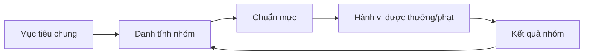
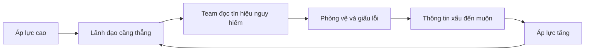
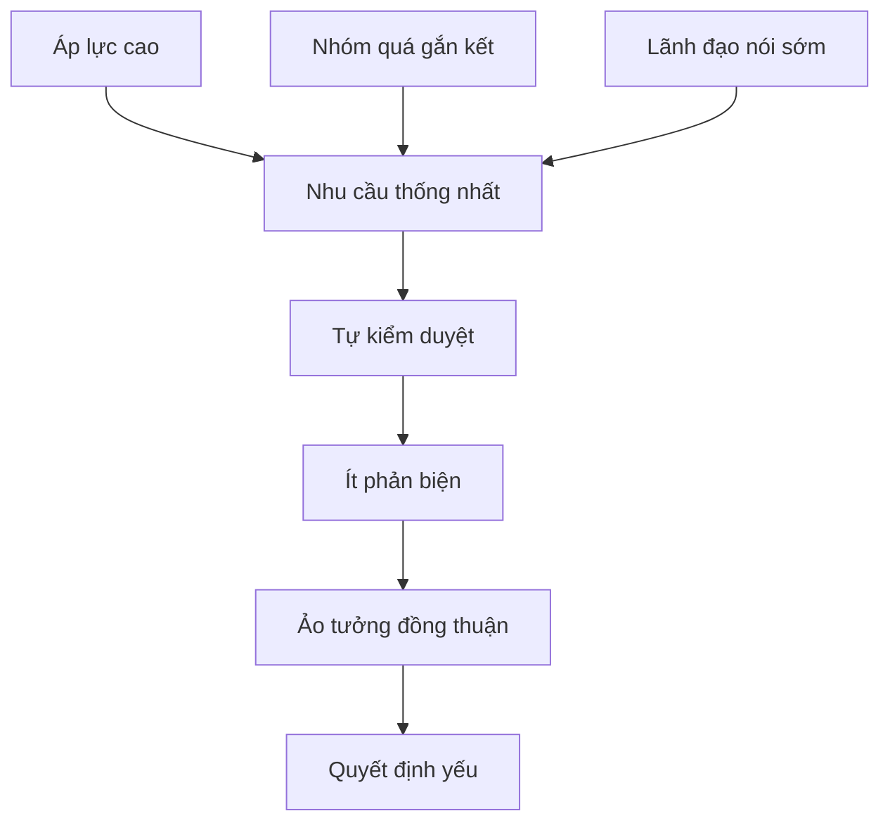
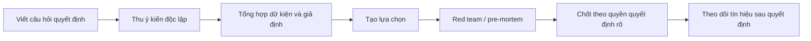

# Tập 19: Tâm Lý Nhóm, Phe Nhóm Và Groupthink

**Hiểu cách con người đổi hành vi khi vào nhóm, hình thành in-group/out-group, chạy theo đồng thuận, lan truyền cảm xúc và ra quyết định tập thể**  
Giáo trình ngắn gọn cho người trưởng thành, cấp quản lý/C-level

---

## 0. Vì Sao C-level Cần Học Tâm Lý Nhóm?

### Bản chất

Ở cấp cao, nhiều quyết định không thất bại vì một người kém.  
Chúng thất bại vì cả nhóm cùng trở nên kém hơn chính từng cá nhân trong nhóm.

Nhóm có thể tạo ra:

- Trí tuệ tập thể
- Can đảm hành động
- Tốc độ phối hợp
- Chuẩn mực hành vi tốt
- Sự bảo vệ tâm lý

Nhưng nhóm cũng có thể tạo ra:

- Phe phái
- Im lặng giả tạo
- Đồng thuận giả
- Loại trừ người khác nhóm
- Leo thang xung đột
- Quyết định tệ nhưng không ai dám phản đối

### Một câu cần nhớ

> Khi con người vào nhóm, họ không chỉ mang theo lý trí cá nhân. Họ còn mang theo nhu cầu thuộc về, sợ bị loại trừ, muốn giữ vị thế và phản ứng theo cảm xúc chung của đám đông.

### Mục tiêu tập này

| Năng lực | Ý nghĩa thực tế |
|---|---|
| Đọc động lực nhóm | Không nhầm im lặng với đồng thuận |
| Nhận diện phe nhóm | Thấy ranh giới in-group/out-group trước khi nó thành chính trị |
| Chống groupthink | Giữ chất lượng quyết định khi nhóm quá đồng thuận |
| Thiết kế meeting | Làm họp trở thành nơi xử lý thực tế, không chỉ hợp thức hóa |
| Thiết kế nhóm ra quyết định | Tăng bất đồng hữu ích, giảm xung đột cá nhân |

---

## 1. First Principles: Nhóm Là Gì?

### Bản chất

Nhóm là một tập hợp người có nhận thức rằng họ liên quan đến nhau, cùng chia sẻ một mục tiêu, danh tính hoặc số phận.

```text
Nhóm = Con người + Mục tiêu chung + Ranh giới + Chuẩn mực + Vị thế + Cảm xúc chung
```

Một nhóm không chỉ là sơ đồ tổ chức.  
Nhóm thật là nơi con người hỏi thầm:

- Ai là "chúng ta"?
- Ai là "họ"?
- Nói gì thì an toàn?
- Ai có quyền định nghĩa sự thật?
- Nếu tôi phản đối, tôi mất gì?

### Mô hình đơn giản



### Câu hỏi gốc

```text
1. Nhóm này thật sự đang bảo vệ điều gì?
2. Ai được xem là người trong nhóm?
3. Ai bị xem là người ngoài nhóm?
4. Chuẩn mực nào đang mạnh hơn quy định chính thức?
5. Người nói thật trong nhóm này được thưởng hay bị phạt?
```

---

## 2. In-group Và Out-group: Ranh Giới Tâm Lý Của "Chúng Ta" Và "Họ"

### Bản chất

In-group là nhóm mà ta cảm thấy mình thuộc về.  
Out-group là nhóm bị xem là bên ngoài, khác biệt hoặc đối lập.

Ranh giới này có thể dựa trên:

- Phòng ban
- Vị trí quyền lực
- Thâm niên
- Trường phái chuyên môn
- Vùng miền, tuổi tác, ngôn ngữ
- Người cũ và người mới
- Người gần lãnh đạo và người xa lãnh đạo

### Tác động

| Cơ chế | Biểu hiện | Rủi ro |
|---|---|---|
| Thiên vị in-group | Dễ tha lỗi cho người phe mình | Tiêu chuẩn kép |
| Khái quát out-group | Xem "bên kia" đều giống nhau | Mất dữ kiện thật |
| Bảo vệ danh tính | Phản ứng khi nhóm bị phê bình | Phòng vệ tập thể |
| Trung thành nhóm | Không nói lỗi của người phe mình | Che giấu vấn đề |

### Nguyên tắc

> Mọi nhóm đều cần ranh giới để phối hợp, nhưng ranh giới quá cứng sẽ biến phối hợp thành phe phái.

---

## 3. Phe Nhóm: Khi Danh Tính Mạnh Hơn Mục Tiêu Chung

### Bản chất

Phe nhóm xuất hiện khi lòng trung thành với một tiểu nhóm mạnh hơn lòng trung thành với mục tiêu chung.

Phe nhóm không luôn bắt đầu từ ý xấu.  
Nó thường bắt đầu từ:

- Cùng chịu áp lực
- Cùng bị hiểu lầm
- Cùng lịch sử làm việc
- Cùng lợi ích
- Cùng cảm giác "chỉ chúng ta mới hiểu chuyện thật"

### Dấu hiệu

| Dấu hiệu | Ý nghĩa |
|---|---|
| Họp chính thức im lặng, họp riêng nói nhiều | Sự thật đã chuyển sang kênh ngầm |
| Một ý tưởng được đánh giá theo người nói | Danh tính lấn át nội dung |
| Tin xấu đi vòng qua lãnh đạo | Kênh chính thức không còn đáng tin |
| Người mới khó hòa nhập | Ranh giới nhóm quá dày |
| Ngôn ngữ "bọn họ", "phe đó", "người bên kia" tăng lên | Out-group đang bị đóng khung |

### Câu hỏi quản trị

```text
1. Phe nhóm này đang bảo vệ lợi ích nào?
2. Ai cảm thấy không được lắng nghe trong hệ thống chính thức?
3. Thông tin nào chỉ lưu thông trong phe?
4. Có quyết định nào bị chặn vì người đề xuất thuộc phe khác?
5. Mục tiêu chung có đủ rõ để vượt qua danh tính nhóm nhỏ không?
```

---

## 4. Conformity: Vì Sao Người Giỏi Vẫn Chạy Theo Số Đông?

### Bản chất

Conformity là xu hướng điều chỉnh niềm tin, lời nói hoặc hành vi để phù hợp với nhóm.

Con người làm vậy vì hai nhu cầu:

| Nhu cầu | Câu hỏi ngầm | Biểu hiện |
|---|---|---|
| Muốn đúng | "Nếu mọi người đều nghĩ vậy, có thể họ biết điều tôi không biết" | Theo dữ kiện xã hội |
| Muốn thuộc về | "Nếu tôi khác họ, tôi có bị loại không?" | Tự kiểm duyệt |

### Khi conformity có ích

- Giúp nhóm phối hợp nhanh
- Tạo chuẩn mực làm việc
- Giảm hỗn loạn
- Giúp người mới học văn hóa

### Khi conformity nguy hiểm

- Ý kiến thiểu số biến mất
- Người có dữ kiện thật im lặng
- Nhóm nhầm sự trôi chảy với sự đúng đắn
- Quyết định chỉ phản ánh người nói sớm hoặc nói mạnh

### Nguyên tắc

> Không thể loại bỏ conformity. Chỉ có thể thiết kế để nhóm conform theo chuẩn mực tốt: nói thật, kiểm chứng, phản biện và chịu trách nhiệm.

---

## 5. Social Proof: Khi Đám Đông Trở Thành Bằng Chứng

### Bản chất

Social proof là xu hướng xem hành vi của người khác như tín hiệu về điều đúng nên làm, đặc biệt khi tình huống mơ hồ.

Trong tổ chức, social proof xuất hiện khi:

- Người đầu tiên gật đầu, người sau gật theo
- Một lãnh đạo tỏ ý thích, cả phòng đổi giọng
- Không ai báo rủi ro, nên mọi người tưởng không có rủi ro
- Một team làm quá giờ, team khác xem đó là chuẩn mực

### Bảng đọc social proof

| Tình huống | Câu hỏi cần hỏi |
|---|---|
| Cả nhóm đồng ý rất nhanh | Họ đồng ý vì hiểu hay vì thấy người khác đồng ý? |
| Không ai phản biện | Có đủ an toàn để phản biện chưa? |
| Ý kiến của người quyền lực xuất hiện sớm | Ý kiến khác có còn cơ hội không? |
| Một hành vi lan nhanh | Hành vi đó đang được thưởng bằng gì? |

### Thiết kế chống social proof mù

```text
1. Thu ý kiến độc lập trước khi thảo luận.
2. Cho người ít quyền lực nói trước ở một số chủ đề.
3. Tách đánh giá ý tưởng khỏi tên người đề xuất.
4. Hỏi "bằng chứng ngược lại là gì?" trước khi chốt.
5. Ghi rõ mức tự tin, không chỉ ghi kết luận.
```

---

## 6. Lan Truyền Cảm Xúc: Cảm Xúc Của Nhóm Là Một Hạ Tầng

### Bản chất

Cảm xúc lan trong nhóm qua giọng nói, nét mặt, tốc độ phản ứng, tin nhắn, ngôn ngữ và cách lãnh đạo phản hồi.

Một nhóm có thể lây:

- Bình tĩnh
- Khẩn trương
- Hoài nghi
- Sợ hãi
- Chán nản
- Tự tin quá mức
- Phẫn nộ

### Vòng lan truyền cảm xúc tiêu cực



### Cách can thiệp

| Điểm can thiệp | Cách làm |
|---|---|
| Ngôn ngữ | Chuyển từ đổ lỗi sang mô tả dữ kiện |
| Nhịp họp | Dừng 2 phút trước quyết định lớn |
| Tín hiệu lãnh đạo | Nói rõ tin xấu được phép xuất hiện |
| Quy trình | Có kênh báo rủi ro sớm |
| Phản hồi | Thưởng người phát hiện vấn đề trước khi nó nổ |

---

## 7. Informal Leaders: Người Không Có Chức Nhưng Có Ảnh Hưởng

### Bản chất

Informal leader là người có ảnh hưởng thật dù không nhất thiết có chức danh chính thức.

Họ có thể ảnh hưởng vì:

- Chuyên môn sâu
- Quan hệ rộng
- Lịch sử đóng góp
- Khả năng kể chuyện
- Khả năng đọc cảm xúc nhóm
- Được nhiều người tin
- Là người đại diện cho một bất mãn ngầm

### Các kiểu informal leader

| Kiểu | Giá trị | Rủi ro |
|---|---|---|
| Người giữ ký ức tổ chức | Biết lịch sử và bối cảnh | Có thể chống thay đổi vì tổn thương cũ |
| Người kết nối | Nối thông tin giữa nhóm | Có thể thành trung tâm tin đồn |
| Người phản biện | Thấy rủi ro sớm | Có thể bị gắn nhãn tiêu cực |
| Người làm chuẩn | Người khác bắt chước hành vi | Chuẩn mực xấu lan rất nhanh |

### Nguyên tắc

> Muốn đổi nhóm, đừng chỉ nhìn sơ đồ chức danh. Hãy nhìn ai thật sự định hình cảm xúc, chuẩn mực và câu chuyện của nhóm.

---

## 8. Meeting Dynamics: Cuộc Họp Là Sân Khấu Của Quyền Lực

### Bản chất

Cuộc họp không chỉ là nơi trao đổi thông tin.  
Nó là nơi nhóm biểu diễn quyền lực, vị thế, liên minh, im lặng và mức an toàn tâm lý.

### Những lỗi họp phổ biến

| Lỗi | Biểu hiện | Hậu quả |
|---|---|---|
| HiPPO effect | Người có chức cao nói sớm | Nhóm neo vào ý kiến quyền lực |
| Round robin giả | Ai cũng nói nhưng không ai nói thật | Đồng thuận bề mặt |
| Họp để hợp thức hóa | Kết luận đã có trước | Mất niềm tin |
| Không tách vấn đề và người | Phản biện bị xem là chống đối | Ý kiến thật biến mất |
| Không có owner quyết định | Nhiều thảo luận, ít cam kết | Trôi trách nhiệm |

### Thiết kế meeting tốt hơn

```text
Trước họp:
- Mục tiêu quyết định là gì?
- Ai có dữ kiện bắt buộc?
- Ý kiến độc lập đã được thu chưa?

Trong họp:
- Người quyền lực nói sau khi dữ kiện chính đã lên bàn.
- Tách phần tạo lựa chọn khỏi phần chọn lựa.
- Ghi rõ bất đồng còn lại.

Sau họp:
- Ai quyết?
- Quyết theo tiêu chí nào?
- Điều kiện nào khiến ta đảo quyết định?
```

---

## 9. Groupthink: Khi Nhóm Quá Đồng Thuận Để Còn Thấy Sự Thật

### Bản chất

Groupthink là trạng thái nhóm ưu tiên hòa hợp, trung thành hoặc hình ảnh chung hơn chất lượng suy nghĩ.

Nó thường xảy ra khi:

- Nhóm rất gắn kết
- Áp lực cao
- Lãnh đạo mạnh
- Thiếu tiếng nói bên ngoài
- Quyết định có rủi ro lớn
- Nhóm có lịch sử thành công
- Phản biện từng bị trừng phạt

### Dấu hiệu groupthink

| Dấu hiệu | Câu hỏi kiểm tra |
|---|---|
| Ảo tưởng bất khả chiến bại | Ta có đang đánh giá thấp rủi ro không? |
| Hợp lý hóa tín hiệu xấu | Dữ kiện nào bị xem nhẹ quá nhanh? |
| Đạo đức hóa phe mình | Ta có cho rằng mình đúng vì mình là "người tốt" không? |
| Tự kiểm duyệt | Ai chưa nói điều họ thật sự nghĩ? |
| Ảo tưởng đồng thuận | Có ai đồng ý chỉ vì không muốn gây khó không? |
| Người gác cổng thông tin | Ai đang lọc tin xấu trước khi nó đến nhóm? |

### Mô hình groupthink



---

## 10. Chống Đồng Thuận Giả

### Bản chất

Đồng thuận giả xảy ra khi nhóm tưởng rằng mọi người đồng ý, trong khi thực tế nhiều người đang im lặng, chưa hiểu, chưa đủ dữ kiện hoặc không muốn trả giá xã hội.

### Kỹ thuật thực hành

| Kỹ thuật | Cách dùng |
|---|---|
| Vote trước khi nói | Mỗi người ghi lựa chọn độc lập trước thảo luận |
| Mức tự tin | Không chỉ hỏi đồng ý/không, hỏi tự tin bao nhiêu phần trăm |
| Red team | Giao một nhóm tìm lý do quyết định này sai |
| Pre-mortem | Giả sử quyết định thất bại, hỏi vì sao |
| Dissent quota | Trước khi chốt phải có ít nhất 2 phản biện nghiêm túc |
| Silent writing | Viết ý kiến trước, nói sau |
| Người quyền lực nói cuối | Giảm neo quyền lực |

### Mẫu câu của lãnh đạo

```text
"Tôi muốn nghe dữ kiện làm quyết định này yếu đi."
"Nếu chúng ta sai, khả năng cao sai ở giả định nào?"
"Ai đang có thông tin trái với hướng này?"
"Ai đồng ý nhưng mức tự tin dưới 70%?"
"Điều gì phải xảy ra để ta đổi quyết định?"
```

---

## 11. Thiết Kế Nhóm Ra Quyết Định

### Bản chất

Nhóm ra quyết định tốt không phải nhóm ít xung đột.  
Đó là nhóm biết tạo xung đột nhận thức mà không biến nó thành xung đột bản sắc.

```text
Chất lượng quyết định nhóm = Dữ kiện đa dạng + Bất đồng an toàn + Tiêu chí rõ + Quyền quyết định rõ + Cơ chế học lại
```

### Cấu trúc quyết định

| Thành phần | Thiết kế tốt |
|---|---|
| Vấn đề | Viết rõ câu hỏi quyết định |
| Dữ kiện | Phân biệt dữ kiện, giả định và ý kiến |
| Vai trò | Ai đề xuất, ai phản biện, ai quyết, ai thực thi |
| Tiêu chí | Biết đang tối ưu điều gì |
| Rủi ro | Nêu rủi ro lớn và tín hiệu cảnh báo |
| Cam kết | Sau khi quyết, ai làm gì trước ngày nào |
| Học lại | Đặt ngày review quyết định |

### Luồng ra quyết định khuyến nghị



---

## 12. Tâm Lý Nhóm Trong Khủng Hoảng

### Bản chất

Khủng hoảng làm nhu cầu thuộc về và nhu cầu chắc chắn tăng mạnh.  
Vì vậy nhóm dễ bám vào lãnh đạo mạnh, câu chuyện đơn giản và kẻ đổ lỗi rõ ràng.

### Rủi ro

| Rủi ro | Biểu hiện | Cách giảm |
|---|---|---|
| Tìm vật tế thần | Đổ lỗi nhanh cho một người/nhóm | Tách trách nhiệm cá nhân khỏi lỗi hệ thống |
| Đóng thông tin | Chỉ nghe tin phù hợp niềm tin sẵn có | Mở kênh dữ kiện trái chiều |
| Quyết định quá nhanh | Chốt trước khi hiểu đủ | Dùng checklist tối thiểu |
| Quá phụ thuộc lãnh đạo | Mọi tín hiệu chờ từ một người | Phân quyền theo tình huống |
| Lan truyền hoảng loạn | Tin đồn mạnh hơn dữ kiện | Nhịp cập nhật cố định |

### Nguyên tắc

> Trong khủng hoảng, lãnh đạo không chỉ quản lý quyết định. Lãnh đạo quản lý nhịp cảm xúc và chất lượng thông tin của cả nhóm.

---

## 13. Công Cụ Thực Hành

### Công cụ 1: Audit tâm lý nhóm

```text
Nhóm đang xét:
Mục tiêu chính thức:
Mục tiêu ngầm:
Ai là in-group:
Ai là out-group:
Chuẩn mực mạnh nhất:
Điều gì không được nói thẳng:
Ai là informal leader:
Tin xấu đi qua kênh nào:
Phe nhóm đang bảo vệ điều gì:
```

### Công cụ 2: Checklist chống groupthink trước quyết định lớn

```text
[ ] Câu hỏi quyết định đã được viết rõ chưa?
[ ] Ý kiến độc lập đã được thu trước thảo luận chưa?
[ ] Người quyền lực đã tránh nói quá sớm chưa?
[ ] Có ít nhất một phương án thay thế nghiêm túc chưa?
[ ] Có pre-mortem chưa?
[ ] Có người được giao vai trò red team chưa?
[ ] Bất đồng còn lại đã được ghi lại chưa?
[ ] Mức tự tin của nhóm đã được đo chưa?
[ ] Điều kiện đảo quyết định đã được xác định chưa?
[ ] Owner và ngày review đã rõ chưa?
```

### Công cụ 3: Mẫu biên bản quyết định nhóm

| Mục | Nội dung cần ghi |
|---|---|
| Câu hỏi quyết định | Ta đang quyết điều gì? |
| Lựa chọn đã cân nhắc | Các phương án thật sự được xem xét |
| Dữ kiện chính | Điều đã biết |
| Giả định chính | Điều ta tin nhưng chưa chắc |
| Bất đồng | Ai lo điều gì, vì sao |
| Quyết định | Chọn gì, bởi ai |
| Tín hiệu cảnh báo | Điều gì cho thấy ta đang sai |
| Ngày review | Khi nào học lại từ kết quả |

---

## 14. Lộ Trình Thực Hành 4 Tuần

### Tuần 1: Quan sát nhóm như một hệ thống

- Chọn một nhóm bạn đang tham gia hoặc dẫn dắt.
- Ghi lại ai nói nhiều, ai im lặng, ai ảnh hưởng dù không có chức.
- Nhận diện 3 chuẩn mực không được viết ra.

### Tuần 2: Đọc in-group/out-group và phe nhóm

- Vẽ ranh giới "chúng ta" và "họ" trong tổ chức.
- Tìm một nơi thông tin bị nghẽn vì ranh giới nhóm.
- Gặp riêng một người ở out-group để hiểu góc nhìn của họ.

### Tuần 3: Thiết kế lại một cuộc họp quyết định

- Thu ý kiến độc lập trước họp.
- Cho người có ít quyền lực nói trước ở phần dữ kiện.
- Dùng pre-mortem trước khi chốt.

### Tuần 4: Xây cơ chế chống groupthink

- Chọn một quyết định lớn sắp tới.
- Giao vai trò red team rõ ràng.
- Ghi lại bất đồng, mức tự tin và điều kiện đảo quyết định.
- Đặt lịch review sau khi có dữ kiện thực tế.

---

## 15. Bảng Tóm Tắt First Principles

| Chủ đề | Bản chất | Câu hỏi áp dụng |
|---|---|---|
| Nhóm | Con người phối hợp qua mục tiêu, ranh giới, chuẩn mực và cảm xúc chung | Nhóm này thật sự đang bảo vệ điều gì? |
| In-group/out-group | Ranh giới "chúng ta" và "họ" định hình đánh giá | Ai được tin dễ hơn và ai bị nghi ngờ dễ hơn? |
| Phe nhóm | Trung thành với tiểu nhóm vượt lên mục tiêu chung | Phe này tồn tại vì nhu cầu nào chưa được xử lý? |
| Conformity | Con người đổi hành vi để đúng hoặc để thuộc về | Ai đang tự kiểm duyệt? |
| Social proof | Hành vi người khác trở thành bằng chứng trong mơ hồ | Mọi người đồng ý vì dữ kiện hay vì thấy người khác đồng ý? |
| Lan truyền cảm xúc | Cảm xúc là hạ tầng vô hình của phối hợp | Cảm xúc nào đang dẫn dắt nhóm? |
| Informal leader | Ảnh hưởng thật không luôn nằm trên sơ đồ chức danh | Ai định hình chuẩn mực và câu chuyện nhóm? |
| Meeting dynamics | Cuộc họp biểu diễn quyền lực và an toàn tâm lý | Ai có thể nói thật trong phòng này? |
| Groupthink | Nhóm ưu tiên hòa hợp hơn chất lượng suy nghĩ | Dữ kiện ngược chiều nào đang bị bỏ qua? |
| Đồng thuận giả | Im lặng bị hiểu nhầm là đồng ý | Ai đồng ý nhưng mức tự tin thấp? |
| Red team | Phản biện được chính thức hóa để bảo vệ quyết định | Ai có nhiệm vụ làm quyết định này mạnh hơn bằng cách tấn công nó? |
| Pre-mortem | Giả định thất bại trước để thấy rủi ro | Nếu quyết định này hỏng, nguyên nhân hợp lý nhất là gì? |
| Thiết kế nhóm quyết định | Tạo bất đồng nhận thức mà không tạo xung đột bản sắc | Quy trình này có làm sự thật dễ xuất hiện hơn không? |

---

## 16. Một Câu Để Nhớ Toàn Bộ Tập 19

> Muốn nhóm ra quyết định tốt, đừng chỉ tìm người thông minh; hãy thiết kế một môi trường nơi sự thật có thể xuất hiện trước khi cả nhóm cùng trở nên quá đồng thuận.
