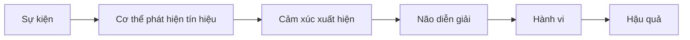
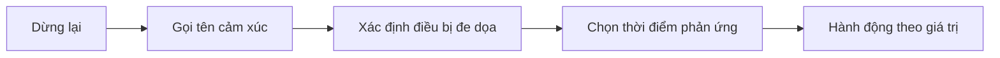

# Tập 2: Cảm Xúc Và Tự Điều Chỉnh

**Hiểu cảm xúc từ gốc để bình tĩnh hơn, quyết định tốt hơn và lãnh đạo trưởng thành hơn**  
Giáo trình ngắn gọn cho người trưởng thành, cấp quản lý/C-level

---

## 0. Vì Sao C-level Cần Học Cảm Xúc?

### Bản chất

Ở cấp cao, vấn đề lớn hiếm khi chỉ là chuyên môn.  
Vấn đề thường là:

- Áp lực
- Ego
- Sợ mất quyền lực
- Sợ sai
- Sợ mất mặt
- Mâu thuẫn lợi ích
- Quyết định trong thiếu chắc chắn
- Con người phòng vệ khi bị đe dọa

Vì vậy, năng lực cảm xúc không phải chuyện "mềm".  
Nó là năng lực vận hành trong môi trường áp lực cao.

### Một câu cần nhớ

> Cảm xúc không xấu. Phản ứng vô thức theo cảm xúc mới nguy hiểm.

### Học cảm xúc để làm gì?

| Năng lực | Lợi ích thực tế |
|---|---|
| Nhận diện cảm xúc | Biết mình đang bị gì chi phối |
| Gọi tên cảm xúc | Giảm cường độ phản ứng |
| Hiểu nhu cầu phía sau | Không xử lý nhầm vấn đề |
| Tự điều chỉnh | Không ra quyết định trong trạng thái xấu |
| Đọc cảm xúc người khác | Lãnh đạo, đàm phán, xử lý xung đột tốt hơn |

---

## 1. Cảm Xúc Là Gì?

### Bản chất

Cảm xúc là tín hiệu của hệ thần kinh.

Nó báo cho ta biết:

- Có nguy hiểm không?
- Có mất mát không?
- Có cơ hội không?
- Có bị xúc phạm không?
- Có bị loại trừ không?
- Có cần hành động không?

### Mô hình đơn giản



### Điểm quan trọng

Ta thường nghĩ:

> Tôi nghĩ trước, rồi tôi cảm thấy.

Nhưng nhiều lúc thực tế là:

> Cơ thể phản ứng trước, cảm xúc xuất hiện, rồi não tìm lý do để giải thích.

### Ví dụ

Một người phản biện gay gắt trong cuộc họp.

Bạn có thể nghĩ:

> Người này không tôn trọng mình.

Nhưng tầng sâu có thể là:

- Cơ thể căng lên
- Tim đập nhanh
- Cảm xúc giận/xấu hổ xuất hiện
- Não diễn giải: "Tôi đang bị công kích"
- Hành vi: phản công, cắt lời, dùng quyền lực

### Câu hỏi áp dụng

Khi có cảm xúc mạnh, hỏi:

```text
1. Cơ thể tôi đang phản ứng thế nào?
2. Tôi đang cảm thấy gì?
3. Tôi đang diễn giải sự kiện này ra sao?
4. Có cách diễn giải nào khác không?
```

---

## 2. Sáu Cảm Xúc Gốc Cần Hiểu Sâu

### Bản đồ nhanh

| Cảm xúc | Thông điệp gốc | Nhu cầu phía sau | Rủi ro nếu phản ứng vô thức |
|---|---|---|---|
| Sợ | Có nguy hiểm | An toàn | Né tránh, co cụm |
| Giận | Ranh giới bị xâm phạm | Tôn trọng, công bằng | Công kích, kiểm soát |
| Buồn | Có mất mát | Chấp nhận, hồi phục | Rút lui, mất động lực |
| Xấu hổ | Tôi có thể bị đánh giá | Được chấp nhận | Che giấu, phòng vệ |
| Ghen/tị | Tôi có thể thua kém/mất vị trí | Giá trị, vị trí | So sánh, hạ thấp người khác |
| Lo âu | Tương lai có rủi ro | Chắc chắn, kiểm soát | Suy nghĩ quá mức |

### First principle

Mỗi cảm xúc đều là một dạng thông tin.

Vấn đề không phải là "làm sao hết cảm xúc".  
Vấn đề là:

> Cảm xúc này đang báo điều gì, và tôi nên xử lý thông tin đó thế nào?

---

## 3. Sợ Hãi: Cảm Xúc Bảo Vệ An Toàn

### Bản chất

Sợ là tín hiệu:

> Có nguy cơ mất an toàn, mất mát, thất bại hoặc tổn thương.

### Sợ ở C-level thường không đơn giản

Người cấp cao hiếm khi nói:

> Tôi sợ.

Họ thường biểu hiện thành:

- Kiểm soát quá mức
- Trì hoãn quyết định
- Cần thêm dữ liệu mãi
- Không dám cắt lỗ
- Né cuộc nói chuyện khó
- Giữ người không phù hợp vì sợ xáo trộn
- Không trao quyền vì sợ mất kiểm soát

### Hai loại sợ

| Loại sợ | Ví dụ | Cách xử lý |
|---|---|---|
| Sợ thực | Rủi ro tài chính, pháp lý, nhân sự | Phân tích, giảm rủi ro |
| Sợ tâm lý | Mất mặt, bị đánh giá, sai hình ảnh | Gọi tên, tách ego khỏi dữ kiện |

### Câu hỏi xử lý sợ

```text
1. Tôi đang sợ mất điều gì?
2. Nỗi sợ này dựa trên dữ kiện hay tưởng tượng?
3. Nếu điều xấu xảy ra, tôi có phương án ứng phó không?
4. Quyết định này có đảo ngược được không?
5. Tôi đang trì hoãn vì thận trọng hay vì né cảm xúc?
```

### Bài tập

Chọn một quyết định bạn đang né.

Viết 3 dòng:

| Câu hỏi | Trả lời |
|---|---|
| Tôi đang sợ gì? |  |
| Cái giá nếu không quyết là gì? |  |
| Bước thử nhỏ nhất là gì? |  |

---

## 4. Giận Dữ: Cảm Xúc Bảo Vệ Ranh Giới

### Bản chất

Giận thường xuất hiện khi ta cảm thấy:

- Bị xúc phạm
- Bị bất công
- Bị xem thường
- Bị xâm phạm ranh giới
- Bị cản trở mục tiêu

> Giận không sai. Giận là tín hiệu có điều gì đó cần được bảo vệ hoặc làm rõ.

### Giận là năng lượng mạnh

Nếu dùng tốt:

- Đặt ranh giới
- Sửa bất công
- Bảo vệ giá trị
- Ra quyết định dứt khoát

Nếu dùng tệ:

- Làm người khác sợ
- Tạo văn hóa im lặng
- Phá niềm tin
- Khiến người giỏi rời đi

### Giận trong vai trò lãnh đạo

Người có quyền lực càng lớn, cơn giận càng có sức phá hủy.

Một câu nói nóng của lãnh đạo có thể làm cấp dưới:

- Im lặng nhiều tháng
- Không dám phản biện
- Che giấu vấn đề
- Nói điều lãnh đạo muốn nghe

### Kỹ thuật xử lý giận

Khi giận, đừng hỏi:

> Làm sao để thắng?

Hãy hỏi:

> Ranh giới hoặc giá trị nào đang bị xâm phạm?

Sau đó nói theo cấu trúc:

```text
Khi việc A xảy ra,
tác động là B,
tôi cần C từ bây giờ.
```

Ví dụ:

> Khi báo cáo bị gửi muộn mà không báo trước, quyết định của ban điều hành bị chậm. Từ tuần sau, tôi cần cập nhật rủi ro trước deadline ít nhất 24 giờ.

### Bài tập

Nhớ lại một lần bạn giận trong công việc.

| Câu hỏi | Trả lời |
|---|---|
| Tôi thật sự giận vì điều gì? |  |
| Ranh giới nào bị vượt qua? |  |
| Tôi đã phản ứng hay đã lãnh đạo? |  |
| Lần sau tôi sẽ nói rõ nhu cầu thế nào? |  |

---

## 5. Xấu Hổ Và Mất Mặt: Cảm Xúc Quyền Lực Trong Văn Hóa Á Đông

### Bản chất

Xấu hổ là cảm giác:

> Tôi có thể bị nhìn là kém, sai, yếu, không đủ tốt, hoặc không còn giá trị.

### Vì sao xấu hổ nguy hiểm?

Vì nó đánh vào bản sắc, không chỉ hành vi.

Khác biệt:

| Cảm giác | Câu bên trong |
|---|---|
| Có lỗi | Tôi đã làm sai |
| Xấu hổ | Tôi là người sai/kém |

### Biểu hiện của xấu hổ

Người xấu hổ thường không nói:

> Tôi đang xấu hổ.

Họ thường:

- Phòng vệ
- Đổ lỗi
- Im lặng
- Nói cứng
- Tấn công ngược
- Tránh gặp mặt
- Hợp lý hóa sai lầm

### Ứng dụng trong quản trị

Nếu bạn làm một người mất mặt trước nhóm, bạn có thể thắng cuộc tranh luận nhưng thua niềm tin.

Muốn sửa lỗi mà không kích hoạt xấu hổ:

| Không nên | Nên |
|---|---|
| "Sao anh lại làm kiểu này?" | "Mình cùng nhìn lại chỗ này." |
| "Việc này quá cơ bản." | "Điểm này cần chuẩn hơn." |
| Phê bình trước đám đông | Góp ý riêng khi có thể |
| Gắn lỗi với con người | Gắn lỗi với hành vi/quy trình |

### Câu hỏi áp dụng

Trước khi góp ý người khác, hỏi:

```text
1. Tôi đang muốn sửa hành vi hay xả bực?
2. Người này có bị mất mặt không?
3. Tôi có đang đánh vào bản sắc của họ không?
4. Cách nói nào giữ được phẩm giá nhưng vẫn rõ tiêu chuẩn?
```

---

## 6. Lo Âu: Não Đang Cố Kiểm Soát Tương Lai

### Bản chất

Lo âu là khi não liên tục hỏi:

> Nếu chuyện xấu xảy ra thì sao?

Lo âu không phải lúc nào cũng vô ích.  
Nó giúp ta dự đoán rủi ro.

Nhưng lo âu quá mức biến thành:

- Suy nghĩ vòng lặp
- Mất ngủ
- Không dám quyết
- Luôn cần chắc chắn
- Kiểm soát người khác
- Không tận hưởng hiện tại

### Lo âu khác chuẩn bị

| Chuẩn bị | Lo âu |
|---|---|
| Có hành động cụ thể | Chỉ nghĩ lặp lại |
| Giảm rủi ro thật | Tăng căng thẳng |
| Có điểm dừng | Không có điểm dừng |
| Dựa trên dữ kiện | Dựa nhiều trên giả định |

### Kỹ thuật: chuyển lo âu thành kế hoạch

Viết ra:

```text
1. Điều tôi lo là gì?
2. Xác suất thực tế là bao nhiêu?
3. Nếu xảy ra, tác động là gì?
4. Tôi có thể làm gì để giảm xác suất?
5. Tôi có thể làm gì để giảm thiệt hại?
6. Sau bước này, tôi có thể dừng nghĩ chưa?
```

### Nguyên tắc

> Lo âu cần được chuyển thành hành động hữu ích, nếu không nó chỉ đốt năng lượng.

---

## 7. Buồn Và Mất Mát: Cảm Xúc Giúp Ta Chấp Nhận Thực Tế

### Bản chất

Buồn xuất hiện khi có mất mát:

- Mất người
- Mất cơ hội
- Mất hình ảnh bản thân
- Mất niềm tin
- Mất một giai đoạn sống
- Mất kỳ vọng về tương lai

### Với người thành đạt

Người thành đạt thường khó cho phép mình buồn.

Họ quen:

- Giải quyết
- Tối ưu
- Kiểm soát
- Tiếp tục tiến lên

Nhưng có những chuyện không thể "fix" ngay.  
Chỉ có thể thừa nhận, cảm nhận, rồi tích hợp vào đời sống.

### Buồn bị né tránh sẽ thành gì?

| Né buồn bằng | Có thể dẫn tới |
|---|---|
| Làm việc quá mức | Kiệt sức |
| Kiểm soát | Căng thẳng quan hệ |
| Giải trí liên tục | Trống rỗng |
| Thành công mới | Không bao giờ đủ |
| Lạnh lùng | Mất kết nối |

### Câu hỏi chữa lành thực tế

```text
1. Tôi đã mất điều gì thật sự?
2. Tôi chưa cho phép mình tiếc điều gì?
3. Tôi đang cố tỏ ra ổn với ai?
4. Điều gì cần được chấp nhận thay vì sửa ngay?
5. Sau mất mát này, giá trị nào vẫn còn?
```

---

## 8. Tự Ái, Ego Và Phòng Vệ

### Bản chất

Ego là hình ảnh ta muốn giữ về chính mình.

Ví dụ:

- Tôi là người giỏi
- Tôi là người đúng
- Tôi là người kiểm soát được mọi thứ
- Tôi là người không cần ai
- Tôi là người thành công

Khi hình ảnh đó bị đe dọa, ta phòng vệ.

### Phòng vệ phổ biến ở cấp cao

| Phòng vệ | Biểu hiện |
|---|---|
| Không nhận sai | Chuyển lỗi sang người khác |
| Hợp lý hóa | Tìm lý do nghe rất hợp lý cho quyết định cảm tính |
| Kiểm soát | Không trao quyền vì sợ mất vai trò |
| Hạ thấp người khác | Giữ cảm giác mình cao hơn |
| Né phản hồi | Chỉ nghe người đồng ý |
| Cứng quan điểm | Nhầm sự linh hoạt với yếu đuối |

### Câu hỏi xuyên qua ego

```text
1. Tôi đang bảo vệ sự thật hay bảo vệ hình ảnh?
2. Nếu nhận sai, tôi sợ điều gì xảy ra?
3. Tôi có đang dùng quyền lực để né cảm giác xấu hổ không?
4. Điều gì sẽ tốt cho tổ chức, kể cả khi không tốt cho ego của tôi?
```

### Dấu hiệu trưởng thành

Người trưởng thành không phải là người luôn đúng.  
Người trưởng thành là người có thể nhìn thấy mình sai mà không sụp đổ.

---

## 9. Tự Điều Chỉnh: Không Đè Nén, Không Bùng Nổ

### Bản chất

Tự điều chỉnh không phải là không cảm xúc.

Tự điều chỉnh là:

> Có cảm xúc, hiểu cảm xúc, giữ khoảng cách đủ để chọn hành động tốt hơn.

### Ba kiểu xử lý cảm xúc

| Kiểu | Biểu hiện | Hậu quả |
|---|---|---|
| Đè nén | "Tôi ổn", nhưng cơ thể căng | Tích tụ, bùng nổ, kiệt sức |
| Bùng nổ | Nói/làm ngay theo cảm xúc | Phá niềm tin |
| Điều chỉnh | Gọi tên, hiểu, chọn phản ứng | Tăng tự chủ |

### Quy trình 5 bước



### Kỹ thuật S.T.O.P

| Bước | Làm gì |
|---|---|
| S - Stop | Dừng lại, không phản ứng ngay |
| T - Take a breath | Thở chậm 3-5 nhịp |
| O - Observe | Quan sát cơ thể, cảm xúc, suy nghĩ |
| P - Proceed | Chọn hành động phù hợp |

### Câu hỏi then chốt

> Nếu tôi phản ứng ngay bây giờ, tôi đang phục vụ cảm xúc hay phục vụ mục tiêu dài hạn?

---

## 10. Cảm Xúc Trong Đàm Phán Và Xung Đột

### Bản chất

Đàm phán không chỉ là trao đổi lợi ích.  
Nó còn là quản trị:

- Sợ mất
- Tự trọng
- Niềm tin
- Vị thế
- Công bằng
- Mức độ an toàn

### Khi người khác phản ứng mạnh

Đừng chỉ nghe nội dung. Hãy đọc cảm xúc phía sau.

| Họ biểu hiện | Có thể đang cảm thấy |
|---|---|
| Cứng rắn quá mức | Sợ bị yếu thế |
| Im lặng | Sợ nói sai hoặc không an toàn |
| Công kích | Bị đe dọa bản sắc |
| Lặp lại yêu cầu | Không cảm thấy được lắng nghe |
| Đòi kiểm soát | Không tin hệ thống |

### Câu mở khóa cảm xúc

```text
Điều gì trong phương án này làm anh/chị lo nhất?
Điểm nào khiến anh/chị chưa yên tâm?
Nếu nhìn từ phía anh/chị, rủi ro lớn nhất là gì?
Điều gì cần rõ hơn để anh/chị có thể đồng thuận?
```

### Nguyên tắc

> Cảm xúc chưa được công nhận thường không biến mất. Nó đi vào chống đối, im lặng hoặc phá ngầm.

---

## 11. Cảm Xúc Trong Lãnh Đạo Đội Ngũ

### Bản chất

Đội ngũ không chỉ phản ứng với chiến lược.  
Đội ngũ phản ứng với cảm giác mà chiến lược tạo ra.

Một thay đổi có thể làm người ta cảm thấy:

- Hào hứng
- Bị đe dọa
- Mất kiểm soát
- Không được tham gia
- Bị thay thế
- Không còn giá trị

### Lãnh đạo cảm xúc trong thay đổi

| Việc cần làm | Ý nghĩa |
|---|---|
| Gọi tên thực tế | Giảm mơ hồ |
| Thừa nhận cảm xúc | Tăng tin cậy |
| Giải thích lý do | Tạo ý nghĩa |
| Nêu tiêu chuẩn mới | Tạo hướng đi |
| Cho quyền tham gia | Tăng kiểm soát |
| Thưởng hành vi mới | Củng cố thay đổi |

### Ví dụ thông điệp tốt

> Giai đoạn này sẽ có nhiều bất định. Tôi hiểu một số người có thể lo về vai trò, mục tiêu và cách đánh giá mới. Lý do chúng ta thay đổi là vì mô hình cũ không còn đủ sức cạnh tranh. Trong 30 ngày tới, điều tôi cần là minh bạch vấn đề, phản hồi nhanh và không che giấu rủi ro.

### Câu hỏi cho lãnh đạo

```text
1. Quyết định này sẽ kích hoạt cảm xúc gì trong đội ngũ?
2. Ai sẽ cảm thấy mất an toàn nhất?
3. Ai sẽ thấy mất quyền lợi hoặc vị trí?
4. Tôi cần nói rõ điều gì để giảm mơ hồ?
5. Hành vi mới nào cần được thưởng ngay?
```

---

## 12. Cơ Thể: Nền Móng Của Bình Tĩnh

### Bản chất

Tâm lý không tách khỏi cơ thể.

Khi cơ thể mệt, đói, thiếu ngủ, căng kéo dài, não quyết định kém hơn.

### Các yếu tố phá tự chủ

| Yếu tố | Tác động |
|---|---|
| Thiếu ngủ | Dễ cáu, giảm kiểm soát xung động |
| Đói/đường huyết thấp | Dễ mất kiên nhẫn |
| Stress kéo dài | Nhìn đâu cũng thấy nguy cơ |
| Quá nhiều quyết định | Chọn dễ thay vì chọn đúng |
| Ít vận động | Căng tích trong cơ thể |

### Điều thực dụng nhất

Muốn cảm xúc ổn hơn, bắt đầu từ:

- Ngủ
- Thở
- Vận động
- Ăn đúng
- Nghỉ giữa các khối quyết định
- Không họp khó khi cơ thể quá tải

### Quy tắc C-level

> Đừng ra quyết định chiến lược khi đang đói, kiệt sức, giận dữ hoặc vừa bị kích hoạt ego.

---

## 13. Bộ Công Cụ Thực Hành

### Công cụ 1: Nhật ký cảm xúc 3 phút

```text
Sự kiện:
Cảm xúc:
Cảm giác trong cơ thể:
Diễn giải của tôi:
Điều bị đe dọa:
Hành động tốt hơn:
```

### Công cụ 2: Tách dữ kiện khỏi cảm xúc

| Dữ kiện | Cảm xúc | Diễn giải | Hành động nên làm |
|---|---|---|---|
|  |  |  |  |

### Công cụ 3: Trước cuộc họp khó

```text
1. Tôi muốn kết quả gì?
2. Tôi có cảm xúc gì trước cuộc họp?
3. Điều gì có thể kích hoạt tôi?
4. Người kia có thể sợ gì?
5. Tôi sẽ giữ giọng điệu nào?
6. Ranh giới không thỏa hiệp là gì?
```

### Công cụ 4: Sau khi phản ứng quá mức

```text
1. Tôi đã bị kích hoạt bởi điều gì?
2. Cảm xúc chính là gì?
3. Tôi đã bảo vệ điều gì?
4. Hậu quả là gì?
5. Tôi cần sửa chữa quan hệ/hành động thế nào?
6. Lần sau tín hiệu cảnh báo sớm là gì?
```

---

## 14. Lộ Trình Thực Hành 4 Tuần

### Tuần 1: Nhận diện cảm xúc

Mục tiêu:

- Gọi tên cảm xúc chính xác hơn
- Nhận ra cảm xúc trong cơ thể

Bài tập:

- Mỗi ngày ghi 1 lần cảm xúc mạnh.
- Không phân tích dài. Chỉ gọi tên và ghi điều bị đe dọa.

### Tuần 2: Tách cảm xúc khỏi hành động

Mục tiêu:

- Tạo khoảng cách giữa kích hoạt và phản ứng

Bài tập:

- Dùng kỹ thuật S.T.O.P ít nhất 3 lần.
- Sau đó ghi: nếu phản ứng ngay, hậu quả sẽ là gì?

### Tuần 3: Cảm xúc trong quan hệ

Mục tiêu:

- Đọc cảm xúc phía sau xung đột
- Góp ý mà không làm người khác mất mặt

Bài tập:

- Trước một cuộc nói chuyện khó, viết: người kia có thể sợ mất gì?
- Sau cuộc nói chuyện, đánh giá: mình có giữ được phẩm giá cho họ không?

### Tuần 4: Cảm xúc trong lãnh đạo

Mục tiêu:

- Dự đoán cảm xúc tập thể
- Thiết kế thông điệp giảm phòng vệ

Bài tập:

- Chọn một thay đổi trong tổ chức.
- Viết bảng: nhóm nào sẽ hào hứng, nhóm nào sẽ lo, nhóm nào sẽ chống đối, vì sao?

---

## 15. Bảng Tóm Tắt First Principles

| Chủ đề | Bản chất | Câu hỏi áp dụng |
|---|---|---|
| Cảm xúc | Tín hiệu của hệ thần kinh | Cảm xúc này báo điều gì? |
| Sợ | Bảo vệ an toàn | Tôi đang sợ mất gì? |
| Giận | Bảo vệ ranh giới | Ranh giới nào bị vượt qua? |
| Xấu hổ | Bảo vệ bản sắc/xã hội | Tôi có đang sợ bị nhìn là kém không? |
| Lo âu | Cố kiểm soát tương lai | Tôi có thể chuyển lo thành kế hoạch không? |
| Buồn | Xử lý mất mát | Tôi cần chấp nhận điều gì? |
| Ego | Bảo vệ hình ảnh bản thân | Tôi đang bảo vệ sự thật hay hình ảnh? |
| Tự điều chỉnh | Chọn hành động sau khi hiểu cảm xúc | Tôi đang phục vụ cảm xúc hay mục tiêu dài hạn? |

---

## 16. Một Câu Để Nhớ Toàn Bộ Tập 2

> Cảm xúc là dữ liệu, không phải mệnh lệnh.

Người trưởng thành không phải là người không còn cảm xúc.  
Người trưởng thành là người biết dùng cảm xúc như thông tin, nhưng không để cảm xúc chưa được hiểu điều khiển hành vi.

