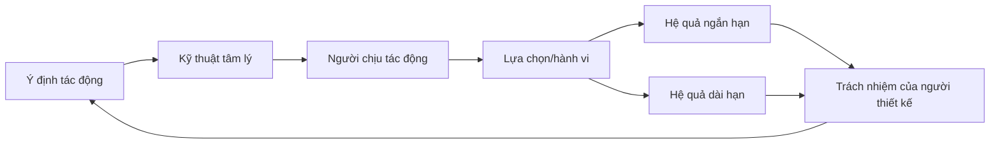
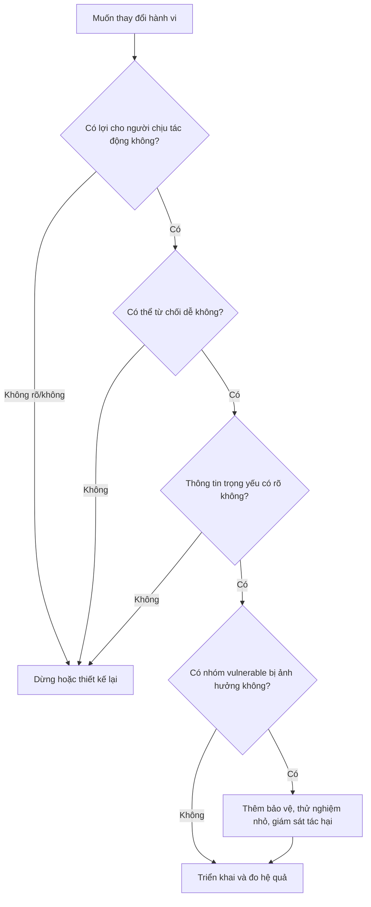
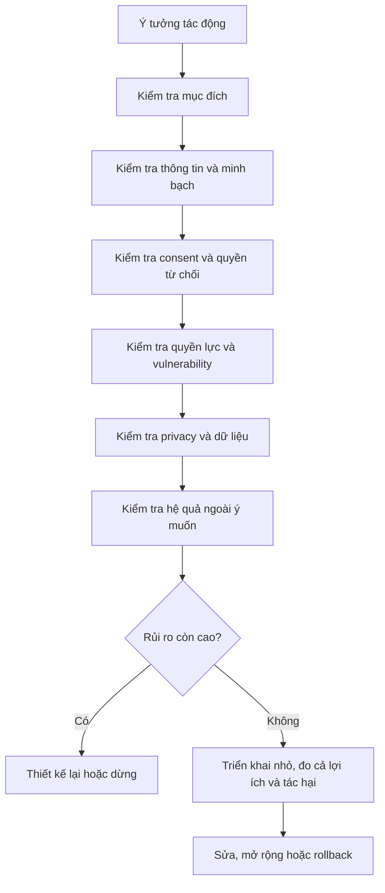

# Tập 20: Đạo Đức Khi Hiểu Và Tác Động Đến Con Người

**Hiểu ranh giới giữa ảnh hưởng và thao túng, consent, minh bạch, quyền lực, vulnerability, privacy và trách nhiệm khi dùng tâm lý trong lãnh đạo, marketing, sales và thiết kế hành vi**  
Giáo trình ngắn gọn cho người trưởng thành, cấp quản lý/C-level

---

## 0. Vì Sao C-level Cần Học Đạo Đức Khi Tác Động Đến Con Người?

### Bản chất

Càng hiểu tâm lý con người, bạn càng có khả năng tạo ảnh hưởng.

Nhưng năng lực ảnh hưởng không tự động là năng lực đúng đắn.  
Một kỹ thuật có thể giúp con người ra quyết định tốt hơn, cũng có thể bị dùng để làm họ mất tự chủ, mua thứ không cần, im lặng trước bất công hoặc trung thành với một hệ thống làm hại họ.

Ở cấp cao, đạo đức không phải là trang trí.  
Đạo đức là điều kiện để niềm tin, thương hiệu, văn hóa và quyền lực tồn tại lâu dài.

Các rủi ro thường gặp:

- Thuyết phục biến thành ép buộc mềm
- Nudging biến thành dark pattern
- Marketing biến nỗi sợ thành doanh thu
- Sales dùng áp lực để đóng deal không phù hợp
- Lãnh đạo dùng sự trung thành để che lấp sự thật
- Tổ chức thu thập dữ liệu nhiều hơn mức cần thiết
- Người yếu thế chịu chi phí của quyết định do người mạnh thiết kế

### Một câu cần nhớ

> Hiểu con người để giúp họ tự do hơn là đạo đức; hiểu con người để làm họ dễ bị điều khiển hơn là thao túng.

### Mục tiêu tập này

Sau tập này, bạn cần làm được 5 việc:

| Năng lực | Ý nghĩa thực tế |
|---|---|
| Phân biệt ảnh hưởng và thao túng | Biết khi nào tác động đã vượt ranh giới |
| Kiểm tra consent | Không dùng sự đồng ý giả, mơ hồ hoặc bị ép |
| Nhìn quyền lực và vulnerability | Bảo vệ người ít quyền, ít thông tin, đang yếu thế |
| Thiết kế nudging có đạo đức | Giúp hành vi tốt dễ hơn mà vẫn giữ tự chủ |
| Chịu trách nhiệm | Dự đoán hệ quả, đo tác hại và sửa khi sai |

---

## 1. First Principles: Đạo Đức Ảnh Hưởng Là Gì?

### Bản chất

Đạo đức ảnh hưởng là cách dùng hiểu biết về con người để tác động đến lựa chọn, cảm xúc hoặc hành vi của họ mà vẫn tôn trọng phẩm giá, quyền tự chủ và lợi ích dài hạn của họ.

```text
Đạo đức ảnh hưởng = Mục đích đúng + Thông tin đủ + Consent thật + Quyền tự chủ + Tác hại được kiểm soát + Trách nhiệm sau tác động
```

Nếu chỉ hỏi:

> Kỹ thuật này có hiệu quả không?

bạn mới hỏi câu hỏi công cụ.

Câu hỏi đạo đức là:

> Kỹ thuật này hiệu quả bằng cách tôn trọng con người hay bằng cách làm họ yếu đi?

### Mô hình gốc



### Câu hỏi gốc

```text
1. Tôi đang tác động để phục vụ lợi ích của ai?
2. Người chịu tác động có hiểu đủ để chọn không?
3. Họ có thể từ chối mà không bị phạt không?
4. Tôi có đang lợi dụng nỗi sợ, thiếu hiểu biết hoặc yếu thế của họ không?
5. Nếu kỹ thuật này bị công khai, tôi có thấy nó vẫn chính đáng không?
```

---

## 2. Ranh Giới Giữa Ảnh Hưởng Và Thao Túng

### Bản chất

Ảnh hưởng là giúp người khác thấy rõ hơn, cân nhắc tốt hơn và hành động tự nguyện hơn.  
Thao túng là làm người khác hành động theo hướng bạn muốn bằng cách làm giảm khả năng hiểu, chọn hoặc từ chối của họ.

| Tiêu chí | Ảnh hưởng có đạo đức | Thao túng |
|---|---|---|
| Thông tin | Làm rõ điều quan trọng | Che giấu hoặc bóp méo |
| Cảm xúc | Giúp cảm xúc được nhận diện | Kích hoạt sợ hãi, xấu hổ, khan hiếm giả |
| Tự chủ | Người kia vẫn có quyền chọn | Thiết kế để khó từ chối |
| Lợi ích | Có lợi ích hợp lý cho cả hai bên | Một bên hưởng lợi, bên kia chịu hại |
| Minh bạch | Có thể giải thích công khai | Phải giấu kỹ thuật mới hiệu quả |
| Hệ quả | Tính đến dài hạn | Chỉ tối ưu chuyển đổi ngắn hạn |

### Dấu hiệu đã vượt ranh giới

- Người kia đồng ý nhưng không thật sự hiểu điều họ đồng ý
- Thiết kế làm lựa chọn từ chối khó hơn lựa chọn đồng ý
- Dùng áp lực thời gian giả để chặn suy nghĩ
- Chỉ trình bày lợi ích, né chi phí thật
- Kích hoạt mặc cảm, sợ bị bỏ rơi hoặc sợ mất địa vị
- Tận dụng dữ liệu riêng tư để đánh vào điểm yếu cá nhân
- Người chịu tác động sẽ thấy bị phản bội nếu biết toàn bộ cách bạn làm

### Nguyên tắc

> Ảnh hưởng tốt làm người khác thấy mình sáng hơn sau quyết định. Thao túng làm họ chỉ nhận ra vấn đề sau khi đã quá muộn.

---

## 3. Consent: Sự Đồng Ý Phải Thật

### Bản chất

Consent không phải là một nút bấm, một chữ ký hoặc một câu "tôi đồng ý".  
Consent là trạng thái trong đó một người hiểu đủ, có quyền chọn đủ và có thể rút lại đủ.

### Consent thật cần có

| Điều kiện | Ý nghĩa |
|---|---|
| Hiểu biết | Người đó biết điều gì đang xảy ra |
| Tự nguyện | Không bị ép, đe dọa hoặc phạt ngầm |
| Cụ thể | Đồng ý cho việc gì, phạm vi nào |
| Có thể rút lại | Không bị khóa vào lựa chọn cũ |
| Không bị đánh lừa | Không có thông tin trọng yếu bị giấu |

### Consent yếu hoặc giả

| Tình huống | Vì sao có vấn đề |
|---|---|
| Điều khoản dài, khó hiểu | Người dùng không thực sự hiểu |
| Nút đồng ý nổi bật, nút từ chối bị giấu | Tự chủ bị thiết kế lệch |
| Nhân sự "tự nguyện" làm thêm vì sợ mất điểm | Quyền lực làm méo consent |
| Khách hàng ký vì sợ hết ưu đãi giả | Cảm xúc bị khai thác |
| Người dùng không thể xóa dữ liệu | Consent không thể rút lại |

### Công cụ: Kiểm tra consent

```text
Người này đang đồng ý với điều gì:
Họ có hiểu hậu quả chính không:
Điều gì đang bị nói nhỏ hoặc giấu đi:
Từ chối có dễ như đồng ý không:
Rút lại có khả thi không:
Có chênh lệch quyền lực không:
Nếu họ hỏi "vì sao anh/chị thiết kế như vậy?", tôi có trả lời thẳng được không:
```

---

## 4. Minh Bạch: Không Phải Nói Hết, Mà Là Không Giấu Điều Trọng Yếu

### Bản chất

Minh bạch không có nghĩa là buộc phải trình bày mọi chi tiết kỹ thuật.  
Minh bạch nghĩa là không che giấu những điều có thể làm thay đổi quyết định của người chịu tác động.

### Những điều cần minh bạch

- Mục đích thu thập dữ liệu
- Ai được lợi từ hành vi mong muốn
- Chi phí, rủi ro và giới hạn
- Điều kiện hủy, đổi, rút lui
- Cách thuật toán hoặc tiêu chí ảnh hưởng đến người dùng
- Khi nào nội dung là quảng cáo, tài trợ hoặc ưu tiên thương mại
- Khi nào người dùng đang bị thử nghiệm hoặc phân nhóm

### Bảng kiểm minh bạch

| Câu hỏi | Dấu hiệu tốt |
|---|---|
| Người kia có biết đây là một nỗ lực tác động không? | Không bị giả vờ là trung lập |
| Có thông tin nào bị giấu vì sẽ làm họ đổi ý không? | Không giấu thông tin trọng yếu |
| Cách trình bày có cân bằng lợi ích và chi phí không? | Không chỉ phóng đại mặt tốt |
| Người chịu tác động có thể kiểm tra lại không? | Có nguồn, tiêu chí hoặc giải thích |
| Có ai đang trả tiền để thông điệp này xuất hiện không? | Quan hệ lợi ích được công khai |

### Nguyên tắc

> Điều gì phải được giấu đi để chiến thuật có hiệu quả thường chính là điểm cần kiểm tra đạo đức đầu tiên.

---

## 5. Quyền Lực Làm Méo Sự Tự Nguyện

### Bản chất

Quyền lực là khả năng ảnh hưởng đến lựa chọn, cơ hội, thu nhập, địa vị hoặc sự an toàn của người khác.

Khi có chênh lệch quyền lực, một câu hỏi, lời mời hoặc đề nghị có thể được nghe như mệnh lệnh.

### Các dạng quyền lực

| Dạng quyền lực | Ví dụ | Rủi ro đạo đức |
|---|---|---|
| Chức danh | CEO, quản lý trực tiếp | Người dưới quyền khó nói không |
| Thông tin | Nắm dữ liệu người khác không có | Dễ dẫn dắt quyết định lệch |
| Chuyên môn | Bác sĩ, chuyên gia, cố vấn | Người nghe dễ tin quá mức |
| Kinh tế | Người trả lương, bên mua lớn | Đồng ý vì sợ mất nguồn sống |
| Xã hội | Người có ảnh hưởng, cộng đồng | Áp lực thuộc về |
| Công nghệ | Nền tảng kiểm soát giao diện | Thiết kế lựa chọn theo lợi ích của nền tảng |

### Câu hỏi khi bạn là bên có quyền lực

```text
1. Người kia có thể phản đối mà không bị trả giá không?
2. Tôi có đang gọi một việc là tự nguyện dù họ khó từ chối?
3. Tôi có đang dùng thông tin bất cân xứng để lấy lợi thế quá mức không?
4. Người yếu hơn có kênh khiếu nại hoặc thoát ra không?
5. Tôi có chấp nhận tiêu chuẩn này nếu vị trí bị đảo ngược không?
```

### Nguyên tắc

> Càng có quyền lực, bạn càng phải chủ động tạo điều kiện để người khác nói không thật.

---

## 6. Vulnerability: Không Lợi Dụng Lúc Con Người Yếu

### Bản chất

Vulnerability là trạng thái một người dễ bị tổn thương, dễ bị dẫn dắt hoặc khó tự bảo vệ lợi ích của mình.

Con người dễ vulnerable khi:

- Đang sợ hãi
- Đang cô đơn
- Đang bệnh
- Đang nợ nần
- Đang đau buồn
- Đang thiếu ngủ
- Đang phụ thuộc vào người có quyền lực
- Không hiểu lĩnh vực đang ra quyết định
- Thuộc nhóm bị kỳ thị hoặc ít tiếng nói

### Rủi ro trong kinh doanh và lãnh đạo

| Bối cảnh | Dễ bị lợi dụng | Cách bảo vệ |
|---|---|---|
| Marketing sức khỏe | Nỗi sợ bệnh tật | Không hứa quá mức, đưa bằng chứng rõ |
| Tài chính cá nhân | Hy vọng làm giàu nhanh | Nói rõ rủi ro, không dùng FOMO |
| Giáo dục | Nỗi sợ tụt lại | Không bán bằng mặc cảm |
| Sales B2B | Áp lực KPI của người mua | Không ép deal trái lợi ích dài hạn |
| Tổ chức | Nhân sự sợ mất việc | Tách phản hồi thật khỏi trừng phạt |

### Công cụ: Vulnerability scan

```text
Ai là nhóm dễ bị tổn thương trong quyết định này:
Họ yếu vì thiếu thông tin, thiếu tiền, thiếu quyền hay đang căng thẳng:
Kỹ thuật tác động có đánh vào điểm yếu đó không:
Có cần thêm thời gian suy nghĩ, tư vấn độc lập hoặc cơ chế thoát không:
Nếu họ là người thân của tôi, tôi có thấy cách tác động này công bằng không:
```

---

## 7. Nudging Có Đạo Đức

### Bản chất

Nudge là thiết kế môi trường lựa chọn để hành vi tốt dễ xảy ra hơn mà không cấm lựa chọn khác.

Nudge có đạo đức khi nó:

- Phục vụ lợi ích hợp lý của người được nudge
- Dễ nhận biết và dễ giải thích
- Giữ quyền từ chối
- Không che giấu chi phí
- Không dùng ma sát bất công để khóa người dùng
- Được đo cả lợi ích lẫn tác hại

### Nudge tốt và dark pattern

| Thiết kế | Nudge có đạo đức | Dark pattern |
|---|---|---|
| Mặc định | Mặc định bảo vệ người dùng | Mặc định lấy thêm dữ liệu không cần thiết |
| Ma sát | Thêm xác nhận trước hành động rủi ro | Làm hủy dịch vụ khó hơn đăng ký |
| Nhắc nhở | Nhắc đúng lúc để người dùng đạt mục tiêu | Gây lo lắng để kéo quay lại |
| So sánh | Giúp hiểu lựa chọn | Sắp xếp để phương án có lợi cho công ty trông tốt giả |
| Khan hiếm | Nói thật số lượng/giới hạn | Tạo khan hiếm giả |

### Mermaid: Ranh giới nudge đạo đức



### Nguyên tắc

> Nudge tốt giúp người ta làm điều họ vẫn chọn khi bình tĩnh, hiểu đủ và có thời gian suy nghĩ.

---

## 8. Marketing Có Đạo Đức

### Bản chất

Marketing có đạo đức không chỉ là quảng cáo đúng luật.  
Marketing có đạo đức là giúp thị trường hiểu đúng giá trị, giới hạn và sự phù hợp của sản phẩm.

### Marketing dễ trượt đạo đức khi

- Bán bằng nỗi sợ không đủ tốt
- Phóng đại kết quả hiếm như kết quả phổ biến
- Dùng testimonial không đại diện
- Che giấu điều kiện để đạt kết quả
- Làm người mua tưởng mình có vấn đề mà sản phẩm mới giải quyết được
- Gắn giá trị con người với việc mua hàng
- Retargeting quá mức vào người đang dễ tổn thương

### Bảng kiểm thông điệp marketing

| Câu hỏi | Cách kiểm tra |
|---|---|
| Lời hứa có đúng với người dùng trung bình không? | Không lấy ngoại lệ làm chuẩn |
| Có nói rõ điều kiện để đạt kết quả không? | Nêu công sức, thời gian, giới hạn |
| Nỗi sợ đang được làm rõ hay bị thổi phồng? | Không bán bằng hoảng loạn |
| Có nhóm nào dễ bị tổn thương hơn không? | Trẻ em, người bệnh, người nợ, người cô đơn |
| Người không mua có bị làm cho thấy thấp kém không? | Không đánh vào phẩm giá |

### Ví dụ chuyển từ thao túng sang đạo đức

| Yếu | Tốt hơn |
|---|---|
| "Nếu không dùng, bạn sẽ tụt lại." | "Phù hợp nếu bạn đang cần giải quyết vấn đề X trong bối cảnh Y." |
| "Chỉ hôm nay, cơ hội cuối cùng." | "Ưu đãi đến ngày X, điều kiện áp dụng là Y." |
| "Ai thành công cũng dùng." | "Một số nhóm khách hàng dùng để đạt mục tiêu cụ thể này." |
| "Thay đổi cuộc đời trong 7 ngày." | "Giúp bạn bắt đầu thói quen đầu tiên trong 7 ngày." |

---

## 9. Sales Có Đạo Đức

### Bản chất

Sales có đạo đức là giúp khách hàng ra quyết định mua hoặc không mua phù hợp với vấn đề, nguồn lực và thời điểm của họ.

Người bán không chỉ có trách nhiệm đóng deal.  
Người bán có trách nhiệm không tạo một quyết định mà khách hàng sẽ hối hận khi hiểu đủ.

### Ranh giới trong sales

| Hành vi | Có đạo đức | Có vấn đề |
|---|---|---|
| Khám phá nhu cầu | Hỏi để hiểu fit | Hỏi để tìm điểm yếu gây áp lực |
| Tạo urgency | Dựa trên deadline thật | Dựng khan hiếm giả |
| Xử lý phản đối | Làm rõ rủi ro và điều kiện | Làm người mua thấy ngại khi từ chối |
| Tư vấn gói | Chọn theo nhu cầu | Đẩy gói cao vì quota |
| Follow-up | Giúp quyết định rõ hơn | Bám đuổi gây mệt mỏi |

### Công cụ: Deal integrity check

```text
Khách hàng có vấn đề thật mà sản phẩm giải quyết được không:
Chi phí chuyển đổi có được nói rõ không:
Ai trong tổ chức khách hàng chịu rủi ro nếu mua sai:
Có bằng chứng phù hợp với bối cảnh của họ không:
Nếu không phù hợp, tôi có dám nói "chưa nên mua" không:
Deal này có làm khách hàng tin hơn sau 6 tháng không:
```

### Nguyên tắc

> Deal tốt là deal vẫn còn đúng sau khi áp lực mua đã biến mất.

---

## 10. Leadership Ethics: Đạo Đức Lãnh Đạo Khi Dùng Tâm Lý

### Bản chất

Lãnh đạo luôn tác động đến tâm lý: bằng mục tiêu, lời nói, phần thưởng, sự chú ý, cách phạt lỗi và cách phân bổ cơ hội.

Vì vậy lãnh đạo không thể nói:

> Tôi chỉ muốn kết quả.

Cách tạo kết quả cũng là một phần của đạo đức lãnh đạo.

### Các vùng rủi ro

| Vùng | Rủi ro | Cách làm đúng hơn |
|---|---|---|
| Tầm nhìn | Dùng lý tưởng để đòi hy sinh vô hạn | Nói rõ giới hạn và chi phí |
| Văn hóa | Dùng "gia đình" để làm mờ hợp đồng | Giữ ranh giới công việc rõ |
| Feedback | Gây xấu hổ để ép thay đổi | Tập trung hành vi, tiêu chuẩn, hỗ trợ |
| Loyalty | Nhầm trung thành với im lặng | Thưởng cho sự thật khó nghe |
| KPI | Tạo áp lực dẫn đến gian lận | Đo cả cách đạt kết quả |
| Sa thải | Dùng sợ hãi để kiểm soát | Công bằng, rõ tiêu chí, giữ phẩm giá |

### Câu hỏi cho lãnh đạo

```text
1. Tôi đang tạo động lực bằng ý nghĩa hay bằng sợ hãi?
2. Người phản biện có bị mất cơ hội không?
3. KPI có đang thưởng hành vi trái giá trị không?
4. Tôi có dùng ngôn ngữ tình cảm để né nghĩa vụ công bằng không?
5. Người yếu nhất trong hệ thống có được bảo vệ khỏi quyền lực của tôi không?
```

### Nguyên tắc

> Văn hóa đạo đức không nằm ở khẩu hiệu. Nó nằm ở điều lãnh đạo cho phép khi kết quả đang tốt.

---

## 11. Privacy: Dữ Liệu Tâm Lý Là Quyền Lực

### Bản chất

Dữ liệu về hành vi, cảm xúc, thói quen, mối quan hệ, sức khỏe, tài chính và niềm tin có thể dùng để phục vụ con người, nhưng cũng có thể dùng để khai thác họ.

Privacy không chỉ là bảo mật kỹ thuật.  
Privacy là quyền kiểm soát mức độ người khác được biết, dự đoán và tác động đến mình.

### Các nguyên tắc privacy

| Nguyên tắc | Ý nghĩa |
|---|---|
| Tối thiểu hóa | Chỉ thu thập dữ liệu thật sự cần |
| Mục đích rõ | Không dùng dữ liệu cho mục đích khác khi chưa xin phép |
| Thời hạn | Không giữ mãi nếu không cần |
| Quyền truy cập | Người dùng biết và kiểm soát dữ liệu của mình |
| Bảo vệ nhóm nhạy cảm | Dữ liệu sức khỏe, trẻ em, tài chính, cảm xúc cần tiêu chuẩn cao hơn |
| Không weaponize | Không dùng dữ liệu để đánh vào điểm yếu cá nhân |

### Câu hỏi trước khi thu thập dữ liệu

```text
Dữ liệu này có thật sự cần cho giá trị cốt lõi không:
Người dùng có hiểu cách dữ liệu được dùng không:
Nếu dữ liệu lộ, ai bị hại:
Nếu dữ liệu bị dùng sai, ai được lợi:
Có thể đạt mục tiêu với ít dữ liệu hơn không:
Khi nào dữ liệu được xóa:
```

### Nguyên tắc

> Dữ liệu càng giúp bạn dự đoán con người chính xác, trách nhiệm đạo đức càng cao.

---

## 12. Trách Nhiệm Khi Dùng Tâm Lý

### Bản chất

Trách nhiệm không dừng ở ý định tốt.  
Trách nhiệm là dự đoán tác hại, giám sát hệ quả, sửa khi sai và chịu chi phí của quyết định mình thiết kế.

Một can thiệp tâm lý có thể có ý định tốt nhưng vẫn gây hại nếu:

- Áp dụng cho sai nhóm
- Tạo áp lực xã hội quá mạnh
- Làm tăng mặc cảm hoặc lo âu
- Tối ưu metric ngắn hạn
- Gây lệ thuộc vào hệ thống
- Làm suy yếu năng lực tự quyết
- Chuyển chi phí sang người không có tiếng nói

### Bảng trách nhiệm theo vòng đời

| Giai đoạn | Trách nhiệm |
|---|---|
| Trước khi thiết kế | Xác định lợi ích, rủi ro, nhóm vulnerable |
| Khi triển khai | Minh bạch, giữ quyền từ chối, thử nghiệm nhỏ |
| Khi đo lường | Đo cả tác hại, không chỉ conversion |
| Khi có phản hồi xấu | Điều tra, sửa, bồi hoàn nếu cần |
| Sau khi thành công | Kiểm tra hệ quả dài hạn và lạm dụng |

### Công cụ: Harm audit

```text
Can thiệp đang tối ưu metric nào:
Metric đó có thể bị đạt bằng cách gây hại không:
Ai có thể chịu chi phí mà không được hỏi ý:
Tác hại nào chỉ xuất hiện sau vài tháng:
Tín hiệu cảnh báo sớm là gì:
Ai có quyền dừng can thiệp:
Có cơ chế khiếu nại và sửa lỗi không:
```

---

## 13. Nguyên Tắc Kiểm Tra Đạo Đức

### Bản chất

Đạo đức cần được biến thành câu hỏi vận hành.  
Nếu chỉ để ở mức "hãy làm điều đúng", hệ thống sẽ thua áp lực tăng trưởng, KPI và quyền lực.

### Bộ 10 câu hỏi kiểm tra

```text
1. Mục đích thật của tác động này là gì?
2. Ai được lợi, ai chịu rủi ro?
3. Người chịu tác động có hiểu đủ không?
4. Họ có thể từ chối hoặc rút lui dễ không?
5. Có chênh lệch quyền lực hoặc thông tin không?
6. Có nhóm vulnerable nào bị ảnh hưởng không?
7. Có thông tin trọng yếu nào bị che giấu không?
8. Thiết kế này có làm giảm tự chủ không?
9. Nếu bị công khai, chúng ta có bảo vệ được quyết định này không?
10. Chúng ta đo và sửa tác hại bằng cách nào?
```

### Bài kiểm tra 5 lớp

| Lớp | Câu hỏi | Nếu câu trả lời xấu |
|---|---|---|
| Ý định | Ta đang phục vụ điều gì? | Dừng hoặc đổi mục tiêu |
| Thông tin | Người kia có hiểu đủ không? | Làm rõ trước khi tác động |
| Tự chủ | Họ có quyền nói không không? | Giảm ép buộc, giảm ma sát thoát |
| Công bằng | Ai yếu hơn đang chịu chi phí? | Thêm bảo vệ hoặc bồi hoàn |
| Trách nhiệm | Ai sửa nếu có hại? | Chưa được triển khai rộng |

### Mermaid: Bộ lọc đạo đức trước khi triển khai



---

## 14. Các Lỗi Đạo Đức Phổ Biến Của Người Thông Minh

### Bản chất

Người hiểu tâm lý thường không sai vì thiếu công cụ.  
Họ sai vì hợp lý hóa việc dùng công cụ quá mức.

### Những câu tự biện thường gặp

| Câu tự biện | Vấn đề thật |
|---|---|
| "Ai cũng làm vậy." | Phổ biến không đồng nghĩa đúng |
| "Người dùng vẫn có lựa chọn." | Lựa chọn có thể bị thiết kế lệch |
| "Mục tiêu tốt nên cách làm chấp nhận được." | Mục tiêu tốt không xóa tác hại |
| "Họ đã đồng ý điều khoản." | Đồng ý hình thức không phải consent thật |
| "Chỉ là tối ưu conversion." | Conversion có thể đến từ mất tự chủ |
| "Nếu không làm, đối thủ sẽ làm." | Áp lực cạnh tranh không miễn trách nhiệm |

### Câu hỏi phản biện bản thân

```text
Tôi có đang dùng ngôn ngữ trung tính để che một hành vi ép buộc không:
Tôi có đang gọi thao túng là trải nghiệm người dùng không:
Tôi có đang dùng dữ liệu để phục vụ người dùng hay để khai thác họ:
Tôi có đang chọn metric vì nó dễ đo hơn điều thật sự quan trọng không:
Tôi có dám để khách hàng/nhân sự biết cách tôi đang tác động không:
```

---

## 15. Công Cụ Thực Hành: Ethical Influence Canvas

### Khi nào dùng

Dùng trước khi triển khai một chiến dịch marketing, kịch bản sales, chính sách nội bộ, thiết kế sản phẩm, chương trình thay đổi hành vi hoặc thông điệp lãnh đạo có tác động lớn.

```text
1. Bối cảnh:
- Ta muốn thay đổi hành vi nào?
- Ai là người chịu tác động?
- Họ đang ở trạng thái cảm xúc và quyền lực nào?

2. Lợi ích:
- Lợi ích cho tổ chức là gì?
- Lợi ích cho người chịu tác động là gì?
- Có xung đột lợi ích không?

3. Thông tin:
- Người kia cần biết gì để chọn đúng?
- Điều gì dễ bị hiểu sai?
- Điều gì chúng ta đang có động cơ muốn nói nhỏ?

4. Consent:
- Đồng ý có cụ thể không?
- Từ chối có dễ không?
- Rút lại có dễ không?

5. Vulnerability:
- Nhóm nào dễ bị hại hơn?
- Họ cần thêm bảo vệ gì?

6. Privacy:
- Dữ liệu nào được dùng?
- Có thể dùng ít dữ liệu hơn không?
- Dữ liệu sẽ được xóa khi nào?

7. Hệ quả:
- Tác hại ngắn hạn có thể là gì?
- Tác hại dài hạn có thể là gì?
- Tín hiệu cảnh báo sớm là gì?

8. Trách nhiệm:
- Ai có quyền dừng?
- Ai nhận phản hồi?
- Cơ chế sửa và bồi hoàn là gì?
```

---

## 16. Lộ Trình Thực Hành 4 Tuần

### Tuần 1: Nhận diện ranh giới ảnh hưởng - thao túng

- Chọn 5 thông điệp marketing, sales hoặc lãnh đạo gần đây.
- Đánh dấu thông tin, cảm xúc, quyền từ chối và lợi ích hai bên.
- Viết lại ít nhất 2 thông điệp để tăng minh bạch.

### Tuần 2: Audit consent và quyền lực

- Chọn một quy trình có sự đồng ý: đăng ký, hủy, thu thập dữ liệu, chính sách nhân sự.
- Kiểm tra người dùng/nhân sự có thể từ chối hoặc rút lại dễ không.
- Tìm một điểm mà quyền lực đang làm consent yếu đi.

### Tuần 3: Kiểm tra nudging, privacy và vulnerability

- Chọn một nudge hoặc mặc định trong sản phẩm/tổ chức.
- Xác định nhóm vulnerable có thể bị ảnh hưởng.
- Giảm dữ liệu không cần thiết hoặc thêm một cơ chế bảo vệ.

### Tuần 4: Thiết lập cơ chế trách nhiệm

- Tạo một checklist đạo đức trước khi launch.
- Thêm một metric đo tác hại, không chỉ đo hiệu quả.
- Chỉ định người có quyền dừng hoặc rollback khi có tín hiệu xấu.

---

## 17. Bảng Tóm Tắt First Principles

| Chủ đề | Bản chất | Câu hỏi áp dụng |
|---|---|---|
| Đạo đức ảnh hưởng | Tác động mà vẫn giữ phẩm giá và tự chủ | Việc này làm người kia tự do hơn hay dễ bị điều khiển hơn? |
| Ảnh hưởng | Giúp người khác hiểu và chọn tốt hơn | Người kia có sáng hơn sau quyết định không? |
| Thao túng | Làm giảm khả năng hiểu, chọn hoặc từ chối | Kỹ thuật này có cần che giấu mới hiệu quả không? |
| Consent | Đồng ý khi hiểu đủ, tự nguyện và có thể rút lại | Từ chối có dễ như đồng ý không? |
| Minh bạch | Không giấu thông tin trọng yếu | Nếu biết thêm, họ có đổi quyết định không? |
| Quyền lực | Khả năng ảnh hưởng đến cơ hội và an toàn của người khác | Người yếu hơn có thể nói không thật không? |
| Vulnerability | Trạng thái dễ bị tổn thương hoặc dẫn dắt | Ta có đang đánh vào điểm yếu của họ không? |
| Nudging | Thiết kế lựa chọn để hành vi tốt dễ hơn | Nudge này có giữ quyền tự chủ không? |
| Marketing ethics | Giúp thị trường hiểu đúng giá trị và giới hạn | Lời hứa có đúng với người dùng trung bình không? |
| Sales ethics | Giúp khách hàng mua hoặc không mua đúng lúc | Deal này còn đúng sau khi áp lực biến mất không? |
| Leadership ethics | Dùng quyền lực để tạo kết quả mà vẫn giữ phẩm giá | Cách đạt kết quả có làm hỏng văn hóa không? |
| Privacy | Quyền kiểm soát dữ liệu và khả năng bị dự đoán | Có thể tạo giá trị với ít dữ liệu hơn không? |
| Trách nhiệm | Đo, sửa và chịu hệ quả của can thiệp | Ai có quyền dừng khi có hại? |

---

## 18. Một Câu Để Nhớ Toàn Bộ Tập 20

> Tác động đến con người chỉ chính đáng khi người chịu tác động vẫn hiểu đủ, chọn được, từ chối được và được bảo vệ khỏi quyền lực mà họ không thể thấy hết.
