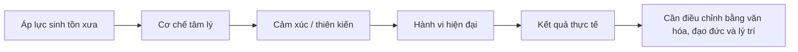
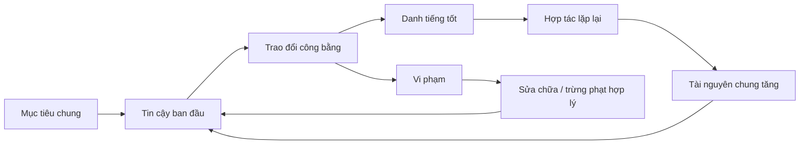

# Tập 21: Tâm Lý Học Tiến Hóa Và Bản Năng Con Người

**Hiểu các động lực cổ xưa phía sau sinh tồn, địa vị, chọn bạn đời, ghen tuông, cạnh tranh, hợp tác, phe nhóm, sợ bị loại trừ và tài nguyên trong đời sống hiện đại**  
Giáo trình ngắn gọn cho người trưởng thành, cấp quản lý/C-level

---

## 0. Vì Sao C-level Cần Học Tâm Lý Học Tiến Hóa?

### Bản chất

Con người hiện đại dùng điện thoại, hợp đồng, KPI và chiến lược.  
Nhưng bên dưới vẫn là một hệ thần kinh được định hình qua hàng trăm nghìn năm để xử lý:

- Sống sót
- Tài nguyên
- Địa vị
- Thuộc về nhóm
- Chọn bạn đời
- Nuôi con
- Phát hiện đe dọa
- Tránh bị loại trừ

Nhiều hành vi trong tổ chức, thị trường và quan hệ không thể hiểu đầy đủ nếu chỉ nhìn bằng lý trí hiện đại.

Một người có thể nói:

> Tôi chỉ đang bảo vệ quan điểm chuyên môn.

Nhưng tầng sâu hơn có thể là:

> Tôi đang bảo vệ vị thế, danh tính, quyền tiếp cận tài nguyên hoặc cảm giác thuộc về nhóm.

### Một câu cần nhớ

> Con người không chỉ tối ưu hạnh phúc; con người thường tối ưu an toàn, địa vị, thuộc về và cơ hội sinh tồn theo những cách rất cổ xưa.

### Mục tiêu tập này

| Năng lực | Ý nghĩa thực tế |
|---|---|
| Đọc bản năng nền | Thấy động lực sinh tồn, địa vị và thuộc về phía sau hành vi |
| Hiểu cạnh tranh và hợp tác | Không ngây thơ trước xung đột lợi ích, cũng không bi quan về lòng tốt |
| Nhận diện sợ bị loại trừ | Hiểu vì sao con người im lặng, theo nhóm hoặc phản ứng quá mạnh |
| Dùng góc nhìn tiến hóa có giới hạn | Không biến bản năng thành biện minh cho hành vi xấu |
| Ứng dụng vào lãnh đạo, quan hệ, marketing | Thiết kế môi trường phù hợp với bản chất người hơn |

---

## 1. First Principles: Tâm Lý Học Tiến Hóa Là Gì?

### Bản chất

Tâm lý học tiến hóa nhìn tâm trí như một hệ thống thích nghi: nhiều cảm xúc, thiên kiến và động lực từng giúp tổ tiên sống sót, sinh sản, bảo vệ con cái và tồn tại trong nhóm.

```text
Tâm trí hiện đại = Não cổ xưa + Môi trường hiện đại + Văn hóa + Cá nhân học được
```

Góc nhìn tiến hóa không nói rằng mọi hành vi đều "đúng".  
Nó hỏi:

> Cơ chế tâm lý này từng giải quyết vấn đề sinh tồn nào?

### Mô hình gốc



### Câu hỏi gốc

```text
1. Hành vi này đang bảo vệ điều gì: an toàn, địa vị, quan hệ, tài nguyên hay danh tính?
2. Cảm xúc này từng có chức năng sinh tồn nào?
3. Môi trường hiện đại có đang kích hoạt quá mức một bản năng cũ không?
4. Tôi đang thấy bản năng thật hay đang hợp lý hóa định kiến?
5. Cần thiết kế môi trường nào để bản năng tốt xuất hiện nhiều hơn?
```

---

## 2. Bản Năng Sinh Tồn: Não Ưu Tiên Sống Trước Khi Ưu Tiên Đúng

### Bản chất

Hệ thần kinh ưu tiên phát hiện nguy hiểm hơn tối ưu sự thật.  
Trong môi trường xưa, bỏ sót một mối đe dọa có thể chết. Báo động nhầm chỉ tốn năng lượng.

Vì vậy con người dễ:

- Nhạy với tin xấu
- Phóng đại rủi ro mơ hồ
- Phản ứng nhanh trước đe dọa địa vị
- Nhớ tổn thương mạnh hơn lời khen
- Tìm nguyên nhân và thủ phạm khi bất an

### Bảng đọc phản ứng sinh tồn

| Phản ứng | Chức năng cổ xưa | Biểu hiện hiện đại |
|---|---|---|
| Sợ hãi | Tránh nguy hiểm | Né quyết định, phòng thủ, đóng thông tin |
| Giận dữ | Đẩy lùi đe dọa | Tấn công, tranh quyền, làm căng cuộc họp |
| Ghê tởm | Tránh độc hại/bệnh | Loại trừ người khác biệt, đạo đức hóa quá mức |
| Lo âu | Dự báo rủi ro | Overthinking, kiểm soát, cần chắc chắn |
| Cảnh giác | Quét tín hiệu nguy hiểm | Nghi ngờ, khó tin, đọc thái độ quá mức |

### Nguyên tắc

> Khi con người cảm thấy bị đe dọa, họ không xử lý như một nhà phân tích. Họ xử lý như một sinh vật cần sống sót.

---

## 3. Địa Vị: Nhu Cầu Được Tính Đến

### Bản chất

Địa vị là vị trí tương đối của một người trong nhóm.  
Trong lịch sử tiến hóa, địa vị ảnh hưởng đến tài nguyên, bạn đời, sự bảo vệ, tiếng nói và khả năng được giúp đỡ.

Ngày nay, địa vị xuất hiện qua:

- Chức danh
- Thu nhập
- Sự chú ý
- Quyền quyết định
- Ai được mời vào phòng
- Ai được nghe trước
- Ai bị ngắt lời
- Ai được tha lỗi

### Hai dạng địa vị

| Dạng | Nguồn gốc | Tác dụng | Mặt tối |
|---|---|---|---|
| Uy tín | Năng lực, đóng góp, đạo đức | Người khác tự nguyện theo | Dễ thành sùng bái chuyên gia |
| Thống trị | Quyền lực, sợ hãi, trừng phạt | Tạo phục tùng nhanh | Làm nghèo thông tin và văn hóa |

### Câu hỏi cho lãnh đạo

```text
1. Trong phòng này, ai đang bị hạ địa vị mà không ai nói ra?
2. Tôi đang dùng uy tín hay thống trị?
3. Hệ thống đang thưởng người tạo giá trị hay người chiếm sân khấu?
4. Có ai phải bảo vệ ego trước khi bảo vệ sự thật không?
```

---

## 4. Chọn Bạn Đời: Không Chỉ Là Lãng Mạn

### Bản chất

Chọn bạn đời là một trong các bài toán tiến hóa mạnh nhất vì liên quan đến sinh sản, nuôi dưỡng, an toàn, tài nguyên và chất lượng liên minh dài hạn.

Con người thường đánh giá đối tác qua nhiều tín hiệu:

- Sức khỏe
- Sự ổn định
- Năng lực
- Sự tử tế
- Cam kết
- Địa vị
- Khả năng bảo vệ
- Khả năng chăm sóc

Không nên giản lược nam/nữ thành công thức cứng.  
Văn hóa, cá tính, tuổi đời, trải nghiệm, kinh tế và giá trị cá nhân đều làm thay đổi lựa chọn.

### Tín hiệu trong quan hệ thân mật

| Tín hiệu | Câu hỏi ngầm |
|---|---|
| Cam kết | Người này có ở lại khi khó không? |
| Năng lực | Người này có xử lý đời sống được không? |
| Tử tế | Người này có gây hại khi có quyền lực không? |
| Ổn định cảm xúc | Người này có làm hệ thần kinh của tôi an toàn hơn không? |
| Trung thực | Tôi có thể dự đoán người này không? |

### Nguyên tắc

> Hấp dẫn ban đầu có thể đến từ tín hiệu sinh học và địa vị; quan hệ dài hạn sống được nhờ tin cậy, tử tế, sửa chữa và cam kết.

---

## 5. Ghen Tuông: Báo Động Về Mất Kết Nối Và Mất Vị Thế

### Bản chất

Ghen tuông là phản ứng khi một người cảm thấy quan hệ, vị thế hoặc quyền ưu tiên của mình bị đe dọa.

Nó có thể chứa:

- Sợ mất người quan trọng
- Sợ bị thay thế
- Sợ bị lừa
- Sợ mất mặt
- Sợ mình không đủ giá trị

Ghen không tự động là yêu.  
Ghen là tín hiệu cần đọc, không phải mệnh lệnh để kiểm soát.

### Ghen lành mạnh và độc hại

| Lành mạnh | Độc hại |
|---|---|
| Nhận ra mình đang sợ | Đổ lỗi ngay cho người kia |
| Nói rõ nhu cầu an toàn | Kiểm tra, theo dõi, cấm đoán |
| Tìm sự thật | Tưởng tượng rồi kết án |
| Đặt ranh giới | Trừng phạt bằng im lặng/giận dữ |
| Sửa quan hệ | Làm quan hệ mất tự do |

### Câu hỏi tự soi

```text
Tôi đang sợ mất điều gì:
Bằng chứng thật là gì:
Câu chuyện tôi đang tự kể là gì:
Tôi cần ranh giới hay cần kiểm soát:
Tôi có thể nói nhu cầu mà không tấn công không:
```

---

## 6. Cạnh Tranh: Khi Tài Nguyên, Địa Vị Và Cơ Hội Có Giới Hạn

### Bản chất

Cạnh tranh xuất hiện khi nhiều người muốn cùng một tài nguyên, vị trí, sự chú ý hoặc cơ hội.

Cạnh tranh không xấu.  
Nó có thể tạo nỗ lực, sáng tạo và chuẩn cao hơn.

Nhưng cạnh tranh trở nên độc hại khi:

- Trò chơi không công bằng
- Tiêu chí mơ hồ
- Thắng bằng phá người khác
- Địa vị quan trọng hơn giá trị thật
- Phần thưởng khuyến khích che giấu thông tin

### Bảng phân biệt

| Cạnh tranh tốt | Cạnh tranh xấu |
|---|---|
| Tiêu chí rõ | Luật ngầm |
| Nâng chuẩn năng lực | Hạ bệ đối thủ |
| Tạo giá trị cho khách hàng/tổ chức | Tối ưu chính trị nội bộ |
| Có giới hạn đạo đức | Bất chấp hậu quả |
| Sau cạnh tranh vẫn hợp tác được | Tạo thù dài hạn |

### Nguyên tắc

> Cạnh tranh cần luật chơi rõ. Nếu không, bản năng địa vị sẽ biến tổ chức thành đấu trường chính trị.

---

## 7. Hợp Tác: Bản Năng Không Chỉ Ích Kỷ

### Bản chất

Con người sống sót nhờ nhóm.  
Vì vậy ta không chỉ có bản năng cạnh tranh, mà còn có bản năng hợp tác, trao đổi, chăm sóc, công bằng và trừng phạt kẻ lợi dụng.

Hợp tác bền cần:

- Tin cậy
- Danh tiếng
- Công bằng
- Lặp lại tương tác
- Khả năng phát hiện ăn theo
- Cơ chế sửa chữa khi vi phạm

### Mô hình hợp tác



### Câu hỏi thiết kế

```text
1. Người hợp tác tốt có được thấy và thưởng không?
2. Người ăn theo có bị phát hiện không?
3. Lợi ích chung có đủ rõ không?
4. Có cơ chế sửa chữa trước khi loại trừ không?
```

---

## 8. Nhóm Trong Và Nhóm Ngoài: Bản Năng "Chúng Ta" Và "Họ"

### Bản chất

Não người phân loại rất nhanh ai là "chúng ta" và ai là "họ".  
Điều này từng giúp phối hợp và tự vệ, nhưng trong xã hội hiện đại dễ tạo phe phái, định kiến và mất dữ kiện.

Ranh giới nhóm có thể dựa trên:

- Công ty cũ/công ty mới
- Phòng ban
- Vùng miền
- Trường phái chuyên môn
- Cấp bậc
- Tuổi tác
- Người thân lãnh đạo
- Người tạo doanh thu và người hỗ trợ

### Hiệu ứng thường gặp

| Cơ chế | Biểu hiện |
|---|---|
| Thiên vị in-group | Dễ tin, dễ tha lỗi cho người phe mình |
| Đóng khung out-group | Xem nhóm kia đều giống nhau |
| Đạo đức hóa phe mình | Mình là đúng, bên kia là có vấn đề |
| Tin đồn | Lấp khoảng trống thông tin bằng câu chuyện phe nhóm |
| Trả đũa | Một lỗi nhỏ được xem là bằng chứng về bản chất |

### Nguyên tắc

> Ranh giới nhóm giúp phối hợp, nhưng lãnh đạo phải làm ranh giới đủ mềm để sự thật đi qua được.

---

## 9. Sợ Bị Loại Trừ: Một Nỗi Sợ Cổ Xưa Trong Văn Phòng Hiện Đại

### Bản chất

Trong môi trường tổ tiên, bị loại khỏi nhóm có thể đồng nghĩa với chết.  
Vì vậy bị phớt lờ, bị chê, bị bỏ khỏi cuộc họp hoặc bị mất tín hiệu thuộc về có thể kích hoạt phản ứng rất mạnh.

Trong tổ chức, sợ bị loại trừ tạo ra:

- Im lặng trước quyết định sai
- Đồng ý giả
- Theo phe mạnh
- Né phản hồi khó
- Tự kiểm duyệt
- Ghen tị với người được ưu ái
- Quá nhạy với tín hiệu từ lãnh đạo

### Bảng đọc tín hiệu

| Tín hiệu bề mặt | Có thể là nỗi sợ sâu |
|---|---|
| Không nói trong họp | Sợ bị phạt hoặc bị xem là khác nhóm |
| Đồng ý quá nhanh | Muốn giữ thuộc về |
| Phòng thủ khi nhận feedback | Sợ mất vị trí trong mắt nhóm |
| Nói sau lưng | Kênh chính thức không an toàn |
| Bám lãnh đạo | Cần bảo chứng thuộc về |

### Câu hỏi của C-level

```text
1. Ai trong hệ thống đang sợ bị bỏ lại?
2. Tín hiệu thuộc về có đang phân bổ công bằng không?
3. Người nói thật có bị loại khỏi vòng thân tín không?
4. Tôi có đang dùng sự im lặng làm bằng chứng đồng thuận không?
```

---

## 10. Tài Nguyên: Não Rất Nhạy Với Thiếu Hụt Và Mất Mát

### Bản chất

Tài nguyên trong tâm trí không chỉ là tiền.  
Nó gồm thời gian, năng lượng, thông tin, cơ hội, sự chú ý, quyền quyết định, mạng lưới và an toàn.

Khi tài nguyên có vẻ thiếu, con người dễ:

- Thu hẹp tầm nhìn
- Giữ phần của mình
- Ít hào phóng hơn
- Cạnh tranh mạnh hơn
- Sợ mất hơn muốn được
- Đánh giá ngắn hạn hơn dài hạn

### Tài nguyên hữu hình và vô hình

| Tài nguyên | Dạng mất mát thường gặp |
|---|---|
| Tiền | Sợ giảm thu nhập, giảm quyền chọn |
| Thời gian | Sợ bị lấy mất quyền tự chủ |
| Sự chú ý | Sợ không còn quan trọng |
| Thông tin | Sợ bị ra rìa |
| Cơ hội | Sợ người khác vượt mình |
| Danh tiếng | Sợ một lỗi phá hỏng vị thế |

### Nguyên tắc

> Khi con người tranh cãi về lý do, hãy kiểm tra xem họ có đang tranh giành tài nguyên hữu hình hoặc vô hình không.

---

## 11. Giới Hạn Khi Dùng Góc Nhìn Tiến Hóa

### Bản chất

Tâm lý học tiến hóa hữu ích để đặt câu hỏi sâu hơn.  
Nhưng nếu dùng cẩu thả, nó dễ thành câu chuyện nghe hợp lý sau khi sự việc đã xảy ra.

### Những lỗi phổ biến

| Lỗi | Vì sao nguy hiểm |
|---|---|
| "Tự nhiên nên đúng" | Cái tự nhiên không tự động là đạo đức |
| Giải thích một nguyên nhân | Hành vi thường do sinh học, văn hóa, học tập và bối cảnh cùng tạo ra |
| Định kiến giới | Biến khác biệt trung bình thành khuôn cứng cho từng cá nhân |
| Câu chuyện sau sự kiện | Dễ bịa lý do tiến hóa khó kiểm chứng |
| Bỏ qua văn hóa | Con người luôn sống trong hệ chuẩn mực và luật lệ |
| Biện minh quyền lực | Dùng "bản năng" để hợp thức hóa kiểm soát, ghen tuông, bạo lực hoặc bất công |

### Bộ lọc sử dụng đúng

```text
1. Đây là giả thuyết hay kết luận?
2. Có cách giải thích văn hóa, kinh tế, học tập hoặc tình huống không?
3. Tôi có đang biến trung bình nhóm thành số phận cá nhân không?
4. Giải thích này có bị dùng để biện minh cho hành vi gây hại không?
5. Nếu hiểu bản năng này, tôi có thiết kế môi trường tốt hơn hay chỉ phán xét con người hơn?
```

### Nguyên tắc

> Tiến hóa giải thích vì sao một cơ chế có thể tồn tại; đạo đức và lãnh đạo quyết định ta nên dùng hoặc điều chỉnh nó thế nào.

---

## 12. Ứng Dụng Trong Lãnh Đạo

### Bản chất

Lãnh đạo tốt không phủ nhận bản năng.  
Lãnh đạo tốt thiết kế môi trường để bản năng sinh tồn không phá hỏng sự thật, hợp tác và trách nhiệm.

### Bảng ứng dụng

| Bản năng | Rủi ro tổ chức | Thiết kế lãnh đạo |
|---|---|---|
| Sinh tồn | Phòng thủ, giấu lỗi | Tách lỗi học tập khỏi lỗi đạo đức |
| Địa vị | Chính trị, giữ mặt | Tiêu chí đóng góp rõ, lãnh đạo nói cuối |
| Thuộc về | Đồng thuận giả | Thu ý kiến độc lập, bảo vệ người phản biện |
| Tài nguyên | Tranh ngân sách, giữ thông tin | Minh bạch ưu tiên và trade-off |
| In-group | Phe phái | Luân chuyển kết nối, mục tiêu chung rõ |
| Cạnh tranh | Hạ bệ nhau | Luật chơi rõ, thưởng hợp tác chéo |
| Hợp tác | Ăn theo | Danh tiếng, accountability và phản hồi nhanh |

### Mẫu câu lãnh đạo

```text
"Tôi muốn nghe rủi ro trước khi nghe sự đồng thuận."
"Ở đây phản biện quyết định không phải phản bội nhóm."
"Tiêu chí thắng cuộc chơi này là giá trị tạo ra, không phải ai nói to hơn."
"Nếu nhóm nào đang thấy bị ra rìa, tôi muốn biết sớm."
```

---

## 13. Ứng Dụng Trong Quan Hệ

### Bản chất

Trong quan hệ thân mật, bản năng thường hiện ra dưới dạng nhu cầu an toàn, ưu tiên, cam kết và sợ bị thay thế.

Nhiều xung đột không chỉ là nội dung tranh luận.  
Nó là câu hỏi sâu:

> Tôi có còn quan trọng, an toàn và được chọn không?

### Bảng đọc quan hệ

| Hành vi | Có thể đang bảo vệ | Cách phản hồi tốt hơn |
|---|---|---|
| Kiểm soát | An toàn, sợ mất | Nói nhu cầu và ranh giới |
| Ghen | Vị trí ưu tiên | Tìm sự thật, không trừng phạt |
| Rút lui | Tự chủ, tránh bị nuốt | Xin không gian có hẹn quay lại |
| Đòi hỏi | Kết nối, tín hiệu yêu thương | Xác nhận cảm xúc trước khi giải thích |
| So sánh | Địa vị, giá trị bản thân | Hỏi điều gì đang làm họ thấy thiếu |

### Công cụ: Nói từ bản năng đến nhu cầu

```text
Khi việc này xảy ra, tôi thấy:
Câu chuyện tôi tự kể là:
Nỗi sợ sâu hơn của tôi là:
Nhu cầu thật của tôi là:
Điều tôi đề nghị là:
Điều tôi không muốn làm là kiểm soát hoặc tấn công bạn:
```

---

## 14. Ứng Dụng Trong Marketing

### Bản chất

Marketing hiệu quả thường chạm vào bản năng: an toàn, địa vị, thuộc về, hấp dẫn, tiết kiệm tài nguyên, tránh mất mát và được nhóm công nhận.

Marketing có đạo đức không né bản năng.  
Nó dùng bản năng để giúp khách hàng hiểu giá trị thật, không khai thác điểm yếu để ép quyết định.

### Bản năng và thông điệp

| Bản năng | Thông điệp lành mạnh | Ranh giới đạo đức |
|---|---|---|
| An toàn | Giảm rủi ro thật, bảo hành rõ | Không thổi phồng sợ hãi |
| Địa vị | Giúp khách hàng thể hiện giá trị thật | Không làm họ thấy vô giá trị nếu không mua |
| Thuộc về | Cộng đồng, chuẩn mực tích cực | Không tạo xấu hổ xã hội giả |
| Khan hiếm | Nói đúng giới hạn thật | Không tạo khan hiếm giả |
| Tránh mất mát | Làm rõ chi phí của không hành động | Không ép bằng áp lực thời gian giả |
| Tin cậy | Bằng chứng xã hội thật | Không dùng review giả hoặc chọn lọc lừa dối |

### Checklist marketing tiến hóa có đạo đức

```text
[ ] Bản năng nào đang được kích hoạt?
[ ] Nỗi sợ có được phóng đại không?
[ ] Khan hiếm có thật không?
[ ] Bằng chứng xã hội có trung thực không?
[ ] Khách hàng có đủ thông tin để không mua không?
[ ] Sau khi mua, họ có thấy được tôn trọng không?
```

---

## 15. Công Cụ Thực Hành: Evolutionary Lens Canvas

### Khi nào dùng

Dùng khi bạn muốn hiểu một hành vi lặp lại trong tổ chức, quan hệ, khách hàng hoặc bản thân mà giải thích lý trí không đủ.

```text
1. Hành vi cần hiểu:
- Ai đang làm gì?
- Hành vi lặp lại trong bối cảnh nào?

2. Bản năng có thể liên quan:
- Sinh tồn/an toàn:
- Địa vị:
- Thuộc về:
- Tài nguyên:
- Chọn bạn đời/quan hệ:
- Cạnh tranh/hợp tác:

3. Tín hiệu kích hoạt:
- Điều gì làm phản ứng bắt đầu?
- Ai hoặc nhóm nào bị xem là đe dọa?
- Tài nguyên hữu hình/vô hình nào đang bị chạm?

4. Lợi ích ngắn hạn:
- Hành vi này giúp người đó tránh hoặc đạt điều gì ngay lập tức?

5. Chi phí dài hạn:
- Hành vi này làm hỏng quan hệ, niềm tin, quyết định hoặc văn hóa thế nào?

6. Giới hạn giải thích:
- Có yếu tố văn hóa, kinh tế, quá khứ cá nhân hoặc hệ thống nào khác không?

7. Thiết kế can thiệp:
- Làm gì để tăng an toàn?
- Làm gì để công bằng địa vị/tài nguyên hơn?
- Làm gì để hợp tác có lợi hơn cạnh tranh xấu?
```

---

## 16. Checklist Cho C-level Trước Quyết Định Nhạy Cảm

### Dùng trước tái cấu trúc, thay đổi thưởng, truyền thông khủng hoảng, sáp nhập, bổ nhiệm hoặc chiến dịch marketing lớn

```text
[ ] Quyết định này chạm vào tài nguyên nào?
[ ] Ai sẽ cảm thấy mất địa vị?
[ ] Ai sẽ sợ bị loại khỏi nhóm?
[ ] Có in-group/out-group nào bị kích hoạt không?
[ ] Thông điệp có làm tăng an toàn hay tăng phòng thủ?
[ ] Cạnh tranh mới có luật chơi rõ không?
[ ] Hợp tác nào cần được thưởng công khai?
[ ] Có ai dễ dùng "bản năng con người" để biện minh cho bất công không?
[ ] Ta có cơ chế nghe phản hồi từ nhóm ít quyền lực không?
[ ] Nếu phản ứng mạnh xảy ra, ta sẽ đọc nó như dữ kiện hay xem là chống đối?
```

---

## 17. Lộ Trình Thực Hành 4 Tuần

### Tuần 1: Quan sát bản năng sinh tồn và địa vị

- Chọn 3 cuộc họp có căng thẳng.
- Ghi lại lúc nào con người phòng thủ, giữ mặt hoặc tranh vị thế.
- Tách nội dung tranh luận khỏi nhu cầu an toàn/địa vị bên dưới.

### Tuần 2: Đọc tài nguyên, cạnh tranh và hợp tác

- Chọn một xung đột trong tổ chức hoặc gia đình.
- Liệt kê tài nguyên hữu hình và vô hình đang bị tranh giành.
- Viết lại luật chơi để cạnh tranh rõ hơn và hợp tác có lợi hơn.

### Tuần 3: Nhận diện in-group/out-group và sợ bị loại trừ

- Vẽ bản đồ "chúng ta" và "họ" trong một hệ thống bạn đang tham gia.
- Tìm một người/nhóm đang bị nghe ít hơn.
- Tạo một kênh để họ nói sự thật mà không mất mặt hoặc mất an toàn.

### Tuần 4: Ứng dụng có đạo đức vào lãnh đạo, quan hệ, marketing

- Dùng Evolutionary Lens Canvas cho một hành vi lặp lại.
- Kiểm tra giới hạn: sinh học, văn hóa, quá khứ cá nhân, hệ thống.
- Thiết kế một can thiệp nhỏ: tăng an toàn, minh bạch tài nguyên hoặc giảm đe dọa địa vị.

---

## 18. Bảng Tóm Tắt First Principles

| Chủ đề | Bản chất | Câu hỏi áp dụng |
|---|---|---|
| Tâm lý học tiến hóa | Tâm trí là hệ thích nghi với áp lực sinh tồn cũ | Cơ chế này từng giải quyết vấn đề sinh tồn nào? |
| Sinh tồn | Não ưu tiên phát hiện đe dọa | Người này đang thấy nguy hiểm ở đâu? |
| Địa vị | Vị trí tương đối ảnh hưởng đến tiếng nói và tài nguyên | Ai đang được nâng hoặc bị hạ vị thế? |
| Chọn bạn đời | Bài toán cam kết, an toàn, sức khỏe và liên minh dài hạn | Người này đang tìm tín hiệu tin cậy nào? |
| Ghen tuông | Báo động về mất kết nối, mất ưu tiên hoặc bị thay thế | Đây là nhu cầu an toàn hay hành vi kiểm soát? |
| Cạnh tranh | Khi cơ hội, tài nguyên hoặc địa vị có giới hạn | Luật chơi có rõ và công bằng không? |
| Hợp tác | Chiến lược sống còn của loài sống theo nhóm | Người hợp tác có được thưởng, người ăn theo có bị phát hiện không? |
| In-group/out-group | Ranh giới "chúng ta" và "họ" định hình niềm tin | Sự thật có đi qua được ranh giới nhóm không? |
| Sợ bị loại trừ | Nỗi sợ cổ xưa về mất nhóm bảo vệ | Ai đang im lặng để giữ thuộc về? |
| Tài nguyên | Tiền, thời gian, chú ý, thông tin, cơ hội và danh tiếng | Người ta đang sợ mất tài nguyên nào? |
| Marketing | Chạm vào bản năng để làm rõ giá trị | Ta đang giúp khách hàng chọn tốt hơn hay khai thác điểm yếu? |
| Lãnh đạo | Thiết kế môi trường để bản năng không phá chất lượng quyết định | Hệ thống này làm con người phòng thủ hay hợp tác? |
| Giới hạn | Tiến hóa là giả thuyết giải thích, không phải biện minh đạo đức | Tôi có đang biến bản năng thành lý do để hợp thức hóa điều sai không? |

---

## 19. Một Câu Để Nhớ Toàn Bộ Tập 21

> Hiểu bản năng tiến hóa không phải để chiều theo phần nguyên thủy của con người, mà để thiết kế đời sống, tổ chức và quan hệ sao cho phần trưởng thành có cơ hội dẫn dắt.
