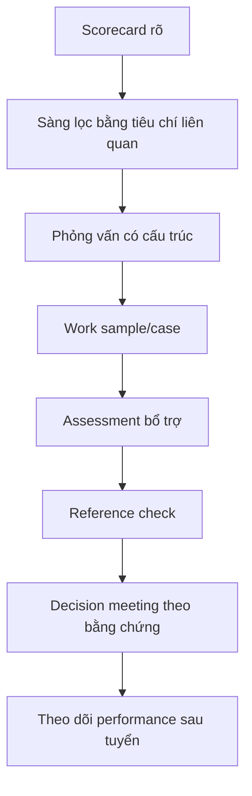

# Tập 22: Đo Lường Tâm Lý, Nhân Cách Và Năng Lực

**Hiểu psychometrics cơ bản, đo nhân cách, năng lực, động lực, giá trị và dùng assessment đúng cách trong tuyển dụng, coaching và phát triển lãnh đạo**  
Giáo trình ngắn gọn cho người trưởng thành, cấp quản lý/C-level

---

## 0. Vì Sao C-level Cần Học Đo Lường Tâm Lý?

### Bản chất

Ở cấp cao, nhiều quyết định lớn là quyết định về con người:

- Tuyển ai
- Thăng chức ai
- Giao quyền cho ai
- Coach ai
- Giữ ai
- Đổi vai ai
- Không nên đặt ai vào vị trí rủi ro cao

Nếu không đo lường, tổ chức thường đánh giá bằng cảm giác.

Cảm giác có giá trị như tín hiệu ban đầu, nhưng rất dễ bị méo bởi:

- Ấn tượng đầu tiên
- Sự tự tin của ứng viên
- Giọng nói, ngoại hình, trường lớp, công ty cũ
- Sự giống mình
- Câu chuyện hay
- Thành tích không rõ đóng góp cá nhân
- Thiên kiến xác nhận

Đo lường tâm lý không làm con người trở thành con số.  
Đo lường tốt giúp ta bớt tự tin sai về con người.

### Một câu cần nhớ

> Đánh giá con người bằng cảm giác là nhanh, nhưng dễ bất công; đo lường tốt là cách làm chậm lại để ra quyết định công bằng hơn.

### Mục tiêu tập này

Sau tập này, bạn cần làm được 5 việc:

| Năng lực | Ý nghĩa thực tế |
|---|---|
| Hiểu psychometrics cơ bản | Biết bài đo nào đáng tin, bài đo nào chỉ là giải trí |
| Đọc độ tin cậy và độ giá trị | Không bị thuyết phục bởi báo cáo đẹp |
| Đo nhân cách, năng lực, động lực, giá trị | Biết mỗi loại đo trả lời câu hỏi nào |
| Dùng assessment trong tuyển dụng/coaching | Kết hợp dữ liệu, phỏng vấn và quan sát hành vi |
| Giữ đạo đức khi đo lường | Không dán nhãn, phân biệt đối xử hoặc xâm phạm riêng tư |

---

## 1. First Principles: Đo Lường Tâm Lý Là Gì?

### Bản chất

Đo lường tâm lý là nỗ lực biến những đặc điểm khó quan sát trực tiếp như năng lực, nhân cách, động lực, giá trị hoặc trạng thái cảm xúc thành dữ liệu có cấu trúc để ra quyết định tốt hơn.

```text
Đo lường tâm lý = Khái niệm rõ + Công cụ phù hợp + Dữ liệu đủ tốt + Diễn giải khiêm tốn + Quyết định có trách nhiệm
```

Không có bài test nào nhìn thấy toàn bộ con người.  
Mỗi bài đo chỉ là một cửa sổ hẹp vào một khía cạnh.

### Mô hình tổng quát


### Câu hỏi gốc

```text
1. Ta đang cần quyết định điều gì?
2. Khái niệm nào thật sự liên quan đến quyết định đó?
3. Công cụ này đo đúng khái niệm đó không?
4. Dữ liệu này đáng tin đến mức nào?
5. Nếu quyết định sai, ai chịu chi phí?
```

---

## 2. Psychometrics Cơ Bản

### Bản chất

Psychometrics là khoa học thiết kế, kiểm tra và diễn giải các công cụ đo tâm lý.

Một bài đo nghiêm túc không chỉ có câu hỏi hay.  
Nó cần bằng chứng rằng điểm số có ý nghĩa, ổn định và liên quan đến điều ta muốn dự báo.

### Năm khái niệm cần biết

| Khái niệm | Nghĩa đơn giản | Câu hỏi C-level cần hỏi |
|---|---|---|
| Construct | Thứ đang muốn đo | Công cụ này đo chính xác cái gì? |
| Item | Câu hỏi/nhiệm vụ trong bài đo | Câu hỏi có đại diện cho construct không? |
| Scale | Cách gom điểm | Điểm cao/thấp nghĩa là gì? |
| Norm | Nhóm chuẩn để so sánh | So với ai? Cùng ngành, cùng cấp, cùng văn hóa không? |
| Error | Sai số đo lường | Điểm này chắc đến mức nào? |

### Nguyên tắc

> Công cụ đo tốt bắt đầu từ câu hỏi đúng, không bắt đầu từ bài test đang có sẵn.

---

## 3. Độ Tin Cậy: Đo Có Ổn Định Không?

### Bản chất

Độ tin cậy trả lời câu hỏi:

> Nếu đo lại trong điều kiện hợp lý, kết quả có nhất quán không?

Một bài đo không đáng tin thì không thể dùng cho quyết định quan trọng, dù báo cáo nhìn chuyên nghiệp.

### Các dạng độ tin cậy

| Dạng | Ý nghĩa | Ví dụ |
|---|---|---|
| Test-retest | Đo lại có giống tương đối không | Nhân cách thường không đổi mạnh sau 2 tuần |
| Internal consistency | Các câu trong cùng thang có đi cùng nhau không | Nhiều câu đo kỷ luật phải cùng hướng |
| Inter-rater | Nhiều người chấm có giống nhau không | Hai interviewer đánh giá case interview gần giống |
| Parallel forms | Hai phiên bản đo có tương đương không | Hai đề năng lực cùng mức khó |

### Sai lầm phổ biến

| Sai lầm | Hậu quả |
|---|---|
| Dùng quiz vui cho quyết định nhân sự | Dữ liệu nhiễu nhưng được đối xử như sự thật |
| Đo trong lúc người làm quá căng thẳng | Điểm phản ánh trạng thái hơn đặc điểm |
| Không chuẩn hóa cách phỏng vấn | Interviewer khác nhau tạo điểm khác nhau |
| Chỉ dùng một lần đo | Dễ bị may rủi, mood, fatigue |

### Câu hỏi kiểm tra

```text
Bài đo này đã có dữ liệu reliability chưa:
Người làm bài có hiểu hướng dẫn giống nhau không:
Môi trường làm bài có công bằng không:
Điểm số có khoảng sai số không:
Ta có đang quyết định quá lớn dựa trên một điểm duy nhất không:
```

---

## 4. Độ Giá Trị: Đo Có Đúng Và Có Ích Không?

### Bản chất

Độ giá trị trả lời câu hỏi:

> Điểm số này có thật sự giúp ta hiểu hoặc dự báo điều cần biết không?

Một bài đo có thể rất ổn định nhưng vẫn vô dụng nếu đo sai thứ.

### Các dạng độ giá trị

| Dạng | Câu hỏi | Ví dụ |
|---|---|---|
| Content validity | Nội dung có đại diện cho việc cần đo không? | Bài test sales phải có tình huống khách hàng thật |
| Construct validity | Có đo đúng khái niệm lý thuyết không? | Thang hướng ngoại không được lẫn với tự tin trình bày |
| Criterion validity | Có liên quan đến kết quả thật không? | Điểm assessment có dự báo performance 6-12 tháng không? |
| Incremental validity | Có thêm giá trị so với dữ liệu đã có không? | Test có giúp hơn CV + interview có cấu trúc không? |
| Face validity | Người làm thấy hợp lý không? | Ứng viên hiểu vì sao bài case liên quan đến vai trò |

### Nguyên tắc

> Độ giá trị không nằm trong bài test một cách tuyệt đối; nó nằm trong cách dùng bài test cho một mục đích cụ thể.

---

## 5. Bốn Thứ Hay Bị Trộn Lẫn: Nhân Cách, Năng Lực, Động Lực, Giá Trị

### Bản chất

Đo lường nhân sự thường sai vì trộn các khái niệm khác nhau.

| Thứ cần đo | Trả lời câu hỏi | Tương đối ổn định? | Cách đo phù hợp |
|---|---|---|---|
| Nhân cách | Người này thường phản ứng thế nào? | Cao | Bảng hỏi chuẩn hóa, quan sát hành vi |
| Năng lực | Người này làm được gì ở mức nào? | Trung bình | Bài test năng lực, work sample, case |
| Động lực | Người này có năng lượng với điều gì? | Trung bình | Phỏng vấn sâu, lịch sử lựa chọn, bài đo động lực |
| Giá trị | Điều gì không thỏa hiệp khi có áp lực? | Cao vừa | Phỏng vấn tình huống, reference, hành vi quá khứ |

### Câu hỏi tách bạch

```text
Đây là người không muốn làm, không biết làm, không hợp cách làm, hay không tin việc này đáng làm?
```

### Ví dụ

| Biểu hiện | Có thể là | Không nên kết luận vội |
|---|---|---|
| Ít nói trong họp | Hướng nội, thiếu an toàn, thiếu chuẩn bị | Không có leadership |
| Làm chậm | Kỷ luật thấp, tiêu chuẩn cao, quá tải | Không có năng lực |
| Hay phản biện | Tư duy độc lập, giá trị mạnh, cái tôi cao | Khó hợp tác |
| Thích thử cái mới | Cởi mở, chán vận hành, tìm thành tựu | Không ổn định |

---

## 6. Big Five: Khung Nhân Cách Có Giá Trị Ứng Dụng Cao

### Bản chất

Big Five là một trong những khung nhân cách được nghiên cứu rộng rãi nhất trong tâm lý học hiện đại.

Nó không chia người thành "type" cứng.  
Nó nhìn nhân cách theo 5 phổ liên tục.

### Năm yếu tố

| Yếu tố | Cao thường | Thấp thường | Câu hỏi dùng người |
|---|---|---|---|
| Openness - Cởi mở | Tò mò, thích mới, chịu mơ hồ | Thực tế, quen ổn định | Vai trò cần đổi mới hay tối ưu? |
| Conscientiousness - Kỷ luật | Có tổ chức, bền bỉ, đáng tin | Linh hoạt, dễ tùy hứng | Vai trò cần độ tin cậy cao không? |
| Extraversion - Hướng ngoại | Năng lượng xã hội, chủ động nói | Tập trung, kín, cần hồi phục một mình | Công việc cần networking mạnh không? |
| Agreeableness - Dễ hợp tác | Mềm, tin người, tránh xung đột | Thẳng, cạnh tranh, khó nhượng bộ | Vai trò cần hòa giải hay thương lượng cứng? |
| Neuroticism - Nhạy cảm cảm xúc | Dễ lo, thấy rủi ro, phản ứng mạnh | Bình tĩnh, ít dao động | Áp lực vai trò cao đến đâu? |

### Lưu ý C-level

- Big Five dùng tốt để hiểu khuynh hướng, không dùng để dán nhãn.
- Điểm cao không luôn tốt, điểm thấp không luôn xấu.
- Fit phụ thuộc vai trò, giai đoạn và văn hóa.
- Nhân cách không thay thế bằng chứng năng lực.

### Nguyên tắc

> Nhân cách nói người đó có xu hướng vận hành thế nào; nó không chứng minh người đó sẽ tạo kết quả gì.

---

## 7. IQ, Cognitive Ability Và Năng Lực Suy Luận

### Bản chất

IQ hoặc cognitive ability đo một phần năng lực xử lý thông tin: suy luận, pattern, trí nhớ làm việc, tốc độ xử lý, ngôn ngữ hoặc định lượng.

Trong nhiều vai trò phức tạp, năng lực nhận thức có liên quan đến khả năng học nhanh, xử lý mơ hồ và giải quyết vấn đề mới.

Nhưng IQ không phải toàn bộ năng lực lãnh đạo.

### IQ giúp dự báo tốt hơn khi

| Bối cảnh | Vì sao hữu ích |
|---|---|
| Vai trò phức tạp cao | Cần học nhanh và xử lý nhiều biến |
| Công việc phân tích | Cần suy luận logic, định lượng, cấu trúc |
| Giai đoạn scale | Cần thiết kế hệ thống, không chỉ xử lý vụ việc |
| Tuyển người ít kinh nghiệm | Thành tích quá khứ chưa đủ dữ liệu |

### IQ không trả lời

- Người này có chính trực không
- Người này có biết hợp tác không
- Người này có chịu trách nhiệm không
- Người này có động lực với vai trò không
- Người này có tạo niềm tin không
- Người này có dùng trí thông minh để phục vụ hay thao túng

### Nguyên tắc

> Năng lực nhận thức giúp người ta hiểu vấn đề nhanh hơn; giá trị và nhân cách quyết định họ dùng sự hiểu đó như thế nào.

---

## 8. EQ: Đo Cảm Xúc Nhưng Đừng Biến Thành Khẩu Hiệu

### Bản chất

EQ thường được dùng để nói về khả năng nhận diện, hiểu, điều chỉnh cảm xúc của mình và tương tác tốt với cảm xúc của người khác.

Khái niệm này hữu ích trong lãnh đạo, nhưng dễ bị dùng quá rộng đến mức mất nghĩa.

### Các thành phần thực dụng

| Thành phần | Biểu hiện quan sát được |
|---|---|
| Tự nhận thức | Biết mình đang bị kích hoạt bởi điều gì |
| Tự điều chỉnh | Không trút phản ứng thô lên người khác |
| Đọc người | Nhận ra cảm xúc, nhu cầu, lo ngại phía sau lời nói |
| Đồng cảm có ranh giới | Hiểu người khác mà không mất tiêu chuẩn |
| Giao tiếp khó | Nói sự thật mà không làm nhục người nghe |

### Rủi ro khi dùng EQ sai

| Cách dùng sai | Hậu quả |
|---|---|
| Gọi người dễ chịu là EQ cao | Nhầm hòa khí với trưởng thành |
| Gọi người thẳng là EQ thấp | Phạt người nói sự thật |
| Dùng EQ để yêu cầu chịu đựng độc hại | Biến cảm xúc thành công cụ kiểm soát |
| Chỉ dùng tự đánh giá | Người thiếu tự nhận thức thường tự chấm sai |

### Câu hỏi tốt hơn

```text
Khi bị áp lực, người này xử lý cảm xúc thế nào?
Khi nhận feedback khó, họ phản ứng ra sao?
Khi người khác bất đồng, họ có nghe được không?
Họ có thể vừa đồng cảm vừa giữ tiêu chuẩn không?
```

---

## 9. Đo Động Lực: Năng Lượng Đến Từ Đâu?

### Bản chất

Động lực không chỉ là "có nhiệt huyết".  
Động lực là thứ khiến một người tự nhiên muốn bỏ công, chịu khó và lặp lại hành vi.

### Các nhóm động lực thường gặp

| Động lực | Phù hợp với | Rủi ro khi lệch |
|---|---|---|
| Thành tựu | Vai trò có mục tiêu rõ, cạnh tranh lành mạnh | Chạy số bất chấp hệ quả |
| Học hỏi | Vai trò mới, nhiều mơ hồ | Chán vận hành lặp lại |
| Tự chủ | Vai trò cần ownership | Khó chịu với kiểm soát chặt |
| An toàn | Vận hành ổn định, tuân thủ | Ngại thay đổi |
| Ảnh hưởng | Lãnh đạo, bán hàng, truyền thông | Chính trị, thích kiểm soát |
| Sứ mệnh | Việc dài hạn, khó, có ý nghĩa | Thất vọng mạnh khi tổ chức lệch giá trị |
| Công nhận | Vai trò cần hiện diện xã hội | Dễ bị phụ thuộc vào khen/chê |

### Cách đo thực dụng

```text
1. Hỏi lịch sử lựa chọn: họ đã tự chọn việc gì khi không bị ép?
2. Hỏi chi phí: họ từng chịu khổ vì điều gì?
3. Hỏi năng lượng: việc gì làm họ quên thời gian?
4. Hỏi phàn nàn: điều gì làm họ mất năng lượng nhanh nhất?
5. Đối chiếu với hành vi thật, không chỉ lời nói.
```

---

## 10. Đo Giá Trị: Điều Gì Không Thỏa Hiệp?

### Bản chất

Giá trị không phải là những từ đẹp trên slide.

Giá trị là thứ một người vẫn chọn khi có áp lực, cám dỗ hoặc chi phí.

### Cách nhận diện giá trị thật

| Dữ liệu | Câu hỏi |
|---|---|
| Quyết định khó trong quá khứ | Khi phải chọn giữa kết quả và nguyên tắc, họ đã làm gì? |
| Cách xử lý quyền lực | Khi có quyền hơn người khác, họ đối xử thế nào? |
| Cách kiếm thành tích | Họ đạt kết quả bằng cách làm hệ thống mạnh lên hay yếu đi? |
| Người họ chọn đi cùng | Họ dung nạp kiểu hành vi nào? |
| Điều họ không chịu được | Họ phản ứng mạnh với loại sai lệch nào? |

### Điểm đỏ giá trị

- Hợp lý hóa việc thiếu minh bạch
- Coi thường người yếu thế
- Đổ lỗi xuống dưới, nhận công lên trên
- Nói một đằng, thưởng một nẻo
- Xem con người chỉ là phương tiện đạt KPI
- Thành tích cao nhưng để lại tổn hại văn hóa

### Nguyên tắc

> Giá trị không được đo bằng điều một người tuyên bố; giá trị được đo bằng điều họ chọn khi phải trả giá.

---

## 11. Assessment Trong Tuyển Dụng

### Bản chất

Tuyển dụng tốt không phải là tìm người gây ấn tượng nhất.  
Tuyển dụng tốt là tăng xác suất chọn người phù hợp nhất với vai trò, giai đoạn và tiêu chuẩn văn hóa.

### Bộ assessment nên kết hợp

| Công cụ | Đo tốt | Rủi ro |
|---|---|---|
| Scorecard vai trò | Kết quả và tiêu chuẩn cần đạt | Viết chung chung |
| Phỏng vấn có cấu trúc | So sánh công bằng giữa ứng viên | Interviewer không tuân thủ |
| Work sample/case | Năng lực làm việc gần thực tế | Case xa vai trò thật |
| Cognitive test | Học nhanh, suy luận | Dùng như tiêu chí duy nhất |
| Personality assessment | Khuynh hướng làm việc | Dán nhãn hoặc loại người máy móc |
| Reference check | Hành vi quá khứ | Hỏi quá hời hợt |

### Quy trình gợi ý



### Nguyên tắc

> Assessment trong tuyển dụng phải phục vụ quyết định tuyển đúng hơn, không phục vụ cảm giác kiểm soát hơn.

---

## 12. Assessment Trong Coaching Và Phát Triển Lãnh Đạo

### Bản chất

Trong coaching, assessment không nên dùng để kết luận "bạn là ai".  
Nó nên dùng để mở đối thoại về pattern, điểm mạnh, điểm mù và hành vi cần thử.

### Dùng assessment tốt trong coaching

| Bước | Cách làm |
|---|---|
| Làm rõ mục tiêu | Đo để phục vụ mục tiêu phát triển nào? |
| Giải thích giới hạn | Đây là dữ liệu gợi ý, không phải bản án |
| Kết hợp phản hồi 360 | So điểm tự nhận với cách người khác trải nghiệm |
| Chuyển thành hành vi | Mỗi insight phải có hành động thử trong 2-4 tuần |
| Review bằng kết quả thật | Người khác có thấy hành vi thay đổi không? |

### Câu hỏi coaching sau assessment

```text
Kết quả nào bạn thấy đúng nhất?
Kết quả nào bạn không đồng ý?
Người xung quanh sẽ xác nhận phần nào?
Điểm mạnh nào đang bị dùng quá mức?
Trong 2 tuần tới, bạn muốn thử hành vi cụ thể nào?
```

---

## 13. MBTI Và Quiz Đại Chúng: Hữu Ích Đến Đâu, Rủi Ro Đến Đâu?

### Bản chất

MBTI và nhiều quiz đại chúng có thể hữu ích như ngôn ngữ tự phản tư nhẹ, giúp người ta bắt đầu nói về khác biệt cá nhân.

Nhưng chúng có rủi ro cao nếu được dùng như công cụ tuyển dụng, thăng chức hoặc đánh giá năng lực.

### Rủi ro chính

| Rủi ro | Hậu quả |
|---|---|
| Chia người thành type cứng | Làm mất sự phức tạp và khả năng phát triển |
| Hiệu ứng Barnum | Mô tả chung chung nhưng ai cũng thấy đúng |
| Tự dán nhãn | "Tôi là kiểu này nên tôi không làm việc kia" |
| Thiên kiến tuyển dụng | Loại người vì type thay vì năng lực thật |
| Độ tin cậy/giá trị yếu cho quyết định lớn | Tạo vẻ khoa học giả |

### Cách dùng an toàn hơn

```text
Dùng để mở đối thoại, không dùng để chốt quyết định.
Dùng như giả thuyết, không dùng như định danh.
Không đưa vào tiêu chí tuyển dụng.
Không dùng type để giới hạn cơ hội.
Luôn đối chiếu với hành vi và kết quả thật.
```

### Nguyên tắc

> Quiz đại chúng có thể giúp người ta nói chuyện dễ hơn, nhưng không đủ để quyết định số phận nghề nghiệp của ai.

---

## 14. Tránh Đánh Giá Bằng Cảm Giác

### Bản chất

Cảm giác của lãnh đạo thường đến từ kinh nghiệm thật, nhưng nó không miễn nhiễm với thiên kiến.

Vấn đề không phải là bỏ trực giác.  
Vấn đề là bắt trực giác trình bày bằng chứng.

### Các thiên kiến hay gặp

| Thiên kiến | Biểu hiện |
|---|---|
| Halo effect | Một điểm tốt làm mọi thứ có vẻ tốt |
| Similarity bias | Thích người giống mình |
| Confidence bias | Nhầm tự tin với năng lực |
| Confirmation bias | Chỉ tìm dữ liệu xác nhận ấn tượng đầu |
| Recency bias | Bị ảnh hưởng bởi sự kiện gần nhất |
| Narrative bias | Tin câu chuyện mạch lạc hơn dữ liệu rời rạc |

### Công cụ: Tách cảm giác khỏi bằng chứng

```text
Ấn tượng ban đầu của tôi:
Bằng chứng hành vi hỗ trợ ấn tượng này:
Bằng chứng chống lại ấn tượng này:
Tôi đang thích/khó chịu vì điểm gì:
Tiêu chí scorecard liên quan là gì:
Người khác nhìn dữ liệu này có thể kết luận khác không:
Quyết định sẽ đổi không nếu bỏ tên, tuổi, trường, công ty cũ:
```

---

## 15. Đạo Đức Khi Đo Lường Con Người

### Bản chất

Đo lường con người luôn có quyền lực.  
Người bị đo có thể mất cơ hội, mất niềm tin, bị dán nhãn hoặc bị đối xử bất công.

Vì vậy, assessment cần đạo đức ngang với kỹ thuật.

### Nguyên tắc đạo đức

| Nguyên tắc | Câu hỏi kiểm tra |
|---|---|
| Mục đích rõ | Đo để làm gì? Người bị đo có biết không? |
| Liên quan vai trò | Thứ đo có liên quan đến quyết định không? |
| Consent | Người làm có hiểu và đồng ý trong phạm vi rõ không? |
| Privacy | Dữ liệu nào được lưu, ai xem, lưu bao lâu? |
| Công bằng | Công cụ có bất lợi cho nhóm nào không? |
| Không dán nhãn | Kết quả có được trình bày như giả thuyết không? |
| Quyền phản hồi | Người bị đo có cơ hội hiểu và phản hồi không? |
| Trách nhiệm | Ai chịu trách nhiệm nếu công cụ gây hại? |

### Những việc không nên làm

- Dùng bài test không liên quan để loại ứng viên
- Ép nhân sự chia sẻ dữ liệu tâm lý nhạy cảm không cần thiết
- Công khai kết quả cá nhân trước nhóm
- Dùng điểm số để làm nhục hoặc kiểm soát
- Dán nhãn người khác bằng một type
- Xem assessment là sự thật cuối cùng

### Nguyên tắc

> Đo lường có đạo đức là đo ít nhất đủ dùng, giải thích rõ, bảo vệ dữ liệu và không biến điểm số thành định mệnh.

---

## 16. Công Cụ Thực Hành

### Công cụ 1: Assessment Decision Canvas

```text
Quyết định cần hỗ trợ:
Vai trò/bối cảnh:
Khái niệm cần đo:
Công cụ dự kiến:
Bằng chứng reliability:
Bằng chứng validity:
Nhóm chuẩn so sánh:
Dữ liệu bổ sung cần có:
Rủi ro sai lệch/công bằng:
Ai được xem kết quả:
Quyết định nào không được phép dựa riêng vào điểm này:
```

### Công cụ 2: Scorecard đo người

```text
Tên/vai trò:
Kết quả cần đạt:
Năng lực bắt buộc:
Năng lực nên có:
Nhân cách phù hợp với vai trò:
Động lực phù hợp:
Giá trị không thỏa hiệp:
Bằng chứng từ phỏng vấn:
Bằng chứng từ work sample:
Bằng chứng từ assessment:
Bằng chứng từ reference:
Khoảng chưa chắc:
Quyết định và lý do:
```

### Công cụ 3: Checklist chọn bài assessment

```text
Công cụ này đo construct nào:
Có tài liệu kỹ thuật không:
Reliability có đủ dùng không:
Validity cho mục đích này có bằng chứng không:
Norm có phù hợp văn hóa/cấp bậc/ngành không:
Bài đo có liên quan trực tiếp đến vai trò không:
Người làm có được giải thích mục đích không:
Dữ liệu được bảo vệ thế nào:
Kết quả có được diễn giải bởi người có năng lực không:
```

### Công cụ 4: Mẫu debrief kết quả assessment

```text
Đây là dữ liệu gợi ý, không phải định nghĩa con người bạn.
Kết quả nên được đọc cùng hành vi, bối cảnh và phản hồi từ người khác.
Phần có vẻ đúng:
Phần cần kiểm chứng:
Điểm mạnh nên dùng có ý thức:
Điểm mạnh có thể bị dùng quá mức:
Một hành vi thử trong 2 tuần tới:
Cách đo thay đổi:
```

---

## 17. Lộ Trình Thực Hành 4 Tuần

### Tuần 1: Audit cách tổ chức đang đánh giá người

Mục tiêu:

- Nhìn rõ nơi nào đang dùng cảm giác thay cho bằng chứng.

Bài tập:

- Chọn 3 quyết định nhân sự gần đây: tuyển, thăng chức, đổi vai.
- Viết lại bằng chứng đã dùng cho từng quyết định.
- Đánh dấu phần nào là dữ liệu, phần nào là ấn tượng.

### Tuần 2: Làm rõ scorecard và construct

Mục tiêu:

- Không đo khi chưa biết mình cần đo gì.

Bài tập:

- Chọn 1 vai trò quan trọng.
- Viết scorecard kết quả, năng lực, nhân cách, động lực, giá trị.
- Tách rõ thứ nào phải đo bằng test, thứ nào phải đo bằng work sample, thứ nào phải đo bằng phỏng vấn.

### Tuần 3: Kiểm tra công cụ assessment

Mục tiêu:

- Loại bỏ công cụ đẹp nhưng yếu.

Bài tập:

- Chọn 1 bài assessment đang dùng hoặc định dùng.
- Hỏi vendor/tài liệu về reliability, validity, norm và privacy.
- Quyết định: giữ, dùng giới hạn, thay thế hoặc bỏ.

### Tuần 4: Thiết kế quy trình dùng dữ liệu có trách nhiệm

Mục tiêu:

- Biến assessment thành một phần của hệ thống ra quyết định công bằng.

Bài tập:

- Tạo checklist trước khi dùng assessment.
- Quy định không quyết định tuyển/thăng chức chỉ bằng một điểm số.
- Thiết kế mẫu debrief kết quả cho ứng viên hoặc nhân sự.
- Theo dõi kết quả thật sau 3-6 tháng để kiểm tra chất lượng dự báo.

---

## 18. Bảng Tóm Tắt First Principles

| Chủ đề | Bản chất | Câu hỏi áp dụng |
|---|---|---|
| Đo lường tâm lý | Biến đặc điểm khó thấy thành dữ liệu có cấu trúc | Ta cần quyết định gì và đo để phục vụ quyết định nào? |
| Psychometrics | Khoa học về chất lượng công cụ đo | Bài đo này có bằng chứng kỹ thuật không? |
| Construct | Khái niệm cần đo | Ta đang đo đúng thứ hay đo thứ dễ đo? |
| Reliability | Độ ổn định của điểm số | Nếu đo lại, kết quả có nhất quán không? |
| Validity | Điểm số có ý nghĩa và hữu ích cho mục đích này | Nó có dự báo hoặc giải thích điều ta cần không? |
| Norm | Nhóm chuẩn để so sánh | Người này đang được so với ai? |
| Nhân cách | Khuynh hướng phản ứng ổn định | Khuynh hướng này fit vai trò nào? |
| Năng lực | Khả năng tạo kết quả trong điều kiện thật | Người này làm được gì, ở mức nào? |
| Động lực | Nguồn năng lượng hành động | Người này tự nhiên chịu khó vì điều gì? |
| Giá trị | Điều không thỏa hiệp khi có áp lực | Khi phải trả giá, họ chọn điều gì? |
| Big Five | Năm phổ nhân cách liên tục | Điểm mạnh này thành rủi ro khi nào? |
| IQ/cognitive ability | Năng lực xử lý thông tin và học vấn đề mới | Vai trò có đủ phức tạp để cần đo yếu tố này không? |
| EQ | Năng lực nhận diện và điều chỉnh cảm xúc trong quan hệ | Khi áp lực, người này xử lý cảm xúc thế nào? |
| Assessment tuyển dụng | Tăng xác suất chọn đúng người | Công cụ này thêm bằng chứng gì so với phỏng vấn? |
| Assessment coaching | Mở đối thoại phát triển | Insight này chuyển thành hành vi nào? |
| Đạo đức đo lường | Đo có mục đích, công bằng, bảo mật và không dán nhãn | Điểm số này có thể làm hại ai nếu dùng sai? |

---

## 19. Một Câu Để Nhớ Toàn Bộ Tập 22

> Đo lường con người đúng cách không phải để đóng khung họ, mà để ra quyết định khiêm tốn hơn, công bằng hơn và có trách nhiệm hơn.

