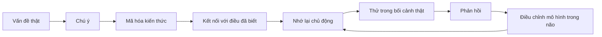

# Tập 23: Khoa Học Học Tập, Trí Nhớ Và Thay Đổi Nhận Thức

**Hiểu não học thế nào, trí nhớ, quên, retrieval practice, spaced repetition, interleaving, elaboration, teaching-to-learn và cách biến kiến thức thành hành vi trong tổ chức**  
Giáo trình ngắn gọn cho người trưởng thành, cấp quản lý/C-level

---

## 0. Vì Sao C-level Cần Học Khoa Học Học Tập?

### Bản chất

Tổ chức không lớn lên chỉ vì có thêm thông tin.  
Tổ chức lớn lên khi con người **học đúng điều, nhớ đủ lâu, dùng được trong tình huống thật và thay đổi hành vi**.

Ở cấp cao, thất bại học tập thường không đến từ thiếu khóa học.  
Nó đến từ cách thiết kế học sai:

- Học quá nhiều, nhớ quá ít
- Nghe xong thấy hay, nhưng không đổi hành vi
- Đào tạo một lần, kỳ vọng tác động lâu dài
- Dạy theo phòng ban, nhưng công việc thật đòi hỏi phối hợp
- Đo số giờ học, không đo năng lực dùng được
- Nhầm "đã hiểu" với "đã thành thạo"
- Nhầm truyền đạt thông tin với xây năng lực

Khoa học học tập giúp lãnh đạo thiết kế tổ chức biết học, không chỉ tổ chức biết họp.

### Một câu cần nhớ

> Học thật không phải là tiếp xúc với thông tin; học thật là não có thể lấy lại, dùng lại và điều chỉnh hành vi trong bối cảnh thật.

### Mục tiêu tập này

| Năng lực | Ý nghĩa thực tế |
|---|---|
| Hiểu não học thế nào | Không thiết kế đào tạo ngược với sinh học |
| Hiểu trí nhớ và quên | Không kỳ vọng con người nhớ chỉ vì đã nghe |
| Dùng retrieval practice | Tăng nhớ bằng cách bắt não nhớ lại |
| Dùng spaced repetition | Chống quên bằng lịch nhắc lại thông minh |
| Dùng interleaving | Tăng khả năng phân biệt và ứng dụng |
| Dùng elaboration | Biến kiến thức rời rạc thành hiểu sâu |
| Teaching-to-learn | Xây năng lực qua việc giải thích cho người khác |
| Chuyển kiến thức thành hành vi | Thiết kế học gắn với công việc thật |
| Thiết kế đào tạo nội bộ | Xây chương trình có tác động, không chỉ có slide |
| Xây văn hóa học tập | Làm học trở thành cách vận hành của tổ chức |

---

## 1. First Principles: Học Là Gì?

### Bản chất

Học là quá trình hệ thần kinh thay đổi dự đoán, ký ức, kỹ năng và hành vi dựa trên trải nghiệm, phản hồi và lặp lại.

```text
Học = Chú ý + Mã hóa + Liên kết + Nhớ lại + Phản hồi + Lặp lại + Ứng dụng
```

Nếu chỉ đưa nội dung vào đầu, đó mới là tiếp xúc.  
Nếu não có thể lấy ra đúng lúc và dùng để hành động tốt hơn, đó mới là học.

### Mô hình gốc



### Câu hỏi gốc

```text
1. Người học cần làm tốt hơn việc gì trong công việc thật?
2. Kiến thức nào phải nhớ, kỹ năng nào phải luyện, thái độ nào phải đổi?
3. Họ có cơ hội nhớ lại chủ động không?
4. Họ có dùng kiến thức trong tình huống thật không?
5. Hệ thống có phản hồi đủ nhanh để não sửa mô hình không?
```

---

## 2. Não Học Thế Nào?

### Bản chất

Não học bằng cách thay đổi kết nối thần kinh khi một mẫu được chú ý, lặp lại, có ý nghĩa và được phản hồi.

Não không ghi lại bài giảng như máy quay.  
Não chọn lọc, nén, diễn giải, liên kết và dự đoán.

### Bốn điều não cần

| Điều kiện | Vì sao quan trọng | Ứng dụng trong đào tạo |
|---|---|---|
| Chú ý | Không chú ý thì mã hóa yếu | Học ngắn, ít nhiễu, có vấn đề thật |
| Ý nghĩa | Não nhớ thứ liên quan đến mục tiêu | Gắn bài học với quyết định và KPI |
| Nỗ lực vừa đủ | Khó vừa phải giúp học sâu | Có bài tập nhớ lại, tình huống, phản biện |
| Phản hồi | Não cần biết đúng/sai ở đâu | Review nhanh, ví dụ tốt/xấu, sửa ngay |

### Điều lãnh đạo cần tránh

- Nhồi nội dung dài không có thực hành
- Chỉ trình bày slide mà không bắt người học xử lý
- Biến đào tạo thành sự kiện một lần
- Đánh giá học bằng mức độ hài lòng
- Không cho người học sai trong môi trường an toàn

### Nguyên tắc

> Não không học tốt khi chỉ nghe thụ động. Não học tốt khi phải dự đoán, nhớ lại, giải thích, thử và nhận phản hồi.

---

## 3. Trí Nhớ: Không Phải Kho Lưu Trữ Cố Định

### Bản chất

Trí nhớ không giống một tủ hồ sơ.  
Trí nhớ là khả năng tái dựng thông tin từ dấu vết, ngữ cảnh và liên kết.

Vì vậy, trí nhớ có thể:

- Bị méo bởi cảm xúc
- Phụ thuộc vào bối cảnh
- Mạnh lên khi được nhớ lại
- Yếu đi khi chỉ được đọc lại
- Tốt hơn khi có nhiều đường liên kết

### Ba tầng trí nhớ cần hiểu

| Tầng | Vai trò | Rủi ro trong công việc |
|---|---|---|
| Working memory | Giữ thông tin ngắn hạn để xử lý | Quá tải khi họp dài, slide dày |
| Long-term memory | Lưu kiến thức, mô hình, kỹ năng | Không hình thành nếu không lặp lại |
| Procedural memory | Kỹ năng tự động hóa qua luyện tập | Không có nếu chỉ học lý thuyết |

### Ứng dụng cho C-level

Khi một chương trình đào tạo chỉ đưa thông tin vào working memory, người học có thể thấy "dễ hiểu" trong phòng học.  
Nhưng nếu không chuyển sang long-term memory và procedural memory, họ sẽ không dùng được khi áp lực thật xuất hiện.

---

## 4. Quên: Lỗi Hay Cơ Chế?

### Bản chất

Quên không chỉ là thất bại.  
Quên là cơ chế giúp não tiết kiệm năng lượng và giảm nhiễu.

Não thường quên nhanh những thứ:

- Không được dùng lại
- Không có ý nghĩa cá nhân
- Không gắn với vấn đề thật
- Không có cảm xúc hoặc hậu quả
- Không được nhớ lại chủ động
- Bị học trong trạng thái quá tải

### Đường cong quên


### Nguyên tắc

> Nếu chương trình học không thiết kế chống quên, nó đang mặc định cho phép phần lớn nội dung biến mất.

---

## 5. Retrieval Practice: Học Bằng Cách Nhớ Lại

### Bản chất

Retrieval practice là luyện lấy thông tin ra khỏi trí nhớ, không phải chỉ đưa thông tin vào.

Đọc lại tạo cảm giác quen.  
Nhớ lại tạo năng lực dùng được.

### Ví dụ

| Cách yếu | Cách mạnh hơn |
|---|---|
| Đọc lại slide | Đóng slide và viết 5 ý chính |
| Nghe trainer giải thích | Tự giải thích lại bằng lời của mình |
| Làm quiz để chấm điểm | Làm quiz để phát hiện lỗ hổng |
| Hỏi "mọi người hiểu chưa?" | Hỏi "hãy nêu 1 tình huống dùng được tuần này" |

### Công cụ: 5 phút nhớ lại

```text
Chủ đề vừa học:
Ba ý chính tôi nhớ được:
Một ví dụ từ công việc thật:
Một điểm tôi còn mơ hồ:
Một hành động tôi sẽ thử trong 48 giờ:
```

### Nguyên tắc

> Muốn biết một người đã học chưa, đừng hỏi họ có nhận ra nội dung không. Hãy xem họ có tự lấy ra và dùng được không.

---

## 6. Spaced Repetition: Lặp Lại Có Khoảng Cách

### Bản chất

Spaced repetition là nhắc lại kiến thức qua nhiều lần cách nhau đủ xa để não phải nỗ lực nhớ lại.

Nhắc lại quá sớm thì dễ nhưng học nông.  
Nhắc lại quá muộn thì mất dấu.  
Khoảng cách tốt tạo nỗ lực vừa đủ.

### Lịch đơn giản cho doanh nghiệp

| Thời điểm | Hoạt động | Mục tiêu |
|---|---|---|
| Ngày 0 | Học khái niệm và ví dụ | Hiểu khung |
| Ngày 1 | Quiz 5 câu hoặc nhớ lại 5 phút | Chống quên sớm |
| Ngày 3 | Case ngắn | Gắn với bối cảnh |
| Ngày 7 | Áp dụng vào một việc thật | Chuyển sang hành vi |
| Ngày 14 | Peer review | Sửa sai và mở rộng |
| Ngày 30 | Retrospective | Củng cố thành chuẩn |

### Câu hỏi thiết kế

```text
Nội dung nào đáng nhớ sau 30 ngày:
Lần nhắc lại đầu tiên diễn ra khi nào:
Ai chịu trách nhiệm nhắc:
Nhắc bằng quiz, case, 1-1 hay công việc thật:
Dữ liệu nào cho thấy người học còn nhớ:
```

---

## 7. Interleaving: Học Xen Kẽ Để Biết Phân Biệt

### Bản chất

Interleaving là học xen kẽ nhiều loại bài, tình huống hoặc kỹ năng liên quan thay vì luyện một dạng duy nhất quá lâu.

Luyện một dạng giúp cảm giác tiến bộ nhanh.  
Luyện xen kẽ giúp nhận ra khi nào dùng cách nào.

### Ví dụ trong tổ chức

| Chủ đề | Học theo cụm dễ | Học xen kẽ tốt hơn |
|---|---|---|
| Sales | 10 case cùng loại khách | Xen kẽ khách lạnh, khách nghi ngờ, khách ép giá |
| Leadership | Chỉ học feedback | Xen kẽ feedback, coaching, ra quyết định, xử lý xung đột |
| Tài chính | Chỉ đọc P&L | Xen kẽ P&L, cash flow, unit economics |
| Product | Chỉ học discovery | Xen kẽ discovery, prioritization, trade-off, launch |

### Nguyên tắc

> Người giỏi không chỉ biết một kỹ thuật. Người giỏi biết lúc nào kỹ thuật đó phù hợp và lúc nào không.

---

## 8. Elaboration: Hiểu Sâu Bằng Kết Nối

### Bản chất

Elaboration là làm kiến thức sâu hơn bằng cách hỏi "vì sao", "liên quan gì", "ví dụ nào", "ngoại lệ nào" và "dùng ở đâu".

Não nhớ tốt hơn khi kiến thức có nhiều móc nối.

### Câu hỏi elaboration

```text
Khái niệm này giải quyết vấn đề gì?
Nó giống điều gì tôi đã biết?
Nó khác điều gì dễ nhầm?
Ví dụ thật trong công ty là gì?
Khi nào nó không đúng?
Nếu áp dụng sai, rủi ro là gì?
```

### Bảng phân biệt

| Mức học | Biểu hiện | Câu hỏi kiểm tra |
|---|---|---|
| Nhận biết | Nghe quen | Tôi có định nghĩa được không? |
| Hiểu | Giải thích được | Tôi có ví dụ riêng không? |
| Phân biệt | Biết dùng khi nào | Tôi có thấy ngoại lệ không? |
| Ứng dụng | Làm khác đi | Hành vi tuần này đổi gì? |
| Dạy lại | Truyền được cho người khác | Người nghe có làm được không? |

---

## 9. Teaching-to-Learn: Dạy Để Học

### Bản chất

Khi phải dạy lại, não buộc phải tổ chức kiến thức rõ hơn, phát hiện lỗ hổng và tìm ví dụ dễ hiểu.

Dạy lại không có nghĩa là biến mọi người thành trainer.  
Dạy lại là cơ chế học sâu.

### Cách dùng trong doanh nghiệp

| Hoạt động | Cách làm |
|---|---|
| 10 phút teach-back | Sau buổi học, mỗi nhóm dạy lại một nguyên tắc |
| Peer demo | Nhân sự trình bày cách áp dụng vào case thật |
| Brown bag | Một người chia sẻ bài học từ dự án |
| Manager cascade | Cấp quản lý dạy lại cho team bằng ví dụ của team |
| Playbook nội bộ | Người học viết lại thành quy trình ngắn |

### Checklist dạy lại

- [ ] Tôi giải thích được bằng ngôn ngữ đơn giản
- [ ] Tôi có ví dụ thật, không chỉ định nghĩa
- [ ] Tôi nêu được lỗi thường gặp
- [ ] Tôi chỉ ra khi nào không nên dùng
- [ ] Người nghe có bước hành động cụ thể

---

## 10. Chuyển Kiến Thức Thành Hành Vi

### Bản chất

Biết không tự động thành làm.  
Từ kiến thức đến hành vi cần bối cảnh, tín hiệu, ma sát thấp, cơ hội luyện và phản hồi.

```text
Kiến thức -> Ý định -> Hành động nhỏ -> Phản hồi -> Lặp lại -> Thói quen/năng lực
```

### Bảng chuyển hóa

| Nếu chỉ có | Thường xảy ra | Cần thêm |
|---|---|---|
| Khái niệm | Hiểu nhưng quên | Retrieval và spaced repetition |
| Ý định | Muốn nhưng không làm | Prompt và next action |
| Bài tập lớp học | Làm được trong lớp | Case công việc thật |
| Cam kết miệng | Trôi theo việc cũ | Follow-up và accountability |
| KPI cuối | Áp lực nhưng mơ hồ | Chỉ số hành vi dẫn trước |

### Công cụ: Bản đồ chuyển hành vi

```text
Kiến thức mới:
Hành vi cụ thể cần đổi:
Bối cảnh xảy ra hành vi:
Tín hiệu nhắc hành động:
Bước đầu tiên dưới 5 phút:
Ai quan sát hoặc phản hồi:
Khi nào review:
Chỉ số dẫn trước:
```

---

## 11. Học Cho Người Lớn

### Bản chất

Người lớn học tốt khi thấy liên quan đến vấn đề thật, có quyền tự chủ, được tôn trọng kinh nghiệm và có thể áp dụng ngay.

Người 40 tuổi/C-level không thiếu thông tin.  
Họ thiếu thời gian, thiếu phản hồi trung thực và thiếu không gian thử cách nghĩ mới mà không mất thể diện.

### Nguyên tắc học cho người lớn

| Nguyên tắc | Ứng dụng |
|---|---|
| Bắt đầu từ vấn đề thật | Dùng case của chính công ty |
| Tôn trọng kinh nghiệm | Cho người học so sánh với thực tế của họ |
| Tự chủ | Cho lựa chọn bài tập, case, mức thử nghiệm |
| Ứng dụng nhanh | Có hành động trong 48 giờ |
| Phản hồi ngang hàng | Dùng peer review, không chỉ trainer |
| An toàn tâm lý | Cho phép nói "tôi chưa biết" |

### Câu hỏi cho C-level

```text
Tôi đang học điều này để giải quyết quyết định nào?
Nếu hiểu đúng, lịch làm việc tuần này sẽ đổi gì?
Tôi cần bỏ niềm tin cũ nào?
Ai có thể phản hồi khi tôi thử hành vi mới?
```

---

## 12. Thay Đổi Nhận Thức

### Bản chất

Thay đổi nhận thức là thay đổi mô hình bên trong mà con người dùng để hiểu sự việc, dự đoán hệ quả và chọn hành động.

Con người không đổi nhận thức chỉ vì nghe một lập luận hay.  
Họ đổi khi mô hình cũ không còn giải thích được thực tế, và mô hình mới vừa hợp lý vừa dùng được.

### Ba lớp cần đổi

| Lớp | Câu hỏi | Ví dụ |
|---|---|---|
| Niềm tin | Tôi tin điều gì là đúng? | "Người giỏi không cần được nhắc" |
| Mô hình | Tôi giải thích sự việc thế nào? | "Lỗi là do thái độ, không phải hệ thống" |
| Hành vi | Tôi làm gì theo niềm tin đó? | Ít feedback, chỉ can thiệp khi có vấn đề |

### Công cụ: Kiểm tra mô hình cũ

```text
Niềm tin hiện tại:
Bằng chứng ủng hộ:
Bằng chứng chống lại:
Chi phí nếu tiếp tục tin như vậy:
Mô hình mới thực dụng hơn:
Thử nghiệm nhỏ để kiểm tra:
```

---

## 13. Thiết Kế Đào Tạo Nội Bộ

### Bản chất

Đào tạo nội bộ tốt không bắt đầu từ câu "nên dạy gì".  
Nó bắt đầu từ câu "sau đào tạo, con người phải làm khác đi điều gì".

### Khung thiết kế

| Bước | Câu hỏi | Sản phẩm đầu ra |
|---|---|---|
| 1. Năng lực | Cần làm tốt việc gì? | Danh sách hành vi quan sát được |
| 2. Khoảng cách | Hiện đang yếu ở đâu? | Dữ liệu, case, lỗi lặp lại |
| 3. Nội dung | Cần biết gì để làm? | Khái niệm tối thiểu |
| 4. Luyện tập | Luyện trong tình huống nào? | Case, role-play, project |
| 5. Nhớ lại | Nhắc lại ra sao? | Quiz, teach-back, review |
| 6. Phản hồi | Ai sửa và sửa lúc nào? | Manager, mentor, peer |
| 7. Đo lường | Biết đổi thật bằng gì? | Chỉ số hành vi và kết quả |

### Checklist trước khi mở lớp

- [ ] Có hành vi đích rõ ràng
- [ ] Có case thật của công ty
- [ ] Nội dung không quá tải working memory
- [ ] Có retrieval practice trong buổi học
- [ ] Có lịch spaced repetition sau buổi học
- [ ] Có bài tập áp dụng trong 48 giờ
- [ ] Manager biết cách follow-up
- [ ] Có chỉ số đo hành vi, không chỉ đo hài lòng

---

## 14. Đo Lường Học Tập

### Bản chất

Không đo học tập bằng số giờ học hoặc điểm hài lòng.  
Đo học tập bằng khả năng nhớ lại, phân biệt, ứng dụng và tạo kết quả trong công việc.

### Bốn tầng đo

| Tầng | Đo gì | Ví dụ |
|---|---|---|
| Nhớ | Có lấy lại được không? | Quiz không mở tài liệu |
| Hiểu | Có giải thích được không? | Teach-back bằng case riêng |
| Ứng dụng | Có làm khác đi không? | Manager feedback theo mẫu mới |
| Kết quả | Hành vi mới tạo tác động gì? | Giảm lỗi, tăng tốc, tăng chất lượng |

### Cạm bẫy đo lường

- Điểm hài lòng cao nhưng hành vi không đổi
- Người học nhớ định nghĩa nhưng không xử lý được case
- Chỉ đo cuối khóa, không đo sau 30 ngày
- Chỉ hỏi người học, không hỏi quản lý trực tiếp
- Đo quá nhiều chỉ số nhưng không dùng để cải tiến

---

## 15. Văn Hóa Học Tập

### Bản chất

Văn hóa học tập không phải là công ty có nhiều khóa học.  
Văn hóa học tập là nơi con người nói thật về điều chưa biết, thử nghiệm nhỏ, phản hồi nhanh và cập nhật mô hình khi thực tế thay đổi.

### Dấu hiệu của văn hóa học tập

| Có văn hóa học tập | Không có văn hóa học tập |
|---|---|
| Lỗi được phân tích để học | Lỗi bị che để tránh phạt |
| Người giỏi vẫn hỏi | Người giỏi phải tỏ ra biết hết |
| Review sau hành động | Chỉ tổng kết khi thất bại lớn |
| Chia sẻ playbook | Giữ kinh nghiệm như quyền lực |
| Thử nghiệm nhỏ | Tranh luận dài nhưng không test |
| Lãnh đạo đổi ý khi có dữ liệu | Lãnh đạo xem đổi ý là mất mặt |

### Hệ thống cần có

- After-action review sau dự án quan trọng
- Kho playbook sống, cập nhật theo bài học mới
- Cộng đồng thực hành theo năng lực lõi
- 1-1 có phần học tập và phản hồi
- Cơ chế chia sẻ lỗi tốt, không làm nhục người sai
- KPI hoặc ritual ghi nhận học từ thử nghiệm

### Nguyên tắc

> Văn hóa học tập bắt đầu khi sự thật quan trọng hơn thể diện, và tiến bộ quan trọng hơn việc chứng minh mình đã đúng.

---

## 16. Bộ Công Cụ Thực Hành

### Công cụ 1: Thiết kế một buổi học 60 phút

```text
Vấn đề thật:
Hành vi đích:
Khái niệm tối thiểu:
Case mở đầu:
Retrieval practice giữa buổi:
Bài tập áp dụng:
Teach-back:
Cam kết 48 giờ:
Lịch nhắc lại sau buổi:
```

### Công cụ 2: Checklist chống quên

- [ ] Nội dung được chia nhỏ
- [ ] Người học phải nhớ lại, không chỉ đọc lại
- [ ] Có nhắc lại sau 1 ngày, 3 ngày, 7 ngày
- [ ] Có áp dụng vào việc thật trong tuần đầu
- [ ] Có người phản hồi
- [ ] Có đo lại sau 30 ngày

### Công cụ 3: After-action review

```text
Mục tiêu ban đầu:
Điều đã xảy ra:
Điều khác với dự đoán:
Nguyên nhân chính:
Bài học có thể dùng lại:
Playbook cần sửa:
Hành động thử tiếp theo:
```

### Công cụ 4: Bảng năng lực từ học đến làm

| Năng lực | Biết gì | Làm gì | Bằng chứng |
|---|---|---|---|
|  |  |  |  |
|  |  |  |  |
|  |  |  |  |

---

## 17. Lộ Trình Thực Hành 4 Tuần

### Tuần 1: Chọn một năng lực cần học thật

Mục tiêu:

- Không chọn chủ đề chung chung
- Chọn một năng lực ảnh hưởng trực tiếp đến kết quả

Bài tập:

- Viết hành vi đích theo mẫu: ai làm gì, khi nào, bằng chứng là gì.
- Thu 3 case thật cho năng lực đó.
- Cắt nội dung xuống còn 3-5 nguyên tắc cốt lõi.

### Tuần 2: Thiết kế học chống quên

Mục tiêu:

- Đưa retrieval practice và spaced repetition vào chương trình

Bài tập:

- Tạo quiz 5 câu không mở tài liệu.
- Lên lịch nhắc lại ngày 1, ngày 3, ngày 7.
- Thêm một bài teach-back 10 phút.

### Tuần 3: Chuyển sang hành vi thật

Mục tiêu:

- Đưa kiến thức ra khỏi lớp học

Bài tập:

- Mỗi người chọn một hành động trong 48 giờ.
- Manager quan sát một hành vi cụ thể.
- Peer review một case áp dụng.

### Tuần 4: Đo, sửa và nhân rộng

Mục tiêu:

- Biến bài học thành hệ thống

Bài tập:

- Đo lại nhớ, hiểu, ứng dụng sau 30 ngày.
- Sửa playbook dựa trên dữ liệu.
- Chọn một ritual học tập duy trì hàng tuần.

---

## 18. Bảng Tóm Tắt First Principles

| Chủ đề | Bản chất | Câu hỏi áp dụng |
|---|---|---|
| Học | Não thay đổi dự đoán và hành vi qua trải nghiệm | Người học có làm khác đi không? |
| Chú ý | Cửa vào của học tập | Nội dung này có đủ liên quan để họ chú ý không? |
| Trí nhớ | Tái dựng từ liên kết và ngữ cảnh | Người học có nhiều đường để lấy lại kiến thức không? |
| Quên | Cơ chế tiết kiệm và giảm nhiễu | Chương trình có chống quên không? |
| Retrieval practice | Luyện nhớ lại chủ động | Người học có phải tự lấy kiến thức ra không? |
| Spaced repetition | Nhắc lại có khoảng cách | Lịch nhắc lại sau buổi học là gì? |
| Interleaving | Học xen kẽ để phân biệt | Người học có biết dùng kỹ thuật nào trong tình huống nào không? |
| Elaboration | Kết nối để hiểu sâu | Họ có ví dụ, ngoại lệ và so sánh riêng không? |
| Teaching-to-learn | Dạy lại để tổ chức hiểu rõ | Người học có giải thích được cho người khác làm theo không? |
| Hành vi | Kiến thức được chứng minh bằng việc làm | Tín hiệu, ma sát và phản hồi đã đủ chưa? |
| Người lớn học | Học tốt khi gắn với vấn đề thật và tự chủ | Bài học này giải quyết quyết định nào của họ? |
| Đào tạo nội bộ | Thiết kế năng lực, không thiết kế slide | Sau khóa học, hành vi nào phải quan sát được? |
| Văn hóa học tập | Tổ chức cập nhật mô hình khi thực tế đổi | Sự thật có thắng thể diện không? |
| Đo lường | Đo nhớ, hiểu, ứng dụng và kết quả | Dữ liệu nào cho thấy học thật đã xảy ra? |

---

## 19. Một Câu Để Nhớ Toàn Bộ Tập 23

> Học thật là khi não nhớ lại được điều quan trọng, dùng được trong tình huống thật và biến nó thành hành vi mới được hệ thống củng cố.

Một tổ chức trưởng thành không phải là nơi mọi người biết nhiều thuật ngữ hơn.  
Đó là nơi con người học nhanh từ thực tế, sửa mô hình cũ và biến bài học thành cách làm mới.
