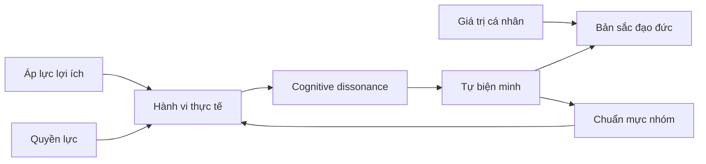
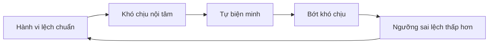
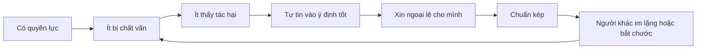
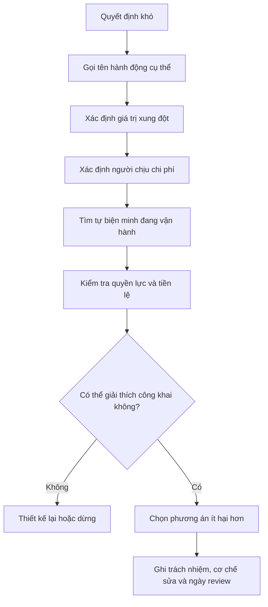

# Tập 24: Tâm Lý Đạo Đức, Tự Biện Minh Và Cái Tôi Đúng Đắn

**Hiểu vì sao người tốt vẫn làm điều sai, cách tự biện minh vận hành, moral licensing, cognitive dissonance, đạo đức nhóm, quyền lực, đạo đức giả và xung đột giá trị trong lãnh đạo và văn hóa tổ chức**  
Giáo trình ngắn gọn cho người trưởng thành, cấp quản lý/C-level

---

## 0. Vì Sao C-level Cần Học Tâm Lý Đạo Đức?

### Bản chất

Đạo đức không chỉ là biết đúng sai.  
Đạo đức còn là cách bộ não bảo vệ hình ảnh "tôi là người đúng đắn" khi hành vi, lợi ích và áp lực không còn sạch sẽ.

Ở cấp cao, rủi ro đạo đức hiếm khi xuất hiện dưới dạng:

> Tôi biết điều này sai và tôi vẫn muốn làm.

Nó thường xuất hiện dưới dạng:

- "Tình huống này đặc biệt."
- "Mình làm vậy vì đại cục."
- "Ai ở vị trí này cũng phải làm thế."
- "Mình đã hy sinh nhiều rồi, được phép linh hoạt một chút."
- "Nếu mình không làm, tổ chức sẽ thiệt."
- "Người kia cũng không trong sạch."

Vì vậy, đạo đức trong lãnh đạo là năng lực nhìn ra cơ chế tự lừa mình trước khi nó trở thành văn hóa.

### Một câu cần nhớ

> Con người không chỉ muốn làm điều đúng; họ còn muốn tin rằng mình đúng ngay cả khi đang làm điều sai.

### Mục tiêu tập này

Sau tập này, bạn cần làm được 5 việc:

| Năng lực | Ý nghĩa thực tế |
|---|---|
| Nhìn đạo đức như tâm lý | Không đơn giản hóa vấn đề thành "người tốt/người xấu" |
| Nhận diện tự biện minh | Bắt được câu chuyện làm điều sai nghe có vẻ hợp lý |
| Quản trị quyền lực đạo đức | Biết quyền lực làm méo chuẩn đúng sai như thế nào |
| Xử lý xung đột giá trị | Không dùng một giá trị tốt để nghiền nát giá trị khác |
| Xây văn hóa chính trực | Thiết kế hệ thống làm điều đúng dễ hơn và nói thật an toàn hơn |

---

## 1. First Principles: Đạo Đức Như Một Hệ Tâm Lý

### Bản chất

Đạo đức là hệ thống tâm lý giúp con người đánh giá hành vi là đúng, sai, đáng tự hào, đáng xấu hổ, được phép hay không được phép.

```text
Đạo đức = Giá trị + Cảm xúc + Bản sắc + Chuẩn mực nhóm + Hệ quả + Tự biện minh
```

Nếu chỉ nhìn đạo đức như luật, bạn sẽ hỏi:

> Việc này có vi phạm quy định không?

Nếu nhìn đạo đức như tâm lý, bạn sẽ hỏi thêm:

> Điều gì đang khiến người thông minh, có vị trí và có hình ảnh tốt tự cho phép mình làm việc này?

### Mô hình gốc



### Câu hỏi gốc

```text
1. Ta đang bảo vệ giá trị nào?
2. Ta đang hy sinh giá trị nào?
3. Câu chuyện nào đang giúp việc này nghe có vẻ đúng?
4. Ai được lợi nếu câu chuyện đó được tin?
5. Nếu người yếu thế kể lại chuyện này, họ sẽ kể khác thế nào?
```

---

## 2. Tự Biện Minh: Cơ Chế Giữ Hình Ảnh Đúng Đắn

### Bản chất

Tự biện minh là quá trình con người giải thích hành vi của mình theo cách làm bản thân vẫn thấy mình là người hợp lý, tử tế hoặc có chính nghĩa.

Tự biện minh không giống nói dối.  
Nói dối là biết mình đang che sự thật với người khác.  
Tự biện minh nguy hiểm hơn vì ta che sự thật với chính mình.

### Các dạng tự biện minh phổ biến

| Dạng | Câu nói thường gặp | Vấn đề thật |
|---|---|---|
| Đại cục hóa | "Vì lợi ích chung." | Ai định nghĩa lợi ích chung? |
| Bình thường hóa | "Ở ngành này ai cũng vậy." | Phổ biến không đồng nghĩa đúng |
| So sánh xuống | "Ít ra mình không tệ như họ." | Chuẩn bị kéo xuống thấp |
| Đổ hoàn cảnh | "Tình thế bắt buộc." | Có lựa chọn nào bị bỏ qua? |
| Đổ nạn nhân | "Họ cũng có lỗi." | Trách nhiệm bị chuyển hướng |
| Kỹ thuật hóa | "Đây chỉ là tối ưu quy trình." | Tác hại con người bị làm mờ |

### Dấu hiệu cần dừng lại

- Bạn cần nhiều câu chuyện để giải thích một hành vi đơn giản.
- Bạn thấy khó nói thẳng sự việc với người ngoài.
- Bạn dùng từ trừu tượng để tránh mô tả hành động cụ thể.
- Bạn chỉ hỏi "có hợp pháp không" thay vì "có đúng không".
- Người phản đối bị xem là ngây thơ, thiếu thực tế hoặc không hiểu cuộc chơi.

### Nguyên tắc

> Tự biện minh thường bắt đầu khi ta đổi câu hỏi từ "điều gì đúng?" sang "làm sao để việc mình muốn làm nghe có vẻ đúng?"

---

## 3. Cognitive Dissonance: Khi Hành Vi Và Bản Sắc Mâu Thuẫn

### Bản chất

Cognitive dissonance là trạng thái khó chịu khi niềm tin, bản sắc và hành vi không khớp nhau.

Ví dụ:

```text
Tôi tin mình công bằng.
Tôi vừa ưu ái người thân tín.
Não cần giảm khó chịu.
```

Có ba cách giảm khó chịu:

| Cách | Ví dụ | Chất lượng đạo đức |
|---|---|---|
| Đổi hành vi | Nhận lỗi, sửa quy trình | Tốt |
| Đổi niềm tin | "Công bằng không áp dụng trong trường hợp này." | Rủi ro |
| Đổi câu chuyện | "Tôi không ưu ái, tôi chọn người đáng tin." | Nguy hiểm nếu thiếu dữ kiện |

### Vòng tự hợp lý hóa



### Câu hỏi tự soi

```text
1. Tôi đang thấy khó chịu vì mình sai hay vì hình ảnh của mình bị đe dọa?
2. Nếu hành vi này do người tôi không thích làm, tôi sẽ đánh giá thế nào?
3. Tôi đang sửa hành vi hay sửa câu chuyện?
4. Tôi có đang dùng thành tích cũ để miễn kiểm tra hiện tại không?
```

---

## 4. Moral Licensing: Khi Việc Tốt Trở Thành Giấy Phép Làm Sai

### Bản chất

Moral licensing là hiện tượng sau khi làm điều tốt, con người dễ tự cho phép mình làm điều kém đạo đức hơn vì cảm thấy mình đã có "tín dụng đạo đức".

Trong lãnh đạo, nó thường có dạng:

- "Tôi đã hy sinh cho công ty nhiều năm."
- "Tôi tạo ra hàng ngàn việc làm."
- "Tôi luôn giúp nhân viên, lần này họ nên hiểu cho tôi."
- "Tôi là người xây văn hóa này, tôi có quyền ngoại lệ."
- "Tôi đóng góp nhiều hơn phần lớn người khác."

### Rủi ro

| Tín dụng đạo đức | Cách nó bị dùng sai |
|---|---|
| Thành tích lớn | Miễn kiểm tra hành vi hiện tại |
| Hy sinh cá nhân | Đòi đặc quyền không nói ra |
| Làm việc thiện | Che mờ xung đột lợi ích |
| Xây dựng tổ chức | Tự xem mình đứng trên chuẩn |
| Được yêu quý | Biến phản hồi thành phản bội |

### Câu hỏi chặn moral licensing

```text
1. Tôi có đang lấy việc tốt cũ để biện minh cho việc hiện tại không?
2. Nếu bỏ hết thành tích của tôi ra khỏi câu chuyện, hành vi này còn đúng không?
3. Người ít quyền hơn có được phép làm tương tự không?
4. Tôi đang xin ngoại lệ hay đang thiết lập chuẩn?
```

### Nguyên tắc

> Việc tốt trong quá khứ không tạo quyền làm điều sai ở hiện tại.

---

## 5. Đúng/Sai Và Bản Sắc: Khi Tranh Luận Trở Thành Tự Vệ

### Bản chất

Con người không chỉ bảo vệ quan điểm.  
Họ bảo vệ bản sắc gắn với quan điểm đó.

Khi một quyết định bị phê bình, lãnh đạo dễ nghe thành:

```text
"Quyết định này có lỗi" = "Tôi là người kém đạo đức"
```

Khi đó, não chuyển từ học hỏi sang phòng vệ.

### Dấu hiệu bản sắc đã lấn át sự thật

| Dấu hiệu | Ý nghĩa |
|---|---|
| Phản biện bị xem là tấn công cá nhân | Bản sắc đang bị đe dọa |
| Người sai khó nhận lỗi công khai | Hình ảnh quan trọng hơn học hỏi |
| Tổ chức chỉ nói về ý định tốt | Hệ quả thật bị né |
| Ai đặt câu hỏi bị gắn nhãn "tiêu cực" | Sự thật bị đạo đức hóa ngược |
| Một nhóm tự xem mình là "phe đúng" | Chuẩn kép sắp xuất hiện |

### Cách tách bản sắc khỏi hành vi

| Thay vì | Dùng câu |
|---|---|
| "Anh sai rồi." | "Quyết định này đang tạo hệ quả nào?" |
| "Đội này thiếu đạo đức." | "Chuẩn nào đã bị hệ thống làm yếu đi?" |
| "Ai chịu trách nhiệm?" | "Phần trách nhiệm nào thuộc cá nhân, phần nào thuộc thiết kế hệ thống?" |
| "Tại sao lại làm vậy?" | "Khi đó anh/chị đang tối ưu điều gì?" |

### Nguyên tắc

> Muốn người lớn sửa sai, hãy làm lỗi có thể được nhìn thẳng mà không biến toàn bộ con người họ thành kẻ xấu.

---

## 6. Đạo Đức Nhóm: Khi "Chúng Ta" Trở Thành Chuẩn Đúng Sai

### Bản chất

Đạo đức nhóm là cách nhóm định nghĩa điều gì được xem là đúng, sai, trung thành, phản bội, đáng tự hào hoặc đáng xấu hổ.

Một người có thể không dám làm điều sai một mình, nhưng sẽ làm nếu nhóm biến nó thành bình thường.

### Cơ chế

| Cơ chế nhóm | Biểu hiện | Rủi ro |
|---|---|---|
| Chuẩn mực ngầm | "Ở đây làm vậy mới sống được." | Sai lệch thành bình thường |
| Trung thành nhóm | Không tố lỗi người phe mình | Che giấu vấn đề |
| Ngôn ngữ riêng | Dùng từ đẹp cho hành vi xấu | Làm mờ thực tế |
| Out-group hóa | "Bên kia không đáng được đối xử tử tế." | Giảm đồng cảm |
| Đồng thuận giả | Không ai phản đối công khai | Sai lầm tập thể |

### Câu hỏi cho lãnh đạo

```text
1. Trong nhóm này, điều gì được thưởng thật sự?
2. Người nói thật được bảo vệ hay bị cô lập?
3. Có hành vi nào ai cũng biết nhưng không ai gọi đúng tên không?
4. "Trung thành" đang nghĩa là bảo vệ tổ chức hay bảo vệ người có quyền?
5. Người ngoài nhóm có được đối xử bằng cùng tiêu chuẩn không?
```

### Nguyên tắc

> Văn hóa là đạo đức được lặp lại cho đến khi không còn ai phải giải thích.

---

## 7. Quyền Lực Làm Méo Đạo Đức Như Thế Nào?

### Bản chất

Quyền lực không chỉ cho bạn khả năng ra quyết định.  
Nó còn làm bạn ít thấy chi phí mà người khác phải chịu từ quyết định của bạn.

Khi có quyền lực, con người dễ:

- Đánh giá ý định của mình quá cao
- Đánh giá tác hại lên người khác quá thấp
- Tin rằng mình hiểu bối cảnh hơn mọi người
- Xem phản đối là thiếu trung thành
- Tự cho mình ngoại lệ
- Nhận ít phản hồi thật hơn nhưng tự tin nhiều hơn

### Vòng méo đạo đức của quyền lực



### Bảng kiểm quyền lực

| Câu hỏi | Vì sao quan trọng |
|---|---|
| Người chịu chi phí có ở trong phòng không? | Quyết định dễ sạch khi nạn nhân vắng mặt |
| Người dưới quyền có thể nói không không? | Consent bị quyền lực làm yếu |
| Chuẩn này áp dụng cho tôi không? | Chặn đặc quyền ngầm |
| Tôi có đang nhầm sợ hãi với đồng thuận không? | Im lặng không phải chấp thuận |
| Ai có quyền kiểm tra tôi? | Quyền lực cần đối trọng |

### Nguyên tắc

> Quyền lực càng lớn, đạo đức càng phải ít dựa vào tự đánh giá và nhiều dựa vào cơ chế kiểm tra.

---

## 8. Đạo Đức Giả: Khoảng Cách Giữa Tuyên Bố Và Hành Vi

### Bản chất

Đạo đức giả không chỉ là nói một đằng làm một nẻo.  
Nó là trạng thái trong đó ngôn ngữ đạo đức được dùng để tạo hình ảnh, nhưng hành vi thật không chịu cùng tiêu chuẩn.

Trong tổ chức, đạo đức giả phá niềm tin nhanh hơn sai lầm thật được nhận trách nhiệm.

### Dạng thường gặp

| Tuyên bố | Hành vi làm hỏng |
|---|---|
| "Con người là tài sản quý nhất." | Ép quá tải rồi gọi là cam kết |
| "Minh bạch." | Tin xấu bị xử lý riêng, tin tốt công bố rộng |
| "Khách hàng là trung tâm." | Metric nội bộ thắng lợi ích khách hàng |
| "Chính trực." | Người tạo doanh thu lớn được miễn chuẩn |
| "Học hỏi." | Ai nói lỗi bị xem là gây rối |

### Tín hiệu văn hóa đạo đức giả

- Giá trị công ty đẹp hơn trải nghiệm nhân viên.
- Câu chuyện truyền thông khác xa câu chuyện trong hành lang.
- Người yếu bị phạt vì lỗi nhỏ, người mạnh được giải thích vì lỗi lớn.
- Lãnh đạo nói về khiêm tốn nhưng không bị phản biện.
- Tổ chức dùng workshop giá trị để tránh sửa cơ chế thưởng/phạt.

### Nguyên tắc

> Giá trị không nằm ở câu treo trên tường; giá trị nằm ở việc ai được thưởng, ai được bảo vệ và ai được miễn trừ.

---

## 9. Xung Đột Giá Trị: Khi Nhiều Điều Đúng Va Vào Nhau

### Bản chất

Nhiều tình huống đạo đức khó không phải vì đúng và sai quá rõ.  
Chúng khó vì nhiều giá trị tốt va vào nhau.

Ví dụ:

| Xung đột | Câu hỏi khó |
|---|---|
| Trung thành vs sự thật | Khi nào bảo vệ người của mình trở thành che giấu lỗi? |
| Tốc độ vs công bằng | Khi nào quyết nhanh làm người yếu mất tiếng nói? |
| Hiệu quả vs phẩm giá | Khi nào tối ưu vận hành làm con người thành công cụ? |
| Bảo mật vs minh bạch | Khi nào giữ kín là trách nhiệm, khi nào là né tránh? |
| Tha thứ vs accountability | Khi nào cho cơ hội, khi nào dung túng? |
| Lợi ích cổ đông vs lợi ích xã hội | Ai đang chịu chi phí ngoài báo cáo? |

### Cách xử lý xung đột giá trị

```text
1. Gọi đúng các giá trị đang xung đột.
2. Nêu rõ ai được lợi và ai chịu chi phí.
3. Tách quyết định ngắn hạn khỏi chuẩn dài hạn.
4. Chọn giá trị ưu tiên trong bối cảnh cụ thể.
5. Ghi lại cái giá đạo đức của lựa chọn.
6. Thiết kế cơ chế bù, sửa hoặc review.
```

### Bảng quyết định

| Câu hỏi | Mục đích |
|---|---|
| Ta đang chọn giữa những giá trị nào? | Tránh giả vờ chỉ có một điều đúng |
| Nếu chọn A, điều gì bị hy sinh? | Thấy chi phí đạo đức |
| Ai không có quyền tự bảo vệ trong quyết định này? | Bảo vệ người yếu thế |
| Quyết định này có thể thành tiền lệ không? | Tránh ngoại lệ biến thành chuẩn |
| Khi nào cần review lại? | Giữ khả năng học |

### Nguyên tắc

> Người trưởng thành đạo đức không chỉ chọn điều đúng; họ biết nói rõ cái giá của điều đúng mình đã chọn.

---

## 10. Đạo Đức Trong Lãnh Đạo: Từ Ý Định Tốt Đến Cơ Chế Tốt

### Bản chất

Ý định tốt là cần nhưng không đủ.  
Lãnh đạo cần thiết kế cơ chế để:

- Sự thật đi lên được
- Quyền lực bị kiểm tra được
- Người yếu có tiếng nói
- Người tạo kết quả không được miễn chuẩn
- Sai lầm được sửa trước khi thành văn hóa

### Những vùng rủi ro cao

| Vùng | Rủi ro đạo đức |
|---|---|
| Tuyển dụng và thăng chức | Ưu ái người giống mình, gọi là "fit" |
| Performance review | Dùng cảm tình thay cho tiêu chuẩn |
| Sa thải | Tối ưu pháp lý nhưng làm hỏng phẩm giá |
| Sales và tăng trưởng | Chạy số bằng lời hứa quá mức |
| Dữ liệu nhân sự | Giám sát nhiều hơn mức cần |
| Khủng hoảng | Che tin để giữ hình ảnh |
| Founder culture | Người sáng lập thành ngoại lệ đạo đức |

### Ba câu hỏi trước quyết định lớn

```text
1. Quyết định này có còn đúng nếu bị công khai đầy đủ không?
2. Người chịu tác động có được giải thích bằng ngôn ngữ bình thường không?
3. Tôi có chấp nhận chuẩn này áp dụng ngược lại với mình không?
```

### Nguyên tắc

> Lãnh đạo đạo đức không phải là người không bao giờ có động cơ xấu; đó là người không để động cơ của mình đứng ngoài kiểm tra.

---

## 11. Văn Hóa Tổ Chức: Thiết Kế Cho Chính Trực

### Bản chất

Văn hóa chính trực không được tạo bằng khẩu hiệu.  
Nó được tạo bằng sự nhất quán giữa lời nói, hệ thống thưởng/phạt, quyền phản biện và cách tổ chức xử lý người có quyền khi họ sai.

### Các đòn bẩy văn hóa

| Đòn bẩy | Câu hỏi thiết kế |
|---|---|
| Chuẩn hành vi | Điều gì không được làm dù kết quả tốt? |
| Thưởng/phạt | Người đạt số bằng cách xấu có bị chặn không? |
| Phản hồi | Ai có thể báo rủi ro mà không bị trả giá? |
| Minh bạch | Tin xấu được nói ở đâu, khi nào, với ai? |
| Quyền lực | Ai kiểm tra người có quyền? |
| Nghi thức | Tổ chức có thói quen review quyết định đạo đức không? |
| Ngôn ngữ | Có từ nào đang làm đẹp hành vi xấu không? |

### Công cụ: Audit văn hóa chính trực

```text
Hành vi nào được tuyên bố là quan trọng:
Hành vi nào thật sự được thưởng:
Ai được miễn chuẩn:
Tin xấu thường đi đường nào:
Người nói thật gần đây được đối xử ra sao:
Có metric nào khuyến khích làm sai không:
Có quyết định nào tổ chức không dám gọi đúng tên không:
Nếu nhân viên mới quan sát 30 ngày, họ sẽ học chuẩn nào:
```

---

## 12. Công Cụ Thực Hành: Moral Clarity Canvas

### Khi nào dùng

Dùng trước quyết định có xung đột lợi ích, tác động lớn đến nhân sự/khách hàng, khả năng tạo tiền lệ, hoặc khi nhóm đang tự tin quá nhanh rằng "việc này ổn".

```text
1. Sự việc:
- Ta đang quyết điều gì?
- Hành động cụ thể là gì, không dùng từ làm đẹp?

2. Giá trị:
- Giá trị nào đang được bảo vệ?
- Giá trị nào có nguy cơ bị hy sinh?

3. Lợi ích:
- Ai được lợi?
- Ai chịu chi phí?
- Ai không có mặt trong cuộc thảo luận?

4. Tự biện minh:
- Câu chuyện nào đang khiến việc này nghe hợp lý?
- Nếu người khác làm vậy với ta, ta có chấp nhận không?

5. Quyền lực:
- Có chênh lệch quyền lực không?
- Người yếu hơn có thể từ chối, phản đối hoặc khiếu nại không?

6. Tiền lệ:
- Nếu việc này lặp lại 10 lần, văn hóa sẽ thành gì?
- Người khác sẽ học chuẩn nào từ quyết định này?

7. Công khai:
- Nếu toàn bộ bối cảnh được công khai, ta có thể giải thích bình tĩnh không?
- Phần nào ta muốn giấu vì xấu hổ, không phải vì bảo mật?

8. Hành động:
- Chọn gì?
- Giảm tác hại bằng cách nào?
- Ai review sau quyết định?
```

---

## 13. Checklist Trước Khi Tự Cho Mình Là Đúng

```text
[ ] Tôi đã mô tả hành động bằng ngôn ngữ cụ thể, không dùng mỹ từ.
[ ] Tôi đã tách ý định tốt khỏi hệ quả thật.
[ ] Tôi đã hỏi người bị ảnh hưởng hoặc người hiểu họ.
[ ] Tôi đã kiểm tra xem thành tích cũ có đang tạo moral licensing không.
[ ] Tôi đã hỏi nếu người tôi không thích làm vậy, tôi sẽ đánh giá thế nào.
[ ] Tôi đã xác định giá trị nào đang bị hy sinh.
[ ] Tôi đã xem người ít quyền hơn có được tiêu chuẩn tương tự không.
[ ] Tôi đã mời một người có quyền phản biện thật.
[ ] Tôi đã ghi lại tiền lệ mà quyết định này tạo ra.
[ ] Tôi đã biết điều kiện nào khiến mình phải sửa hoặc xin lỗi.
```

---

## 14. Luồng Xử Lý Quyết Định Đạo Đức Khó



---

## 15. Lộ Trình Thực Hành 4 Tuần

### Tuần 1: Nhận diện tự biện minh

- Chọn 3 quyết định gần đây khiến bạn phải giải thích nhiều.
- Viết lại hành động bằng ngôn ngữ cụ thể, không dùng từ đẹp.
- Tìm câu tự biện minh chính trong mỗi quyết định.

### Tuần 2: Kiểm tra moral licensing và quyền lực

- Liệt kê 5 đặc quyền hoặc ngoại lệ bạn đang có.
- Hỏi: đặc quyền nào hợp lý vì vai trò, đặc quyền nào chỉ tồn tại vì không ai dám chất vấn?
- Chọn một ngoại lệ cần bỏ hoặc đưa vào quy định minh bạch.

### Tuần 3: Audit đạo đức nhóm

- Chọn một team hoặc ban lãnh đạo.
- Ghi lại hành vi nào được thưởng thật sự, không phải được tuyên bố.
- Tìm một chuẩn kép giữa người mạnh và người yếu.

### Tuần 4: Thiết kế cơ chế chính trực

- Tạo checklist đạo đức trước quyết định lớn.
- Chỉ định một người hoặc nhóm có quyền phản biện.
- Thêm ngày review cho quyết định có rủi ro đạo đức.
- Sửa một metric đang khuyến khích hành vi sai.

---

## 16. Bảng Tóm Tắt First Principles

| Chủ đề | Bản chất | Câu hỏi áp dụng |
|---|---|---|
| Đạo đức như tâm lý | Hệ thống giá trị, cảm xúc, bản sắc và chuẩn mực điều khiển đúng sai | Điều gì đang khiến việc này nghe có vẻ đúng? |
| Tự biện minh | Câu chuyện giúp ta giữ hình ảnh tốt khi hành vi có vấn đề | Tôi đang sửa hành vi hay sửa câu chuyện? |
| Cognitive dissonance | Khó chịu khi hành vi và bản sắc mâu thuẫn | Tôi đang giảm khó chịu bằng sự thật hay bằng hợp lý hóa? |
| Moral licensing | Việc tốt cũ tạo cảm giác được phép linh hoạt hiện tại | Nếu bỏ thành tích cũ ra, hành vi này còn đúng không? |
| Bản sắc đạo đức | Nhu cầu thấy mình là người đúng đắn | Phản biện đang bị nghe như dữ kiện hay tấn công cá nhân? |
| Đạo đức nhóm | Nhóm định nghĩa điều gì được xem là đúng, sai, trung thành | Chuẩn ngầm nào đang mạnh hơn giá trị chính thức? |
| Quyền lực | Khả năng làm người khác chịu hệ quả từ quyết định của mình | Người chịu chi phí có tiếng nói thật không? |
| Đạo đức giả | Khoảng cách giữa giá trị tuyên bố và hành vi được thưởng | Ai được miễn chuẩn? |
| Xung đột giá trị | Nhiều điều đúng va vào nhau trong cùng quyết định | Ta đang hy sinh giá trị nào để bảo vệ giá trị nào? |
| Chính trực lãnh đạo | Ý định tốt được đặt dưới cơ chế kiểm tra | Ai có quyền nói tôi sai? |
| Văn hóa chính trực | Hệ thống làm điều đúng dễ hơn và nói thật an toàn hơn | Người mới học chuẩn nào từ hành vi được thưởng? |
| Tiền lệ đạo đức | Mỗi ngoại lệ hôm nay dạy tổ chức chuẩn ngày mai | Nếu việc này lặp lại 10 lần, văn hóa sẽ thành gì? |

---

## 17. Một Câu Để Nhớ Toàn Bộ Tập 24

> Đạo đức trưởng thành bắt đầu khi ta ngừng hỏi "làm sao chứng minh mình đúng" và bắt đầu hỏi "điều gì trong mình, trong nhóm và trong quyền lực đang làm sự thật bị méo?"
