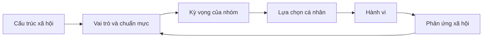
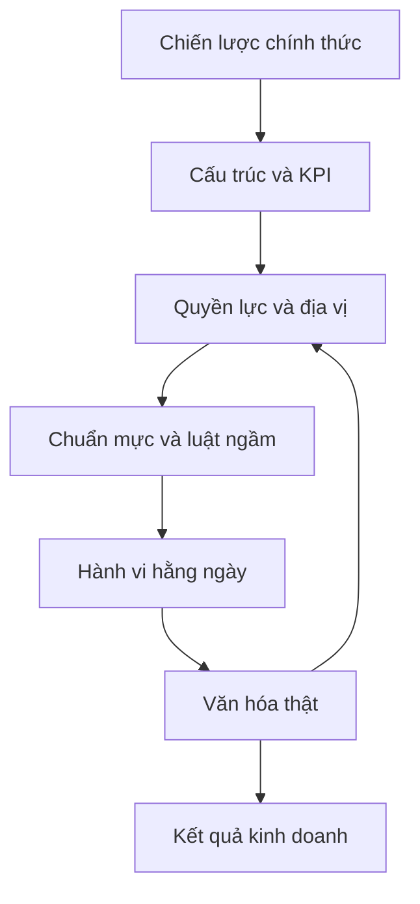

# Tập 25: Xã Hội Học Và Nhân Học Cho Người Muốn Hiểu Con Người

**Hiểu con người trong xã hội, vai trò, chuẩn mực, tầng lớp, thể chế, nghi lễ, biểu tượng, cộng đồng, gia đình, văn hóa, tiêu dùng, tổ chức và khách hàng**  
Giáo trình ngắn gọn cho người trưởng thành, cấp quản lý/C-level

---

## 0. Vì Sao C-level Cần Học Xã Hội Học Và Nhân Học?

### Bản chất

Nhiều quyết định quản trị sai vì nhìn con người như một cá nhân tách rời.

Nhưng con người thật luôn sống trong:

- Gia đình
- Nhóm bạn
- Tổ chức
- Cộng đồng
- Tầng lớp xã hội
- Chuẩn mực văn hóa
- Thể chế chính thức
- Biểu tượng địa vị
- Lịch sử và ký ức tập thể

Tâm lý học giúp bạn hiểu động cơ bên trong.  
Xã hội học và nhân học giúp bạn hiểu môi trường xã hội đang tạo hình động cơ đó.

### Một câu cần nhớ

> Con người không chỉ hỏi "tôi muốn gì"; họ còn hỏi "người như tôi, trong nhóm của tôi, ở vị trí của tôi, được phép muốn gì".

### Mục tiêu tập này

| Năng lực | Ý nghĩa thực tế |
|---|---|
| Nhìn con người trong bối cảnh | Không đổ lỗi quá nhanh cho cá nhân |
| Đọc vai trò và chuẩn mực | Hiểu vì sao người giỏi vẫn hành xử theo khuôn |
| Nhận diện tầng lớp và địa vị | Hiểu sức mạnh của vị thế, cơ hội và biểu tượng |
| Quan sát văn hóa | Thấy điều người trong cuộc xem là "bình thường" |
| Ứng dụng vào tổ chức và khách hàng | Thiết kế sản phẩm, văn hóa, chính sách sát đời sống thật |

---

## 1. First Principles: Con Người Là Sinh Vật Xã Hội

### Bản chất

Con người không chỉ sống cùng người khác.  
Con người được tạo hình bởi người khác.

```text
Con người xã hội = Cơ thể + Tâm lý + Vai trò + Chuẩn mực + Quan hệ + Thể chế + Văn hóa
```

Một hành vi cá nhân thường là kết quả của nhiều tầng:

| Tầng | Câu hỏi |
|---|---|
| Cá nhân | Người này muốn gì, sợ gì, tin gì? |
| Quan hệ | Ai đang ảnh hưởng đến họ? |
| Vai trò | Họ đang phải đóng vai gì? |
| Chuẩn mực | Điều gì được xem là đúng trong nhóm này? |
| Tầng lớp | Họ có cơ hội, vốn và rủi ro nào? |
| Thể chế | Luật, quy trình, thị trường đang ép gì? |
| Văn hóa | Ý nghĩa nào đang nằm dưới hành vi? |

### Mô hình đơn giản



### Câu hỏi gốc

```text
1. Hành vi này hợp lý trong bối cảnh xã hội nào?
2. Người này đang đóng vai gì trước mắt người khác?
3. Chuẩn mực nào đang thưởng hoặc phạt hành vi này?
4. Tầng lớp, địa vị hoặc thể chế nào đang giới hạn lựa chọn?
5. Nếu chỉ nhìn cá nhân, tôi đang bỏ sót cấu trúc nào?
```

---

## 2. Xã Hội Là Gì?

### Bản chất

Xã hội là mạng lưới con người, quan hệ, vị trí, quy tắc và ý nghĩa cùng tạo ra cách sống chung.

Xã hội không chỉ là "đám đông".  
Xã hội là hệ thống khiến một số hành vi trở nên dễ, một số hành vi trở nên khó, một số người có tiếng nói lớn hơn và một số người phải im lặng nhiều hơn.

### Những thành phần chính

| Thành phần | Nghĩa đơn giản | Ví dụ trong tổ chức |
|---|---|---|
| Vai trò | Vị trí xã hội kèm kỳ vọng | CEO, quản lý, nhân viên mới |
| Chuẩn mực | Luật ngầm về điều nên làm | Không phản biện sếp trước đám đông |
| Địa vị | Mức được công nhận và lắng nghe | Người gần quyền lực được tin hơn |
| Thể chế | Quy tắc chính thức và bền vững | Luật, KPI, quy trình tuyển dụng |
| Mạng lưới | Ai nối với ai | Kênh thông tin chính thức và phi chính thức |
| Văn hóa | Ý nghĩa chung | "Ở đây phải chịu khó mới được xem là tốt" |

### Nguyên tắc

> Khi một hành vi lặp lại ở nhiều người, đừng chỉ hỏi từng người sai gì. Hãy hỏi xã hội nhỏ quanh họ đang dạy gì.

---

## 3. Vai Trò: Con Người Hành Xử Theo Vị Trí

### Bản chất

Vai trò là bộ kỳ vọng gắn với một vị trí xã hội.

Một người không chỉ là "chính họ".  
Trong từng bối cảnh, họ là cha, mẹ, con, sếp, cấp dưới, khách hàng, người mua, người bán, người mới, người cũ, người có quyền hoặc người yếu thế.

### Vai trò tạo hành vi

| Vai trò | Kỳ vọng xã hội | Rủi ro |
|---|---|---|
| CEO | Mạnh mẽ, chắc chắn, nhìn xa | Khó thừa nhận không biết |
| Quản lý cấp trung | Vừa làm hài lòng trên, vừa giữ dưới | Dễ bị kẹt và phòng vệ |
| Nhân viên mới | Học nhanh, không gây rắc rối | Tự kiểm duyệt |
| Người cha/mẹ | Hy sinh, kiểm soát, bảo vệ | Khó trao quyền cho con |
| Khách hàng cao cấp | Được tôn trọng, khác biệt | Nhạy với tín hiệu địa vị |

### Câu hỏi áp dụng

```text
Người này đang ở vai trò nào:
Vai trò đó đòi họ phải tỏ ra thế nào:
Điều gì họ không được phép nói trong vai trò đó:
Vai trò nào đang xung đột với vai trò nào:
Nếu đổi vai trò, hành vi có đổi không:
```

---

## 4. Chuẩn Mực: Luật Ngầm Mạnh Hơn Nội Quy

### Bản chất

Chuẩn mực là điều một nhóm xem là bình thường, đúng, đáng khen hoặc đáng xấu hổ.

Chuẩn mực có thể mạnh hơn quy định chính thức vì nó đi kèm phần thưởng xã hội:

- Được thuộc về
- Được tin
- Được mời vào nhóm trong
- Được xem là "biết điều"
- Tránh bị chê, bị cô lập, bị gắn nhãn

### Bảng đọc chuẩn mực

| Dấu hiệu | Chuẩn mực có thể nằm dưới |
|---|---|
| Ai cũng làm quá giờ nhưng không ai nói ép | Hy sinh được xem là trung thành |
| Họp không ai phản biện | Giữ hòa khí quan trọng hơn sự thật |
| Người hỏi nhiều bị xem là tiêu cực | Tuân thủ quan trọng hơn hiểu rõ |
| Khách mua hàng vì sợ bị đánh giá | Tiêu dùng gắn với thể diện |
| Gia đình né nói chuyện tiền bạc | Tiền là vùng xấu hổ hoặc quyền lực |

### Nguyên tắc

> Muốn đổi hành vi, phải đổi chuẩn mực được thưởng, không chỉ đổi thông điệp được nói.

---

## 5. Giai Cấp, Tầng Lớp Và Địa Vị

### Bản chất

Tầng lớp xã hội không chỉ là thu nhập.  
Nó là tổng hợp của tiền, học vấn, quan hệ, gu thẩm mỹ, ngôn ngữ, cơ hội, sự tự tin và mức được hệ thống tin tưởng.

### Các loại vốn xã hội

| Loại vốn | Nghĩa đơn giản | Ví dụ |
|---|---|---|
| Vốn kinh tế | Tiền, tài sản, khả năng chịu rủi ro | Có thể nghỉ việc để khởi nghiệp |
| Vốn văn hóa | Học vấn, gu, cách nói, cách ứng xử | Biết nói chuyện trong phòng board |
| Vốn xã hội | Quan hệ và mạng lưới | Có người giới thiệu đúng lúc |
| Vốn biểu tượng | Uy tín, danh tiếng, danh hiệu | Trường top, chức danh, giải thưởng |

### Tác động đến hành vi

| Bối cảnh | Người nhiều vốn | Người ít vốn |
|---|---|---|
| Ra quyết định | Dám thử vì có đệm an toàn | Sợ sai vì sai là trả giá thật |
| Giao tiếp | Tự nhiên đặt câu hỏi | Sợ bị xem là không biết |
| Tiêu dùng | Mua để thể hiện gu hoặc tự do | Mua để giảm bất an hoặc tăng thể diện |
| Sự nghiệp | Có người mở cửa | Phải chứng minh nhiều hơn |

### Câu hỏi cho lãnh đạo

```text
Chính sách này giả định mọi người có cùng nguồn lực không:
Ai có thể tận dụng cơ hội này dễ hơn:
Ai chịu rủi ro lớn hơn nếu thất bại:
Ngôn ngữ của tổ chức có loại trừ người ít vốn văn hóa không:
Địa vị đang được trao cho năng lực thật hay cho dấu hiệu quen thuộc:
```

---

## 6. Thể Chế: Quy Tắc Tạo Ra Hành Vi

### Bản chất

Thể chế là những quy tắc chính thức hoặc bán chính thức định hình hành vi trong thời gian dài.

Ví dụ:

- Luật pháp
- Thị trường
- Trường học
- Gia đình
- Công ty
- Tôn giáo
- Nền tảng công nghệ
- Hệ thống KPI
- Quy trình thăng chức

### Thể chế tác động như thế nào?

| Cơ chế | Ví dụ | Hệ quả |
|---|---|---|
| Thưởng/phạt | KPI chỉ đo doanh số | Sales dễ bán sai khách |
| Phân quyền | Ai được quyết ngân sách | Ý tưởng tốt có thể bị nghẽn |
| Phân loại | High performer/low performer | Con người bị đóng khung |
| Tạo đường đi | Quy trình phê duyệt | Cái dễ làm trở thành cái hay làm |
| Hợp thức hóa | Có chữ ký, có policy | Điều chưa chắc đúng trở thành "đúng quy trình" |

### Nguyên tắc

> Thể chế là tâm lý học được đóng thành quy trình, luật và phần thưởng.

---

## 7. Nghi Lễ Và Biểu Tượng

### Bản chất

Nghi lễ là hành động lặp lại có ý nghĩa xã hội.  
Biểu tượng là vật, lời nói, không gian hoặc hành vi đại diện cho một ý nghĩa lớn hơn chính nó.

Con người cần nghi lễ và biểu tượng vì chúng giúp nhóm:

- Đánh dấu chuyển đổi
- Củng cố danh tính
- Thể hiện quyền lực
- Ghi nhớ điều quan trọng
- Tạo cảm giác thuộc về
- Biến giá trị trừu tượng thành hành động thấy được

### Ví dụ thực tế

| Bối cảnh | Nghi lễ/biểu tượng | Ý nghĩa ngầm |
|---|---|---|
| Công ty | All-hands, lễ vinh danh | Ai và điều gì được công nhận |
| Gia đình | Bữa cơm, giỗ, Tết | Ký ức, thứ bậc, trách nhiệm |
| Thị trường | Hộp sản phẩm, flagship store | Địa vị, gu, niềm tin |
| Lãnh đạo | Chỗ ngồi, cách mở họp | Quyền lực và khoảng cách |
| Khách hàng | Membership, thẻ hạng | Thuộc về một nhóm có giá trị |

### Câu hỏi đọc biểu tượng

```text
Vật/việc này đại diện cho điều gì:
Ai được nhìn thấy qua biểu tượng này:
Ai bị làm cho vô hình:
Nghi lễ này củng cố giá trị thật hay chỉ diễn lại khẩu hiệu:
Nếu bỏ nghi lễ này, nhóm mất cảm giác gì:
```

---

## 8. Cộng Đồng Và Gia Đình

### Bản chất

Cộng đồng là nơi con người có cảm giác thuộc về, chia sẻ chuẩn mực và được nhìn nhận.  
Gia đình là cộng đồng đầu tiên, nơi ta học quyền lực, yêu thương, xấu hổ, nghĩa vụ, tiền bạc và cách giải quyết xung đột.

### Cộng đồng tạo ra gì?

| Tác động | Mặt tốt | Mặt rủi ro |
|---|---|---|
| Thuộc về | Có hỗ trợ và ý nghĩa | Sợ khác biệt |
| Chuẩn mực | Có định hướng hành vi | Áp lực tuân thủ |
| Danh tính | Biết mình là ai | Đóng khung người khác |
| Bảo vệ | Không cô đơn | Loại trừ người ngoài |
| Truyền ký ức | Có lịch sử chung | Mang theo tổn thương cũ |

### Gia đình trong quyết định người lớn

Nhiều quyết định kinh doanh và tiêu dùng có bóng của gia đình:

- Mua nhà để chứng minh đã thành công
- Chọn trường cho con để giảm lo âu địa vị
- Né rủi ro vì từng chứng kiến gia đình mất mát
- Làm việc quá mức vì học rằng giá trị bản thân nằm ở hy sinh
- Khó nói không vì trong gia đình, từ chối bị xem là bất hiếu

### Nguyên tắc

> Đằng sau nhiều lựa chọn cá nhân là một cuộc đối thoại thầm với gia đình, cộng đồng và tầng lớp xuất thân.

---

## 9. Nhân Học: Quan Sát Văn Hóa Từ Đời Sống Thật

### Bản chất

Nhân học giúp ta hiểu con người bằng cách quan sát họ trong bối cảnh sống thật, thay vì chỉ hỏi họ nghĩ gì.

Điểm mạnh của nhân học:

- Nhìn hành vi trong đời sống thật
- Thấy điều người trong cuộc không gọi tên
- Hiểu ý nghĩa sau vật dụng, nghi lễ và thói quen
- Tránh áp đặt giả định của người quan sát
- Tôn trọng bối cảnh địa phương

### Quan sát như nhà nhân học

```text
1. Đi vào bối cảnh thật.
2. Quan sát trước khi kết luận.
3. Ghi điều người ta làm, không chỉ điều họ nói.
4. Hỏi "việc này có nghĩa gì với họ?".
5. Tìm mẫu lặp lại trong vật dụng, thời gian, không gian, ngôn ngữ.
6. Kiểm tra lại diễn giải với người trong cuộc.
```

### Bảng so sánh

| Cách nhìn nhanh | Cách nhìn nhân học |
|---|---|
| Khách hàng lười dùng app | App không khớp nhịp sống thật của họ |
| Nhân sự chống thay đổi | Thay đổi đe dọa danh tính nghề nghiệp |
| Người dùng mua vì giảm giá | Giảm giá tạo cảm giác thắng và kiểm soát |
| Gia đình không nói thẳng | Nói thẳng có thể phá vỡ thứ bậc và hòa khí |
| Team không dùng quy trình | Quy trình không khớp công việc thực tế |

---

## 10. Hành Vi Tiêu Dùng: Mua Không Chỉ Vì Công Năng

### Bản chất

Tiêu dùng là hành vi kinh tế, tâm lý và xã hội cùng lúc.

Người ta mua để:

- Giải quyết việc cần làm
- Giảm bất an
- Tiết kiệm thời gian
- Thể hiện gu
- Giữ thể diện
- Thuộc về một nhóm
- Tách mình khỏi một nhóm khác
- Kể một câu chuyện về bản thân

### Bảng đọc hành vi tiêu dùng

| Câu hỏi | Ý nghĩa |
|---|---|
| Sản phẩm này giúp họ làm gì? | Công năng |
| Sản phẩm này giúp họ trở thành ai? | Danh tính |
| Ai sẽ thấy việc họ mua? | Biểu tượng xã hội |
| Họ sợ bị đánh giá điều gì? | Thể diện và xấu hổ |
| Nhóm nào đang ảnh hưởng đến quyết định? | Chuẩn mực và social proof |
| Mua xong họ muốn kể câu chuyện gì? | Ý nghĩa văn hóa |

### Nguyên tắc

> Khách hàng không chỉ mua sản phẩm; họ mua một cách để sống, được nhìn nhận và bớt bất an trong nhóm của mình.

---

## 11. Tổ Chức Như Một Xã Hội Nhỏ

### Bản chất

Tổ chức không chỉ là sơ đồ, quy trình và KPI.  
Tổ chức là một xã hội nhỏ với tầng lớp, nghi lễ, biểu tượng, ngôn ngữ, truyền thuyết, phe nhóm và luật ngầm.

### Những thứ cần quan sát

| Lớp tổ chức | Câu hỏi |
|---|---|
| Quyền lực | Ai thật sự quyết, dù chức danh nói gì? |
| Địa vị | Ai được mời vào cuộc họp quan trọng? |
| Ngôn ngữ | Từ nào được dùng để khen hoặc chê? |
| Nghi lễ | Sự kiện nào được lặp lại để củng cố văn hóa? |
| Biểu tượng | Văn phòng, title, đặc quyền nói gì về thứ bậc? |
| Truyền thuyết | Câu chuyện nào được kể đi kể lại? |
| Luật ngầm | Điều gì ai cũng biết nhưng không viết ra? |

### Mermaid: Tổ chức như hệ xã hội



### Nguyên tắc

> Văn hóa thật của tổ chức là điều con người học được rằng phải làm để được an toàn, được công nhận và có cơ hội.

---

## 12. Khách Hàng Như Thành Viên Của Một Văn Hóa

### Bản chất

Khách hàng không xuất hiện trên thị trường như một cá nhân trống rỗng.  
Họ bước vào thị trường với tầng lớp, gia đình, cộng đồng, chuẩn mực, ngôn ngữ và ký ức tiêu dùng.

### Cần hiểu gì trước khi thiết kế sản phẩm?

| Lớp cần hiểu | Câu hỏi |
|---|---|
| Nhịp sống | Một ngày thật của họ diễn ra thế nào? |
| Không gian | Họ dùng sản phẩm ở đâu, cùng ai? |
| Quan hệ | Ai ảnh hưởng đến lựa chọn? |
| Ngôn ngữ | Họ gọi vấn đề bằng từ gì? |
| Biểu tượng | Điều gì làm họ thấy "đáng tiền"? |
| Rủi ro xã hội | Mua sai khiến họ mất mặt với ai? |
| Nghi lễ | Sản phẩm chen vào thói quen nào? |

### Công cụ: Cultural Customer Canvas

```text
1. Nhóm khách hàng:
2. Bối cảnh sống thật:
3. Việc cần làm:
4. Người ảnh hưởng:
5. Chuẩn mực của nhóm:
6. Điều gây xấu hổ hoặc mất mặt:
7. Biểu tượng địa vị liên quan:
8. Nghi lễ/thói quen sản phẩm chạm vào:
9. Ngôn ngữ khách hàng dùng:
10. Điều họ không nói trong khảo sát nhưng thể hiện qua hành vi:
```

---

## 13. Hạn Chế Khi Chỉ Nhìn Cá Nhân

### Bản chất

Chỉ nhìn cá nhân làm ta đánh giá nhanh, nhưng dễ sai tầng nguyên nhân.

Ta dễ gọi một người là:

- Lười
- Thiếu kỷ luật
- Không có ownership
- Chống đối
- Không hiểu giá trị sản phẩm
- Không phù hợp văn hóa

Trong khi vấn đề có thể nằm ở:

- Vai trò xung đột
- Chuẩn mực sai
- Tầng lớp và cơ hội khác nhau
- Thể chế thưởng sai hành vi
- Gia đình và cộng đồng tạo áp lực
- Sản phẩm không khớp bối cảnh sống
- Tổ chức phạt người nói thật

### Bảng đổi câu hỏi

| Câu hỏi cá nhân hóa quá mức | Câu hỏi xã hội học/nhân học hơn |
|---|---|
| Vì sao họ không chịu thay đổi? | Thay đổi này làm họ mất vai trò, địa vị hay an toàn nào? |
| Vì sao khách không mua? | Sản phẩm này chưa khớp nghi lễ, chuẩn mực hay biểu tượng nào? |
| Vì sao team thiếu trách nhiệm? | Hệ thống đang thưởng trách nhiệm hay thưởng né rủi ro? |
| Vì sao nhân sự im lặng? | Im lặng đang bảo vệ họ khỏi hình phạt xã hội nào? |
| Vì sao gia đình cứ lặp lại xung đột? | Vai trò, thứ bậc và chuẩn mực nào đang giữ vòng lặp? |

### Nguyên tắc

> Cá nhân chịu trách nhiệm cho hành vi của mình, nhưng lãnh đạo phải chịu trách nhiệm nhìn đủ bối cảnh tạo ra hành vi đó.

---

## 14. Công Cụ Thực Hành

### Công cụ 1: Bản đồ bối cảnh xã hội

```text
Hành vi cần hiểu:
Người/nhóm liên quan:
Vai trò chính:
Chuẩn mực đang chi phối:
Ai thưởng hành vi này:
Ai phạt hành vi ngược lại:
Địa vị hoặc thể diện nào bị đe dọa:
Thể chế/quy trình nào đang tạo áp lực:
Gia đình/cộng đồng có ảnh hưởng gì:
Cách diễn giải xã hội học tốt hơn "tính cách họ là...":
```

### Công cụ 2: Checklist quan sát văn hóa

```text
[ ] Tôi đã quan sát hành vi thật, không chỉ nghe lời kể chưa?
[ ] Tôi biết người trong cuộc gọi vấn đề này bằng từ gì chưa?
[ ] Tôi đã nhìn không gian, vật dụng, thời gian và nghi lễ chưa?
[ ] Tôi đã hỏi ai được lợi, ai chịu chi phí chưa?
[ ] Tôi đã phân biệt quy định chính thức và luật ngầm chưa?
[ ] Tôi đã kiểm tra vai trò, địa vị và thể diện chưa?
[ ] Tôi có đang áp đặt chuẩn của mình lên bối cảnh của họ không?
[ ] Tôi đã kiểm chứng diễn giải với người trong cuộc chưa?
```

### Công cụ 3: Audit tổ chức như một xã hội nhỏ

| Mục | Cần ghi |
|---|---|
| Luật chính thức | Quy định, KPI, quy trình |
| Luật ngầm | Điều ai cũng biết nhưng không nói |
| Nghi lễ | Họp, vinh danh, review, onboarding |
| Biểu tượng | Title, chỗ ngồi, đặc quyền, ngôn ngữ |
| Tầng lớp nội bộ | Nhóm nào có tiếng nói lớn hơn |
| Cộng đồng nhỏ | Phe, nhóm nghề, người cũ/người mới |
| Câu chuyện lặp lại | Huyền thoại công ty, chuyện founder, chuyện khủng hoảng |
| Hành vi được thưởng | Điều thật sự giúp thăng tiến |

---

## 15. Lộ Trình Thực Hành 4 Tuần

### Tuần 1: Nhìn con người trong bối cảnh

- Chọn 3 hành vi khó hiểu trong tổ chức, gia đình hoặc khách hàng.
- Với mỗi hành vi, viết lại theo 7 tầng: cá nhân, quan hệ, vai trò, chuẩn mực, tầng lớp, thể chế, văn hóa.
- Gạch bỏ ít nhất một kết luận quá nhanh về "tính cách".

### Tuần 2: Quan sát văn hóa thật

- Dành 2 giờ quan sát một bối cảnh thật: cửa hàng, meeting, onboarding, quy trình chăm sóc khách hàng.
- Ghi lại hành vi, ngôn ngữ, vật dụng, nghi lễ và điều không ai nói thẳng.
- Hỏi 3 người trong cuộc: "Việc này với anh/chị có nghĩa gì?"

### Tuần 3: Audit tổ chức hoặc khách hàng

- Chọn một nhóm nội bộ hoặc một phân khúc khách hàng.
- Vẽ vai trò, chuẩn mực, người ảnh hưởng, biểu tượng địa vị và rủi ro mất mặt.
- Tìm một điểm sản phẩm/chính sách đang trái với văn hóa thật.

### Tuần 4: Thiết kế lại một can thiệp

- Chọn một thông điệp, chính sách, meeting hoặc trải nghiệm khách hàng.
- Sửa để khớp hơn với vai trò, chuẩn mực, nghi lễ và bối cảnh sống thật.
- Đo không chỉ kết quả, mà cả phản ứng xã hội: ai thấy được tôn trọng, ai thấy bị đe dọa, ai im lặng.

---

## 16. Bảng Tóm Tắt First Principles

| Chủ đề | Bản chất | Câu hỏi áp dụng |
|---|---|---|
| Con người xã hội | Cá nhân được tạo hình bởi quan hệ, vai trò và văn hóa | Bối cảnh nào làm hành vi này hợp lý? |
| Xã hội | Mạng lưới người, quy tắc, vị trí và ý nghĩa | Hệ thống xã hội này đang thưởng điều gì? |
| Vai trò | Vị trí kèm kỳ vọng hành vi | Người này đang phải đóng vai gì? |
| Chuẩn mực | Luật ngầm về điều đúng và bình thường | Điều gì được khen, điều gì bị xấu hổ? |
| Tầng lớp | Khác biệt về tiền, học vấn, quan hệ, gu và cơ hội | Ai có nguồn lực để chọn khác đi? |
| Địa vị | Mức được công nhận và lắng nghe | Hành vi này đang bảo vệ vị thế nào? |
| Thể chế | Quy tắc bền vững tạo đường đi hành vi | Quy trình nào khiến việc này lặp lại? |
| Nghi lễ | Hành động lặp lại có ý nghĩa xã hội | Nghi lễ này củng cố giá trị nào? |
| Biểu tượng | Vật/hành vi đại diện cho ý nghĩa lớn hơn | Sản phẩm hoặc đặc quyền này nói gì về người sở hữu? |
| Cộng đồng | Nơi con người thuộc về và chịu chuẩn mực | Nhóm nào đang định nghĩa điều đúng? |
| Gia đình | Cộng đồng đầu tiên dạy vai trò, nghĩa vụ và xấu hổ | Ký ức gia đình nào đang ảnh hưởng quyết định? |
| Nhân học | Quan sát văn hóa trong đời sống thật | Người trong cuộc thấy việc này có nghĩa gì? |
| Tiêu dùng | Mua công năng, danh tính, thể diện và thuộc về | Khách hàng muốn trở thành ai khi mua? |
| Tổ chức | Xã hội nhỏ có tầng lớp, luật ngầm và nghi lễ | Văn hóa thật đang được học qua hành vi nào? |
| Hạn chế nhìn cá nhân | Dễ nhầm triệu chứng với nguyên nhân xã hội | Tôi đang bỏ sót cấu trúc nào? |

---

## 17. Một Câu Để Nhớ Toàn Bộ Tập 25

> Muốn hiểu con người sâu hơn, đừng chỉ nhìn vào bên trong họ; hãy nhìn cả vai trò, chuẩn mực, tầng lớp, thể chế và văn hóa đang nói cho họ biết nên sống như thế nào.
