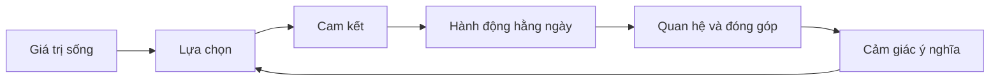
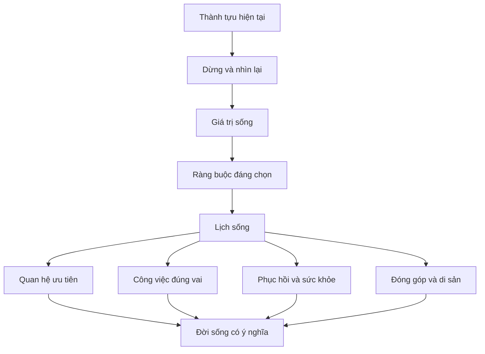

# Tập 26: Tâm Lý Ý Nghĩa, Hiện Sinh Và Đời Sống Sau Thành Công

**Hiểu ý nghĩa, tự do, trách nhiệm, cái chết, cô đơn, trống rỗng, đau khổ, bình an, di sản và cách thiết kế đời sống sau khi đã đạt nhiều thành tựu**  
Giáo trình ngắn gọn cho người trưởng thành, cấp quản lý/C-level

---

## 0. Vì Sao C-level Cần Học Tâm Lý Ý Nghĩa Và Hiện Sinh?

### Bản chất

Ở giai đoạn đầu sự nghiệp, câu hỏi thường là:

> Làm sao để thành công?

Sau khi đã có chức danh, tiền, ảnh hưởng và một mức tự do nhất định, câu hỏi đổi thành:

> Thành công này để làm gì?

Đây không phải là yếu đuối.  
Đây là dấu hiệu tâm lý khi con người bước qua tầng sinh tồn, thành tựu và địa vị để chạm vào tầng ý nghĩa.

Các khủng hoảng thường gặp ở tuổi trung niên hoặc sau thành công:

- Đạt mục tiêu nhưng không thấy vui lâu
- Chức danh lớn nhưng bên trong trống
- Có nhiều lựa chọn nhưng khó biết điều gì thật sự đáng sống
- Gia đình, sức khỏe hoặc quan hệ trả giá cho thành tựu
- Không còn muốn chơi cuộc chơi cũ nhưng chưa có cuộc chơi mới
- Sợ mình đã đi rất xa nhưng không chắc có đi đúng hướng
- Nghĩ nhiều hơn về tuổi già, cái chết và di sản

### Một câu cần nhớ

> Thành công trả lời câu hỏi "tôi có thể đạt gì"; ý nghĩa trả lời câu hỏi "tôi nên sống vì điều gì".

### Mục tiêu tập này

| Năng lực | Ý nghĩa thực tế |
|---|---|
| Hiểu khủng hoảng sau thành công | Không nhầm trống rỗng với thất bại |
| Nhìn rõ tự do và trách nhiệm | Biết mình đang chọn, né chọn hay đổ lỗi |
| Đối diện cái chết, cô đơn và giới hạn | Sống tỉnh hơn, bớt trì hoãn điều quan trọng |
| Xác định giá trị sống | Ra quyết định theo điều đáng sống, không chỉ điều có lợi |
| Thiết kế đời sống sau thành tựu | Tạo nhịp sống có ý nghĩa, bình an và di sản |

---

## 1. First Principles: Ý Nghĩa Là Gì?

### Bản chất

Ý nghĩa không phải là cảm xúc hưng phấn.  
Ý nghĩa là cảm giác rằng đời sống của mình đang gắn với điều có giá trị, đáng chịu trách nhiệm và đáng tiếp tục.

```text
Ý nghĩa = Giá trị rõ + Cam kết thật + Hành động lặp lại + Quan hệ đúng + Cái giá được chấp nhận
```

Một đời sống có ý nghĩa không nhất thiết luôn dễ chịu.  
Nó thường có khó khăn, hy sinh và giới hạn. Nhưng người sống trong đó biết vì sao mình chấp nhận cái giá.

### Mô hình gốc



### Câu hỏi gốc

```text
1. Điều gì nếu mất đi sẽ làm đời tôi nghèo đi thật sự?
2. Tôi đang dùng thành công để phục vụ giá trị nào?
3. Cái giá nào tôi sẵn sàng trả vì điều này?
4. Điều gì đang có lợi nhưng không còn có nghĩa?
5. Nếu chỉ còn 5 năm sống khỏe, tôi sẽ giữ lại điều gì?
```

---

## 2. Hiện Sinh: Bốn Sự Thật Không Thể Ủy Quyền

### Bản chất

Tâm lý hiện sinh nhìn con người như một sinh vật có ý thức về tự do, trách nhiệm, cái chết, cô đơn và nhu cầu ý nghĩa.

Không ai có thể sống thay bạn.  
Không ai có thể chết thay bạn.  
Không ai có thể chọn giá trị thay bạn mà đời bạn vẫn là của bạn.

### Bốn trụ cột hiện sinh

| Trụ cột | Nghĩa đơn giản | Khi né tránh sẽ thành |
|---|---|---|
| Tự do | Tôi luôn có phần được chọn | Đổ lỗi, sống theo quán tính |
| Trách nhiệm | Tôi phải chịu hệ quả lựa chọn | Oán giận, nạn nhân hóa |
| Cái chết | Thời gian hữu hạn | Trì hoãn điều quan trọng |
| Cô đơn | Không ai vào tận lõi trải nghiệm của tôi | Bám víu, chạy theo công nhận |

### Sự trưởng thành hiện sinh

| Chưa trưởng thành | Trưởng thành hơn |
|---|---|
| Muốn đời đảm bảo chắc chắn | Chấp nhận bất định và vẫn chọn |
| Muốn vừa tự do vừa không chịu hệ quả | Tự do đi cùng trách nhiệm |
| Né nghĩ về cái chết | Dùng cái chết để lọc ưu tiên |
| Sợ cô đơn nên chiều lòng mọi người | Có kết nối nhưng không đánh mất mình |
| Tìm ý nghĩa như một cảm giác | Xây ý nghĩa bằng cam kết |

---

## 3. Khủng Hoảng Sau Thành Công

### Bản chất

Khủng hoảng sau thành công xảy ra khi hệ thống tâm lý từng giúp bạn leo lên không còn đủ để giúp bạn sống sâu.

Trước đây, động cơ có thể là:

- Chứng minh mình giỏi
- Thoát nghèo hoặc thoát bất an
- Được công nhận
- Có quyền kiểm soát
- Không thua người khác
- Bảo vệ gia đình

Các động cơ này có thể tạo thành tựu lớn.  
Nhưng nếu chúng trở thành bản sắc duy nhất, sau khi đạt được nhiều thứ, bên trong vẫn thấy thiếu.

### Dấu hiệu

| Biểu hiện | Tầng sâu có thể là |
|---|---|
| Đạt mục tiêu rồi nhanh chán | Phần thưởng không còn chạm vào giá trị |
| Không biết nghỉ | Sợ mất giá trị khi không tạo kết quả |
| Dễ cáu với người thân | Đời sống riêng đã bị hy sinh quá lâu |
| Muốn bỏ hết làm lại | Không ghét việc, mà ghét bản sắc cũ |
| Mua thêm trải nghiệm nhưng vẫn trống | Dùng kích thích thay cho ý nghĩa |
| Ghen với người sống đơn giản | Nhận ra mình thiếu tự do nội tâm |

### Câu hỏi tự soi

```text
Thành công hiện tại từng cứu tôi khỏi điều gì:
Nó đang bắt tôi trả giá gì:
Tôi còn muốn thành công hơn vì giá trị hay vì sợ dừng lại:
Nếu không cần chứng minh nữa, tôi sẽ sống khác ở điểm nào:
```

---

## 4. Trống Rỗng: Khi Bên Ngoài Đủ Nhưng Bên Trong Thiếu

### Bản chất

Trống rỗng không phải lúc nào cũng là thiếu mục tiêu.  
Nhiều người trống rỗng vì có quá nhiều mục tiêu nhưng thiếu ý nghĩa.

Trống rỗng thường xuất hiện khi:

- Hành động không còn nối với giá trị
- Quan hệ nhiều nhưng ít thân thật
- Lịch dày nhưng đời sống mỏng
- Thành tựu lớn nhưng bản thân bị bỏ quên
- Cơ thể mệt nhưng cái tôi không cho phép dừng

### Ba loại trống rỗng

| Loại | Dấu hiệu | Cần xử lý bằng |
|---|---|---|
| Trống rỗng do kiệt sức | Mất năng lượng, mất hứng thú, dễ cáu | Nghỉ, hồi phục, giảm tải |
| Trống rỗng do lệch giá trị | Làm nhiều nhưng thấy vô nghĩa | Chọn lại ưu tiên |
| Trống rỗng hiện sinh | Có mọi thứ nhưng hỏi "để làm gì?" | Đối diện tự do, cái chết, di sản |

### Nguyên tắc

> Không phải mọi khoảng trống đều cần lấp. Có khoảng trống cần được lắng nghe.

---

## 5. Tự Do Và Trách Nhiệm

### Bản chất

Tự do không chỉ là có nhiều tiền, nhiều lựa chọn hoặc không ai quản.  
Tự do sâu hơn là khả năng chọn điều đúng với giá trị và chịu trách nhiệm với cái giá của lựa chọn đó.

Ở cấp cao, nhiều người có tự do bên ngoài nhưng không có tự do bên trong:

- Không ai ép, nhưng vẫn không dám nghỉ
- Có thể nói không, nhưng vẫn nói có vì sợ mất hình ảnh
- Có tiền, nhưng vẫn sống như đang thiếu
- Có quyền, nhưng bị chính vai trò của mình giam giữ

### Bảng phân biệt

| Tự do giả | Tự do trưởng thành |
|---|---|
| Muốn không bị ràng buộc | Chọn ràng buộc đáng giá |
| Có nhiều lựa chọn | Biết bỏ lựa chọn không đúng |
| Làm điều mình thích | Làm điều mình tin là đúng |
| Né trách nhiệm | Nhận hệ quả của lựa chọn |
| Giữ mọi cánh cửa mở | Đóng vài cánh cửa để sống sâu |

### Câu hỏi

```text
Tôi đang nói "không có lựa chọn" ở đâu trong khi thật ra tôi sợ cái giá:
Tôi đang chọn điều gì bằng cách không chọn:
Tự do nào tôi muốn, và trách nhiệm nào đi kèm:
```

---

## 6. Cái Chết: Bộ Lọc Ưu Tiên Tối Hậu

### Bản chất

Cái chết làm con người sợ vì nó nhắc ta rằng thời gian, sức khỏe, cơ hội và quan hệ đều hữu hạn.

Nhưng khi được nhìn thẳng, cái chết không chỉ làm ta buồn.  
Nó làm ta tỉnh.

### Cái chết giúp lọc điều gì

| Câu hỏi | Điều được lọc |
|---|---|
| Nếu chỉ còn ít thời gian, việc này còn quan trọng không? | Ưu tiên thật |
| Tôi sẽ tiếc điều gì nếu không làm? | Cam kết bị trì hoãn |
| Tôi đang giận ai quá lâu? | Gánh nặng quan hệ |
| Tôi đang đổi sức khỏe lấy điều gì? | Cái giá của tham vọng |
| Tôi muốn được nhớ đến vì điều gì? | Di sản |

### Bài tập: Lá thư từ cuối đời

```text
Tưởng tượng tôi 80 tuổi, nhìn lại hiện tại.
Điều tôi cảm ơn bản thân vì đã làm:
Điều tôi tiếc nếu tiếp tục né:
Người tôi cần yêu thương rõ hơn:
Việc tôi cần dừng để không đánh mất đời mình:
Một lựa chọn cần làm trong 30 ngày tới:
```

---

## 7. Cô Đơn Và Kết Nối Thật

### Bản chất

Càng lên cao, con người càng dễ cô đơn vì:

- Ít người nói thật với mình
- Nhiều quan hệ có lợi ích
- Vai trò che khuất con người thật
- Không muốn làm người khác lo
- Sợ yếu đuối làm giảm uy tín

Cô đơn hiện sinh sâu hơn cô đơn xã hội.  
Đó là nhận ra rằng không ai có thể sống, chọn, đau và chết thay mình.

### Kết nối thật không phải là luôn được hiểu

| Kết nối yếu | Kết nối sâu hơn |
|---|---|
| Nhiều người biết mình | Có vài người biết con người thật |
| Được ngưỡng mộ | Được nói thật |
| Luôn mạnh | Được yếu đúng nơi |
| Quan hệ vì vai trò | Quan hệ vì sự hiện diện |
| Né xung đột | Có thể nói điều khó |

### Câu hỏi

```text
Ai có thể nghe sự thật của tôi mà không cần tôi biểu diễn:
Tôi đang cô đơn vì thiếu người hay vì luôn giấu mình:
Tôi cần xây quan hệ nào trước khi cần nó:
```

---

## 8. Đau Khổ Và Bình An

### Bản chất

Đau khổ là một phần không thể loại bỏ khỏi đời sống: mất mát, bệnh tật, thất bại, già đi, xa cách, hối tiếc.

Vấn đề không phải là làm sao để không đau.  
Vấn đề là làm sao để đau mà không đánh mất phẩm giá, giá trị và khả năng yêu thương.

### Đau khổ có hai lớp

| Lớp | Ví dụ | Cách làm việc |
|---|---|---|
| Đau thật | Mất người thân, bệnh, thất bại, chia ly | Công nhận, chăm sóc, tìm hỗ trợ |
| Đau phụ | Tự trách, chống cự, so sánh, xấu hổ | Nhìn lại diễn giải và kỳ vọng |

### Bình an là gì?

Bình an không phải là mọi thứ đều ổn.  
Bình an là bên trong có đủ trật tự để không bị mọi biến động kéo đi.

| Bình an giả | Bình an thật |
|---|---|
| Né xung đột | Dám đối diện nhưng không bị nuốt chửng |
| Không cảm thấy gì | Cảm nhận được mà không hoảng |
| Kiểm soát hết | Biết phần nào không kiểm soát được |
| Rút khỏi đời | Sống có mặt với điều quan trọng |

---

## 9. Giá Trị Sống: La Bàn Sau Thành Tựu

### Bản chất

Giá trị sống là những điều bạn muốn đời mình đại diện, ngay cả khi không ai vỗ tay.

Giá trị khác mục tiêu:

| Mục tiêu | Giá trị |
|---|---|
| Có điểm kết thúc | Là hướng sống liên tục |
| Có thể đạt xong | Cần được sống mỗi ngày |
| Thường đo bằng kết quả | Đo bằng sự trung thành với điều quan trọng |
| Dễ bị so sánh | Mang tính cá nhân sâu |

### Nhóm giá trị thường gặp ở người trưởng thành

| Giá trị | Câu hỏi kiểm tra |
|---|---|
| Sự thật | Tôi có dám nhìn điều bất tiện không? |
| Tự do | Tôi có sống theo lựa chọn thật không? |
| Gia đình | Người thân có nhận được phần tốt nhất của tôi không? |
| Sức khỏe | Tôi có đang phản bội cơ thể để phục vụ ego không? |
| Phụng sự | Thành công của tôi giúp ai sống tốt hơn? |
| Sáng tạo | Tôi còn tạo ra điều gì sống động không? |
| Trí tuệ | Tôi có đang học sâu hay chỉ lặp lại quyền lực cũ? |
| Bình an | Tôi có đổi yên ổn nội tâm lấy công nhận không? |

### Công cụ: Lọc giá trị thật

```text
Giá trị tôi nói là quan trọng:
Lịch tuần qua có chứng minh điều đó không:
Tiền của tôi có chứng minh điều đó không:
Sự chú ý của tôi có chứng minh điều đó không:
Tôi đang hy sinh giá trị nào để giữ hình ảnh nào:
Một hành vi nhỏ để sống đúng giá trị hơn:
```

---

## 10. Di Sản: Điều Còn Lại Khi Bạn Không Còn Điều Khiển

### Bản chất

Di sản không chỉ là tài sản, công ty, tên tuổi hoặc quỹ từ thiện.  
Di sản là dấu vết giá trị bạn để lại trong con người, hệ thống và văn hóa.

### Các lớp di sản

| Lớp | Câu hỏi |
|---|---|
| Gia đình | Người thân học được cách yêu thương, sống và chịu trách nhiệm gì từ tôi? |
| Con người | Ai trưởng thành hơn vì từng làm việc với tôi? |
| Tổ chức | Hệ thống nào tiếp tục tốt khi tôi không còn ở đó? |
| Văn hóa | Chuẩn mực nào được nâng lên vì sự hiện diện của tôi? |
| Xã hội | Tôi đã góp phần giải quyết vấn đề nào lớn hơn mình? |
| Nội tâm | Tôi có trở thành con người mà chính mình tôn trọng không? |

### Cảnh báo

Di sản dễ bị ego chiếm dụng.  
Khi đó, con người không còn muốn để lại giá trị, mà muốn kéo dài cái tôi.

| Di sản từ ego | Di sản từ giá trị |
|---|---|
| Muốn tên mình còn mãi | Muốn điều tốt tiếp tục |
| Kiểm soát sau khi rời đi | Tạo người và hệ thống tự đứng được |
| Xây tượng đài cá nhân | Xây năng lực cho thế hệ sau |
| Sợ bị quên | Chấp nhận mình hữu hạn |

---

## 11. Thiết Kế Đời Sống Sau Thành Tựu

### Bản chất

Đời sống sau thành tựu không tự xuất hiện.  
Nó phải được thiết kế lại, vì lịch cũ, bản sắc cũ và phần thưởng cũ vẫn kéo bạn về cuộc chơi cũ.

Thiết kế đời sống không phải là nghỉ hưu sớm hay bỏ hết.  
Đó là chọn lại cấu trúc sống để thành công phục vụ con người, không nuốt mất con người.

### Năm vùng cần thiết kế

| Vùng | Câu hỏi thiết kế |
|---|---|
| Thân thể | Lịch của tôi có bảo vệ giấc ngủ, vận động và phục hồi không? |
| Công việc | Tôi làm việc gì vì giá trị, không chỉ vì quán tính? |
| Quan hệ | Tôi dành thời gian tốt nhất cho ai? |
| Học hỏi/sáng tạo | Tôi còn được sống động ở đâu? |
| Phụng sự/di sản | Thành tựu của tôi đang giúp điều gì lớn hơn tôi? |

### Mô hình thiết kế



### Nguyên tắc thực dụng

- Đừng thiết kế đời sống bằng tuyên bố lớn; hãy thiết kế bằng lịch tuần.
- Đừng chỉ thêm hoạt động ý nghĩa; hãy bỏ hoạt động làm rỗng mình.
- Đừng nhầm tự do với không cam kết; đời sống sâu cần vài cam kết lớn.
- Đừng đợi khủng hoảng sức khỏe hoặc gia đình mới chọn lại.

---

## 12. Công Cụ Thực Hành: Life After Success Canvas

### Khi nào dùng

Dùng khi bạn đã đạt một mức thành tựu nhưng bắt đầu thấy trống, mệt, lệch giá trị hoặc muốn bước vào một giai đoạn sống sâu hơn.

```text
1. Thành tựu hiện tại:
- Tôi đã đạt được gì?
- Thành tựu này từng phục vụ điều gì?
- Nó đang còn phục vụ điều đó không?

2. Cái giá:
- Sức khỏe đã trả gì?
- Gia đình/quan hệ đã trả gì?
- Nội tâm đã trả gì?
- Điều gì không thể tiếp tục thêm 5 năm?

3. Giá trị:
- 5 giá trị sống quan trọng nhất của tôi là gì?
- Giá trị nào đang bị lịch sống phản bội?
- Giá trị nào cần được bảo vệ bằng ranh giới?

4. Tự do và trách nhiệm:
- Tôi thật sự có quyền chọn lại ở đâu?
- Tôi sợ cái giá nào?
- Ai sẽ bị ảnh hưởng bởi lựa chọn mới?

5. Thiết kế tuần:
- Việc nào cần bỏ?
- Việc nào cần giảm?
- Việc nào cần giữ?
- Việc nào cần thêm?

6. Di sản:
- Tôi muốn con người/hệ thống nào tốt hơn vì mình?
- Tôi cần trao quyền cho ai?
- Điều gì nên tiếp tục mà không cần tôi kiểm soát?
```

---

## 13. Checklist Quyết Định Ở Giai Đoạn Sau Thành Công

### Bản chất

Ở giai đoạn này, câu hỏi không chỉ là "có nên làm không".  
Câu hỏi đúng hơn là "việc này có xứng đáng với một phần đời còn lại không".

### Checklist

```text
Việc này có nối với giá trị sống thật của tôi không:
Tôi làm vì tự do hay vì sợ mất hình ảnh:
Cái giá sức khỏe, gia đình, bình an là gì:
Nếu thành công, tôi có thật sự muốn đời mình giống vậy hơn không:
Nếu thất bại, tôi có vẫn tôn trọng lý do mình chọn không:
Việc này tạo di sản hay chỉ kéo dài ego:
Tôi có thể nói không với điều này mà vẫn thấy mình có giá trị không:
```

### Bảng quyết định nhanh

| Nếu câu trả lời là | Hành động |
|---|---|
| Có giá trị, có cái giá hợp lý | Cam kết rõ và thiết kế hệ thống hỗ trợ |
| Có lợi nhưng lệch giá trị | Từ chối hoặc giảm quy mô |
| Đúng giá trị nhưng cái giá quá cao | Thiết kế lại, chậm hơn, ít ego hơn |
| Chỉ để chứng minh | Dừng 72 giờ trước khi quyết |
| Không biết vì sao muốn | Chưa quyết, cần đối thoại sâu hơn |

---

## 14. Lộ Trình Thực Hành 4 Tuần

### Tuần 1: Audit trống rỗng và cái giá

- Viết ra 5 thành tựu lớn nhất trong 10 năm qua.
- Ghi rõ mỗi thành tựu đã cho gì và lấy đi gì.
- Chọn một cái giá không thể tiếp tục trả.

### Tuần 2: Làm rõ giá trị sống

- Chọn 5 giá trị sống quan trọng nhất.
- So với lịch, tiền, sự chú ý và quan hệ hiện tại.
- Chọn một giá trị đang bị phản bội nhiều nhất.

### Tuần 3: Thiết kế lại lịch tuần

- Bỏ hoặc giảm một hoạt động làm rỗng mình.
- Đặt lịch cố định cho sức khỏe, gia đình hoặc phục hồi.
- Thêm một hành động nhỏ phục vụ di sản hoặc phụng sự.

### Tuần 4: Cam kết giai đoạn mới

- Viết một tuyên bố 10 dòng về giai đoạn sống tiếp theo.
- Nói chuyện với một người thân/cố vấn đáng tin.
- Chọn một quyết định cụ thể cần thay đổi trong 90 ngày tới.

---

## 15. Bảng Tóm Tắt First Principles

| Chủ đề | Bản chất | Câu hỏi áp dụng |
|---|---|---|
| Ý nghĩa | Sống gắn với điều có giá trị và đáng chịu trách nhiệm | Việc này đáng sống hay chỉ đáng khoe? |
| Hiện sinh | Đối diện tự do, trách nhiệm, cái chết, cô đơn và ý nghĩa | Tôi đang né sự thật nào của đời mình? |
| Thành công | Kết quả đạt được trong một cuộc chơi | Cuộc chơi này còn đúng với tôi không? |
| Khủng hoảng sau thành công | Hệ động cơ cũ không còn đủ cho đời sống mới | Trống rỗng này đang báo điều gì? |
| Trống rỗng | Khoảng cách giữa đời sống bên ngoài và giá trị bên trong | Tôi đang lấp khoảng trống hay lắng nghe nó? |
| Tự do | Khả năng chọn theo giá trị và chịu cái giá | Tôi sợ mất gì nếu chọn thật? |
| Trách nhiệm | Nhận phần mình trong hệ quả | Tôi đang đổ lỗi ở đâu để khỏi chọn? |
| Cái chết | Giới hạn làm ưu tiên trở nên thật | Nếu thời gian hữu hạn, điều gì cần đổi ngay? |
| Cô đơn | Không ai sống thay lõi trải nghiệm của mình | Tôi có đang biểu diễn thay vì kết nối không? |
| Đau khổ | Phần không thể loại bỏ của đời sống | Tôi cần công nhận đau thật hay giảm đau phụ? |
| Bình an | Trật tự nội tâm giữa biến động | Điều gì làm tôi mất bình an vì không sống đúng? |
| Giá trị sống | La bàn khi mục tiêu cũ đã đạt | Lịch của tôi có chứng minh giá trị tôi nói không? |
| Di sản | Giá trị còn tiếp tục khi tôi không kiểm soát | Điều tốt nào nên lớn hơn cái tôi của tôi? |
| Thiết kế đời sống | Biến giá trị thành lịch, ranh giới và cam kết | Tuần này cần bỏ gì, giữ gì, thêm gì? |

---

## 16. Một Câu Để Nhớ Toàn Bộ Tập 26

> Sau thành công, nhiệm vụ không phải là thắng thêm mọi cuộc chơi, mà là đủ tự do và trách nhiệm để chọn cuộc đời thật sự đáng sống.
