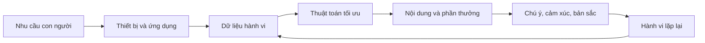
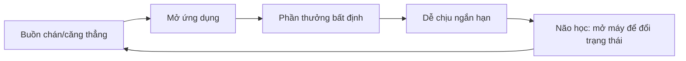
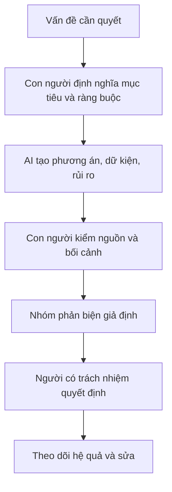

# Tập 27: Tâm Lý Công Nghệ, Mạng Xã Hội Và AI

**Hiểu cách môi trường số tái thiết kế chú ý, cảm xúc, bản sắc, quan hệ, lao động, ra quyết định, nuôi dạy con và đạo đức sản phẩm trong thời đại smartphone, mạng xã hội, thuật toán và AI**  
Giáo trình ngắn gọn cho người trưởng thành, cấp quản lý/C-level

---

## 0. Vì Sao C-level Cần Học Tâm Lý Công Nghệ?

### Bản chất

Công nghệ số không chỉ là công cụ.  
Nó là môi trường sống mới đang thiết kế lại cách con người chú ý, cảm thấy, so sánh, yêu thương, làm việc, học hỏi và ra quyết định.

Ở cấp lãnh đạo, rủi ro không nằm ở việc "dùng công nghệ nhiều".  
Rủi ro nằm ở việc không nhận ra công nghệ đang âm thầm thay đổi:

- Nhịp chú ý của bản thân và tổ chức
- Cảm xúc tập thể trong đội ngũ
- Bản sắc cá nhân qua hình ảnh công khai
- Quan hệ gia đình, bạn bè và đồng nghiệp
- Cách thị trường tin, nghi ngờ và nổi giận
- Cách nhân sự làm việc cùng AI
- Chuẩn đạo đức của sản phẩm số

### Một câu cần nhớ

> Công nghệ không chỉ phục vụ hành vi con người; nó còn huấn luyện lại hành vi con người.

### Mục tiêu tập này

| Năng lực | Ý nghĩa thực tế |
|---|---|
| Nhìn công nghệ như môi trường tâm lý | Không xem smartphone, mạng xã hội và AI chỉ là tiện ích |
| Bảo vệ chú ý và cảm xúc | Giảm nghiện kích thích, phản ứng nóng và kiệt sức số |
| Hiểu thuật toán và dopamine | Biết vì sao con người bị kéo vào vòng lặp kiểm tra, so sánh, phản ứng |
| Quản trị AI trong lao động và quyết định | Tăng năng suất mà không mất phán đoán |
| Nuôi dạy con trong môi trường số | Dạy tự chủ, không chỉ cấm đoán |
| Thiết kế sản phẩm số có đạo đức | Tăng trưởng không biến con người thành nguyên liệu |

---

## 1. First Principles: Công Nghệ Số Là Gì Về Mặt Tâm Lý?

### Bản chất

Công nghệ số là hệ thống biến chú ý, dữ liệu, hành vi và quan hệ của con người thành tín hiệu có thể đo, dự đoán và tối ưu.

```text
Công nghệ số = Thiết bị + Giao diện + Dữ liệu + Thuật toán + Phần thưởng + Chuẩn xã hội + Mô hình kinh doanh
```

Nếu chỉ hỏi:

> Công cụ này giúp gì?

bạn mới nhìn tầng tiện ích.

Câu hỏi tâm lý là:

> Công cụ này đang làm con người chú ý, cảm xúc, chọn lựa và liên hệ với nhau khác đi thế nào?

### Mô hình gốc



### Câu hỏi gốc

```text
1. Công nghệ này đang tối ưu cho điều gì?
2. Ai được lợi khi người dùng ở lại lâu hơn, phản ứng mạnh hơn hoặc chia sẻ nhiều hơn?
3. Hành vi nào đang được thưởng ngay?
4. Hệ quả dài hạn nào không được đo?
5. Người dùng mạnh hơn hay yếu hơn sau khi dùng?
```

---

## 2. Smartphone: Thiết Bị Trong Túi Hay Môi Trường Trong Não?

### Bản chất

Smartphone nguy hiểm không phải vì màn hình nhỏ.  
Nó mạnh vì luôn ở gần cơ thể, xuất hiện trong mọi khoảng trống và nối trực tiếp nhu cầu xã hội với phần thưởng tức thì.

Smartphone gom nhiều vai trò vào một vật:

- Công cụ làm việc
- Nguồn tin tức
- Máy giải trí
- Kênh quan hệ
- Gương bản sắc
- Máy đo địa vị
- Cửa vào AI

Khi một thiết bị vừa là công cụ, vừa là phần thưởng, vừa là nơi né cảm xúc, ranh giới tự chủ rất dễ bị mờ.

### Các vòng lặp phổ biến

| Tình huống | Vòng lặp tâm lý |
|---|---|
| Chờ đợi 30 giây | Mở máy để tránh trống |
| Căng thẳng | Lướt để giảm khó chịu |
| Vừa đăng nội dung | Kiểm tra phản hồi để đo giá trị bản thân |
| Làm việc khó | Chuyển sang thông báo dễ hơn |
| Trước khi ngủ | Tìm kích thích để né im lặng |

### Nguyên tắc

> Smartphone nên là công cụ được gọi ra theo ý định, không phải môi trường tự động nuốt mọi khoảng trống.

---

## 3. Chú Ý: Tài Sản Lãnh Đạo Bị Đấu Giá Mỗi Ngày

### Bản chất

Chú ý là cửa vào của suy nghĩ sâu, học tập, cảm xúc ổn định và quyết định tốt.

Môi trường số cạnh tranh bằng cách làm ba việc:

- Cắt nhỏ chú ý
- Tăng tần suất kích thích
- Thưởng phản ứng nhanh hơn suy nghĩ chậm

Ở C-level, mất chú ý không chỉ là mất năng suất.  
Nó làm suy giảm năng lực nhìn hệ thống, đọc con người, giữ bình tĩnh và chọn điều quan trọng.

### Bảng phân biệt

| Chú ý bị kéo | Chú ý được thiết kế |
|---|---|
| Mở máy theo xung động | Mở máy theo mục đích |
| Lịch bị thông báo chia nhỏ | Lịch có block sâu |
| Phản hồi ngay mọi tín hiệu | Phân tầng mức khẩn cấp |
| Đọc nhiều nhưng hiểu nông | Đọc ít hơn, nghĩ sâu hơn |
| Não quen kích thích cao | Não chịu được khoảng trống |

### Công cụ: Audit chú ý 24 giờ

```text
Tôi mở điện thoại bao nhiêu lần:
Tôi mở vì mục đích hay vì xung động:
Thông báo nào thật sự cần realtime:
Khoảng nào trong ngày cần bảo vệ cho suy nghĩ sâu:
Ứng dụng nào làm tôi mạnh hơn sau khi dùng:
Ứng dụng nào làm tôi mệt, so sánh hoặc phân tán:
```

---

## 4. Dopamine: Không Phải Hóa Chất Hạnh Phúc, Mà Là Hóa Chất Theo Đuổi

### Bản chất

Dopamine không đơn giản là "cảm giác vui".  
Nó liên quan mạnh đến mong đợi, tìm kiếm, phần thưởng bất định và động lực lặp lại hành vi.

Mạng xã hội, game, thông báo và feed vô tận thường dùng phần thưởng biến thiên:

```text
Không biết lần mở tiếp theo có gì hay không.
Chính sự không chắc đó làm não muốn kiểm tra tiếp.
```

### Vòng lặp dopamine số



### Dấu hiệu bị huấn luyện bởi phần thưởng nhanh

- Khó chịu khi không có kích thích
- Không đọc nổi nội dung dài
- Muốn kiểm tra phản hồi ngay sau khi đăng/gửi
- Làm việc sâu thấy chậm và nhạt
- Nghỉ ngơi cũng cần màn hình
- Cảm xúc phụ thuộc mạnh vào notification, like, comment, tin nhắn

### Nguyên tắc

> Vấn đề không phải là dopamine; vấn đề là để thuật toán chọn phần thưởng cho não mình quá thường xuyên.

---

## 5. Mạng Xã Hội: Sân Khấu Bản Sắc Và Máy Khuếch Đại Cảm Xúc

### Bản chất

Mạng xã hội không chỉ kết nối con người.  
Nó biến đời sống xã hội thành một sân khấu có đo lường công khai: lượt xem, thích, chia sẻ, bình luận, follower.

Khi quan hệ xã hội bị đo hóa, con người dễ bắt đầu hỏi:

```text
Tôi là ai?
Tôi có được chú ý không?
Tôi có đang thua người khác không?
Tôi nên nói gì để được công nhận?
```

### Những gì mạng xã hội tái thiết kế

| Vùng tâm lý | Cách bị thay đổi |
|---|---|
| Bản sắc | Từ sống thành biểu diễn |
| Cảm xúc | Cảm xúc mạnh được thưởng bằng lan truyền |
| Quan hệ | Kết nối rộng nhưng thân sâu giảm |
| Địa vị | So sánh liên tục với phiên bản được chọn lọc của người khác |
| Ý kiến | Quan điểm thành tín hiệu thuộc nhóm |
| Thời gian | Hiện tại bị kéo vào nhu cầu ghi lại, đăng, phản hồi |

### Câu hỏi tự soi

```text
Tôi đang đăng để chia sẻ, kết nối, học hỏi hay đo giá trị bản thân:
Tôi có đang sống khác đi vì tưởng tượng khán giả đang nhìn không:
Tôi có còn quan hệ nào không cần biểu diễn không:
Điều gì tôi không dám nghĩ hoặc nói vì sợ mất hình ảnh số:
```

---

## 6. So Sánh Xã Hội: Khi Đời Người Khác Trở Thành Màn Hình Chấm Điểm Mình

### Bản chất

So sánh xã hội là cơ chế tự nhiên.  
Nó giúp con người định vị mình trong nhóm, học từ người khác và điều chỉnh hành vi.

Nhưng môi trường số làm so sánh trở nên méo vì bạn thường so đời sống thật của mình với phiên bản được chọn lọc của người khác.

### Các dạng so sánh số

| Dạng | Biểu hiện | Rủi ro |
|---|---|---|
| So thành tựu | Ai gọi vốn, mua nhà, thăng chức, nổi tiếng | Thấy mình chậm dù đang sống đúng |
| So gia đình | Gia đình người khác hạnh phúc, con giỏi, đi du lịch | Xấu hổ với đời sống thật |
| So thân thể | Hình ảnh chỉnh sửa, ánh sáng đẹp | Mất thiện cảm với cơ thể mình |
| So đạo đức | Ai cũng có vẻ sống đúng, hiểu biết, tiến bộ | Sợ sai, sợ bị phán xét |
| So tự do | Người khác có vẻ nhàn, giàu, sâu sắc | Khinh thường nhịp sống của mình |

### Nguyên tắc

> So sánh hữu ích khi nó cho dữ kiện học tập; so sánh độc hại khi nó biến đời người khác thành bản án về giá trị của mình.

---

## 7. Thuật Toán: Người Biên Tập Vô Hình Của Thực Tại

### Bản chất

Thuật toán không chỉ sắp xếp nội dung.  
Nó chọn phần nào của thế giới được đưa vào ý thức của bạn thường xuyên hơn.

Nếu một người nhìn thế giới qua feed đủ lâu, feed không còn là feed.  
Nó trở thành cảm giác về thực tại.

### Thuật toán thường tối ưu cho

| Tín hiệu | Vì sao được tối ưu | Hệ quả tâm lý |
|---|---|---|
| Thời gian xem | Giữ người dùng lâu hơn | Nội dung gây nghiện được ưu tiên |
| Tương tác | Dễ bán quảng cáo/đo quan tâm | Phẫn nộ, tranh cãi, cực đoan dễ nổi |
| Dự đoán sở thích | Tăng khả năng quay lại | Buồng vọng, hẹp thế giới |
| Cá nhân hóa | Tăng cảm giác liên quan | Mỗi người sống trong một thực tại riêng |
| Lan truyền | Tăng tăng trưởng | Nội dung nhanh hơn kiểm chứng |

### Câu hỏi cho lãnh đạo

```text
Thuật toán của sản phẩm đang thưởng hành vi nào:
Nó có đang làm người dùng cực đoan, phụ thuộc hoặc so sánh hơn không:
Metric tăng trưởng nào có thể che tác hại dài hạn:
Người dùng có hiểu vì sao họ thấy nội dung này không:
Có cách nào cho người dùng chỉnh lại môi trường của mình không:
```

---

## 8. Tin Giả Và Niềm Tin: Khi Sự Thật Thua Cảm Xúc

### Bản chất

Tin giả không lan chỉ vì con người thiếu thông tin.  
Nó lan vì đánh trúng cảm xúc, bản sắc nhóm, nỗi sợ và nhu cầu chắc chắn.

Một tin dễ lan thường có các yếu tố:

- Gây phẫn nộ hoặc sợ hãi
- Xác nhận điều nhóm đã tin
- Có kẻ xấu rõ ràng
- Đơn giản hóa vấn đề phức tạp
- Cho người chia sẻ cảm giác mình tỉnh táo hơn số đông

### Bảng phân biệt

| Tin đáng tin hơn | Tin cần cảnh giác |
|---|---|
| Có nguồn gốc rõ | Nguồn mơ hồ, "người trong ngành nói" |
| Chấp nhận sự phức tạp | Quá gọn, quá chắc, quá kích động |
| Có thể kiểm chứng | Chỉ dựa vào ảnh chụp, đoạn cắt, lời kể |
| Tách dữ kiện và bình luận | Trộn phán xét vào mô tả |
| Sửa khi sai | Không bao giờ nhận sai |

### Công cụ: Dừng 3 phút trước khi chia sẻ

```text
Tin này làm tôi cảm thấy gì:
Tôi muốn chia sẻ vì đúng hay vì giận/sợ/hả hê:
Nguồn đầu tiên là ai:
Có nguồn độc lập nào xác nhận không:
Nếu tin này sai, ai bị hại:
Tôi có đang chia sẻ để thể hiện bản sắc nhóm không:
```

---

## 9. AI Và Quan Hệ: Khi Máy Biết Trả Lời Như Người

### Bản chất

AI tạo sinh làm mờ ranh giới giữa công cụ và đối tượng quan hệ.  
Khi một hệ thống biết lắng nghe, phản hồi, khen, đồng cảm và nhớ ngữ cảnh, não người có thể phản ứng như đang tương tác với một chủ thể xã hội.

AI có thể hỗ trợ:

- Viết, học, suy nghĩ, phản biện
- Giảm cô đơn tạm thời
- Tập luyện đối thoại khó
- Hỗ trợ người thiếu nguồn lực chuyên môn

Nhưng AI cũng có thể tạo rủi ro:

- Thân mật giả
- Phụ thuộc cảm xúc
- Tránh quan hệ thật vì quan hệ thật khó hơn
- Bị củng cố niềm tin sai
- Nhầm phản hồi trôi chảy với hiểu biết sâu

### Ranh giới cần giữ

| Dùng AI tốt | Dùng AI lệch |
|---|---|
| Làm rõ suy nghĩ trước khi nói chuyện thật | Thay thế đối thoại thật |
| Nhờ phản biện và mở rộng góc nhìn | Chỉ tìm xác nhận |
| Hỗ trợ học và sáng tạo | Giao phó bản sắc, tình cảm, quyết định sống |
| Tiết kiệm thời gian cho việc có giá trị | Lấp mọi khoảng trống bằng hội thoại máy |

### Nguyên tắc

> AI có thể mô phỏng sự đáp lại, nhưng đời sống con người vẫn cần quan hệ có trách nhiệm hai chiều.

---

## 10. AI Và Lao Động: Tăng Năng Suất Hay Tái Thiết Kế Giá Trị Con Người?

### Bản chất

AI không chỉ tự động hóa tác vụ.  
Nó thay đổi câu hỏi "con người được trả tiền để làm gì".

Những phần dễ bị AI hỗ trợ hoặc thay thế:

- Tóm tắt
- Soạn thảo
- Phân loại
- Tìm mẫu
- Tạo phương án
- Viết code cơ bản
- Chuẩn bị phân tích ban đầu

Những phần con người càng phải nâng cấp:

- Đặt vấn đề đúng
- Hiểu bối cảnh và quyền lực
- Phán đoán đạo đức
- Chịu trách nhiệm
- Đọc tín hiệu con người
- Quyết định trong bất định
- Xây niềm tin

### Bảng chuyển dịch năng lực

| Trước AI | Sau AI |
|---|---|
| Biết nhiều thông tin | Biết hỏi đúng và kiểm chứng |
| Làm nhanh tác vụ | Thiết kế workflow người + AI |
| Viết từ trang trắng | Biên tập, đánh giá, chọn hướng |
| Làm chuyên viên độc lập | Điều phối hệ thống công cụ |
| Giỏi trả lời | Giỏi định nghĩa vấn đề |

### Câu hỏi cho tổ chức

```text
Việc nào nên để AI hỗ trợ:
Việc nào bắt buộc con người chịu trách nhiệm:
Kỹ năng nào sẽ mất nếu nhân sự chỉ dùng AI mà không hiểu nền tảng:
Chúng ta đo năng suất hay đo chất lượng phán đoán:
Ai được đào tạo để không bị bỏ lại:
```

---

## 11. AI Và Ra Quyết Định: Khi Trôi Chảy Bị Nhầm Với Đúng

### Bản chất

AI có thể làm quyết định tốt hơn bằng cách mở rộng thông tin, tạo giả thuyết và kiểm tra logic.  
Nhưng AI cũng có thể làm quyết định tệ hơn nếu con người nhầm câu trả lời trôi chảy với sự thật.

Rủi ro lớn không phải là AI luôn sai.  
Rủi ro là AI sai theo cách nghe rất hợp lý.

### Các lỗi thường gặp

| Lỗi | Biểu hiện | Cách chặn |
|---|---|---|
| Automation bias | Tin AI vì nó có vẻ khách quan | Bắt buộc có người phản biện |
| Hallucination | Câu trả lời bịa nhưng mạch lạc | Kiểm nguồn độc lập |
| Context loss | AI không hiểu chính trị, văn hóa, lịch sử tổ chức | Cung cấp bối cảnh và kiểm bởi người trong cuộc |
| Over-delegation | Giao cả phán đoán cho AI | Tách hỗ trợ khỏi quyết định |
| Data bias | Dữ liệu cũ/lệch tạo đề xuất lệch | Audit nguồn dữ liệu |

### Luồng dùng AI cho quyết định quan trọng



### Nguyên tắc

> AI có thể đề xuất; con người phải hiểu, chọn, chịu trách nhiệm và sửa.

---

## 12. Sức Khỏe Tinh Thần Trong Môi Trường Số

### Bản chất

Môi trường số có thể hỗ trợ kết nối, học tập và biểu đạt.  
Nhưng nếu không được thiết kế, nó dễ tạo quá tải cảm xúc, mất ngủ, lo âu, cô đơn, so sánh và kiệt sức.

### Tín hiệu cần chú ý

| Tín hiệu | Có thể đang xảy ra |
|---|---|
| Mất ngủ vì màn hình | Não chưa được hạ kích thích |
| Lo âu khi không kiểm tra máy | Phụ thuộc vào tín hiệu bên ngoài |
| Dễ nổi nóng sau khi đọc tin | Hệ cảm xúc bị kích hoạt liên tục |
| Càng lướt càng cô đơn | Kết nối nông thay thế thân mật thật |
| Tự ghét mình sau khi xem feed | So sánh xã hội đang ăn vào bản sắc |
| Không chịu được im lặng | Khoảng trống bị đồng nhất với khó chịu |

### Bộ quy tắc vệ sinh số

```text
1. Không để điện thoại là vật đầu tiên và cuối cùng trong ngày.
2. Tắt thông báo không cần realtime.
3. Có ít nhất một block làm việc sâu không màn hình phụ.
4. Không tranh luận online khi đang tức giận.
5. Không đo giá trị bản thân bằng phản hồi công khai.
6. Có quan hệ thật không đi qua thuật toán.
7. Khi sức khỏe tinh thần xấu đi, giảm kích thích trước khi tăng lời khuyên.
```

---

## 13. Nuôi Dạy Con Trong Thời Đại Smartphone, Mạng Xã Hội Và AI

### Bản chất

Nuôi dạy con trong môi trường số không thể chỉ dựa vào cấm đoán.  
Trẻ cần học tự chủ, phân biệt thật/giả, chịu được buồn chán, bảo vệ riêng tư và dùng công nghệ để học, sáng tạo, kết nối lành mạnh.

Cha mẹ cần nhớ:

- Trẻ học từ môi trường và mẫu hành vi của người lớn
- Não trẻ nhạy với phần thưởng nhanh hơn người trưởng thành
- Cấm tuyệt đối dễ tạo giấu giếm
- Thả tự do hoàn toàn là bỏ mặc
- AI có thể giúp học nhưng cũng có thể làm trẻ bỏ qua năng lực nền

### Bảng định hướng theo nguyên tắc

| Nguyên tắc | Hành động thực tế |
|---|---|
| Làm mẫu | Người lớn có giờ không điện thoại |
| Cùng hiểu | Nói về thuật toán, quảng cáo, tin giả bằng ngôn ngữ đơn giản |
| Ranh giới rõ | Có giờ ngủ, giờ học, nơi không màn hình |
| Đồng hành | Cùng xem, cùng hỏi, cùng phân tích thay vì chỉ kiểm soát |
| Năng lực nền | Trẻ vẫn phải đọc, viết, tính, suy nghĩ trước khi nhờ AI |
| Riêng tư | Không đăng đời con như tài sản nội dung của cha mẹ |

### Câu hỏi gia đình

```text
Nhà mình dùng công nghệ để phục vụ điều gì:
Khu vực/thời điểm nào không màn hình:
Con có biết vì sao một nội dung xuất hiện trên feed không:
Con có biết hỏi nguồn trước khi tin không:
Con có được phép buồn chán mà không cần màn hình không:
Cha mẹ có đang yêu cầu con điều chính mình không làm không:
```

---

## 14. Đạo Đức Sản Phẩm Số: Tăng Trưởng Không Được Ăn Mòn Con Người

### Bản chất

Sản phẩm số có đạo đức không chỉ tránh vi phạm pháp luật.  
Nó cần kiểm tra xem sản phẩm đang làm người dùng tự chủ hơn hay phụ thuộc hơn.

Tăng trưởng bằng cách hiểu con người là bình thường.  
Tăng trưởng bằng cách khai thác điểm yếu tâm lý của con người là rủi ro đạo đức.

### Những vùng rủi ro cao

| Vùng | Câu hỏi đạo đức |
|---|---|
| Onboarding | Người dùng có hiểu họ đang đồng ý gì không? |
| Notification | Thông báo phục vụ người dùng hay kéo họ quay lại bằng lo âu? |
| Feed | Nội dung nào được khuếch đại và vì sao? |
| Streak/gamification | Đang tạo động lực hay tạo mặc cảm mất chuỗi? |
| Recommendation | Có làm người dùng hẹp thế giới, cực đoan hoặc phụ thuộc không? |
| AI companion | Có làm người dùng nhầm mô phỏng thân mật với quan hệ thật không? |
| Dữ liệu | Có thu nhiều hơn mức cần và khó xóa hơn mức công bằng không? |

### Checklist trước khi ship tính năng

```text
[ ] Tính năng này phục vụ nhu cầu thật hay tạo nhu cầu giả?
[ ] Người dùng có thể hiểu, từ chối và rút lại không?
[ ] Có nhóm yếu thế nào dễ bị khai thác hơn không?
[ ] Metric thành công có đo tác hại dài hạn không?
[ ] Tính năng này có làm người dùng mất ngủ, so sánh, phụ thuộc hoặc cực đoan hơn không?
[ ] Nếu cơ chế tối ưu bị công khai, ta có giải thích được không?
[ ] Có nút thoát, giới hạn, kiểm soát và minh bạch đủ rõ không?
```

### Nguyên tắc

> Sản phẩm tốt không chỉ khiến người dùng quay lại; nó khiến họ có đời sống tốt hơn sau khi rời đi.

---

## 15. Công Cụ Thực Hành: Digital Self-Governance Canvas

### Khi nào dùng

Dùng khi bạn thấy mình hoặc tổ chức bị phân tán, phản ứng quá nhanh, lệ thuộc công nghệ, dùng AI thiếu kiểm soát hoặc sản phẩm số bắt đầu tạo tác hại ngoài ý định.

```text
1. Môi trường số hiện tại:
- Tôi/tổ chức dùng những nền tảng nào nhiều nhất?
- Ứng dụng nào là công cụ, ứng dụng nào là vòng lặp?
- Thông báo nào đang kiểm soát lịch?

2. Chú ý:
- Việc nào cần deep work?
- Khoảng nào phải không bị thông báo phá?
- Ai trong tổ chức được quyền kỳ vọng phản hồi realtime?

3. Cảm xúc và bản sắc:
- Nội dung nào làm tôi/đội ngũ lo, giận, so sánh hoặc kiệt sức?
- Có nơi nào con người đang biểu diễn thay vì làm việc thật?
- Ta đang đo giá trị bằng tín hiệu nào?

4. AI:
- Việc nào AI hỗ trợ tốt?
- Việc nào con người phải quyết?
- Chuẩn kiểm chứng là gì?
- Dữ liệu nào không được đưa vào AI?

5. Gia đình và quan hệ:
- Quan hệ nào cần hiện diện không màn hình?
- Giờ nào trong ngày dành cho người thân mà không bị chia nhỏ?

6. Đạo đức sản phẩm:
- Ta đang tối ưu metric nào?
- Metric đó có thể làm hại người dùng ra sao?
- Cơ chế giảm hại và review là gì?
```

---

## 16. Checklist Cho C-level Trong Thời Đại Số

```text
[ ] Tôi có block suy nghĩ sâu hằng tuần không bị thông báo phá.
[ ] Tôi biết ứng dụng nào làm mình mạnh hơn và ứng dụng nào làm mình yếu hơn.
[ ] Tôi không ra quyết định lớn ngay sau khi bị kích hoạt cảm xúc bởi feed/tin tức.
[ ] Tôi kiểm chứng thông tin trước khi chia sẻ trong tổ chức.
[ ] Tôi dùng AI như người hỗ trợ, không như người chịu trách nhiệm.
[ ] Tôi có chính sách rõ về dữ liệu nhạy cảm khi dùng AI.
[ ] Tôi đào tạo nhân sự kỹ năng hỏi, kiểm chứng, phản biện AI.
[ ] Tôi không biến nhân sự thành máy phản hồi realtime.
[ ] Tôi có ranh giới công nghệ trong gia đình.
[ ] Sản phẩm của tôi có cơ chế minh bạch, kiểm soát và giảm tác hại.
```

---

## 17. Lộ Trình Thực Hành 4 Tuần

### Tuần 1: Audit chú ý và smartphone

- Ghi lại 3 ngày: mở điện thoại khi nào, vì mục đích gì.
- Tắt toàn bộ thông báo không cần realtime.
- Tạo 2 block deep work 60-90 phút không bị gián đoạn.
- Chọn một thời điểm không điện thoại: bữa ăn, trước ngủ hoặc sau thức dậy.

### Tuần 2: Dọn môi trường mạng xã hội và thông tin

- Unfollow/mute nguồn làm tăng so sánh, giận dữ hoặc nhiễu.
- Chọn 3 nguồn tin đáng tin và 1 quy tắc kiểm chứng trước khi chia sẻ.
- Không tranh luận online khi đang tức giận.
- Viết lại tiêu chí: tôi dùng mạng xã hội để làm gì, không dùng để làm gì.

### Tuần 3: Thiết kế nguyên tắc dùng AI

- Liệt kê 10 workflow có thể dùng AI hỗ trợ.
- Đánh dấu việc nào AI được đề xuất, việc nào con người phải quyết.
- Tạo checklist kiểm nguồn cho đầu ra AI.
- Đào tạo nhóm một buổi 60 phút về prompt, kiểm chứng, bảo mật và trách nhiệm.

### Tuần 4: Thiết kế đạo đức số cho gia đình và sản phẩm

- Lập thỏa thuận gia đình về giờ/khu vực không màn hình.
- Nói với con về thuật toán, tin giả và AI bằng ví dụ cụ thể.
- Audit một tính năng sản phẩm theo checklist đạo đức.
- Thêm một metric giảm hại hoặc cơ chế người dùng kiểm soát tốt hơn.

---

## 18. Bảng Tóm Tắt First Principles

| Chủ đề | Bản chất | Câu hỏi áp dụng |
|---|---|---|
| Công nghệ số | Môi trường tối ưu chú ý, dữ liệu và hành vi | Công nghệ này đang huấn luyện con người thành gì? |
| Smartphone | Công cụ luôn gần cơ thể và mọi khoảng trống | Tôi mở máy theo ý định hay xung động? |
| Chú ý | Cửa vào của suy nghĩ sâu và quyết định tốt | Lịch của tôi bảo vệ chú ý hay bán lẻ nó? |
| Dopamine | Hệ theo đuổi phần thưởng và mong đợi | Phần thưởng nào đang dạy não tôi lặp lại? |
| Mạng xã hội | Sân khấu bản sắc có đo lường công khai | Tôi đang kết nối hay biểu diễn? |
| So sánh xã hội | Cơ chế định vị bản thân trong nhóm | So sánh này giúp học hay làm tôi tự hạ thấp mình? |
| Thuật toán | Người biên tập vô hình của thực tại | Feed này đang làm thế giới của tôi hẹp hay rộng hơn? |
| Tin giả | Nội dung đánh vào cảm xúc và bản sắc để lan | Tôi muốn chia sẻ vì đúng hay vì bị kích hoạt? |
| AI trong quan hệ | Máy mô phỏng đáp lại xã hội | AI đang hỗ trợ quan hệ thật hay thay thế nó? |
| AI trong lao động | Công cụ tái phân bổ giá trị công việc | Con người còn chịu trách nhiệm ở đâu? |
| AI trong quyết định | Hệ tạo phương án và lập luận trôi chảy | Tôi đã kiểm nguồn, bối cảnh và hệ quả chưa? |
| Sức khỏe tinh thần số | Trạng thái não chịu ảnh hưởng bởi kích thích liên tục | Công nghệ này làm tôi ổn định hay phân mảnh hơn? |
| Nuôi dạy con | Dạy tự chủ trong môi trường số | Con học kiểm soát hay chỉ học né kiểm soát? |
| Đạo đức sản phẩm số | Thiết kế tăng tự chủ, giảm khai thác điểm yếu | Người dùng mạnh hơn hay yếu hơn sau khi dùng? |

---

## 19. Một Câu Để Nhớ Toàn Bộ Tập 27

> Trong thời đại số, trưởng thành không phải là bỏ công nghệ, mà là đủ tỉnh táo để công nghệ phục vụ đời sống thay vì thiết kế lại đời sống thay mình.
