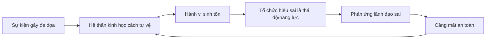
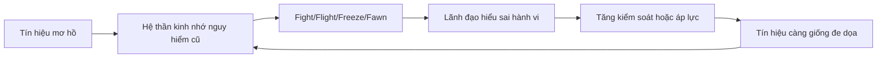

# Tập 28: Trauma-informed Leadership - Lãnh Đạo Hiểu Sang Chấn

**Hiểu sang chấn trong tổ chức, phản ứng sinh tồn, toxic leadership, an toàn tâm lý, tái kích hoạt, ranh giới, tái cấu trúc, sa thải, M&A và cách lãnh đạo tiêu chuẩn cao mà không gây hại**  
Giáo trình ngắn gọn cho người trưởng thành, cấp quản lý/C-level

---

## 0. Vì Sao C-level Cần Học Lãnh Đạo Hiểu Sang Chấn?

### Bản chất

Tổ chức không chỉ có chiến lược, quy trình và KPI.  
Tổ chức còn có ký ức cảm xúc.

Một lần sa thải hỗn loạn, một CEO hay làm nhục người khác, một thương vụ M&A thiếu minh bạch, một giai đoạn burnout kéo dài hoặc một văn hóa trừng phạt lỗi có thể để lại dấu vết lâu hơn bản thân sự kiện.

Sang chấn trong tổ chức không có nghĩa là mọi người yếu đuối.  
Nó nghĩa là hệ thần kinh của con người đã học rằng môi trường này không an toàn.

Ở cấp cao, nếu không hiểu sang chấn, lãnh đạo dễ:

- Nhầm sợ hãi với kỷ luật
- Nhầm im lặng với đồng thuận
- Nhầm phục tùng với cam kết
- Nhầm phản kháng với thái độ xấu
- Nhầm tốc độ với sức khỏe tổ chức
- Nhầm tiêu chuẩn cao với gây áp lực độc hại
- Nhầm "move on" với đã phục hồi

### Một câu cần nhớ

> Tổ chức không quên điều lãnh đạo từng làm khi con người ở trạng thái yếu thế.

### Mục tiêu tập này

| Năng lực | Ý nghĩa thực tế |
|---|---|
| Nhận diện sang chấn tổ chức | Biết khi nào vấn đề không chỉ là hiệu suất |
| Hiểu phản ứng sinh tồn | Đọc fight, flight, freeze, fawn trong hành vi nhân sự |
| Phân biệt tiêu chuẩn cao và gây hại | Giữ performance mà không tạo sợ hãi |
| Hỗ trợ không dung túng | Có lòng người nhưng vẫn có ranh giới và accountability |
| Lãnh đạo qua tái cấu trúc/M&A | Giảm tái kích hoạt, giữ sự thật và phục hồi niềm tin |

---

## 1. First Principles: Trauma-informed Leadership Là Gì?

### Bản chất

Trauma-informed leadership là cách lãnh đạo hiểu rằng hành vi của con người trong tổ chức không chỉ đến từ tính cách, năng lực hoặc động cơ.  
Hành vi còn đến từ hệ thần kinh đã học cách sống sót trong môi trường có đe dọa.

```text
Lãnh đạo hiểu sang chấn = Sự thật + An toàn + Ranh giới + Lựa chọn + Trách nhiệm + Phục hồi niềm tin
```

Đây không phải là lãnh đạo mềm yếu.  
Đây là lãnh đạo đủ tỉnh để không dùng nỗi sợ làm nhiên liệu vận hành.

### Mô hình gốc



### Câu hỏi gốc

```text
1. Hành vi này là thiếu năng lực, thiếu thiện chí hay phản ứng sinh tồn?
2. Điều gì trong hệ thống đang làm con người thấy bị đe dọa?
3. Tôi đang tạo rõ ràng hay làm họ phải đoán ý?
4. Tôi đang hỗ trợ để họ mạnh lên hay dung túng để vấn đề kéo dài?
5. Quyết định khó này có thể được làm bằng sự thật, phẩm giá và ranh giới không?
```

---

## 2. Sang Chấn Trong Tổ Chức Là Gì?

### Bản chất

Sang chấn tổ chức là dấu vết tâm lý và sinh lý còn lại sau những trải nghiệm khiến con người thấy mất kiểm soát, bị đe dọa, bị làm nhục, bị phản bội hoặc bị bỏ rơi trong môi trường làm việc.

Nó có thể đến từ một sự kiện lớn hoặc từ nhiều việc nhỏ lặp lại.

| Nguồn sang chấn | Ví dụ |
|---|---|
| Quyền lực độc hại | Sếp mắng nhục công khai, đe dọa, thay đổi ý liên tục |
| Bất định kéo dài | Tin đồn sa thải, không rõ tương lai, quyết định bị giấu |
| Phản bội niềm tin | Hứa không cắt người rồi cắt, dùng thông tin riêng để phạt |
| Burnout hệ thống | Làm quá tải nhiều tháng, nghỉ ngơi bị xem là thiếu cam kết |
| M&A/tái cấu trúc | Mất vai trò, mất nhóm, mất bản sắc nghề nghiệp |
| Văn hóa trừng phạt | Báo lỗi bị phạt, nói thật bị loại khỏi vòng trong |

### Dấu hiệu tổ chức còn mang sang chấn

| Dấu hiệu | Tầng sâu có thể là |
|---|---|
| Mọi người hỏi rất nhiều nhưng không nói thẳng | Sợ bị phạt nếu hiểu sai ý lãnh đạo |
| Họp im lặng, sau họp mới nói thật | Thiếu an toàn tâm lý |
| Tin xấu đến muộn | Từng có tiền lệ trừng phạt tin xấu |
| Nhân sự giỏi phòng vệ, né cam kết | Đã học rằng cam kết bị dùng để ép thêm |
| Quá nhạy với thay đổi nhỏ | Hệ thần kinh đang chờ nguy hiểm tiếp theo |
| Lãnh đạo mới làm đúng nhưng vẫn không được tin | Ký ức tổ chức chưa được xử lý |

### Nguyên tắc

> Sang chấn tổ chức không biến mất vì lãnh đạo nói "chúng ta nhìn về phía trước". Nó giảm khi hệ thống lặp lại đủ nhiều hành vi đáng tin.

---

## 3. Phản Ứng Sinh Tồn: Fight, Flight, Freeze, Fawn

### Bản chất

Khi con người thấy bị đe dọa, hệ thần kinh ưu tiên sống sót hơn học hỏi, sáng tạo hoặc hợp tác.

Trong tổ chức, phản ứng sinh tồn thường bị hiểu sai là vấn đề tính cách.

| Phản ứng | Biểu hiện trong công việc | Lãnh đạo dễ hiểu sai là |
|---|---|---|
| Fight | Cãi mạnh, phòng thủ, công kích, phản biện gắt | Chống đối |
| Flight | Né họp, đổi việc, bận liên tục, tránh đối thoại | Thiếu cam kết |
| Freeze | Im lặng, chậm quyết định, không chủ động | Kém năng lực |
| Fawn | Luôn đồng ý, chiều sếp, đọc ý, không nói thật | Trung thành |

### Cách đọc đúng hơn

```text
Hỏi ít hơn: Người này bị gì?
Hỏi nhiều hơn: Điều gì đang khiến hệ thần kinh của họ phải tự vệ?
```

Điều này không xóa trách nhiệm cá nhân.  
Nó giúp lãnh đạo chọn can thiệp đúng hơn.

| Nếu là | Cần |
|---|---|
| Thiếu năng lực | Đào tạo, hỗ trợ, tiêu chuẩn rõ |
| Thiếu thông tin | Làm rõ bối cảnh, quyền quyết định, kỳ vọng |
| Thiếu an toàn | Giảm đe dọa, tăng dự đoán được, bảo vệ người nói thật |
| Thiếu trách nhiệm | Ranh giới, hệ quả, accountability |

---

## 4. Toxic Leadership: Khi Lãnh Đạo Trở Thành Nguồn Đe Dọa

### Bản chất

Toxic leadership không chỉ là lãnh đạo khó tính.  
Đó là kiểu dùng quyền lực khiến con người phải vận hành bằng sợ hãi, xấu hổ, phục tùng hoặc tự bảo vệ liên tục.

### Dấu hiệu phổ biến

| Hành vi | Tác hại |
|---|---|
| Làm nhục công khai | Tạo xấu hổ, im lặng, phòng thủ |
| Thay đổi tiêu chuẩn tùy tâm trạng | Mọi người quản trị cảm xúc sếp thay vì quản trị việc |
| Đòi trung thành cá nhân | Sự thật bị thay bằng phe nhóm |
| Dùng đe dọa mơ hồ | Hệ thần kinh luôn cảnh giác |
| Thưởng người hy sinh quá mức | Burnout thành chuẩn văn hóa |
| Trừng phạt người phản biện | Tin xấu bị giấu |

### Phân biệt tiêu chuẩn cao và toxic leadership

| Tiêu chuẩn cao | Toxic leadership |
|---|---|
| Khó tính với kết quả và sự thật | Khó chịu với con người |
| Kỳ vọng rõ, đo được | Kỳ vọng mơ hồ, đổi liên tục |
| Feedback thẳng nhưng tôn trọng | Feedback làm nhục hoặc hạ thấp |
| Có hỗ trợ tương xứng | Chỉ ép, không tháo cản trở |
| Có hệ quả công bằng | Hệ quả tùy cảm xúc/quyền lực |
| Người giỏi thấy lớn lên | Người giỏi thấy phải tự vệ |

### Câu hỏi tự soi

```text
Tôi có đang dùng căng thẳng để ép tốc độ không:
Người khác sợ tôi thất vọng hay sợ tôi làm hại họ:
Sau feedback của tôi, người kia rõ việc hơn hay thấy mình nhỏ lại:
Tiêu chuẩn của tôi có ổn định khi tôi mệt, giận hoặc bị áp lực không:
```

---

## 5. An Toàn Tâm Lý Không Phải Là Dễ Dãi

### Bản chất

An toàn tâm lý là cảm giác có thể nói thật, hỏi, báo lỗi, phản biện và thừa nhận chưa biết mà không bị làm nhục, trả đũa hoặc loại trừ.

Nó không có nghĩa là không có áp lực, không có chuẩn hoặc không có hậu quả.

| Môi trường | An toàn | Tiêu chuẩn | Kết quả |
|---|---:|---:|---|
| Dễ dãi | Cao | Thấp | Thoải mái nhưng yếu |
| Sợ hãi | Thấp | Cao | Tốc độ ngắn hạn, hỏng dài hạn |
| Thờ ơ | Thấp | Thấp | Trì trệ |
| Trưởng thành | Cao | Cao | Học nhanh, chịu trách nhiệm |

### Công thức thực dụng

```text
An toàn tâm lý trưởng thành = Nói thật được + Bị thách thức được + Có trách nhiệm với tác động của mình
```

### Câu lãnh đạo nên dùng

| Tình huống | Câu nói tốt hơn |
|---|---|
| Tin xấu | "Cảm ơn vì đưa tin sớm. Bây giờ ta xử lý thực tế." |
| Sai lầm | "Lỗi này dạy gì về hệ thống và trách nhiệm cá nhân?" |
| Phản biện | "Điểm nào trong lập luận của tôi yếu nhất?" |
| Hiệu suất kém | "Chuẩn là X, hiện tại là Y, khoảng cách cần đóng là Z." |
| Quyết định khó | "Tôi sẽ nói rõ điều đã biết, điều chưa biết và thời điểm cập nhật." |

---

## 6. Tái Kích Hoạt: Khi Hiện Tại Đánh Thức Quá Khứ

### Bản chất

Tái kích hoạt là khi một tín hiệu hiện tại làm hệ thần kinh nhớ lại nguy hiểm cũ, dù tình huống hiện tại chưa chắc giống quá khứ.

Trong tổ chức, tái kích hoạt thường xảy ra khi có:

- Tin đồn tái cấu trúc
- Lãnh đạo mới nói giống lãnh đạo cũ từng gây hại
- Email mơ hồ từ cấp cao
- Cuộc họp bất ngờ không có agenda
- Feedback trước mặt nhiều người
- Mục tiêu tăng mạnh nhưng nguồn lực không tăng
- Thông báo M&A nhưng thiếu kế hoạch con người

### Vòng tái kích hoạt



### Cách giảm tái kích hoạt

| Việc lãnh đạo làm | Tác dụng |
|---|---|
| Nói rõ điều đã biết/chưa biết | Giảm đoán mò |
| Cập nhật đúng hẹn, kể cả chưa có tin mới | Tăng dự đoán được |
| Không dùng họp bất ngờ cho tin xấu nếu không cần | Giảm cảnh giác |
| Feedback riêng, cụ thể, về hành vi | Giảm xấu hổ |
| Cho lựa chọn trong phạm vi có thể | Trả lại cảm giác kiểm soát |
| Giữ lời nhỏ | Tái xây niềm tin bằng bằng chứng |

---

## 7. Hỗ Trợ Không Dung Túng

### Bản chất

Hiểu sang chấn không có nghĩa là miễn trách nhiệm.  
Nó nghĩa là khi một người đang khó khăn, lãnh đạo vẫn giữ phẩm giá của họ trong lúc giữ tiêu chuẩn của tổ chức.

```text
Hỗ trợ không dung túng = Thấu hiểu nguyên nhân + Rõ chuẩn + Hỗ trợ cụ thể + Mốc thời gian + Hệ quả công bằng
```

### Bảng phân biệt

| Cách làm | Biểu hiện | Hệ quả |
|---|---|---|
| Dung túng | Né feedback vì sợ làm người kia tổn thương | Chuẩn rơi, team bất công |
| Gây hại | Ép, mắng, đe dọa, làm nhục | Sợ hãi, phòng vệ, mất niềm tin |
| Hỗ trợ trưởng thành | Rõ khoảng cách, hỗ trợ thật, mốc rõ | Người có cơ hội phục hồi hoặc rời đi trong phẩm giá |

### Mẫu hội thoại

```text
Tôi muốn nói rõ cả hai điều.

Một là tôi hiểu giai đoạn này có áp lực thật, và tôi muốn biết điều gì đang cản bạn.
Hai là vai trò này vẫn cần đạt chuẩn A, B, C.

Trong 2 tuần tới, chúng ta sẽ hỗ trợ bằng X và kiểm tra bằng Y.
Nếu sau mốc đó khoảng cách vẫn còn, ta sẽ phải đổi phạm vi việc hoặc quyết định hướng khác.
```

### Nguyên tắc

> Lòng trắc ẩn không thay thế ranh giới. Ranh giới giúp lòng trắc ẩn không biến thành bất công với phần còn lại của tổ chức.

---

## 8. Ranh Giới: Điều Kiện Để An Toàn Không Thành Hỗn Loạn

### Bản chất

Ranh giới là đường phân biệt giữa điều được hỗ trợ, điều được chấp nhận và điều không được phép tiếp diễn.

Tổ chức hiểu sang chấn cần ranh giới rõ hơn, không mờ hơn.

| Ranh giới | Câu hỏi |
|---|---|
| Vai trò | Người này chịu trách nhiệm điều gì? |
| Hành vi | Hành vi nào không được chấp nhận dù có lý do? |
| Thời gian | Hỗ trợ kéo dài đến mốc nào? |
| Quyền riêng tư | Điều gì thuộc cá nhân, điều gì ảnh hưởng công việc? |
| Năng lực | Khoảng cách nào có thể đào tạo, khoảng cách nào không phù hợp vai trò? |
| Hệ quả | Nếu không thay đổi, quyết định tiếp theo là gì? |

### Những ranh giới không nên thương lượng

- Làm nhục, đe dọa hoặc quấy rối người khác
- Trả đũa người nói thật
- Che giấu rủi ro trọng yếu
- Lặp lại hành vi gây hại sau khi đã được phản hồi rõ
- Dùng nỗi đau cá nhân để miễn trách nhiệm với tác động lên người khác

### Câu hỏi tự soi

```text
Tôi đang tránh đặt ranh giới vì lòng thương hay vì sợ xung đột:
Ai đang chịu chi phí khi tôi không đặt ranh giới:
Ranh giới này có được áp dụng công bằng với người mạnh và người yếu không:
```

---

## 9. Tái Cấu Trúc, Sa Thải Và M&A: Lúc Tổ Chức Dễ Bị Tổn Thương Nhất

### Bản chất

Tái cấu trúc, sa thải và M&A không chỉ là quyết định tài chính hoặc vận hành.  
Đó là sự kiện đụng vào an toàn sinh tồn: thu nhập, địa vị, nhóm thuộc về, bản sắc và tương lai.

Không thể làm các quyết định này không đau.  
Nhưng có thể làm chúng ít gây hại hơn.

### Nguyên tắc khi phải ra quyết định khó

| Nguyên tắc | Thực hành |
|---|---|
| Sự thật | Không hứa điều chưa chắc |
| Phẩm giá | Không biến người rời đi thành con số |
| Dự đoán được | Nói rõ timeline, tiêu chí, kênh hỏi đáp |
| Công bằng | Tiêu chí nhất quán, có kiểm tra thiên kiến |
| Hỗ trợ | Severance, giới thiệu việc, thời gian chuyển giao nếu có thể |
| Bảo vệ người ở lại | Nói rõ chiến lược, tải việc, điều gì thay đổi |

### Bảng rủi ro trong M&A/tái cấu trúc

| Rủi ro | Dấu hiệu | Can thiệp |
|---|---|---|
| Tin đồn thay sự thật | Slack/nhóm riêng nóng lên | Cập nhật định kỳ, một nguồn thông tin chính thức |
| Người giỏi rời đi | Im lặng, giảm cam kết | Nói rõ vai trò, tương lai, quyền quyết định |
| Survivor guilt | Người ở lại thấy có lỗi | Thừa nhận mất mát, làm rõ lý do và kỳ vọng mới |
| Mất bản sắc | "Chúng ta không còn là chúng ta" | Giữ lại nghi thức/giá trị thật, không xóa lịch sử |
| Quá tải sau cắt giảm | Ít người hơn, việc không giảm | Cắt phạm vi, không chỉ cắt người |

### Câu lãnh đạo cần tránh

| Câu nên tránh | Vì sao |
|---|---|
| "Đây là cơ hội tuyệt vời cho tất cả." | Phủ nhận mất mát thật |
| "Mọi thứ sẽ không thay đổi." | Thường không đúng, làm mất niềm tin |
| "Gia đình chúng ta..." | Khi sa thải, ngôn ngữ gia đình gây phản bội |
| "Ai giỏi thì không cần lo." | Tăng sợ hãi và cạnh tranh phòng vệ |
| "Hãy tích cực lên." | Bắt người khác bỏ qua cảm xúc hợp lý |

---

## 10. Phục Hồi Niềm Tin Sau Khi Tổ Chức Đã Bị Tổn Thương

### Bản chất

Niềm tin không phục hồi bằng khẩu hiệu.  
Niềm tin phục hồi bằng chuỗi hành vi nhất quán đủ lâu, đặc biệt khi lãnh đạo có quyền chọn cách dễ hơn.

```text
Niềm tin = Năng lực + Chính trực + Thiện chí + Dự đoán được + Sửa sai khi có hại
```

### 5 bước phục hồi

| Bước | Việc làm |
|---|---|
| 1. Gọi đúng tên | Nói rõ điều đã gây hại, không nói vòng |
| 2. Nhận phần trách nhiệm | Không đổ hết cho thị trường, người cũ hoặc hoàn cảnh |
| 3. Sửa cơ chế | Đổi quy trình, incentive, quyền quyết định gây hại |
| 4. Lặp lại hành vi mới | Giữ lời nhỏ trong nhiều tuần/tháng |
| 5. Cho phép kiểm chứng | Để người khác thấy dữ kiện, không chỉ nghe lời hứa |

### Điều làm niềm tin hỏng thêm

- Xin lỗi chung chung nhưng không đổi hành vi
- Đòi người khác tin ngay
- Trừng phạt người vẫn còn nghi ngờ
- Gọi phản ứng của họ là tiêu cực
- Chỉ chăm sóc hình ảnh bên ngoài

### Nguyên tắc

> Sau tổn thương, người ta không tin vào ý định tốt trước. Họ tin vào bằng chứng lặp lại.

---

## 11. Lãnh Đạo Tiêu Chuẩn Cao Mà Không Gây Hại

### Bản chất

Tiêu chuẩn cao là cần thiết.  
Không có tiêu chuẩn, tổ chức trở thành nơi né khó, né trách nhiệm và bình thường hóa trung bình.

Vấn đề không phải là tiêu chuẩn cao.  
Vấn đề là dùng đe dọa, xấu hổ và mơ hồ để đạt tiêu chuẩn.

### Công thức

```text
Hiệu suất khỏe = Kỳ vọng rõ + Nguồn lực đủ + Feedback thẳng + Học nhanh + Hệ quả công bằng + Phục hồi năng lượng
```

### Bảng thực hành

| Thay vì | Hãy làm |
|---|---|
| "Tôi cần mọi người cố hơn." | "Chuẩn cần đạt là X, gap hiện tại là Y." |
| Mắng khi lỗi xảy ra | Phân loại lỗi: cẩu thả, thiếu năng lực, rủi ro học tập hay lỗi hệ thống |
| Đòi ownership mơ hồ | Trao quyền quyết định thật kèm ranh giới |
| Khen làm đêm liên tục | Khen kết quả bền vững và cách làm không đốt người |
| Để người giỏi độc hại thắng | Không thỏa hiệp với hành vi gây hại dù kết quả cao |

### Câu hỏi cho C-level

```text
Tiêu chuẩn nào thật sự không thương lượng:
Nguồn lực nào phải đi kèm tiêu chuẩn đó:
Hành vi nào đang đạt số nhưng phá văn hóa:
Người ở đây đang sợ thất bại hay học từ thất bại:
Chúng ta đang tối ưu quý này bằng cách vay nợ sức khỏe tổ chức bao nhiêu:
```

---

## 12. Công Cụ Thực Hành

### Công cụ 1: Trauma-informed Leadership Canvas

```text
Bối cảnh:
Sự kiện/áp lực hiện tại là gì:
Nhóm nào bị ảnh hưởng nhiều nhất:

Đe dọa:
Họ có thể đang sợ mất điều gì:
Tín hiệu nào dễ tái kích hoạt:
Điều gì đang mơ hồ:

Hành vi:
Fight/flight/freeze/fawn đang xuất hiện ở đâu:
Hành vi nào là sinh tồn, hành vi nào là vi phạm ranh giới:

Can thiệp:
Sự thật nào cần nói rõ:
Lựa chọn nào có thể trao lại:
Hỗ trợ cụ thể là gì:
Ranh giới không thương lượng là gì:
Mốc kiểm tra là khi nào:

Niềm tin:
Lời hứa nhỏ nào cần giữ:
Tín hiệu nào chứng minh hành vi mới:
Ai có quyền báo khi lãnh đạo lệch chuẩn:
```

### Công cụ 2: Checklist trước thông báo khó

```text
Thông điệp có nói rõ lý do thật không:
Có điều gì chưa biết được gọi đúng là chưa biết không:
Timeline cập nhật tiếp theo là khi nào:
Người bị ảnh hưởng có kênh hỏi riêng không:
Quản lý tuyến đầu đã được chuẩn bị chưa:
Ngôn ngữ có giữ phẩm giá người rời đi không:
Có hỗ trợ cụ thể hay chỉ có lời cảm ơn không:
Người ở lại biết ưu tiên mới và tải việc mới không:
```

### Công cụ 3: Bảng phân loại hành vi khó

| Hành vi | Có thể là sinh tồn? | Ranh giới bị ảnh hưởng? | Can thiệp đầu tiên |
|---|---|---|---|
| Im lặng trong họp | Có | Thấp | Tạo kênh nói thật, hỏi cụ thể |
| Công kích cá nhân | Có | Cao | Dừng hành vi, feedback riêng, hệ quả rõ |
| Né deadline | Có | Trung bình | Làm rõ cản trở, chuẩn, mốc hỗ trợ |
| Luôn đồng ý với sếp | Có | Trung bình | Mời phản biện, thưởng sự thật |
| Che giấu rủi ro | Có thể | Cao | Điều tra nguyên nhân, đặt hệ quả công bằng |

### Công cụ 4: Audit niềm tin sau tổn thương

```text
Sự kiện nào làm niềm tin giảm:
Lãnh đạo đã gọi đúng tên sự kiện chưa:
Điều gì đã được sửa trong hệ thống:
Lời hứa nào đã giữ:
Lời hứa nào đã vỡ:
Người nghi ngờ có bị xem là vấn đề không:
Bằng chứng nào cho thấy tổ chức đáng tin hơn trước:
```

---

## 13. Lộ Trình Thực Hành 4 Tuần

### Tuần 1: Nhận diện phản ứng sinh tồn

Mục tiêu:

- Nhìn hành vi khó bằng lăng kính hệ thần kinh và hệ thống
- Không vội gắn nhãn tính cách

Bài tập:

- Chọn 3 hành vi đang gây khó trong team.
- Phân loại fight, flight, freeze hoặc fawn.
- Ghi rõ: điều gì là dữ kiện cần hiểu, điều gì là ranh giới cần giữ.

### Tuần 2: Tăng an toàn tâm lý có tiêu chuẩn

Mục tiêu:

- Làm người khác nói thật sớm hơn
- Giữ chuẩn rõ hơn, không mềm hóa vô nguyên tắc

Bài tập:

- Trong 3 cuộc họp, hỏi: "Tin xấu nào chúng ta đang nói quá nhỏ?"
- Khi có lỗi, phân loại lỗi trước khi phản ứng.
- Viết lại một kỳ vọng mơ hồ thành chuẩn cụ thể.

### Tuần 3: Audit tái kích hoạt và ranh giới

Mục tiêu:

- Giảm tín hiệu mơ hồ gây cảnh giác
- Đặt ranh giới công bằng

Bài tập:

- Chọn một quy trình dễ gây lo: performance review, tái cấu trúc, thay đổi vai trò.
- Kiểm tra điểm mơ hồ, điểm thiếu lựa chọn, điểm dễ làm nhục.
- Đặt một ranh giới không thương lượng và một hỗ trợ cụ thể.

### Tuần 4: Phục hồi niềm tin bằng hành vi lặp lại

Mục tiêu:

- Biến lời nói thành bằng chứng
- Tạo cơ chế sửa khi lãnh đạo gây hại

Bài tập:

- Chọn một lời hứa nhỏ với tổ chức và giữ đúng hẹn.
- Tạo một kênh báo tin xấu không bị phạt.
- Review sau 2 tuần: người ta nói thật hơn, ít hơn hay chỉ nói khéo hơn?

---

## 14. Bảng Tóm Tắt First Principles

| Chủ đề | Bản chất | Câu hỏi áp dụng |
|---|---|---|
| Sang chấn tổ chức | Ký ức cảm xúc của hệ thống sau đe dọa/phản bội | Tổ chức đã học phải tự vệ ở đâu? |
| Phản ứng sinh tồn | Fight, flight, freeze, fawn khi thấy nguy hiểm | Đây là thái độ xấu hay tự vệ? |
| Toxic leadership | Dùng quyền lực tạo sợ hãi, xấu hổ, phục tùng | Người giỏi ở đây lớn lên hay nhỏ lại? |
| An toàn tâm lý | Nói thật không bị làm nhục/trả đũa | Tin xấu có đến sớm không? |
| Tái kích hoạt | Hiện tại đánh thức nguy hiểm cũ | Tín hiệu nào làm người ta cảnh giác quá mức? |
| Hỗ trợ không dung túng | Thấu hiểu nhưng vẫn giữ chuẩn và hệ quả | Tôi đang giúp họ mạnh lên hay né việc khó? |
| Ranh giới | Đường rõ giữa hỗ trợ và điều không thể tiếp diễn | Ai chịu chi phí nếu ranh giới mờ? |
| Tái cấu trúc/sa thải | Quyết định khó chạm vào an toàn sinh tồn | Việc này có được làm bằng sự thật và phẩm giá không? |
| M&A | Thay đổi quyền lực, bản sắc và tương lai | Ta đang tích hợp con người hay chỉ tích hợp sơ đồ tổ chức? |
| Phục hồi niềm tin | Bằng chứng lặp lại sau tổn thương | Lời hứa nào được giữ đủ lâu để người khác kiểm chứng? |
| Tiêu chuẩn cao | Kỳ vọng rõ, hỗ trợ đủ, hệ quả công bằng | Chuẩn cao này làm hệ thống mạnh lên hay sợ hơn? |

---

## 15. Một Câu Để Nhớ Toàn Bộ Tập 28

> Lãnh đạo hiểu sang chấn không hạ tiêu chuẩn; họ nâng tiêu chuẩn về cả kết quả, sự thật, phẩm giá và cách quyền lực chạm vào con người.
