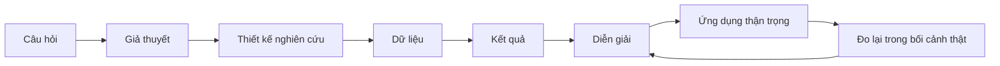
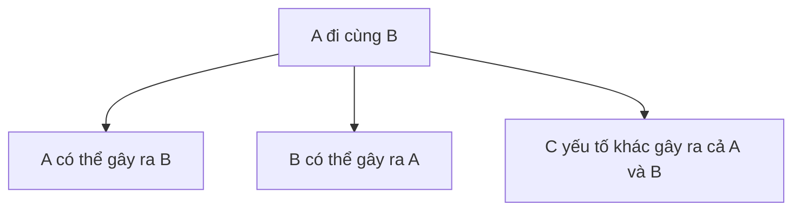
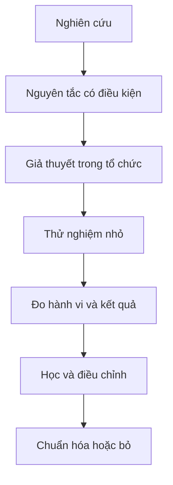

# Tập 29: Tư Duy Phản Biện Và Đọc Nghiên Cứu Tâm Lý

**Hiểu pop psychology, bằng chứng mạnh/yếu, correlation vs causation, sample size, replication, effect size, bias, đọc paper cơ bản và cách áp dụng nghiên cứu vào lãnh đạo/nhân sự mà không bị thuật ngữ hoặc guru dẫn dắt**  
Giáo trình ngắn gọn cho người trưởng thành, cấp quản lý/C-level

---

## 0. Vì Sao C-level Cần Học Tư Duy Phản Biện Khi Đọc Tâm Lý?

### Bản chất

Ở cấp cao, một ý tưởng tâm lý sai không chỉ làm bạn hiểu nhầm con người.  
Nó có thể biến thành chính sách tuyển dụng, đào tạo, đánh giá, văn hóa và chiến lược nhân sự tốn kém.

Trong doanh nghiệp, kiến thức tâm lý thường đi vào qua:

- Sách best-seller
- Bài nói truyền cảm hứng
- Khóa học lãnh đạo
- Mô hình tính cách
- Content mạng xã hội
- Consultant hoặc guru
- Paper được trích một nửa
- Thuật ngữ nghe rất khoa học

Vấn đề không phải là mọi thứ phổ biến đều sai.  
Vấn đề là người lãnh đạo cần biết **cái gì đáng tin, đáng thử, đáng đo và đáng bỏ qua**.

### Một câu cần nhớ

> Tư duy phản biện không phải là hoài nghi mọi thứ; đó là biết mức độ tin phù hợp với chất lượng bằng chứng.

### Mục tiêu tập này

| Năng lực | Ý nghĩa thực tế |
|---|---|
| Nhận diện pop psychology | Không biến ý tưởng hấp dẫn thành chính sách vội |
| Phân biệt bằng chứng mạnh/yếu | Biết nên tin đến đâu |
| Hiểu correlation vs causation | Không nhầm đi cùng nhau với gây ra nhau |
| Đọc sample size, effect size, replication | Không bị con số đẹp đánh lừa |
| Nhận diện bias | Giảm sai lệch khi đọc, chọn và áp dụng nghiên cứu |
| Đọc paper cơ bản | Lấy được ý chính mà không cần thành nhà khoa học |
| Đánh giá guru và thuật ngữ | Tách chất lượng ý tưởng khỏi hào quang cá nhân |
| Áp dụng vào lãnh đạo/nhân sự | Thử nhỏ, đo thật, sửa nhanh |
| Biết khi nào không nên tin kết luận | Bảo vệ tổ chức khỏi quyết định yếu bằng chứng |

---

## 1. First Principles: Bằng Chứng Là Gì?

### Bản chất

Bằng chứng là dữ liệu hoặc quan sát giúp ta cập nhật mức độ tin vào một kết luận.

```text
Niềm tin tốt = Câu hỏi rõ + Dữ liệu phù hợp + Phương pháp đúng + Hiệu ứng đủ lớn + Lặp lại được + Phù hợp bối cảnh
```

Một nghiên cứu không "chứng minh sự thật vĩnh viễn".  
Nó chỉ tăng hoặc giảm xác suất rằng một giả thuyết đúng trong điều kiện nhất định.

### Mô hình gốc



### Câu hỏi gốc

```text
1. Kết luận này trả lời câu hỏi gì?
2. Dữ liệu có thật sự đo điều được tuyên bố không?
3. Thiết kế nghiên cứu có cho phép nói về nguyên nhân không?
4. Hiệu ứng lớn đến mức nào trong đời thật?
5. Kết quả đã được lặp lại bởi nhóm khác chưa?
6. Bối cảnh nghiên cứu có giống tổ chức của tôi không?
```

---

## 2. Pop Psychology: Khi Ý Tưởng Hay Không Đồng Nghĩa Với Đúng

### Bản chất

Pop psychology là kiến thức tâm lý được đơn giản hóa để dễ hiểu, dễ nhớ, dễ bán hoặc dễ lan truyền.

Nó có thể hữu ích như cửa vào.  
Nhưng nếu dùng như sự thật chắc chắn, nó rất nguy hiểm.

### Dấu hiệu thường gặp

| Dấu hiệu | Rủi ro |
|---|---|
| Câu chuyện quá gọn, quá đẹp | Che mất ngoại lệ và điều kiện áp dụng |
| Chia người thành vài nhóm cứng | Làm nghèo sự phức tạp của con người |
| Dùng não bộ để hợp thức hóa mọi thứ | Nghe khoa học nhưng có thể suy diễn quá mức |
| Hứa thay đổi nhanh, dễ, chắc chắn | Bỏ qua bối cảnh, luyện tập và hệ thống |
| Trích một nghiên cứu nổi tiếng | Không biết nghiên cứu đó còn đứng vững không |
| Dựa nhiều vào trải nghiệm cá nhân của guru | Nhầm case cá nhân với quy luật chung |

### Nguyên tắc

> Ý tưởng càng dễ lan truyền, càng cần hỏi: nó đúng trong điều kiện nào, sai trong điều kiện nào, và bằng chứng mạnh đến đâu?

---

## 3. Thang Bằng Chứng Mạnh Và Yếu

### Bản chất

Không phải mọi bằng chứng có giá trị như nhau.  
Một câu chuyện hay, một khảo sát nhỏ và một meta-analysis không nên được đối xử ngang nhau.

### Thang thực dụng cho lãnh đạo

| Mức | Loại bằng chứng | Nên dùng thế nào |
|---|---|---|
| Rất yếu | Giai thoại, case cá nhân, trích dẫn nổi tiếng | Gợi ý để suy nghĩ, chưa đủ để quyết |
| Yếu | Khảo sát tự báo cáo, sample nhỏ, không nhóm so sánh | Dùng để đặt giả thuyết |
| Trung bình | Nghiên cứu quan sát tốt, dữ liệu lớn nhưng không random | Cẩn trọng với nguyên nhân |
| Mạnh | Thí nghiệm có nhóm đối chứng, pre-register, đo hành vi thật | Có thể thử áp dụng có kiểm soát |
| Rất mạnh | Nhiều nghiên cứu lặp lại, meta-analysis chất lượng, effect ổn định | Có thể đưa vào playbook, vẫn cần đo tại chỗ |

### Câu hỏi kiểm tra

```text
Kết luận này dựa trên câu chuyện, khảo sát, thí nghiệm hay tổng hợp nhiều nghiên cứu?
Ai thực hiện nghiên cứu?
Có xung đột lợi ích không?
Đã có nghiên cứu ngược lại chưa?
Kết quả có được đo bằng hành vi thật hay chỉ bằng cảm nhận?
```

---

## 4. Correlation Vs Causation

### Bản chất

Correlation nghĩa là hai thứ đi cùng nhau.  
Causation nghĩa là một thứ gây ra thay đổi ở thứ kia.

Đây là lỗi rất thường gặp trong lãnh đạo:

> "Nhân viên gắn kết cao có performance cao, vậy cứ tăng engagement là performance sẽ tăng."

Có thể đúng một phần.  
Nhưng cũng có thể người performance cao được công nhận nhiều hơn nên họ gắn kết hơn. Hoặc cả hai cùng bị ảnh hưởng bởi quản lý trực tiếp tốt.

### Ba khả năng khi thấy correlation



### Bảng ví dụ

| Kết luận vội | Khả năng khác |
|---|---|
| Người học nhiều thì thăng tiến, nên khóa học gây thăng tiến | Người tham vọng hơn vừa học nhiều vừa tìm cơ hội |
| Team hạnh phúc thì bán tốt, nên làm vui là đủ | Team bán tốt có thưởng cao nên hạnh phúc hơn |
| Người hướng ngoại lãnh đạo tốt hơn | Vai trò sales/visibility làm người hướng ngoại dễ được thấy hơn |
| Làm hybrid tăng nghỉ việc | Hybrid có thể xuất hiện ở team vốn đã bất mãn |

### Nguyên tắc

> Khi nghiên cứu không có thiết kế nhân quả, hãy nói "liên quan đến", đừng nói "gây ra".

---

## 5. Sample Size: Bao Nhiêu Người Là Đủ?

### Bản chất

Sample size là số người, nhóm hoặc quan sát được dùng trong nghiên cứu.

Sample nhỏ không tự động sai.  
Nhưng sample nhỏ làm kết quả dễ dao động, dễ bị ngoại lệ kéo lệch và khó khái quát.

### Cách đọc nhanh

| Tình huống | Câu hỏi cần hỏi |
|---|---|
| Nghiên cứu 20-50 người | Đây là nghiên cứu khám phá hay kết luận mạnh? |
| Chỉ sinh viên đại học | Có áp dụng được cho quản lý 40 tuổi không? |
| Chỉ một công ty/quốc gia | Văn hóa và ngành có ảnh hưởng không? |
| Nhiều người nhưng tự báo cáo | Dữ liệu lớn có đo đúng hành vi thật không? |
| Nhiều team nhưng cùng một lãnh đạo | Quan sát có độc lập không? |

### Nguyên tắc

> Sample lớn giúp giảm nhiễu, nhưng sample sai bối cảnh vẫn có thể dẫn đến quyết định sai.

---

## 6. Replication: Kết Quả Có Lặp Lại Được Không?

### Bản chất

Replication là việc một kết quả nghiên cứu được lặp lại bởi nghiên cứu khác, tốt nhất là bởi nhóm độc lập.

Tâm lý học từng có nhiều kết quả nổi tiếng nhưng khó lặp lại.  
Vì vậy, một nghiên cứu đơn lẻ nên được xem là tín hiệu, không phải kết luận cuối.

### Cần phân biệt

| Loại | Ý nghĩa |
|---|---|
| Direct replication | Làm lại gần giống nghiên cứu cũ |
| Conceptual replication | Kiểm tra cùng ý tưởng bằng cách khác |
| Failed replication | Không tìm thấy hiệu ứng tương tự |
| Mixed evidence | Có nghiên cứu ủng hộ, có nghiên cứu không |

### Câu hỏi thực dụng

```text
Kết quả này đã được nhóm khác lặp lại chưa?
Có meta-analysis hoặc review gần đây không?
Hiệu ứng có ổn định qua văn hóa, tuổi, nghề, bối cảnh không?
Nếu chưa lặp lại, tôi có đang dùng nó như giả thuyết thay vì chân lý không?
```

---

## 7. Effect Size: Hiệu Ứng Lớn Đến Đâu?

### Bản chất

Một kết quả có thể "có ý nghĩa thống kê" nhưng tác động ngoài đời rất nhỏ.

Effect size giúp trả lời:

> Nếu áp dụng, khác biệt thực tế lớn đến mức nào?

### Cách hiểu cho C-level

| Câu hỏi | Vì sao quan trọng |
|---|---|
| Hiệu ứng nhỏ, vừa hay lớn? | Để biết có đáng đổi chính sách không |
| Tác động lên ai? | Trung bình tốt nhưng một nhóm có thể không lợi |
| Chi phí áp dụng là gì? | Hiệu ứng nhỏ có thể không đáng nếu chi phí cao |
| Có tác dụng phụ không? | Một can thiệp tăng KPI này có thể hại KPI khác |
| Có bền không? | Hiệu ứng sau 1 tuần khác với sau 12 tháng |

### Ví dụ

| Kết quả nghe hay | Câu hỏi đúng hơn |
|---|---|
| Chương trình tăng wellbeing có ý nghĩa thống kê | Tăng bao nhiêu, kéo dài bao lâu, chi phí mỗi người là gì? |
| Test tính cách dự đoán performance | Dự đoán mạnh đến mức nào so với structured interview? |
| Đào tạo bias làm thái độ tốt hơn | Hành vi tuyển dụng có đổi không? |

### Nguyên tắc

> Đừng hỏi chỉ "có hiệu quả không"; hãy hỏi "hiệu quả lớn đủ để đáng làm không".

---

## 8. Bias: Sai Lệch Khi Đọc Và Dùng Nghiên Cứu

### Bản chất

Bias không chỉ nằm trong người được nghiên cứu.  
Bias cũng nằm trong người đọc, người trích dẫn và người muốn áp dụng kết quả.

### Các bias thường gặp

| Bias | Biểu hiện trong lãnh đạo |
|---|---|
| Confirmation bias | Chỉ chọn nghiên cứu ủng hộ điều mình đã tin |
| Authority bias | Tin vì tác giả nổi tiếng hoặc trường lớn |
| Novelty bias | Thích ý tưởng mới hơn ý tưởng đúng |
| Survivorship bias | Học từ người thắng và quên người làm giống vậy nhưng thua |
| Publication bias | Kết quả đẹp dễ được công bố hơn kết quả không có gì |
| Measurement bias | Đo thứ dễ đo thay vì thứ cần đo |
| Cultural bias | Áp dụng nghiên cứu phương Tây vào bối cảnh khác mà không kiểm tra |

### Công cụ: Bias pause 3 phút

```text
Tôi muốn kết luận này đúng vì lý do gì?
Ai được lợi nếu tổ chức tin kết luận này?
Bằng chứng ngược lại là gì?
Có nhóm người nào bị bỏ qua trong dữ liệu không?
Nếu đối thủ đọc cùng dữ liệu, họ có diễn giải khác không?
```

---

## 9. Đọc Paper Cơ Bản Không Cần Thành Nhà Khoa Học

### Bản chất

Bạn không cần đọc paper như nhà nghiên cứu.  
Bạn cần đọc đủ để biết kết luận có đáng tin và đáng áp dụng không.

### Thứ tự đọc nhanh

| Bước | Đọc phần nào | Cần lấy gì |
|---|---|---|
| 1 | Title và abstract | Câu hỏi, kết luận chính |
| 2 | Introduction cuối phần | Giả thuyết nghiên cứu |
| 3 | Method | Ai được nghiên cứu, đo bằng gì, thiết kế ra sao |
| 4 | Results | Kết quả chính, effect size, uncertainty |
| 5 | Discussion | Tác giả diễn giải và giới hạn thế nào |
| 6 | Limitations | Điều gì chưa được chứng minh |
| 7 | References | Có dựa trên dòng nghiên cứu rộng không |

### Template đọc một paper

```text
Tên paper:
Câu hỏi nghiên cứu:
Đối tượng/sample:
Thiết kế: quan sát, thí nghiệm, longitudinal, meta-analysis?
Đo lường chính:
Kết quả chính:
Effect size/độ lớn thực tế:
Giới hạn tác giả nêu:
Điều paper KHÔNG chứng minh:
Khả năng áp dụng vào tổ chức của tôi:
Thử nghiệm nhỏ có thể làm:
```

### Nguyên tắc

> Đọc paper tốt là đọc cả kết luận lẫn giới hạn; chỉ đọc abstract rất dễ biến nghiên cứu thành khẩu hiệu.

---

## 10. Guru, Thuật Ngữ Và Hào Quang Khoa Học

### Bản chất

Guru giỏi có thể giúp phổ biến kiến thức.  
Guru nguy hiểm khi biến sự tự tin, câu chuyện cá nhân và thuật ngữ thành thay thế cho bằng chứng.

### Dấu hiệu cần cảnh giác

| Tín hiệu | Cần hỏi |
|---|---|
| "Khoa học đã chứng minh..." | Nghiên cứu nào, thiết kế gì, đã lặp lại chưa? |
| Một mô hình giải thích mọi vấn đề | Ngoại lệ là gì? |
| Chỉ có testimonial, không có dữ liệu | Có đo hành vi và kết quả thật không? |
| Thuật ngữ não bộ dày đặc | Có liên quan trực tiếp đến can thiệp không? |
| Tấn công người hỏi bằng chứng | Đây là giáo dục hay quyền lực? |
| Bán chứng chỉ quá nhanh | Năng lực được kiểm tra thế nào? |

### Bảng dịch thuật ngữ về câu hỏi thật

| Thuật ngữ nghe hay | Câu hỏi cần kéo về |
|---|---|
| Neuro-based leadership | Hành vi lãnh đạo nào đổi, đo bằng gì? |
| Growth mindset culture | Người quản lý có phản hồi và thiết kế lỗi học tập ra sao? |
| Psychological safety | Người nói thật có bị phạt không? |
| Emotional intelligence | Năng lực cụ thể nào: nhận biết, điều chỉnh, đồng cảm hay giao tiếp? |
| High-performance personality | Dự đoán performance tốt hơn công cụ tuyển dụng hiện tại không? |

### Nguyên tắc

> Thuật ngữ tốt làm vấn đề rõ hơn. Thuật ngữ xấu làm người nghe ngại hỏi lại.

---

## 11. Áp Dụng Nghiên Cứu Vào Lãnh Đạo Và Nhân Sự

### Bản chất

Nghiên cứu không nên đi thẳng từ paper sang policy.  
Nó nên đi qua một vòng dịch, thử, đo và sửa.

### Mô hình áp dụng



### Bảng chuyển hóa

| Từ nghiên cứu | Sang quản trị |
|---|---|
| "Feedback thường xuyên giúp học tốt hơn" | Thiết kế 1-1 có phản hồi cụ thể mỗi 2 tuần |
| "Structured interview dự đoán tốt hơn phỏng vấn tự do" | Chuẩn hóa câu hỏi, thang điểm và calibration |
| "Psychological safety liên quan đến học nhóm" | Đo việc nói rủi ro, hỏi ngu, phản biện sếp |
| "Goal setting có thể tăng performance" | Đặt mục tiêu rõ, khó vừa phải, có feedback |
| "Stress cao kéo dài hại hiệu suất" | Theo dõi tải việc, phục hồi và lỗi vận hành |

### Nguyên tắc

> Áp dụng nghiên cứu không phải là copy kết luận; đó là biến kết luận thành giả thuyết vận hành có thể đo.

---

## 12. Khi Nào Không Nên Tin Kết Luận?

### Bản chất

Một kết luận có thể đúng trong paper nhưng không đủ để bạn tin hoặc dùng ngay trong tổ chức.

### Checklist cảnh báo

- [ ] Kết luận lớn nhưng chỉ dựa trên một nghiên cứu nhỏ
- [ ] Không rõ sample là ai
- [ ] Chỉ đo cảm nhận, không đo hành vi
- [ ] Thiết kế correlation nhưng tác giả/diễn giả nói như causation
- [ ] Effect size rất nhỏ nhưng được quảng bá quá mạnh
- [ ] Không có replication hoặc có replication thất bại
- [ ] Không nêu limitations
- [ ] Có xung đột lợi ích thương mại
- [ ] Không phù hợp văn hóa, ngành, cấp bậc hoặc độ tuổi
- [ ] Không có cách đo tác động khi áp dụng

### Bảng quyết định nhanh

| Tình huống | Hành động |
|---|---|
| Bằng chứng yếu, rủi ro cao | Không dùng làm chính sách |
| Bằng chứng yếu, rủi ro thấp | Có thể thử nhỏ, nói rõ là thử nghiệm |
| Bằng chứng trung bình, chi phí thấp | Pilot có đo lường |
| Bằng chứng mạnh, phù hợp bối cảnh | Đưa vào playbook, vẫn theo dõi |
| Bằng chứng trái chiều | Chưa chuẩn hóa, cần test trong bối cảnh của mình |

---

## 13. Công Cụ Thực Hành: Research-to-Decision Canvas

### Khi nào dùng

Dùng trước khi mua một chương trình đào tạo, áp dụng mô hình lãnh đạo, dùng test nhân sự hoặc thay đổi chính sách dựa trên một ý tưởng tâm lý.

```text
1. Tuyên bố chính:
- Ý tưởng đang được đề xuất là gì?
- Nó hứa giải quyết vấn đề nào?

2. Bằng chứng:
- Nguồn chính là paper, sách, case hay testimonial?
- Có bao nhiêu nghiên cứu ủng hộ?
- Có replication/meta-analysis không?
- Có bằng chứng ngược lại không?

3. Chất lượng:
- Sample là ai?
- Thiết kế có nói được nhân quả không?
- Effect size lớn đến đâu?
- Đo hành vi thật hay cảm nhận?

4. Bối cảnh:
- Tổ chức của tôi giống và khác bối cảnh nghiên cứu ở đâu?
- Nhóm nào có thể không phù hợp?
- Rủi ro đạo đức hoặc công bằng là gì?

5. Thử nghiệm:
- Pilot nhỏ nhất là gì?
- Đo chỉ số hành vi nào?
- Ngưỡng thành công/thất bại là gì?
- Khi nào dừng, sửa hoặc nhân rộng?
```

---

## 14. Checklist Đọc Nhanh Một Ý Tưởng Tâm Lý

### Bản chất

Checklist này giúp bạn không bị kéo đi bởi sự hấp dẫn của câu chuyện trước khi kiểm tra chất lượng bằng chứng.

```text
Ý tưởng này nói chính xác điều gì:
Nó dựa trên loại bằng chứng nào:
Correlation hay causation:
Sample là ai và có đủ gần với bối cảnh của tôi không:
Effect size có đáng kể không:
Đã được replication chưa:
Có bias hoặc lợi ích thương mại không:
Điều kiện áp dụng là gì:
Tác dụng phụ có thể là gì:
Tôi sẽ đo gì nếu thử:
```

### Câu hỏi cho nhà cung cấp/consultant

| Câu hỏi | Mục đích |
|---|---|
| Bằng chứng mạnh nhất cho mô hình này là gì? | Tách khoa học khỏi marketing |
| Kết quả nào đã được đo bằng hành vi thật? | Tránh chỉ đo hài lòng |
| Khi nào mô hình này không hiệu quả? | Kiểm tra độ trung thực |
| Có nghiên cứu độc lập không? | Giảm xung đột lợi ích |
| Pilot 30-60 ngày nên đo gì? | Ép ý tưởng thành vận hành |

---

## 15. Ứng Dụng Cho Các Quyết Định Nhân Sự

### Bản chất

Nhân sự là nơi ý tưởng tâm lý dễ bị dùng quá mức vì con người phức tạp, dữ liệu nhiễu và ai cũng có trực giác riêng.

### Bảng áp dụng thực dụng

| Quyết định | Cách dùng nghiên cứu tốt hơn |
|---|---|
| Tuyển dụng | Ưu tiên structured interview, work sample, tiêu chí rõ |
| Đánh giá hiệu suất | Tách kết quả, hành vi, bối cảnh và bias của người đánh giá |
| Đào tạo lãnh đạo | Đo hành vi sau đào tạo, không chỉ điểm hài lòng |
| Engagement | Xem là tín hiệu hệ thống, không phải mục tiêu trang trí |
| Culture change | Đổi ritual, incentives và chuẩn phản hồi, không chỉ slogan |
| Wellbeing | Đo tải việc, quyền kiểm soát, phục hồi và hỗ trợ quản lý |
| Test tính cách | Không dùng như định mệnh; kiểm tra validity cho mục tiêu cụ thể |

### Nguyên tắc đạo đức

- Không gắn nhãn cố định con người bằng một bài test.
- Không dùng thuật ngữ tâm lý để hợp thức hóa thiên kiến cá nhân.
- Không biến dữ liệu yếu thành lý do loại, phạt hoặc đóng cơ hội.
- Không áp dụng can thiệp tâm lý mà không nói rõ mục tiêu và ranh giới.
- Không đo con người nhiều hơn mức tổ chức sẵn sàng dùng dữ liệu một cách tử tế.

---

## 16. Lộ Trình Thực Hành 4 Tuần

### Tuần 1: Dọn lại niềm tin tâm lý đang dùng

- Liệt kê 10 ý tưởng tâm lý đang ảnh hưởng đến cách bạn lãnh đạo.
- Đánh dấu nguồn: trải nghiệm, sách, khóa học, paper, consultant.
- Chọn 2 ý tưởng có tác động lớn nhất đến quyết định nhân sự.

### Tuần 2: Kiểm tra bằng chứng

- Tìm nguồn gốc nghiên cứu hoặc review gần nhất cho 2 ý tưởng đó.
- Ghi sample, thiết kế, effect size, replication và limitations.
- Viết lại kết luận bằng ngôn ngữ thận trọng hơn.

### Tuần 3: Biến thành giả thuyết vận hành

- Chọn một ý tưởng đáng thử trong tổ chức.
- Thiết kế pilot nhỏ trong 30-60 ngày.
- Chọn 1-2 chỉ số hành vi và một chỉ số kết quả.

### Tuần 4: Review và chuẩn hóa

- So sánh dữ liệu trước/sau hoặc nhóm thử/nhóm đối chiếu nếu có.
- Ghi rõ điều hiệu quả, điều không hiệu quả, điều chưa biết.
- Quyết định: bỏ, sửa, thử tiếp hoặc đưa vào playbook.

---

## 17. Bảng Tóm Tắt First Principles

| Chủ đề | Bản chất | Câu hỏi áp dụng |
|---|---|---|
| Tư duy phản biện | Điều chỉnh mức tin theo chất lượng bằng chứng | Tôi nên tin kết luận này đến mức nào? |
| Pop psychology | Ý tưởng dễ hiểu, dễ lan truyền, thường bị đơn giản hóa | Điều gì đã bị lược bỏ để câu chuyện nghe hay? |
| Bằng chứng | Dữ liệu giúp cập nhật niềm tin | Loại bằng chứng này mạnh hay yếu? |
| Correlation | Hai biến đi cùng nhau | Có yếu tố thứ ba nào giải thích cả hai không? |
| Causation | Một biến gây thay đổi ở biến khác | Thiết kế nghiên cứu có cho phép nói về nguyên nhân không? |
| Sample size | Số quan sát trong nghiên cứu | Sample này đủ lớn và đủ giống bối cảnh của tôi không? |
| Replication | Kết quả được lặp lại độc lập | Có ai khác tìm thấy hiệu ứng tương tự chưa? |
| Effect size | Độ lớn thực tế của tác động | Hiệu ứng này có đáng đổi chính sách không? |
| Statistical significance | Khả năng kết quả không chỉ do ngẫu nhiên | Có ý nghĩa thống kê nhưng có ý nghĩa kinh doanh không? |
| Bias | Sai lệch trong đo, đọc, chọn và diễn giải | Tôi muốn kết luận này đúng vì điều gì? |
| Paper | Báo cáo nghiên cứu có phương pháp và giới hạn | Paper này chứng minh gì và không chứng minh gì? |
| Guru | Người phổ biến ý tưởng, không tự động là nguồn chân lý | Họ có chấp nhận câu hỏi về bằng chứng không? |
| Thuật ngữ | Nhãn giúp gọi tên khái niệm | Thuật ngữ này làm rõ hành vi nào? |
| Ứng dụng | Dịch nghiên cứu thành thử nghiệm có đo lường | Pilot nhỏ nhất và chỉ số thật là gì? |
| Không nên tin | Khi kết luận vượt quá bằng chứng | Điều kiện nào khiến tôi phải dừng hoặc giảm mức tin? |

---

## 18. Một Câu Để Nhớ Toàn Bộ Tập 29

> Người lãnh đạo trưởng thành không hỏi "ý tưởng này nghe hay không", mà hỏi "bằng chứng mạnh đến đâu, đúng trong điều kiện nào, và tôi sẽ đo gì trước khi tin nó trong tổ chức của mình".
