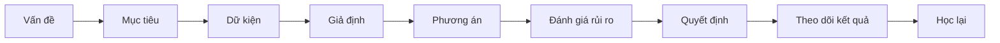

# Tập 3: Ra Quyết Định Và Thiên Kiến Tư Duy

**Hiểu vì sao người thông minh vẫn quyết định sai, và cách thiết kế quyết định tỉnh hơn**  
Giáo trình ngắn gọn cho người trưởng thành, cấp quản lý/C-level

---

## 0. Vì Sao C-level Cần Học Ra Quyết Định?

### Bản chất

Ở cấp thấp, sai lầm thường nằm ở kỹ năng thực thi.  
Ở cấp cao, sai lầm thường nằm ở **chất lượng quyết định**.

Một quyết định sai ở C-level có thể làm mất:

- Tiền
- Người giỏi
- Thời gian
- Cơ hội thị trường
- Uy tín
- Tinh thần tổ chức
- Nhiều năm lợi thế cạnh tranh

### Một câu cần nhớ

> Người thông minh vẫn quyết định sai vì não không được thiết kế để nhìn sự thật khách quan. Não được thiết kế để sống sót, bảo vệ cái tôi và tiết kiệm năng lượng.

### Mục tiêu tập này

Sau tập này, bạn cần làm được 5 việc:

| Năng lực | Ý nghĩa thực tế |
|---|---|
| Tách dữ kiện khỏi diễn giải | Không nhầm cảm giác với sự thật |
| Nhận ra thiên kiến | Biết não đang bẻ cong thực tế ở đâu |
| Phân loại quyết định | Biết quyết nhanh hay chậm |
| Thiết kế phản biện | Tránh đồng thuận giả |
| Ra quyết định có kỷ luật | Giảm sai lầm do ego, sợ hãi, áp lực |

---

## 1. First Principles: Quyết Định Là Gì?

### Bản chất

Quyết định là hành động chọn một hướng đi trong điều kiện:

- Không đủ dữ kiện
- Có rủi ro
- Có chi phí cơ hội
- Có cảm xúc
- Có áp lực thời gian
- Có lợi ích của nhiều bên

> Quyết định không phải là chọn điều chắc chắn đúng. Quyết định là chọn hướng hợp lý nhất với dữ kiện, mục tiêu và rủi ro hiện có.

### Công thức gốc

```text
Quyết định = Mục tiêu + Dữ kiện + Giả định + Rủi ro + Giá trị ưu tiên + Thời điểm
```

Nếu thiếu một phần, quyết định dễ méo.

| Thiếu gì | Hậu quả |
|---|---|
| Mục tiêu | Tối ưu nhầm thứ |
| Dữ kiện | Quyết theo cảm giác |
| Nhận diện giả định | Tưởng điều chưa chắc là sự thật |
| Rủi ro | Lạc quan quá mức |
| Giá trị ưu tiên | Mâu thuẫn nội bộ |
| Thời điểm | Đúng nhưng quá muộn |

### Mô hình tổng quát



### Câu hỏi mở đầu mọi quyết định

```text
1. Chúng ta thật sự đang quyết điều gì?
2. Mục tiêu tối thượng là gì?
3. Nếu chỉ được tối ưu một thứ, đó là gì?
4. Điều gì không được hy sinh?
```

---

## 2. Hai Hệ Thống Tư Duy: Nhanh Và Chậm

### Bản chất

Não có hai kiểu xử lý:

| Hệ | Đặc điểm | Dùng tốt khi | Nguy hiểm khi |
|---|---|---|---|
| Nhanh | Trực giác, cảm xúc, kinh nghiệm | Tình huống quen, cần phản ứng nhanh | Vấn đề mới, phức tạp, nhiều rủi ro |
| Chậm | Phân tích, so sánh, kiểm chứng | Quyết định lớn, khó đảo ngược | Quá phân tích, bỏ lỡ thời điểm |

### Trực giác không xấu

Trực giác là kinh nghiệm được nén lại.

Nhưng trực giác chỉ đáng tin khi:

- Bạn có kinh nghiệm thật trong lĩnh vực đó
- Môi trường có quy luật tương đối ổn định
- Bạn từng nhận phản hồi nhanh và rõ
- Bạn không bị cảm xúc mạnh chi phối

### Khi nào không nên tin trực giác?

| Tình huống | Lý do |
|---|---|
| Thị trường mới | Kinh nghiệm cũ có thể sai |
| Sản phẩm mới | Chưa có mẫu hình đủ chắc |
| Tuyển senior/C-level | Ấn tượng ban đầu dễ đánh lừa |
| M&A/đầu tư lớn | Ego và narrative rất mạnh |
| Đang giận/sợ | Cảm xúc giả dạng trực giác |

### Quy tắc thực dụng

> Trực giác được dùng để tạo giả thuyết. Dữ kiện và phản biện dùng để kiểm chứng giả thuyết.

---

## 3. Dữ Kiện, Diễn Giải Và Câu Chuyện Trong Đầu

### Bản chất

Con người không sống trực tiếp trong sự thật.  
Con người sống trong **câu chuyện mà não tạo ra từ sự thật**.

### Ba lớp cần tách

| Lớp | Nghĩa | Ví dụ |
|---|---|---|
| Dữ kiện | Điều quan sát/đo được | Doanh thu giảm 12% trong quý |
| Diễn giải | Ý nghĩa ta gán cho dữ kiện | Thị trường không còn cần sản phẩm |
| Câu chuyện | Narrative lớn hơn | Công ty đang mất năng lực cạnh tranh |

### Ví dụ

Sự kiện:

> Một nhân sự chủ chốt xin nghỉ.

Các diễn giải có thể:

- Người đó thiếu cam kết
- Sếp trực tiếp có vấn đề
- Chế độ không cạnh tranh
- Văn hóa đã xuống
- Đây là tín hiệu thị trường nhân sự

Nếu nhầm diễn giải với dữ kiện, ta sẽ xử lý sai.

### Bài tập tách lớp

Khi gặp vấn đề lớn, viết:

| Dữ kiện chắc chắn | Diễn giải của tôi | Diễn giải khác có thể đúng |
|---|---|---|
|  |  |  |

### Câu hỏi kiểm tra

```text
1. Điều gì là sự thật đo được?
2. Điều gì chỉ là suy luận?
3. Tôi đang thích câu chuyện nào nhất?
4. Câu chuyện nào làm tôi khó chịu nhưng có thể đúng?
```

---

## 4. Thiên Kiến Xác Nhận: Ta Tìm Điều Chứng Minh Mình Đúng

### Bản chất

Thiên kiến xác nhận là xu hướng:

> Tìm, nhớ và tin những thông tin ủng hộ điều mình đã tin.

### Vì sao nguy hiểm?

Vì người càng thông minh càng giỏi tìm lý do để bảo vệ quan điểm của mình.

### Biểu hiện trong lãnh đạo

| Biểu hiện | Ví dụ |
|---|---|
| Chỉ hỏi người đồng ý | Chọn cố vấn dễ chịu |
| Bỏ qua tín hiệu yếu | Khách hàng phàn nàn nhưng xem là cá biệt |
| Diễn giải dữ kiện theo hướng có lợi | "Tăng trưởng chậm là do mùa vụ" |
| Phạt người nói ngược | Tổ chức dần mất sự thật |

### Cách chống

Đừng hỏi:

> Dữ kiện nào chứng minh tôi đúng?

Hỏi:

> Dữ kiện nào sẽ khiến tôi đổi ý?

### Công cụ: Pre-mortem

Trước khi triển khai quyết định lớn, giả định:

> 12 tháng sau, quyết định này thất bại nặng.

Sau đó hỏi:

```text
1. Vì sao nó thất bại?
2. Tín hiệu cảnh báo sớm là gì?
3. Ai đã thấy rủi ro nhưng không nói?
4. Điều gì chúng ta đang tự lừa mình?
5. Cần kiểm chứng gì trước khi đi xa hơn?
```

---

## 5. Thiên Kiến Sợ Mất Mát: Mất Đau Hơn Được Vui

### Bản chất

Con người thường cảm thấy đau vì mất mát mạnh hơn niềm vui khi đạt được lợi ích tương đương.

> Sợ mất làm ta giữ cái cũ quá lâu, kể cả khi cái cũ không còn tốt.

### Biểu hiện ở cấp cao

| Tình huống | Sợ mất mát khiến ta |
|---|---|
| Sản phẩm cũ giảm hiệu quả | Không dám khai tử |
| Nhân sự lâu năm không còn phù hợp | Không dám thay |
| Dự án đã đốt nhiều tiền | Tiếp tục vì tiếc |
| Mô hình kinh doanh yếu | Vá víu thay vì chuyển hướng |
| Đối tác xấu | Giữ vì sợ mất doanh thu |

### Câu hỏi cắt qua sợ mất

```text
1. Nếu hôm nay chưa sở hữu thứ này, tôi có chọn mua/giữ nó không?
2. Nếu dự án này chưa bắt đầu, tôi có phê duyệt nó không?
3. Tôi đang giữ vì còn giá trị hay vì tiếc chi phí cũ?
4. Cái giá của việc tiếp tục là gì?
```

### Nguyên tắc

> Chi phí đã mất không nên quyết định tương lai. Tương lai nên được quyết bởi giá trị còn lại và cơ hội phía trước.

---

## 6. Thiên Kiến Chi Phí Chìm: Đã Lỡ Đầu Tư Nên Cố Tiếp

### Bản chất

Chi phí chìm là tiền, thời gian, công sức đã bỏ ra và không lấy lại được.

Sai lầm là:

> Tiếp tục một việc kém hiệu quả chỉ vì đã đầu tư quá nhiều.

### Ví dụ

| Bối cảnh | Câu nói nguy hiểm |
|---|---|
| Dự án công nghệ | "Đã làm 18 tháng rồi, cố thêm đi." |
| Nhân sự cấp cao | "Tuyển rất khó, thay bây giờ mất công." |
| Chiến lược thị trường | "Đã mở văn phòng rồi, không thể rút." |
| Quan hệ đối tác | "Đã đi với nhau lâu, bỏ sao được." |

### Câu hỏi đúng

Không hỏi:

> Ta đã bỏ bao nhiêu vào đây?

Hỏi:

> Từ hôm nay trở đi, bỏ thêm vào đây có đáng không?

### Bảng quyết định

| Câu hỏi | Trả lời |
|---|---|
| Giá trị còn lại là gì? |  |
| Chi phí tiếp tục là gì? |  |
| Cơ hội khác bị mất là gì? |  |
| Tín hiệu nào cho thấy cần dừng? |  |
| Ai có lợi ích cảm xúc trong việc tiếp tục? |  |

---

## 7. Thiên Kiến Gần Đây Và Dễ Nhớ

### Bản chất

Cái gì mới xảy ra, nổi bật, gây cảm xúc mạnh thì dễ được não xem là quan trọng hơn thực tế.

### Ví dụ

| Sự kiện nổi bật | Sai lầm có thể xảy ra |
|---|---|
| Một khách hàng lớn rời đi | Tưởng toàn bộ thị trường xấu |
| Một nhân sự mới gây ấn tượng | Đánh giá quá cao năng lực thật |
| Một lỗi truyền thông | Phản ứng quá tay |
| Một deal thắng lớn | Tưởng chiến lược đã đúng |

### Cách chống

Hỏi:

```text
1. Đây là tín hiệu hay nhiễu?
2. Nó đại diện cho xu hướng hay chỉ là sự kiện riêng lẻ?
3. Dữ liệu 6-12 tháng nói gì?
4. Nếu sự kiện này không gây cảm xúc mạnh, tôi có đánh giá khác không?
```

### Nguyên tắc

> Dữ kiện gây ấn tượng không luôn là dữ kiện quan trọng.

---

## 8. Thiên Kiến Quyền Lực Và Đồng Thuận Giả

### Bản chất

Trong tổ chức, người có quyền lực thường nhận được ít sự thật hơn họ tưởng.

Vì cấp dưới có thể:

- Sợ mất lòng
- Sợ bị phạt
- Muốn giữ hình ảnh
- Muốn được thăng tiến
- Không muốn mang tiếng tiêu cực

### Đồng thuận giả là gì?

Là khi mọi người gật đầu, nhưng không thật sự tin, không thật sự hiểu, hoặc không dám phản đối.

### Dấu hiệu

| Dấu hiệu | Ý nghĩa |
|---|---|
| Cuộc họp quá êm | Có thể thiếu sự thật |
| Không ai phản biện | Có thể thiếu an toàn |
| Sau họp mới bàn riêng | Cuộc họp chính không thật |
| Quyết định xong nhưng thực thi chậm | Đồng thuận bề mặt |
| Chỉ có tin tốt đi lên | Hệ thống đang lọc sự thật |

### Cách thiết kế phản biện

```text
1. Chỉ định một người phản biện chính thức.
2. Yêu cầu mỗi phương án có phần "vì sao có thể sai".
3. Cho phép gửi phản biện ẩn danh với vấn đề nhạy cảm.
4. Lãnh đạo nói trước: "Tôi có thể sai ở đâu?"
5. Thưởng người phát hiện rủi ro sớm.
```

### Câu hỏi cho CEO/C-level

> Trong tổ chức này, nói sự thật có an toàn không, hay chỉ nói điều đúng chính trị mới an toàn?

---

## 9. Thiên Kiến Ego: Muốn Đúng Hơn Muốn Thật

### Bản chất

Ego khiến ta gắn bản thân với quyết định.

Khi đó, nếu quyết định sai, ta không chỉ thấy:

> Phương án sai.

Ta cảm thấy:

> Tôi sai. Tôi kém. Tôi mất mặt.

Và não bắt đầu phòng vệ.

### Biểu hiện

| Biểu hiện | Nghĩa bên dưới |
|---|---|
| Không đổi ý dù dữ kiện đổi | Sợ mất hình ảnh |
| Tấn công người phản biện | Bảo vệ ego |
| Chọn dữ kiện có lợi | Bảo vệ câu chuyện cũ |
| Trì hoãn thừa nhận sai | Sợ hậu quả xã hội |
| Đổ lỗi cho thực thi | Né sai lầm chiến lược |

### Câu hỏi chống ego

```text
1. Tôi đang bảo vệ quyết định hay bảo vệ sự thật?
2. Nếu người khác đưa ra quyết định này, tôi sẽ đánh giá thế nào?
3. Dữ kiện nào đủ mạnh để tôi đổi ý?
4. Tôi có đang nhầm kiên định với cố chấp không?
```

### Nguyên tắc

> Đổi ý khi dữ kiện đổi không phải yếu. Đó là năng lực lãnh đạo trưởng thành.

---

## 10. Quyết Định Một Chiều Và Hai Chiều

### Bản chất

Không phải quyết định nào cũng cần cùng mức phân tích.

### Phân loại

| Loại quyết định | Đặc điểm | Cách xử lý |
|---|---|---|
| Hai chiều | Dễ đảo ngược, học được nhanh | Quyết nhanh, thử nhỏ |
| Một chiều | Khó đảo ngược, hậu quả lớn | Chậm lại, phản biện kỹ |

### Ví dụ

| Hai chiều | Một chiều |
|---|---|
| Thử kênh marketing mới | M&A lớn |
| Thử giá trong một phân khúc | Sa thải C-level |
| Pilot quy trình mới | Đổi mô hình kinh doanh |
| Thử công cụ nội bộ | Cam kết pháp lý dài hạn |

### Sai lầm phổ biến

| Sai lầm | Hậu quả |
|---|---|
| Xử lý quyết định hai chiều quá chậm | Mất tốc độ học |
| Xử lý quyết định một chiều quá nhanh | Trả giá lớn |

### Câu hỏi

```text
1. Quyết định này có đảo ngược được không?
2. Nếu sai, thiệt hại tối đa là gì?
3. Có thể thử nhỏ trước không?
4. Cần quyết ngay hay cần thêm phản biện?
```

---

## 11. Tốc Độ Quyết Định: Nhanh Không Có Nghĩa Là Vội

### Bản chất

Tốc độ tốt là tốc độ phù hợp với độ rõ và độ rủi ro.

### Ma trận tốc độ

| Rủi ro | Độ rõ cao | Độ rõ thấp |
|---|---|---|
| Thấp | Quyết nhanh | Thử nhỏ |
| Cao | Phản biện nhanh rồi quyết | Tạm dừng, tìm dữ kiện then chốt |

### Khi nào cần quyết nhanh?

- Cơ hội ngắn hạn
- Rủi ro thấp
- Có thể đảo ngược
- Dữ kiện đủ tốt
- Trì hoãn gây chi phí lớn

### Khi nào cần chậm lại?

- Khó đảo ngược
- Ảnh hưởng nhiều người
- Dữ kiện mâu thuẫn
- Cảm xúc nhóm đang cao
- Có dấu hiệu đồng thuận giả
- Người quyết định có lợi ích cá nhân mạnh

### Nguyên tắc 70%

Với nhiều quyết định kinh doanh, chờ đủ 100% dữ kiện là quá muộn.  
Nhưng quyết khi mới có 30% dữ kiện là đánh cược.

> Hãy quyết khi có khoảng 70% độ rõ, nếu quyết định có thể được theo dõi và điều chỉnh.

---

## 12. Chất Lượng Quyết Định Khác Chất Lượng Kết Quả

### Bản chất

Một quyết định tốt vẫn có thể cho kết quả xấu vì may rủi.  
Một quyết định tệ vẫn có thể cho kết quả tốt vì may mắn.

### Vì sao cần tách?

Nếu chỉ nhìn kết quả, tổ chức sẽ học sai.

| Kết quả | Quy trình quyết định | Đánh giá đúng |
|---|---|---|
| Tốt | Tốt | Nên nhân rộng |
| Tốt | Tệ | May mắn, cần sửa quy trình |
| Xấu | Tốt | Học từ biến số ngoài kiểm soát |
| Xấu | Tệ | Cần sửa mạnh |

### Ví dụ

Một deal đầu tư thắng lớn không chứng minh quy trình đầu tư tốt nếu:

- Không thẩm định đủ
- Không có phản biện rủi ro
- Không xác định downside
- Chỉ thắng vì thị trường thuận lợi

### Câu hỏi review sau quyết định

```text
1. Quy trình quyết định có tốt không?
2. Dữ kiện lúc đó có đủ không?
3. Giả định nào đúng/sai?
4. Kết quả đến từ năng lực hay may rủi?
5. Lần sau cần sửa quy trình nào?
```

---

## 13. Thiết Kế Cuộc Họp Ra Quyết Định

### Bản chất

Cuộc họp quyết định tốt không phải là nơi mọi người nói nhiều.  
Nó là nơi sự thật, rủi ro và lựa chọn được làm rõ.

### Trước cuộc họp

Phải rõ:

| Câu hỏi | Cần có |
|---|---|
| Ta quyết điều gì? | Một câu rõ ràng |
| Ai là người quyết cuối? | Tên người/vai trò |
| Cần dữ kiện nào? | Dashboard/tài liệu ngắn |
| Phương án là gì? | 2-4 lựa chọn |
| Tiêu chí chọn là gì? | Ưu tiên rõ |

### Trong cuộc họp

Quy trình đề xuất:

```text
1. Nhắc lại quyết định cần đưa ra.
2. Xác nhận mục tiêu và tiêu chí.
3. Trình bày dữ kiện, không kể chuyện dài.
4. Nêu các phương án.
5. Với mỗi phương án: upside, downside, giả định.
6. Phản biện chính thức.
7. Người quyết định chốt.
8. Ghi rõ owner, mốc kiểm tra, điều kiện đảo chiều.
```

### Sau cuộc họp

Phải có:

- Quyết định cuối
- Lý do chọn
- Giả định chính
- Rủi ro chính
- Người chịu trách nhiệm
- Mốc kiểm tra
- Điều kiện dừng/đổi hướng

### Nguyên tắc

> Không có owner và mốc kiểm tra thì chưa phải quyết định. Đó mới là thảo luận.

---

## 14. Checklist Trước Quyết Định Lớn

### Dùng cho chiến lược, nhân sự cấp cao, đầu tư, M&A, sản phẩm lớn

```text
1. Quyết định cần đưa ra là gì?
2. Mục tiêu tối thượng là gì?
3. Điều gì không được hy sinh?
4. Dữ kiện chắc chắn là gì?
5. Giả định quan trọng nhất là gì?
6. Giả định nào chưa được kiểm chứng?
7. Phương án thay thế là gì?
8. Nếu không làm gì thì sao?
9. Nếu sai, cái giá là gì?
10. Có thể thử nhỏ trước không?
11. Ai phản đối mạnh nhất, và vì sao?
12. Ai có lợi ích cá nhân trong phương án này?
13. Tôi đang sợ mất gì?
14. Ego của ai đang bị đe dọa?
15. Dữ kiện nào sẽ khiến chúng ta đổi ý?
16. Mốc kiểm tra đầu tiên là khi nào?
17. Điều kiện dừng hoặc đảo chiều là gì?
```

---

## 15. Ra Quyết Định Về Con Người

### Bản chất

Quyết định về con người khó vì nó kích hoạt:

- Cảm tình
- Lòng trung thành
- Sợ làm tổn thương
- Sợ mất ổn định
- Sợ bị đánh giá vô tình
- Thành kiến cá nhân

### Sai lầm phổ biến

| Sai lầm | Hậu quả |
|---|---|
| Đánh giá theo ấn tượng | Tuyển sai người nói hay |
| Giữ người vì tình cảm | Tổ chức chịu chi phí ẩn |
| Nhầm tiềm năng với hiệu suất | Chờ quá lâu |
| Không nói thật sớm | Vấn đề lớn dần |
| Đánh giá bằng cảm giác | Thiếu công bằng |

### Câu hỏi khi đánh giá nhân sự cấp cao

```text
1. Người này tạo ra kết quả thật nào?
2. Kết quả đó nhờ năng lực cá nhân hay nhờ bối cảnh?
3. Người này làm đội ngũ mạnh lên hay yếu đi?
4. Điểm mù lớn nhất là gì?
5. Nếu tuyển lại hôm nay, tôi có chọn người này không?
6. Nếu người này rời đi, điều gì thật sự mất?
7. Nếu giữ lại, cái giá 12 tháng tới là gì?
```

---

## 16. Ra Quyết Định Trong Khủng Hoảng

### Bản chất

Khủng hoảng làm não hẹp lại.

Khi bị đe dọa, con người dễ:

- Phản ứng nhanh quá
- Đổ lỗi
- Che giấu thông tin
- Chọn giải pháp tạo cảm giác kiểm soát
- Nhìn ngắn hạn
- Giao tiếp kém

### Nguyên tắc trong khủng hoảng

| Việc | Lý do |
|---|---|
| Làm rõ sự thật hiện có | Giảm hoảng loạn |
| Tách dữ kiện khỏi tin đồn | Tránh phản ứng sai |
| Chỉ định người quyết | Tránh hỗn loạn |
| Giao tiếp đều | Giảm mơ hồ |
| Chia quyết định theo mốc ngắn | Dễ điều chỉnh |
| Review liên tục | Dữ kiện thay đổi nhanh |

### Câu hỏi khủng hoảng

```text
1. Điều gì chắc chắn đúng lúc này?
2. Điều gì chưa biết?
3. Rủi ro lớn nhất trong 24-72 giờ tới là gì?
4. Ai cần được thông tin ngay?
5. Quyết định nào phải đưa ra bây giờ?
6. Quyết định nào có thể chờ thêm dữ kiện?
```

---

## 17. Nhật Ký Quyết Định

### Bản chất

Nếu không ghi lại lý do quyết định, ta sẽ học sai sau khi có kết quả.

Não thường viết lại ký ức theo kết quả:

- Thắng thì tưởng mình đã biết trước
- Thua thì tưởng rủi ro đã rõ
- Sai thì nhớ khác đi để bảo vệ ego

### Mẫu nhật ký

```text
Ngày:
Quyết định:
Người quyết:
Mục tiêu:
Dữ kiện chính:
Giả định chính:
Phương án đã cân nhắc:
Lý do chọn:
Rủi ro lớn nhất:
Tín hiệu cảnh báo sớm:
Mốc review:
Điều kiện đảo chiều:
```

### Sau khi có kết quả

```text
Kết quả thực tế:
Giả định nào đúng?
Giả định nào sai?
Điều gì là may rủi?
Điều gì là năng lực?
Quy trình quyết định cần sửa gì?
```

---

## 18. Lộ Trình Thực Hành 4 Tuần

### Tuần 1: Tách dữ kiện khỏi diễn giải

Mục tiêu:

- Không nhầm cảm giác với sự thật
- Biết câu chuyện trong đầu mình

Bài tập:

- Mỗi ngày chọn 1 nhận định mạnh.
- Viết thành 3 cột: dữ kiện, diễn giải, diễn giải khác.

### Tuần 2: Nhận diện thiên kiến

Mục tiêu:

- Nhận ra xác nhận niềm tin, sợ mất, chi phí chìm, ego

Bài tập:

- Chọn một quyết định đang kẹt.
- Hỏi: "Tôi đang sợ mất gì?" và "Tôi đang muốn chứng minh điều gì?"

### Tuần 3: Thiết kế quyết định

Mục tiêu:

- Phân loại quyết định một chiều/hai chiều
- Biết thử nhỏ trước khi cam kết lớn

Bài tập:

- Lập bảng 5 quyết định hiện tại.
- Ghi: đảo ngược được không, rủi ro, cần quyết nhanh hay chậm.

### Tuần 4: Review và học

Mục tiêu:

- Tách chất lượng quyết định khỏi kết quả
- Tạo nhật ký quyết định

Bài tập:

- Review 2 quyết định cũ: một thắng, một thua.
- Đánh giá lại quy trình, không chỉ kết quả.

---

## 19. Bảng Tóm Tắt First Principles

| Chủ đề | Bản chất | Câu hỏi áp dụng |
|---|---|---|
| Quyết định | Chọn hướng đi trong thiếu chắc chắn | Ta thật sự đang quyết gì? |
| Trực giác | Kinh nghiệm được nén lại | Môi trường này có đủ quen để tin trực giác không? |
| Dữ kiện | Điều đo/quan sát được | Điều gì chắc chắn đúng? |
| Diễn giải | Ý nghĩa ta gán cho dữ kiện | Có diễn giải nào khác không? |
| Thiên kiến xác nhận | Tìm điều chứng minh mình đúng | Dữ kiện nào khiến tôi đổi ý? |
| Sợ mất mát | Mất đau hơn được vui | Tôi đang giữ vì giá trị hay vì tiếc? |
| Chi phí chìm | Đã lỡ đầu tư nên cố tiếp | Từ hôm nay bỏ thêm có đáng không? |
| Đồng thuận giả | Gật đầu không có nghĩa là tin | Nói thật có an toàn không? |
| Ego | Bảo vệ hình ảnh hơn sự thật | Tôi đang bảo vệ quyết định hay sự thật? |
| Review quyết định | Học từ quy trình, không chỉ kết quả | Quyết định tốt hay chỉ may mắn? |

---

## 20. Một Câu Để Nhớ Toàn Bộ Tập 3

> Quyết định tốt không đến từ việc chắc chắn đúng, mà từ việc nhìn rõ mục tiêu, dữ kiện, giả định, rủi ro, thiên kiến và điều kiện để đổi hướng.

Người lãnh đạo trưởng thành không phải là người luôn quyết đúng.  
Người lãnh đạo trưởng thành là người thiết kế hệ thống để sự thật xuất hiện sớm hơn ego, sợ hãi và đồng thuận giả.

