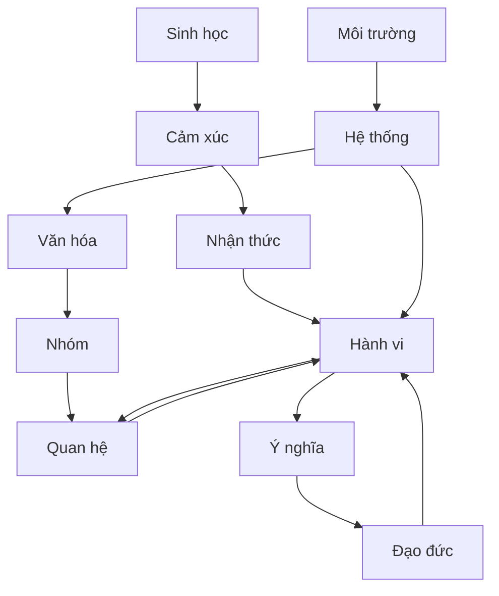
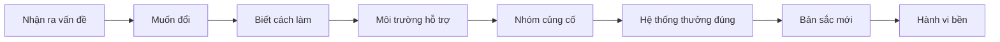

# Tập 30: Bản Đồ Tích Hợp Về Con Người

**Hiểu con người như một hệ thống đa tầng: sinh học, cảm xúc, nhận thức, hành vi, quan hệ, nhóm, văn hóa, hệ thống, ý nghĩa và đạo đức để phân tích đúng, can thiệp đúng và lãnh đạo thực dụng hơn**  
Giáo trình ngắn gọn cho người trưởng thành, cấp quản lý/C-level

---

## 0. Vì Sao C-level Cần Một Bản Đồ Tích Hợp Về Con Người?

### Bản chất

Sau nhiều tập về tâm lý, não bộ, cảm xúc, ra quyết định, lãnh đạo, quan hệ, văn hóa, hệ thống, đạo đức và ý nghĩa, rủi ro lớn nhất là biết nhiều mảnh nhưng dùng rời rạc.

Con người thật không nằm trong một môn học duy nhất.

Một hành vi có thể đồng thời là:

- Phản ứng của cơ thể đang mệt
- Cảm xúc chưa được gọi tên
- Niềm tin sai hoặc thiên kiến nhận thức
- Thói quen được củng cố
- Cách bảo vệ quan hệ
- Sản phẩm của chuẩn mực nhóm
- Hệ quả của KPI, quyền lực và hệ thống
- Nỗ lực giữ ý nghĩa, bản sắc hoặc phẩm giá
- Vấn đề đạo đức về quyền tự chủ, công bằng và trách nhiệm

C-level cần bản đồ tích hợp vì quyết định cấp cao hiếm khi sai do thiếu một kỹ thuật.  
Nó thường sai vì nhìn con người quá hẹp.

### Một câu cần nhớ

> Hành vi con người hiếm khi có một nguyên nhân; nó thường là điểm nổi lên của nhiều tầng đang tương tác.

### Mục tiêu tập này

| Năng lực | Ý nghĩa thực tế |
|---|---|
| Nhìn con người đa tầng | Không đổ lỗi quá nhanh cho cá nhân |
| Phân tích một hành vi có hệ thống | Biết tầng nào đang chi phối nhiều nhất |
| Chọn điểm can thiệp | Tác động đúng chỗ, ít tốn lực hơn |
| Ứng dụng vào lãnh đạo và dùng người | Hiểu động cơ, năng lực, bối cảnh và rủi ro |
| Ra quyết định có đạo đức | Không tối ưu kết quả bằng cách làm con người yếu đi |

---

## 1. First Principles: Con Người Là Một Hệ Thống Sống Đa Tầng

### Bản chất

Con người không chỉ là "tính cách".  
Con người là một hệ thống sống gồm cơ thể, cảm xúc, suy nghĩ, thói quen, quan hệ, nhóm, văn hóa, cấu trúc, ý nghĩa và lương tri.

```text
Con người = Cơ thể + Cảm xúc + Nhận thức + Hành vi + Quan hệ + Nhóm + Văn hóa + Hệ thống + Ý nghĩa + Đạo đức
```

Không tầng nào giải thích tất cả.  
Nhưng bỏ sót một tầng quan trọng có thể làm toàn bộ phân tích lệch hướng.

### Bản đồ tổng



### Câu hỏi gốc

```text
1. Hành vi này đang được tạo ra bởi tầng nào nhiều nhất?
2. Tầng nào tôi đang bỏ qua vì quen nhìn theo chuyên môn của mình?
3. Nếu can thiệp ở tầng cá nhân mà hệ thống không đổi, hành vi có quay lại không?
4. Nếu đổi hệ thống mà con người không đủ năng lực/cảm xúc, thay đổi có bền không?
5. Cách can thiệp này có làm con người tự do và trưởng thành hơn không?
```

---

## 2. Mười Tầng Cần Nhìn Khi Hiểu Một Người

### Bản chất

Một người có thể nói một câu đơn giản như "tôi không muốn làm việc này".  
Nhưng bên dưới câu đó có thể là mệt mỏi, sợ sai, mất niềm tin, xung đột quyền lực, chuẩn mực nhóm, hoặc cảm giác việc này vô nghĩa.

### Bảng mười tầng

| Tầng | Câu hỏi chính | Dấu hiệu cần chú ý |
|---|---|---|
| Sinh học | Cơ thể đang ở trạng thái nào? | Ngủ, stress, bệnh, năng lượng, hormone, tuổi tác |
| Cảm xúc | Cảm xúc nào đang điều khiển? | Sợ, giận, xấu hổ, buồn, ghen, bất an |
| Nhận thức | Người này đang tin/diễn giải gì? | Thiên kiến, niềm tin lõi, câu chuyện trong đầu |
| Hành vi | Thói quen nào đang lặp lại? | Cue, routine, reward, môi trường kích hoạt |
| Quan hệ | Ai đang ảnh hưởng trực tiếp? | Tin tưởng, xung đột, lệ thuộc, nhu cầu được công nhận |
| Nhóm | Nhóm thưởng/phạt điều gì? | Phe nhóm, groupthink, chuẩn mực, vai trò |
| Văn hóa | Điều gì được xem là đúng/bình thường? | Thể diện, gia đình, tuổi tác, cấp bậc, cộng đồng |
| Hệ thống | Quy trình và incentive đang ép gì? | KPI, luật, ngân sách, cấu trúc quyền lực |
| Ý nghĩa | Việc này chạm vào giá trị nào? | Bản sắc, mục đích, di sản, nỗi trống rỗng |
| Đạo đức | Điều gì là đúng, công bằng, có trách nhiệm? | Consent, quyền lực, tổn hại, minh bạch |

### Nguyên tắc

> Khi hành vi có vẻ phi lý, hãy tìm tầng mà trong đó nó trở nên hợp lý.

---

## 3. Phân Tích Một Hành Vi Theo Nhiều Tầng

### Bản chất

Đừng bắt đầu bằng câu "người này bị gì".  
Hãy bắt đầu bằng câu "hành vi này đang phục vụ điều gì trong bối cảnh nào".

Ví dụ: một quản lý cấp trung luôn né phản biện trong họp.

| Tầng | Diễn giải có thể |
|---|---|
| Sinh học | Kiệt sức, não ưu tiên an toàn hơn sáng tạo |
| Cảm xúc | Sợ bị mất mặt hoặc bị đánh giá là chống đối |
| Nhận thức | Tin rằng "nói thật với sếp là nguy hiểm" |
| Hành vi | Đã quen im lặng để tránh rắc rối |
| Quan hệ | Cần giữ hòa khí với sếp trực tiếp |
| Nhóm | Nhóm từng phạt người nói thẳng |
| Văn hóa | Tôn trọng cấp trên bị hiểu thành không phản biện |
| Hệ thống | KPI chỉ thưởng kết quả ngắn hạn, không thưởng cảnh báo sớm |
| Ý nghĩa | Người này muốn giữ hình ảnh người đáng tin |
| Đạo đức | Lãnh đạo có đang tạo môi trường đủ an toàn để nói thật không? |

### Công cụ: Bảng phân tích 10 tầng

```text
Hành vi cần phân tích:
Bối cảnh xảy ra:
Ai có mặt:
Hệ quả ngay sau hành vi:

Sinh học:
Cảm xúc:
Nhận thức:
Hành vi/thói quen:
Quan hệ:
Nhóm:
Văn hóa:
Hệ thống:
Ý nghĩa:
Đạo đức:

Tầng có ảnh hưởng mạnh nhất:
Tầng tôi cần kiểm chứng thêm:
Kết luận tạm thời:
```

---

## 4. Cách Chọn Điểm Can Thiệp

### Bản chất

Can thiệp đúng không phải là can thiệp nhiều.  
Can thiệp đúng là chọn tầng có đòn bẩy cao nhất, chi phí thấp nhất và ít tác dụng phụ nhất.

### Bốn tiêu chí chọn điểm can thiệp

| Tiêu chí | Câu hỏi |
|---|---|
| Đòn bẩy | Tầng nào đổi một chút nhưng kéo theo nhiều thay đổi? |
| Khả thi | Tầng nào có thể tác động trong quyền hạn hiện tại? |
| Bền vững | Tầng nào nếu đổi sẽ làm hành vi mới tự duy trì? |
| Đạo đức | Tầng nào đổi mà vẫn tôn trọng tự chủ và phẩm giá? |

### Bảng chọn tầng can thiệp

| Nếu vấn đề chính là | Can thiệp ưu tiên |
|---|---|
| Mệt, quá tải, mất ngủ | Giảm tải, hồi phục, nhịp làm việc, sức khỏe |
| Cảm xúc mạnh | Gọi tên cảm xúc, điều tiết, tạo an toàn |
| Niềm tin sai | Phản hồi, dữ liệu, đối thoại, trải nghiệm sửa niềm tin |
| Thói quen xấu | Đổi cue, reward, friction, môi trường |
| Xung đột quan hệ | Làm rõ kỳ vọng, ranh giới, niềm tin |
| Chuẩn mực nhóm lệch | Đổi hành vi được khen, người làm gương, nghi lễ |
| Văn hóa không khớp | Dịch thông điệp theo ngôn ngữ và giá trị bản địa |
| Incentive sai | Sửa KPI, quyền quyết, quy trình, nguồn lực |
| Mất ý nghĩa | Kết nối lại giá trị, vai trò, đóng góp |
| Rủi ro đạo đức | Minh bạch, consent, giới hạn quyền lực, cơ chế khiếu nại |

### Nguyên tắc

> Nếu một hành vi được hệ thống thưởng, đừng kỳ vọng lời khuyên cá nhân sẽ xóa được nó.

---

## 5. Khung Ứng Dụng Cho Tự Hiểu Mình

### Bản chất

Tự hiểu mình không chỉ là biết tính cách.  
Tự hiểu mình là biết tầng nào thường điều khiển mình khi áp lực tăng.

### Bảng tự soi

| Tầng | Câu hỏi tự hỏi |
|---|---|
| Sinh học | Tôi đang quyết định trong trạng thái cơ thể nào? |
| Cảm xúc | Cảm xúc nào tôi đang né gọi tên? |
| Nhận thức | Câu chuyện nào trong đầu tôi có thể sai? |
| Hành vi | Tôi đang lặp lại mẫu cũ nào? |
| Quan hệ | Tôi đang muốn được ai công nhận hoặc sợ ai thất vọng? |
| Nhóm | Tôi đang bị chuẩn mực nhóm nào kéo đi? |
| Văn hóa | Niềm tin gia đình/xã hội nào đang nói thay tôi? |
| Hệ thống | Lịch, tiền, vai trò nào đang khóa lựa chọn? |
| Ý nghĩa | Điều này có thật sự quan trọng với đời tôi không? |
| Đạo đức | Lựa chọn này có làm tôi tôn trọng mình hơn không? |

### Checklist 10 phút trước quyết định lớn

```text
[ ] Tôi đã ngủ/nghỉ đủ để quyết chưa?
[ ] Tôi đang sợ gì nếu chọn thật?
[ ] Tôi có đang phản ứng với vết thương cũ không?
[ ] Tôi đã kiểm tra dữ liệu trái với niềm tin của mình chưa?
[ ] Tôi có đang chiều lòng một người hoặc một nhóm không?
[ ] Tôi có đang nhầm thể diện với giá trị không?
[ ] Hệ thống nào đang khiến lựa chọn này trông như "không còn cách khác"?
[ ] Quyết định này có nối với điều tôi muốn xây trong 5 năm tới không?
[ ] Ai có thể chịu hại nếu tôi chọn như vậy?
[ ] Nếu công khai lý do thật, tôi có thấy chính đáng không?
```

---

## 6. Khung Ứng Dụng Cho Lãnh Đạo

### Bản chất

Lãnh đạo không chỉ là tạo mục tiêu và yêu cầu người khác theo.  
Lãnh đạo là thiết kế điều kiện để con người có thể thấy rõ, tin đủ, làm được và chịu trách nhiệm.

### Bảng đọc vấn đề lãnh đạo

| Triệu chứng | Không nên kết luận vội | Cần kiểm tra |
|---|---|---|
| Nhân sự im lặng | Họ thiếu chủ động | An toàn tâm lý, quyền lực, lịch sử bị phạt |
| Team chậm đổi mới | Họ bảo thủ | Incentive, rủi ro sai, năng lực học |
| Quản lý cấp trung phòng vệ | Họ yếu | Áp lực hai đầu, vai trò mơ hồ, thiếu quyền |
| Văn hóa đổ lỗi | Con người xấu | Hệ thống phạt lỗi nhưng không thưởng học |
| Người giỏi rời đi | Họ không trung thành | Ý nghĩa, công bằng, cơ hội, quan hệ với sếp |

### Công cụ: Audit một vấn đề lãnh đạo

```text
Vấn đề quan sát được:
Hành vi cụ thể:
Ai đang làm:
Ai đang được lợi:
Ai đang chịu chi phí:
Hành vi này được thưởng ở đâu:
Hành vi ngược lại bị phạt ở đâu:
Tầng can thiệp nhanh:
Tầng can thiệp bền:
Rủi ro đạo đức nếu ép thay đổi:
```

---

## 7. Khung Ứng Dụng Cho Dùng Người

### Bản chất

Dùng người không chỉ là chọn người giỏi.  
Dùng người là đặt đúng người, đúng vai, đúng bối cảnh, đúng mức quyền và đúng cơ chế phản hồi.

### Năm câu hỏi trước khi giao việc lớn

| Câu hỏi | Vì sao quan trọng |
|---|---|
| Người này có năng lực thật ở việc này không? | Tránh nhầm tự tin với năng lực |
| Người này có động cơ phù hợp không? | Năng lực cao nhưng động cơ lệch sẽ nguy hiểm |
| Bối cảnh có giúp họ thành công không? | Người đúng đặt sai hệ thống vẫn thất bại |
| Quyền hạn có khớp trách nhiệm không? | Tránh bắt chịu trách nhiệm khi không có quyền |
| Giá trị và đạo đức có đủ tin cậy không? | Càng nhiều quyền, lỗi đạo đức càng đắt |

### Bảng nhìn người đa tầng

| Tầng | Cần đọc |
|---|---|
| Năng lượng | Người này bền dưới áp lực nào, gãy ở đâu |
| Cảm xúc | Khi sợ, giận, bị phê bình họ phản ứng ra sao |
| Tư duy | Họ học từ dữ liệu hay bảo vệ cái tôi |
| Hành vi | Thói quen làm việc có ổn định không |
| Quan hệ | Họ làm người khác mạnh lên hay yếu đi |
| Nhóm | Họ tạo chuẩn mực gì quanh mình |
| Hệ thống | Họ cần quyền, nguồn lực và ranh giới nào |
| Ý nghĩa | Việc gì làm họ thấy đáng dấn thân |
| Đạo đức | Khi không ai nhìn, họ còn giữ nguyên tắc nào |

### Nguyên tắc

> Đừng chỉ hỏi "người này giỏi không"; hãy hỏi "người này giỏi trong hệ thống nào, với quyền lực nào, và cái giá đạo đức nào".

---

## 8. Khung Ứng Dụng Cho Đổi Hành Vi

### Bản chất

Đổi hành vi bền vững cần nhiều hơn ý chí.  
Ý chí chỉ là một tầng. Môi trường, phần thưởng, bản sắc, nhóm và hệ thống thường mạnh hơn.

### Mô hình đổi hành vi tích hợp



### Công cụ thiết kế thay đổi

| Thành phần | Câu hỏi thiết kế |
|---|---|
| Cue | Điều gì kích hoạt hành vi cũ? |
| Friction | Làm hành vi cũ khó hơn ở đâu? |
| Reward | Hành vi mới được thưởng bằng gì? |
| Skill | Người đó thiếu kỹ năng nào? |
| Emotion | Cảm xúc nào cần được xử lý? |
| Identity | Người này cần thấy mình là ai để làm hành vi mới? |
| Group | Ai cần làm gương hoặc công nhận hành vi mới? |
| System | KPI/quy trình nào phải đổi để hành vi mới sống được? |

### Nguyên tắc

> Muốn đổi hành vi, đừng chỉ tăng quyết tâm; hãy giảm ma sát, đổi phần thưởng và tạo môi trường khiến hành vi mới trở nên bình thường.

---

## 9. Khung Ứng Dụng Cho Quan Hệ

### Bản chất

Quan hệ không chỉ hỏng vì thiếu kỹ năng giao tiếp.  
Nó thường hỏng vì nhu cầu, nỗi sợ, vai trò, quyền lực, lịch sử tổn thương và ý nghĩa bị lẫn vào nhau.

### Bảng đọc xung đột

| Tầng | Câu hỏi |
|---|---|
| Sinh học | Hai bên có đang quá mệt để nói chuyện không? |
| Cảm xúc | Cảm xúc thật là giận, sợ, buồn hay xấu hổ? |
| Nhận thức | Mỗi bên đang kể câu chuyện gì về bên kia? |
| Hành vi | Mẫu lặp lại là tấn công, rút lui, chiều lòng hay kiểm soát? |
| Quan hệ | Nhu cầu được thấy, được tôn trọng, được an toàn là gì? |
| Nhóm/văn hóa | Gia đình, giới tính, tuổi tác, cấp bậc đang ảnh hưởng ra sao? |
| Hệ thống | Tiền, thời gian, quyền quyết đang phân bổ thế nào? |
| Ý nghĩa | Xung đột này chạm vào giá trị nào? |
| Đạo đức | Có ép buộc, coi thường, thao túng hoặc bất công không? |

### Công cụ: Câu hỏi làm dịu quan hệ

```text
Việc này với anh/chị có nghĩa gì:
Điều gì làm anh/chị thấy không an toàn hoặc không được tôn trọng:
Anh/chị đang cần tôi hiểu điều gì trước khi bàn giải pháp:
Phần nào là nhu cầu thật, phần nào là cách thể hiện chưa tốt:
Chúng ta đang cùng chống lại vấn đề hay đang chống lại nhau:
```

---

## 10. Khung Ứng Dụng Cho Ra Quyết Định

### Bản chất

Quyết định tốt không chỉ đúng về dữ liệu.  
Quyết định tốt cần đúng với cơ thể đủ tỉnh, cảm xúc đủ rõ, nhận thức đủ khiêm tốn, hệ thống đủ thực tế, ý nghĩa đủ sâu và đạo đức đủ vững.

### Bảng kiểm quyết định đa tầng

| Tầng | Câu hỏi |
|---|---|
| Sinh học | Tôi có đang quyết trong mệt mỏi, đói, căng thẳng hoặc phấn khích quá mức không? |
| Cảm xúc | Cảm xúc nào đang đẩy tôi chọn nhanh? |
| Nhận thức | Thiên kiến nào dễ xuất hiện: xác nhận, mất mát, địa vị, sunk cost? |
| Hành vi | Tôi có đang lặp lại mẫu quyết định quen thuộc không? |
| Quan hệ | Ai đang ảnh hưởng quá nhiều hoặc quá ít? |
| Nhóm | Nhóm có đang groupthink không? |
| Văn hóa | Chuẩn mực nào làm một lựa chọn trở nên khó nói? |
| Hệ thống | Incentive nào làm dữ liệu bị bóp méo? |
| Ý nghĩa | Quyết định này phục vụ điều gì lớn hơn kết quả ngắn hạn? |
| Đạo đức | Ai chịu rủi ro, ai được lợi, ai có quyền từ chối? |

### Quy tắc thực dụng

```text
Quyết định nhỏ: dùng nguyên tắc và tốc độ.
Quyết định lớn: dùng dữ liệu, phản biện và thời gian.
Quyết định có con người chịu hại: thêm kiểm tra đạo đức.
Quyết định không thể đảo ngược: thêm người phản biện độc lập.
Quyết định chạm vào bản sắc: thêm câu hỏi ý nghĩa.
```

---

## 11. Những Lỗi Thường Gặp Khi Hiểu Con Người

### Bản chất

Sai lầm không chỉ đến từ thiếu kiến thức.  
Nhiều sai lầm đến từ việc dùng một kiến thức đúng để giải thích quá nhiều thứ.

| Lỗi | Biểu hiện | Cách sửa |
|---|---|---|
| Tâm lý hóa mọi thứ | Cái gì cũng quy về tính cách hoặc tuổi thơ | Kiểm tra hệ thống, incentive, văn hóa |
| Sinh học hóa mọi thứ | Cái gì cũng quy về não, hormone, stress | Kiểm tra ý nghĩa, quan hệ, đạo đức |
| Đạo đức hóa quá nhanh | Gắn nhãn người khác lười, xấu, vô trách nhiệm | Hỏi hành vi này hợp lý ở tầng nào |
| Hệ thống hóa quá mức | Xem cá nhân không còn trách nhiệm | Giữ cả bối cảnh và lựa chọn cá nhân |
| Kỹ thuật hóa con người | Dùng framework để điều khiển | Kiểm tra consent và phẩm giá |
| Văn hóa hóa mọi thứ | Xem chuẩn mực là bất biến | Tìm nhóm nhỏ, quyền lực và thay đổi thế hệ |
| Ý nghĩa hóa quá sớm | Nói về sứ mệnh khi người ta đang kiệt sức | Xử lý cơ thể và an toàn trước |

### Nguyên tắc

> Framework tốt giúp nhìn rộng hơn; framework tệ làm mình tưởng đã hiểu xong.

---

## 12. Công Cụ Tổng Hợp: Canvas Hiểu Con Người

### Dùng khi nào?

Dùng khi bạn cần hiểu một cá nhân, một team, một phân khúc khách hàng, một xung đột hoặc một hành vi lặp lại trong tổ chức.

### Canvas

```text
Đối tượng/hành vi cần hiểu:
Bối cảnh:
Kết quả đang thấy:
Kết quả mong muốn:

1. Sinh học:
- Năng lượng, stress, sức khỏe, nhịp sống:

2. Cảm xúc:
- Cảm xúc chính, cảm xúc bị giấu:

3. Nhận thức:
- Niềm tin, giả định, thiên kiến:

4. Hành vi:
- Mẫu lặp lại, phần thưởng, ma sát:

5. Quan hệ:
- Người ảnh hưởng, xung đột, niềm tin:

6. Nhóm:
- Chuẩn mực, vai trò, phe nhóm:

7. Văn hóa:
- Thể diện, giá trị, ngôn ngữ, điều cấm kỵ:

8. Hệ thống:
- KPI, quyền lực, quy trình, nguồn lực:

9. Ý nghĩa:
- Bản sắc, giá trị, mục đích, nỗi sợ mất mình:

10. Đạo đức:
- Consent, công bằng, tác hại, trách nhiệm:

Giả thuyết chính:
Dữ liệu cần kiểm chứng:
Điểm can thiệp đầu tiên:
Điểm can thiệp bền vững:
Chỉ số theo dõi:
Rủi ro phụ:
```

---

## 13. Lộ Trình Thực Hành 4 Tuần

### Tuần 1: Vẽ bản đồ chính mình

- Chọn một hành vi cá nhân đang lặp lại nhưng chưa hài lòng.
- Phân tích theo 10 tầng.
- Chọn một tầng bạn thường bỏ qua nhất.

### Tuần 2: Phân tích một người hoặc một team

- Chọn một hành vi khó hiểu trong công việc.
- Viết ít nhất 3 giả thuyết khác nhau ở 3 tầng khác nhau.
- Nói chuyện kiểm chứng với người trong cuộc thay vì chỉ suy diễn.

### Tuần 3: Chọn điểm can thiệp

- Chọn một vấn đề có thể tác động trong quyền hạn của bạn.
- So sánh 3 điểm can thiệp theo đòn bẩy, khả thi, bền vững và đạo đức.
- Thử một thay đổi nhỏ trong 7 ngày.

### Tuần 4: Đánh giá và chuẩn hóa

- Đo hành vi thật, không chỉ cảm giác.
- Hỏi người chịu tác động xem họ thấy rõ hơn, tự chủ hơn hay bị ép hơn.
- Viết lại thành một nguyên tắc lãnh đạo/dùng người/ra quyết định cho 90 ngày tới.

---

## 14. Bảng Tóm Tắt First Principles

| Chủ đề | Bản chất | Câu hỏi áp dụng |
|---|---|---|
| Con người đa tầng | Hệ thống sống gồm cơ thể, tâm lý, quan hệ, văn hóa, hệ thống và ý nghĩa | Tôi đang nhìn quá hẹp ở tầng nào? |
| Sinh học | Trạng thái cơ thể ảnh hưởng cảm xúc và quyết định | Cơ thể này có đủ an toàn và năng lượng không? |
| Cảm xúc | Tín hiệu về nhu cầu, đe dọa và giá trị | Cảm xúc nào đang điều khiển hành vi? |
| Nhận thức | Cách diễn giải thế giới và bản thân | Niềm tin nào có thể đang sai? |
| Hành vi | Mẫu lặp lại được môi trường thưởng | Hành vi này được kích hoạt và củng cố thế nào? |
| Quan hệ | Con người hành động trong niềm tin, ràng buộc và ảnh hưởng | Ai đang ảnh hưởng đến lựa chọn này? |
| Nhóm | Chuẩn mực nhóm quyết định điều được khen hoặc bị phạt | Nhóm đang dạy hành vi nào là an toàn? |
| Văn hóa | Hệ ý nghĩa làm một hành vi trở nên bình thường | Điều này có nghĩa gì trong bối cảnh của họ? |
| Hệ thống | Incentive, quy trình và quyền lực tạo đường đi hành vi | Hệ thống đang thưởng điều gì? |
| Ý nghĩa | Con người cần thấy việc mình làm đáng sống và đáng chịu trách nhiệm | Việc này phục vụ giá trị nào? |
| Đạo đức | Ảnh hưởng phải tôn trọng tự chủ, phẩm giá và công bằng | Cách tác động này có chính đáng nếu công khai không? |
| Phân tích hành vi | Tìm tầng làm hành vi trở nên hợp lý | Tầng nào giải thích mạnh nhất? |
| Chọn can thiệp | Đổi đúng tầng có đòn bẩy, khả thi, bền và đạo đức | Đổi ở đâu ít lực nhưng nhiều tác dụng nhất? |
| Lãnh đạo | Thiết kế điều kiện để con người làm điều đúng | Tôi đang yêu cầu ý chí hay đang tạo điều kiện? |
| Dùng người | Đặt đúng người vào đúng vai, đúng hệ thống, đúng quyền | Người này phù hợp trong bối cảnh nào? |
| Đổi hành vi | Cần đổi cue, reward, môi trường, nhóm và bản sắc | Hành vi mới có được hệ thống hỗ trợ không? |
| Quan hệ | Xung đột là nhiều tầng nhu cầu, sợ hãi, vai trò và quyền lực | Nhu cầu thật dưới phản ứng này là gì? |
| Ra quyết định | Quyết định tốt cần dữ liệu, cảm xúc rõ, hệ thống thật và đạo đức vững | Ai được lợi, ai chịu rủi ro, điều gì đáng làm? |

---

## 15. Một Câu Để Nhớ Toàn Bộ Tập 30

> Hiểu con người là học cách nhìn cùng lúc nhiều tầng, rồi chọn điểm tác động nhỏ nhất nhưng đúng nhất để con người rõ hơn, tự do hơn và trưởng thành hơn.
