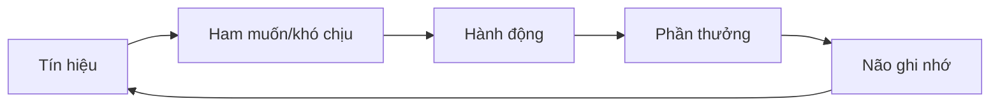
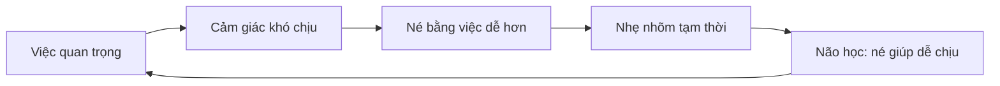

# Tập 4: Thói Quen Cá Nhân Và Kỷ Luật Nội Tâm

**Hiểu trì hoãn, dopamine, môi trường và cách đổi hành vi bền vững mà không phụ thuộc vào ý chí**  
Giáo trình ngắn gọn cho người trưởng thành, cấp quản lý/C-level

---

## 0. Vì Sao C-level Cần Học Thói Quen?

### Bản chất

Ở cấp cao, vấn đề không chỉ là biết phải làm gì.  
Vấn đề là có đủ hệ thống nội tâm và môi trường để **làm điều đúng một cách đều đặn**.

Người giỏi vẫn có thể:

- Trì hoãn việc chiến lược
- Nghiện xử lý việc gấp
- Mất tập trung vì thông báo
- Làm việc quá sức
- Không nghỉ được
- Dùng bận rộn để né suy nghĩ sâu
- Biết nên đổi nhưng vẫn lặp lại hành vi cũ

### Một câu cần nhớ

> Thói quen không phải là vấn đề ý chí. Thói quen là hệ thống tự động của não để tiết kiệm năng lượng và tìm phần thưởng quen thuộc.

### Mục tiêu tập này

Sau tập này, bạn cần làm được 5 việc:

| Năng lực | Ý nghĩa thực tế |
|---|---|
| Hiểu vòng lặp thói quen | Biết hành vi lặp lại vì sao tồn tại |
| Nhìn ra phần thưởng ẩn | Không xử lý nhầm triệu chứng |
| Thiết kế môi trường | Làm việc đúng dễ hơn, việc sai khó hơn |
| Quản trị năng lượng | Không dùng ý chí khi cơ thể cạn |
| Xây kỷ luật nội tâm | Làm điều quan trọng dù cảm xúc thay đổi |

---

## 1. First Principles: Thói Quen Là Gì?

### Bản chất

Thói quen là hành vi được não tự động hóa vì nó từng đem lại phần thưởng.

Não thích thói quen vì:

- Đỡ phải suy nghĩ
- Tiết kiệm năng lượng
- Dự đoán được kết quả
- Giảm cảm giác khó chịu
- Tạo cảm giác kiểm soát

### Vòng lặp gốc



### Ví dụ đơn giản

| Tín hiệu | Ham muốn/khó chịu | Hành động | Phần thưởng |
|---|---|---|---|
| Việc khó | Lo, mơ hồ | Mở email | Cảm giác đang bận |
| Stress | Căng cơ thể | Lướt điện thoại | Dễ chịu nhanh |
| Mệt | Thiếu năng lượng | Ăn ngọt | Tỉnh tạm thời |
| Bị phê bình | Xấu hổ | Phòng vệ | Bảo vệ cái tôi |

### Câu hỏi cốt lõi

Khi một hành vi lặp lại, đừng hỏi:

> Tại sao tôi yếu kỷ luật?

Hãy hỏi:

> Hành vi này đang thưởng cho tôi bằng điều gì?

---

## 2. Trì Hoãn: Không Phải Lười, Mà Là Né Cảm Xúc

### Bản chất

Trì hoãn thường là chiến lược né cảm xúc khó chịu.

Ta không chỉ né việc.  
Ta né cảm giác mà việc đó tạo ra:

- Mơ hồ
- Sợ sai
- Sợ bị đánh giá
- Sợ bắt đầu
- Sợ thất bại
- Sợ phát hiện mình không đủ giỏi

### Vòng lặp trì hoãn



### Trì hoãn cấp cao thường trông như năng suất

| Bề mặt | Bản chất có thể là |
|---|---|
| Họp liên tục | Né quyết định khó |
| Xử lý email cả ngày | Né suy nghĩ chiến lược |
| Cần thêm dữ liệu mãi | Sợ cam kết |
| Chỉnh deck quá lâu | Sợ bị đánh giá |
| Tập trung vào việc gấp | Né việc quan trọng nhưng mơ hồ |

### Cách phá vòng lặp

Đừng cố làm xong.  
Hãy làm cho việc đó **dễ bắt đầu đến mức không đáng sợ**.

Ví dụ:

| Việc lớn | Bước nhỏ đầu tiên |
|---|---|
| Viết chiến lược 2027 | Mở file và viết 5 bullet xấu |
| Cắt dự án yếu | Liệt kê 3 dữ kiện không thể bỏ qua |
| Nói chuyện với nhân sự khó | Viết mục tiêu cuộc nói chuyện |
| Tập luyện lại | Đi giày và ra khỏi nhà 5 phút |

### Câu hỏi thực hành

```text
1. Tôi đang né việc gì?
2. Việc đó tạo ra cảm xúc khó chịu nào?
3. Bước nhỏ nhất trong 5 phút là gì?
4. Nếu chỉ cần bắt đầu xấu, tôi sẽ làm gì?
```

---

## 3. Dopamine: Não Theo Đuổi Dự Đoán Phần Thưởng

### Bản chất

Dopamine không chỉ là "hormone vui".  
Nó liên quan mạnh đến động lực, ham muốn, dự đoán phần thưởng và sự tìm kiếm.

> Não dễ bị kéo về thứ cho phần thưởng nhanh, rõ, mới và ít tốn sức.

### Vì sao điện thoại, email, mạng xã hội mạnh?

Vì chúng có:

- Phần thưởng nhanh
- Tính mới liên tục
- Phản hồi tức thì
- Không chắc chắn
- Ma sát thấp
- Cảm giác đang kết nối

### Cạm bẫy của người bận

Người cấp cao dễ nghiện:

- Email
- Tin nhắn
- Tin tức
- Dashboard
- Họp gấp
- Cảm giác được cần đến

Vì các thứ này cho cảm giác:

> Tôi đang quan trọng và đang kiểm soát tình hình.

### So sánh phần thưởng

| Hoạt động | Phần thưởng | Rủi ro |
|---|---|---|
| Email | Nhanh, rõ, dễ | Cướp thời gian sâu |
| Họp gấp | Cảm giác quan trọng | Mất chiến lược |
| Lướt tin | Kích thích mới | Tăng lo âu |
| Việc sâu | Phần thưởng chậm | Dễ bị né |
| Tập luyện | Lợi ích tích lũy | Không hấp dẫn tức thì |

### Cách xử lý

Không thể thắng dopamine nhanh bằng lời khuyên đạo đức.  
Phải thiết kế lại phần thưởng và ma sát.

| Muốn giảm | Cách làm |
|---|---|
| Check điện thoại | Để xa tay, tắt thông báo, dùng khung giờ |
| Email liên tục | Chỉ xử lý theo block 2-3 lần/ngày |
| Tin tức | Chọn giờ đọc cố định, giới hạn nguồn |
| Việc gấp giả | Có tiêu chí phân loại khẩn cấp thật |

---

## 4. Ý Chí: Nguồn Lực Có Giới Hạn

### Bản chất

Ý chí không ổn định.  
Nó giảm khi:

- Mệt
- Đói
- Stress
- Thiếu ngủ
- Có quá nhiều quyết định
- Bị cảm xúc mạnh
- Môi trường đầy cám dỗ

### Sai lầm phổ biến

Nhiều người đặt mục tiêu như thể ngày nào mình cũng:

- Ngủ đủ
- Tỉnh táo
- Không bị stress
- Không bị kéo vào việc gấp
- Có cảm hứng

Thực tế không như vậy.

### Nguyên tắc

> Hệ thống tốt là hệ thống vẫn hoạt động được vào ngày bạn không có cảm hứng.

### Ứng dụng

Thay vì nói:

> Tôi sẽ cố kỷ luật hơn.

Hãy thiết kế:

| Vấn đề | Thiết kế tốt hơn |
|---|---|
| Không tập được | Đặt lịch với huấn luyện viên/bạn tập |
| Ăn xấu | Không để đồ xấu trong nhà/văn phòng |
| Không đọc sách | Để sách ở nơi dễ thấy, điện thoại xa |
| Không làm việc sâu | Chặn lịch 90 phút, không họp |
| Hay ngủ muộn | Tắt màn hình theo giờ, chuẩn bị phòng ngủ |

---

## 5. Ma Sát: Luật Gốc Của Hành Vi

### Bản chất

Con người thường làm việc dễ nhất trong môi trường hiện tại.

> Muốn làm việc tốt nhiều hơn, giảm ma sát. Muốn làm việc xấu ít đi, tăng ma sát.

### Ma sát là gì?

Ma sát là mọi thứ làm hành vi khó bắt đầu hơn:

- Xa hơn
- Mất công hơn
- Phải nghĩ nhiều hơn
- Cần nhiều bước hơn
- Không rõ bắt đầu từ đâu
- Không có công cụ sẵn

### Ví dụ

| Mục tiêu | Giảm ma sát |
|---|---|
| Đọc nhiều hơn | Để sách mở sẵn trên bàn |
| Tập sáng | Chuẩn bị đồ tập từ tối |
| Ăn lành mạnh | Có đồ ăn tốt trong tủ |
| Viết chiến lược | Mở sẵn file, có template |
| Gọi cuộc khó | Viết sẵn 3 câu mở đầu |

### Tăng ma sát cho thói quen xấu

| Thói quen xấu | Tăng ma sát |
|---|---|
| Lướt điện thoại | Để ngoài phòng làm việc |
| Ăn vặt | Không mua về |
| Check email | Đăng xuất trên điện thoại |
| Họp tùy tiện | Bắt buộc có agenda và quyết định cần chốt |
| Làm việc muộn | Đặt lịch đóng ngày, tắt máy |

### Câu hỏi thiết kế

```text
1. Hành vi tốt nào cần dễ hơn?
2. Hành vi xấu nào cần khó hơn?
3. Tôi có thể thay đổi môi trường trong 10 phút không?
4. Điểm bắt đầu có đủ rõ chưa?
```

---

## 6. Bản Sắc: Thói Quen Bền Khi Gắn Với "Tôi Là Ai"

### Bản chất

Thói quen bền không chỉ dựa vào mục tiêu.  
Nó dựa vào bản sắc.

Khác biệt:

| Mục tiêu | Bản sắc |
|---|---|
| Tôi muốn chạy 5 km | Tôi là người chăm sóc cơ thể |
| Tôi muốn đọc 20 cuốn | Tôi là người học suốt đời |
| Tôi muốn bớt nóng | Tôi là lãnh đạo biết tự chủ |
| Tôi muốn viết chiến lược | Tôi là người tạo rõ ràng |

### Vì sao bản sắc mạnh?

Vì con người có xu hướng hành động nhất quán với hình ảnh mình tin về bản thân.

Nếu bạn tin:

> Tôi là người bận, không có thời gian cho sức khỏe.

Bạn sẽ luôn tìm bằng chứng cho điều đó.

Nếu bạn chuyển thành:

> Tôi là người bảo vệ năng lượng vì quyết định của tôi ảnh hưởng nhiều người.

Hành vi sẽ khác.

### Công thức xây bản sắc

```text
1. Chọn kiểu người bạn muốn trở thành.
2. Chọn hành vi nhỏ chứng minh bản sắc đó.
3. Lặp lại mỗi ngày.
4. Ghi nhận bằng chứng: "Tôi là người như vậy."
```

### Bài tập

Điền vào:

| Tôi muốn bớt... | Vì tôi là người... | Hành vi nhỏ chứng minh |
|---|---|---|
| phản ứng nóng | lãnh đạo tự chủ | dừng 10 giây trước khi trả lời |
| trì hoãn | tạo rõ ràng | viết 5 bullet đầu tiên |
| bỏ bê sức khỏe | bảo vệ năng lượng | đi bộ 20 phút |

---

## 7. Kỷ Luật Nội Tâm: Làm Điều Đúng Khi Không Có Ai Nhìn

### Bản chất

Kỷ luật nội tâm không phải là ép mình sống khắc nghiệt.

Kỷ luật nội tâm là:

> Khả năng giữ lời với bản thân về những điều thật sự quan trọng.

### Kỷ luật khác kiểm soát bản thân cực đoan

| Kỷ luật trưởng thành | Kiểm soát cực đoan |
|---|---|
| Linh hoạt nhưng nhất quán | Cứng nhắc |
| Tôn trọng cơ thể | Ép quá sức |
| Phục vụ giá trị dài hạn | Phục vụ hình ảnh |
| Có hồi phục | Dễ kiệt sức |
| Dựa vào hệ thống | Dựa vào căng thẳng |

### Câu hỏi gốc

Không hỏi:

> Tôi có đủ kỷ luật không?

Hỏi:

> Điều gì đủ quan trọng để tôi thiết kế cuộc sống quanh nó?

### Ba tầng kỷ luật

| Tầng | Nội dung |
|---|---|
| Cơ thể | Ngủ, ăn, vận động, hồi phục |
| Chú ý | Bảo vệ sự tập trung |
| Giá trị | Làm điều quan trọng dù không dễ |

### Nguyên tắc

> Người không bảo vệ lịch của mình sẽ sống theo ưu tiên của người khác.

---

## 8. Quản Trị Năng Lượng: Nền Móng Của Thói Quen

### Bản chất

Bạn không chỉ quản trị thời gian.  
Bạn quản trị năng lượng sinh học, cảm xúc và nhận thức.

### Bốn loại năng lượng

| Loại | Câu hỏi |
|---|---|
| Thể chất | Tôi ngủ, ăn, vận động ra sao? |
| Cảm xúc | Tôi đang mang cảm xúc chưa xử lý nào? |
| Nhận thức | Tôi có đủ khoảng trống để nghĩ sâu không? |
| Ý nghĩa | Việc này có kết nối với điều quan trọng không? |

### Dấu hiệu cạn năng lượng

- Dễ cáu
- Quyết định chậm
- Check điện thoại nhiều
- Không muốn suy nghĩ sâu
- Ăn uống bù cảm xúc
- Họp nhưng không thật sự hiện diện
- Chọn việc dễ thay vì việc quan trọng

### Thiết kế tuần cho C-level

| Khối | Mục đích |
|---|---|
| Deep work | Chiến lược, suy nghĩ khó |
| Decision block | Chốt việc quan trọng |
| People block | 1-1, coaching, xung đột |
| Admin block | Email, ký duyệt, việc nhỏ |
| Recovery block | Tập, nghỉ, không màn hình |

### Nguyên tắc

> Đừng để việc nông ăn hết giờ não tốt nhất.

---

## 9. Routine Sáng Và Tối

### Bản chất

Routine không phải nghi thức màu mè.  
Routine là cách giảm quyết định lặp lại để bảo vệ năng lượng.

### Routine sáng tốt cần trả lời

```text
1. Cơ thể đã được kích hoạt chưa?
2. Tâm trí đã rõ việc quan trọng chưa?
3. Tôi có tránh bị kéo vào điện thoại/email quá sớm không?
```

### Gợi ý routine sáng 45 phút

| Thời lượng | Việc |
|---|---|
| 5 phút | Uống nước, ánh sáng tự nhiên |
| 15 phút | Vận động nhẹ/đi bộ |
| 10 phút | Viết 3 việc quan trọng |
| 10 phút | Đọc/suy nghĩ sâu |
| 5 phút | Xem lịch và chọn điểm không thỏa hiệp |

### Routine tối tốt cần trả lời

```text
1. Ngày hôm nay đã khép lại chưa?
2. Ngày mai có rõ việc đầu tiên chưa?
3. Cơ thể có được tín hiệu nghỉ không?
```

### Gợi ý routine tối 30 phút

| Thời lượng | Việc |
|---|---|
| 5 phút | Ghi lại việc chưa xong |
| 5 phút | Chọn việc đầu tiên ngày mai |
| 10 phút | Tắt màn hình/giảm ánh sáng |
| 5 phút | Ghi 1 điều học được |
| 5 phút | Thở chậm/giãn cơ |

### Lưu ý

Routine tốt là routine bạn làm được vào ngày bận, không phải routine đẹp trên giấy.

---

## 10. Deep Work: Năng Lực Khó Nhất Của Người Cấp Cao

### Bản chất

Deep work là trạng thái tập trung đủ lâu để xử lý vấn đề khó.

Ở C-level, deep work dùng cho:

- Chiến lược
- Mô hình kinh doanh
- Thiết kế tổ chức
- Quyết định nhân sự lớn
- Suy nghĩ về tương lai
- Viết thông điệp quan trọng

### Vì sao deep work khó?

Vì nó:

- Chậm
- Mơ hồ
- Không có dopamine nhanh
- Dễ chạm vào nỗi sợ sai
- Bị phá bởi việc gấp

### Thiết kế một block deep work

```text
1. Chọn một câu hỏi duy nhất.
2. Chặn 60-120 phút.
3. Tắt thông báo.
4. Để điện thoại ngoài tầm tay.
5. Mở sẵn tài liệu cần dùng.
6. Kết thúc bằng 5 bullet kết luận.
```

### Câu hỏi tốt cho deep work

```text
Điều gì nếu đúng sẽ thay đổi chiến lược của chúng ta?
Chúng ta đang né sự thật nào?
Nút thắt lớn nhất của tổ chức là gì?
Nếu chỉ được làm 3 việc trong quý tới, đó là gì?
Điều gì đang tạo tăng trưởng giả?
```

---

## 11. Thói Quen Sức Khỏe: Không Phải Cá Nhân, Mà Là Tài Sản Lãnh Đạo

### Bản chất

Sức khỏe của lãnh đạo không chỉ ảnh hưởng cá nhân.  
Nó ảnh hưởng chất lượng quyết định, cảm xúc và văn hóa tổ chức.

### Ba nền móng

| Nền móng | Vì sao quan trọng |
|---|---|
| Ngủ | Phục hồi não, kiểm soát cảm xúc |
| Vận động | Giảm stress, tăng năng lượng |
| Ăn uống | Ổn định năng lượng và tâm trạng |

### Sai lầm phổ biến

| Sai lầm | Hậu quả |
|---|---|
| Hy sinh ngủ để làm thêm | Quyết định kém, dễ cáu |
| Không vận động | Stress tích trong cơ thể |
| Ăn thất thường | Năng lượng dao động |
| Dùng caffeine thay nghỉ | Nợ năng lượng |
| Không có ngày hồi phục | Kiệt sức chậm |

### Nguyên tắc tối thiểu

Nếu không có thời gian, giữ 3 điều:

```text
1. Ngủ đủ nhất có thể.
2. Đi bộ 20-30 phút/ngày.
3. Không để mình quá đói trước quyết định/họp khó.
```

---

## 12. Bận Rộn: Thói Quen Né Điều Quan Trọng

### Bản chất

Bận rộn có thể là một dạng né tránh cao cấp.

Nó tạo cảm giác:

- Tôi có giá trị
- Tôi đang cần thiết
- Tôi đang kiểm soát
- Tôi không phải đối diện khoảng trống
- Tôi không phải hỏi câu hỏi khó

### Dấu hiệu bận rộn giả

| Dấu hiệu | Ý nghĩa |
|---|---|
| Lịch kín nhưng chiến lược mờ | Bị kéo bởi người khác |
| Họp nhiều nhưng quyết ít | Họp thay cho trách nhiệm |
| Luôn phản ứng | Không còn chủ động |
| Không có thời gian nghĩ | Tổ chức đang dùng não của bạn sai |
| Nghỉ là thấy tội lỗi | Bản sắc gắn với bận |

### Câu hỏi cắt qua bận rộn

```text
1. Việc này có cần tôi không?
2. Nếu tôi không làm, chuyện gì thật sự xảy ra?
3. Tôi đang tạo giá trị hay tạo cảm giác bận?
4. Tôi có đang dùng bận rộn để né quyết định khó không?
5. Việc nào nếu làm tốt sẽ làm nhiều việc khác không cần thiết?
```

### Nguyên tắc

> Bận không phải là bằng chứng của hiệu quả. Bận chỉ là bằng chứng có nhiều đầu vào.

---

## 13. Thiết Kế Môi Trường Cá Nhân

### Bản chất

Môi trường thắng ý chí trong dài hạn.

Nếu môi trường liên tục kéo bạn về hành vi xấu, bạn sẽ mệt vì phải chống lại nó mỗi ngày.

### Ba môi trường cần thiết kế

| Môi trường | Cần thiết kế gì |
|---|---|
| Vật lý | Bàn làm việc, điện thoại, đồ ăn, sách, ánh sáng |
| Số | Thông báo, app, email, lịch, mạng xã hội |
| Xã hội | Người gặp, chuẩn mực, cam kết, phản hồi |

### Checklist môi trường làm việc sâu

```text
Điện thoại ngoài tầm tay.
Thông báo tắt.
Một màn hình/tài liệu chính.
Không mở email/chat.
Câu hỏi cần xử lý viết rõ.
Nước/sổ/bút sẵn.
Thời gian kết thúc rõ.
```

### Checklist môi trường sống tốt hơn

```text
Đồ ăn tốt dễ lấy.
Đồ ăn xấu khó lấy hoặc không có.
Đồ tập dễ thấy.
Sách ở nơi dễ chạm.
Phòng ngủ ít màn hình.
Lịch có block nghỉ thật.
```

---

## 14. Thói Quen Trong Quan Hệ

### Bản chất

Quan hệ cũng được tạo bởi thói quen.

Ví dụ:

- Thói quen lắng nghe
- Thói quen cắt lời
- Thói quen né xung đột
- Thói quen chỉ góp ý khi bực
- Thói quen không nói lời công nhận
- Thói quen phòng vệ khi bị phản hồi

### Thói quen nhỏ, tác động lớn

| Thói quen | Tác động |
|---|---|
| Hỏi trước khi kết luận | Giảm xung đột |
| Ghi nhận đúng lúc | Tăng động lực |
| Góp ý riêng | Giữ phẩm giá |
| Nói rõ kỳ vọng | Giảm hiểu nhầm |
| Xin lỗi nhanh khi quá lời | Phục hồi niềm tin |

### Bài tập

Chọn một quan hệ quan trọng.

```text
1. Thói quen xấu của tôi trong quan hệ này là gì?
2. Nó đem lại phần thưởng gì cho tôi?
3. Nó gây chi phí gì?
4. Thói quen thay thế nhỏ nhất là gì?
```

---

## 15. Thói Quen Học Tập Cho Người 40+

### Bản chất

Người trưởng thành học tốt nhất khi kiến thức gắn với vấn đề thật.

Không cần học nhiều.  
Cần học đúng, dùng ngay, phản tư đều.

### Công thức học ngắn

```text
1 vấn đề thật
1 khái niệm gốc
1 ví dụ đời sống
1 hành động áp dụng
1 dòng rút kinh nghiệm
```

### Lịch học tối giản

| Tần suất | Việc |
|---|---|
| Mỗi ngày 15 phút | Đọc/nghe một ý |
| Mỗi ngày 5 phút | Ghi áp dụng vào việc thật |
| Mỗi tuần 30 phút | Review điều học được |
| Mỗi tháng 60 phút | Chọn một hành vi cần đổi |

### Nguyên tắc

> Học sâu không phải là đọc nhiều. Học sâu là để một ý đúng thay đổi cách mình nhìn và hành động.

---

## 16. Công Cụ Thực Hành

### Công cụ 1: Bản đồ thói quen

```text
Thói quen muốn đổi:
Tín hiệu kích hoạt:
Cảm xúc/ham muốn:
Hành động hiện tại:
Phần thưởng hiện tại:
Chi phí dài hạn:
Hành động thay thế:
Phần thưởng mới:
Môi trường cần đổi:
```

### Công cụ 2: Thiết kế hành vi 5 phút

```text
Hành vi quan trọng:
Bước nhỏ nhất trong 5 phút:
Khi nào làm:
Ở đâu:
Chuẩn bị gì trước:
Phần thưởng nhỏ sau khi làm:
```

### Công cụ 3: Review tuần

```text
Tuần này tôi lặp lại hành vi nào tốt?
Tôi lặp lại hành vi nào xấu?
Tín hiệu nào kích hoạt hành vi xấu?
Tôi đã dùng bận rộn để né điều gì?
Tuần tới tôi chỉ cần đổi một điểm nào?
```

### Công cụ 4: Audit năng lượng

| Câu hỏi | Trả lời |
|---|---|
| Tôi ngủ trung bình bao nhiêu? |  |
| Giờ não tốt nhất của tôi bị dùng cho việc gì? |  |
| Việc nào làm tôi cạn năng lượng nhất? |  |
| Người/cuộc họp nào hút năng lượng? |  |
| Khối phục hồi nào cần được đưa vào lịch? |  |

---

## 17. Lộ Trình Thực Hành 4 Tuần

### Tuần 1: Nhìn rõ vòng lặp

Mục tiêu:

- Không phán xét bản thân
- Nhìn hành vi như vòng lặp có phần thưởng

Bài tập:

- Chọn 1 thói quen xấu.
- Ghi tín hiệu, cảm xúc, hành động, phần thưởng.

### Tuần 2: Giảm ma sát việc tốt

Mục tiêu:

- Làm việc đúng dễ bắt đầu hơn

Bài tập:

- Chọn 1 hành vi tốt.
- Thiết kế bước 5 phút và chuẩn bị môi trường trước.

### Tuần 3: Tăng ma sát việc xấu

Mục tiêu:

- Không chống cám dỗ bằng ý chí

Bài tập:

- Chọn 1 hành vi xấu.
- Tăng ít nhất 2 lớp ma sát.

### Tuần 4: Gắn với bản sắc

Mục tiêu:

- Chuyển từ "tôi muốn" sang "tôi là người"

Bài tập:

- Viết một câu bản sắc mới.
- Mỗi ngày làm một hành vi nhỏ chứng minh bản sắc đó.

---

## 18. Bảng Tóm Tắt First Principles

| Chủ đề | Bản chất | Câu hỏi áp dụng |
|---|---|---|
| Thói quen | Hành vi tự động có phần thưởng | Phần thưởng ẩn là gì? |
| Trì hoãn | Né cảm xúc khó chịu | Tôi đang né cảm giác nào? |
| Dopamine | Theo đuổi phần thưởng nhanh | Thứ gì đang cho phần thưởng quá dễ? |
| Ý chí | Nguồn lực không ổn định | Hệ thống có chạy được khi tôi mệt không? |
| Ma sát | Hành vi dễ sẽ thắng | Cần làm gì dễ hơn/khó hơn? |
| Bản sắc | Hành động theo "tôi là ai" | Hành vi này chứng minh tôi là người thế nào? |
| Kỷ luật | Giữ lời với điều quan trọng | Điều gì đáng để thiết kế cuộc sống quanh nó? |
| Năng lượng | Nền của tự chủ | Giờ não tốt nhất đang dùng cho việc gì? |
| Bận rộn | Có thể là né tránh | Tôi đang tạo giá trị hay cảm giác bận? |
| Môi trường | Thắng ý chí dài hạn | Môi trường đang kéo tôi về đâu? |

---

## 19. Một Câu Để Nhớ Toàn Bộ Tập 4

> Muốn đổi đời sống, đừng chỉ đổi quyết tâm. Hãy đổi vòng lặp, phần thưởng, ma sát, môi trường và bản sắc.

Kỷ luật trưởng thành không phải là ép mình căng hơn.  
Kỷ luật trưởng thành là thiết kế một hệ thống khiến con người tốt nhất của mình dễ xuất hiện hơn mỗi ngày.

