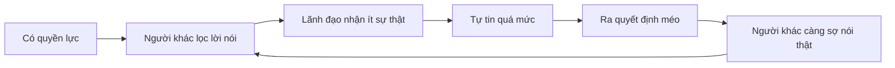

# Tập 5: Tâm Lý Lãnh Đạo Và Quyền Lực

**Hiểu ego, quyền lực, niềm tin, ảnh hưởng, phản kháng và cách giữ sự thật trong tổ chức**  
Giáo trình ngắn gọn cho người trưởng thành, cấp quản lý/C-level

---

## 0. Vì Sao C-level Cần Học Tâm Lý Quyền Lực?

### Bản chất

Quyền lực không chỉ thay đổi cách người khác đối xử với bạn.  
Nó cũng thay đổi cách bạn nhìn chính mình, nhìn người khác và nhìn sự thật.

Ở cấp cao, rủi ro lớn không phải chỉ là thiếu năng lực.  
Rủi ro lớn là:

- Không còn nghe được sự thật
- Nhầm phục tùng với cam kết
- Nhầm sợ hãi với tôn trọng
- Nhầm bận rộn với ảnh hưởng
- Nhầm kiểm soát với lãnh đạo
- Nhầm cái tôi với tiêu chuẩn
- Nhầm trung thành cá nhân với tốt cho tổ chức

### Một câu cần nhớ

> Quyền lực khuếch đại con người thật của lãnh đạo và khuếch đại cả hệ thống xung quanh họ.

### Mục tiêu tập này

Sau tập này, bạn cần làm được 5 việc:

| Năng lực | Ý nghĩa thực tế |
|---|---|
| Hiểu tác động của quyền lực | Biết quyền lực đang làm méo mình và tổ chức ở đâu |
| Đọc phản kháng | Không nhầm chống đối với thiếu năng lực |
| Xây niềm tin | Tạo môi trường có sự thật |
| Dùng ảnh hưởng đúng | Không chỉ dựa vào chức danh |
| Thiết kế trách nhiệm | Quyền lực đi cùng accountability |

---

## 1. First Principles: Lãnh Đạo Là Gì?

### Bản chất

Lãnh đạo không phải là có chức danh.  
Lãnh đạo là khả năng làm cho con người và hệ thống di chuyển về một hướng có giá trị.

```text
Lãnh đạo = Hướng đi + Niềm tin + Năng lực hành động + Trách nhiệm
```

Nếu thiếu một phần, lãnh đạo sẽ méo.

| Thiếu gì | Hậu quả |
|---|---|
| Hướng đi | Mọi người bận nhưng không tiến |
| Niềm tin | Có lệnh nhưng không có cam kết |
| Năng lực hành động | Có tầm nhìn nhưng không thực thi |
| Trách nhiệm | Có quyền nhưng không có chuẩn |

### Lãnh đạo khác quản lý

| Quản lý | Lãnh đạo |
|---|---|
| Giữ hệ thống chạy | Đưa hệ thống đến tương lai tốt hơn |
| Tối ưu hiện tại | Chọn hướng đi |
| Kiểm soát quy trình | Tạo rõ ràng và cam kết |
| Đảm bảo việc được làm | Đảm bảo việc đúng được làm |

### Mô hình đơn giản


### Câu hỏi gốc

```text
1. Tôi đang tạo rõ ràng hay tạo mơ hồ?
2. Tôi đang tạo niềm tin hay tạo sợ hãi?
3. Tôi đang làm tổ chức mạnh lên hay phụ thuộc vào tôi hơn?
4. Tôi đang bảo vệ sự thật hay bảo vệ hình ảnh?
```

---

## 2. Quyền Lực Là Gì?

### Bản chất

Quyền lực là khả năng ảnh hưởng đến lựa chọn, nguồn lực, phần thưởng, hình phạt và tương lai của người khác.

Quyền lực có nhiều nguồn:

| Nguồn quyền lực | Ví dụ |
|---|---|
| Chức danh | CEO, Chairman, Founder |
| Nguồn lực | Ngân sách, nhân sự, cơ hội |
| Thông tin | Biết điều người khác không biết |
| Chuyên môn | Năng lực hiếm |
| Quan hệ | Kết nối, mạng lưới, liên minh |
| Uy tín | Lịch sử tạo kết quả |
| Đạo đức | Sự chính trực, đáng tin |

### Quyền lực không xấu

Quyền lực là công cụ.  
Nó có thể dùng để:

- Tạo rõ ràng
- Bảo vệ tiêu chuẩn
- Phân bổ nguồn lực
- Cắt bỏ điều hại
- Mở đường cho người giỏi
- Chịu trách nhiệm thay cho tập thể

Nhưng quyền lực cũng dễ làm méo:

- Sự thật
- Cảm xúc
- Quan hệ
- Phản hồi
- Cảm giác về bản thân

### Câu hỏi kiểm tra

> Quyền lực của tôi đang làm người khác nói thật hơn hay nói khéo hơn?

---

## 3. Quyền Lực Thay Đổi Người Có Quyền Như Thế Nào?

### Bản chất

Khi có quyền lực, con người dễ:

- Ít nhận phản hồi hơn
- Đánh giá quá cao trực giác của mình
- Ít để ý cảm xúc người khác hơn
- Dễ nhầm ý kiến cá nhân với sự thật
- Dễ coi sự phản đối là vấn đề thái độ
- Dễ quên rằng người khác đang sợ hậu quả

### Vòng méo của quyền lực



### Dấu hiệu quyền lực đang làm méo bạn

| Dấu hiệu | Ý nghĩa |
|---|---|
| Ít ai phản biện trực tiếp | Có thể không còn an toàn |
| Bạn thấy mình luôn là người rõ nhất | Có thể thiếu dữ kiện ngược |
| Người khác hay "đọc ý" bạn | Tổ chức đang phục vụ tâm trạng lãnh đạo |
| Tin xấu đến muộn | Hệ thống sợ hậu quả |
| Người giỏi im lặng dần | Họ không tin nói thật có ích |

### Câu hỏi tự soi

```text
1. Ai là người có thể nói tôi sai mà không bị phạt?
2. Tin xấu thường đến với tôi sớm hay muộn?
3. Người trong tổ chức đang nói thật hay quản trị cảm xúc của tôi?
4. Tôi có đang dùng quyền lực để kết thúc tranh luận quá sớm không?
```

---

## 4. Ego Lãnh Đạo: Khi Cái Tôi Ngồi Vào Ghế Chiến Lược

### Bản chất

Ego là hình ảnh ta muốn giữ về mình.

Ở cấp cao, ego thường gắn với:

- Tôi phải đúng
- Tôi phải mạnh
- Tôi phải kiểm soát được
- Tôi phải được tôn trọng
- Tôi không được tỏ ra yếu
- Tôi là người làm nên thành công này

### Khi ego bị đe dọa

Lãnh đạo có thể:

- Phòng vệ
- Công kích phản biện
- Không nhận sai
- Gạt bỏ dữ kiện ngược
- Giữ người trung thành hơn người giỏi
- Tiếp tục chiến lược sai vì sợ mất mặt

### Phân biệt tiêu chuẩn cao và ego cao

| Tiêu chuẩn cao | Ego cao |
|---|---|
| Tập trung vào kết quả và sự thật | Tập trung vào hình ảnh cá nhân |
| Cho phép phản biện | Xem phản biện là bất kính |
| Sửa sai nhanh | Né nhận sai |
| Khó tính với vấn đề | Khó chịu với con người |
| Dùng quyền lực để bảo vệ chuẩn | Dùng quyền lực để bảo vệ cái tôi |

### Câu hỏi xuyên ego

```text
1. Tôi đang bảo vệ tiêu chuẩn hay bảo vệ tự ái?
2. Nếu người khác nói điều này, tôi có công nhận là đúng không?
3. Tôi có đang muốn thắng cuộc nói chuyện hơn muốn hiểu sự thật không?
4. Điều gì tốt cho tổ chức nhưng khó cho ego của tôi?
```

---

## 5. Niềm Tin: Tiền Tệ Thật Của Lãnh Đạo

### Bản chất

Niềm tin là cảm giác:

> Tôi có thể đặt mình, công việc hoặc tương lai của mình vào tay người này mà không bị phản bội.

Không có niềm tin, tổ chức sẽ cần nhiều kiểm soát hơn.  
Nhiều kiểm soát hơn làm chậm tổ chức.

### Ba trụ cột của niềm tin

| Trụ cột | Câu hỏi người khác tự hỏi |
|---|---|
| Năng lực | Người này có biết mình đang làm gì không? |
| Chính trực | Người này có nói thật và giữ lời không? |
| Thiện chí | Người này có quan tâm lợi ích ngoài bản thân không? |

### Hành vi làm mất niềm tin

| Hành vi | Tác động |
|---|---|
| Nói một đằng làm một nẻo | Mất chính trực |
| Đổi ý nhưng không giải thích | Tăng bất định |
| Phạt người nói thật | Tắt phản hồi |
| Ưu ái người thân cận | Mất công bằng |
| Nhận công, đổ lỗi | Mất tôn trọng |
| Hứa quá mức | Mất uy tín |

### Hành vi xây niềm tin

| Hành vi | Tác động |
|---|---|
| Nói rõ điều biết và chưa biết | Tạo thật |
| Giữ lời nhỏ | Tạo độ tin |
| Nhận sai công khai khi cần | Giảm phòng vệ |
| Công bằng trong tiêu chuẩn | Tạo an toàn |
| Bảo vệ người nói thật | Tăng dữ kiện |
| Giải thích lý do quyết định | Tạo ý nghĩa |

### Nguyên tắc

> Niềm tin tăng bằng hành vi nhất quán, không tăng bằng thông điệp hay khẩu hiệu.

---

## 6. An Toàn Tâm Lý: Điều Kiện Để Sự Thật Đi Lên

### Bản chất

An toàn tâm lý là cảm giác:

> Tôi có thể nói thật, đặt câu hỏi, thừa nhận lỗi hoặc phản biện mà không bị làm nhục, trừng phạt hay loại trừ.

An toàn tâm lý không có nghĩa là dễ dãi.  
Nó là điều kiện để tiêu chuẩn cao vận hành.

### An toàn khác thoải mái

| An toàn tâm lý | Thoải mái dễ dãi |
|---|---|
| Nói thật được | Né xung đột |
| Tiêu chuẩn rõ | Tiêu chuẩn thấp |
| Lỗi được học | Lỗi bị bỏ qua |
| Phản biện được | Ai cũng vui vẻ bề mặt |
| Trách nhiệm cao | Không ai chịu trách nhiệm |

### Dấu hiệu thiếu an toàn

- Tin xấu đến muộn
- Họp chính im, họp ngoài nói nhiều
- Người mới ít hỏi
- Không ai nhận lỗi
- Mọi người chờ ý lãnh đạo
- Báo cáo toàn màu xanh
- Sau quyết định, thực thi chậm

### Câu lãnh đạo nên dùng

```text
Tôi có thể đang sai ở đâu?
Rủi ro nào chúng ta chưa dám nói?
Ai đang nhìn thấy điều tôi chưa thấy?
Nếu phản biện phương án này, điểm yếu lớn nhất là gì?
Cảm ơn vì đã nói sớm. Ta xử lý vấn đề, không xử lý người báo tin.
```

### Nguyên tắc

> Tổ chức không thể sửa điều nó không dám nói ra.

---

## 7. Phục Tùng, Cam Kết Và Tuân Thủ Bề Mặt

### Bản chất

Không phải ai làm theo cũng thật sự đồng thuận.

Có ba mức:

| Mức | Biểu hiện | Chất lượng |
|---|---|---|
| Phục tùng | Làm vì sợ | Nhanh nhưng mong manh |
| Tuân thủ | Làm vì quy định | Ổn định nhưng ít sáng tạo |
| Cam kết | Làm vì tin | Bền và chủ động |

### Rủi ro của phục tùng

Phục tùng có thể tạo cảm giác tổ chức rất kỷ luật.  
Nhưng bên dưới có thể là:

- Sợ hãi
- Không dám nói thật
- Không dám thử
- Không dám nhận trách nhiệm
- Chờ chỉ đạo
- Làm đúng chữ, không làm đúng tinh thần

### Câu hỏi phân biệt

```text
1. Người này làm vì tin hay vì sợ?
2. Nếu tôi không có mặt, hành vi này có tiếp tục không?
3. Họ có dám báo rủi ro khi kế hoạch sai không?
4. Họ có chủ động cải thiện hay chỉ chờ lệnh?
```

### Nguyên tắc

> Sợ hãi có thể tạo tốc độ ngắn hạn, nhưng phá chủ động dài hạn.

---

## 8. Phản Kháng: Không Phải Lúc Nào Cũng Là Chống Đối

### Bản chất

Phản kháng là tín hiệu hệ thống.

Nó có thể báo:

- Người ta chưa hiểu
- Người ta không tin
- Người ta sợ mất thứ gì đó
- Người ta thấy rủi ro thật
- Người ta bị quá tải
- Người ta không được tham gia
- Lợi ích bị ảnh hưởng

### Các loại phản kháng

| Loại | Bản chất | Cách xử lý |
|---|---|---|
| Thiếu hiểu | Không rõ lý do/cách làm | Giải thích, làm rõ |
| Thiếu tin | Không tin lãnh đạo/hệ thống | Xây niềm tin, minh bạch |
| Sợ mất | Mất quyền, vị trí, an toàn | Gọi tên mất mát, hỗ trợ chuyển đổi |
| Rủi ro thật | Họ thấy điểm yếu | Lắng nghe, kiểm chứng |
| Chính trị | Bảo vệ lợi ích nhóm | Làm rõ quyền lợi và chuẩn |
| Kiệt sức | Không còn năng lượng | Giảm tải, ưu tiên lại |

### Câu hỏi đọc phản kháng

```text
1. Họ không hiểu, không tin, không muốn, hay không thể?
2. Họ đang sợ mất điều gì?
3. Có phần phản kháng nào là dữ kiện đúng không?
4. Nếu tôi là họ, điều gì sẽ làm tôi lo?
5. Cần tăng rõ ràng, tăng an toàn hay tăng trách nhiệm?
```

### Nguyên tắc

> Phản kháng bị dập tắt sẽ đi ngầm. Phản kháng được hiểu đúng có thể trở thành dữ liệu.

---

## 9. Ảnh Hưởng: Lãnh Đạo Không Chỉ Bằng Mệnh Lệnh

### Bản chất

Ảnh hưởng là khả năng làm người khác tự nguyện chú ý, tin và hành động.

Mệnh lệnh tạo hành vi.  
Ảnh hưởng tạo cam kết.

### Các nguồn ảnh hưởng

| Nguồn | Cách hoạt động |
|---|---|
| Rõ ràng | Người khác biết phải đi đâu |
| Năng lực | Người khác tin bạn hiểu vấn đề |
| Chính trực | Người khác tin lời bạn |
| Đồng cảm | Người khác cảm thấy được hiểu |
| Tiêu chuẩn | Người khác biết điều gì được chấp nhận |
| Tấm gương | Người khác thấy bạn sống điều bạn nói |
| Lợi ích chung | Người khác thấy mình trong bức tranh |

### Ảnh hưởng yếu thường dựa vào

- Chức danh
- Sợ hãi
- Thưởng phạt
- Chính trị
- Gây áp lực

Nó có thể hiệu quả ngắn hạn, nhưng chi phí cao.

### Cấu trúc thông điệp ảnh hưởng

```text
1. Thực tại là gì?
2. Vì sao phải hành động?
3. Hướng đi là gì?
4. Điều này có ý nghĩa gì với họ?
5. Cần hành vi cụ thể nào?
6. Tiêu chuẩn và mốc kiểm tra là gì?
```

---

## 10. Chính Trị Nội Bộ: Tâm Lý Của Quyền Lợi Và Vị Trí

### Bản chất

Chính trị nội bộ xuất hiện khi con người cạnh tranh để bảo vệ hoặc mở rộng:

- Quyền lực
- Nguồn lực
- Ảnh hưởng
- Vị trí
- Hình ảnh
- Sự an toàn

Chính trị không thể biến mất hoàn toàn.  
Nhưng có thể làm nó minh bạch và ít độc hại hơn.

### Chính trị lành mạnh và độc hại

| Lành mạnh | Độc hại |
|---|---|
| Tranh luận lợi ích rõ ràng | Đâm sau lưng |
| Khác quan điểm được nói thẳng | Phe nhóm ngầm |
| Quyết định dựa trên tiêu chí | Quyết định dựa trên thân cận |
| Xung đột được xử lý công khai | Tin đồn và thao túng |
| Quyền lực đi cùng trách nhiệm | Quyền lực không bị kiểm soát |

### Dấu hiệu chính trị độc hại

- Tin đồn mạnh hơn thông tin chính thức
- Người thân cận có quyền không rõ
- Quyết định thật diễn ra ngoài phòng họp
- Người nói thẳng bị cô lập
- KPI chính thức khác động lực thật
- Lãnh đạo nghe qua phe, không nghe qua dữ kiện

### Câu hỏi xử lý

```text
1. Quyền lực thật đang nằm ở đâu?
2. Ai được lợi khi vấn đề mơ hồ?
3. Quyết định này dựa trên tiêu chí hay quan hệ?
4. Có cuộc họp ngoài cuộc họp nào đang quyết định thật không?
5. Cần minh bạch hóa quyền, trách nhiệm và tiêu chí nào?
```

---

## 11. Giao Quyền: Từ Kiểm Soát Sang Tạo Năng Lực

### Bản chất

Giao quyền không phải là buông.  
Giao quyền là chuyển quyền quyết định kèm rõ mục tiêu, ranh giới và trách nhiệm.

### Vì sao lãnh đạo không giao quyền?

| Lý do bề mặt | Bản chất có thể là |
|---|---|
| "Họ chưa đủ năng lực" | Chưa đầu tư phát triển |
| "Việc này quan trọng" | Sợ mất kiểm soát |
| "Tôi làm nhanh hơn" | Không muốn chịu chậm ban đầu |
| "Tôi phải kiểm tra hết" | Thiếu hệ thống tiêu chuẩn |
| "Không ai hiểu như tôi" | Tổ chức phụ thuộc cá nhân |

### Công thức giao quyền

```text
1. Kết quả mong muốn là gì?
2. Quyền quyết định đến đâu?
3. Ranh giới không được vượt là gì?
4. Tiêu chuẩn chất lượng là gì?
5. Mốc kiểm tra là khi nào?
6. Khi gặp rủi ro, phải báo theo cách nào?
```

### Các mức giao quyền

| Mức | Người được giao làm gì |
|---|---|
| 1 | Thu thập dữ kiện |
| 2 | Đề xuất phương án |
| 3 | Quyết sau khi được duyệt |
| 4 | Quyết và báo lại |
| 5 | Toàn quyền trong ranh giới đã thống nhất |

### Nguyên tắc

> Nếu mọi quyết định quan trọng đều cần bạn, bạn chưa xây tổ chức. Bạn mới xây một hệ thống phụ thuộc vào bạn.

---

## 12. Accountability: Trách Nhiệm Không Phải Đổ Lỗi

### Bản chất

Accountability là sự rõ ràng về:

- Ai sở hữu kết quả
- Tiêu chuẩn là gì
- Quyền hạn đến đâu
- Khi sai thì học và sửa thế nào
- Hậu quả của việc không đạt là gì

Nó khác đổ lỗi.

| Accountability | Đổ lỗi |
|---|---|
| Tập trung vào kết quả và hệ thống | Tập trung tìm người sai |
| Rõ trước khi làm | Mơ hồ rồi phạt |
| Có quyền đi cùng trách nhiệm | Có trách nhiệm nhưng không có quyền |
| Học từ sai | Che giấu sai |
| Tạo trưởng thành | Tạo sợ hãi |

### Câu hỏi thiết kế accountability

```text
1. Kết quả này ai sở hữu?
2. Người đó có đủ quyền để chịu trách nhiệm không?
3. Tiêu chuẩn đo lường là gì?
4. Mốc kiểm tra là khi nào?
5. Nếu lệch, cơ chế sửa là gì?
6. Nếu lặp lại thất bại, hậu quả là gì?
```

### Nguyên tắc

> Trách nhiệm mơ hồ tạo chính trị. Trách nhiệm rõ tạo trưởng thành.

---

## 13. Văn Hóa: Bóng Dài Của Hành Vi Lãnh Đạo

### Bản chất

Văn hóa không phải là slogan.  
Văn hóa là những hành vi được thưởng, được phạt, được bỏ qua và được bắt chước.

### Lãnh đạo tạo văn hóa bằng 5 cách

| Cách | Ví dụ |
|---|---|
| Điều họ chú ý | Hỏi về doanh số nhưng không hỏi về khách hàng |
| Điều họ thưởng | Thưởng kết quả ngắn hạn dù phá đội ngũ |
| Điều họ phạt | Phạt người báo tin xấu |
| Điều họ bỏ qua | Bỏ qua người giỏi nhưng độc hại |
| Điều họ làm khi áp lực | Nói giá trị một đằng, hành động một nẻo |

### Câu hỏi văn hóa thực

```text
1. Ở đây, hành vi nào giúp thăng tiến?
2. Hành vi nào bị phạt dù không nói ra?
3. Tin xấu được xử lý thế nào?
4. Người giỏi nhưng độc hại có được giữ không?
5. Khi áp lực, giá trị nào bị hy sinh đầu tiên?
```

### Nguyên tắc

> Văn hóa thật lộ ra khi có áp lực, không phải khi mọi thứ thuận lợi.

---

## 14. Lãnh Đạo Trong Khủng Hoảng

### Bản chất

Khủng hoảng làm con người tìm kiếm:

- Rõ ràng
- Bình tĩnh
- Sự thật
- Hướng đi
- Người chịu trách nhiệm
- Cảm giác có thể hành động

### Lãnh đạo yếu trong khủng hoảng

- Đổ lỗi
- Che giấu
- Giao tiếp mơ hồ
- Quyết định theo hoảng loạn
- Phản ứng theo tin đồn
- Tạo thêm sợ hãi

### Lãnh đạo mạnh trong khủng hoảng

| Hành vi | Tác động |
|---|---|
| Nói rõ điều biết/chưa biết | Giảm mơ hồ |
| Giữ nhịp giao tiếp | Giảm tin đồn |
| Chia vấn đề thành mốc ngắn | Tăng hành động |
| Không phạt người báo tin | Tăng sự thật |
| Nhận trách nhiệm | Tạo ổn định |
| Quyết định theo nguyên tắc | Giảm cảm tính |

### Cấu trúc thông điệp khủng hoảng

```text
1. Thực tế hiện tại là gì?
2. Điều gì đã biết và chưa biết?
3. Ưu tiên 24-72 giờ tới là gì?
4. Ai chịu trách nhiệm phần nào?
5. Khi nào cập nhật tiếp?
6. Hành vi nào cần mọi người giữ?
```

---

## 15. Cô Đơn Ở Đỉnh Và Cạm Bẫy Của Người Thành Công

### Bản chất

Càng lên cao, càng ít người nói với bạn điều bạn cần nghe.

Người thành công dễ mắc:

- Cô lập
- Quá tin mình
- Khó nhận phản hồi
- Đồng nhất bản thân với vai trò
- Không biết ai thật lòng
- Không có nơi xử lý nỗi sợ
- Không cho phép mình yếu

### Cạm bẫy

| Cạm bẫy | Hậu quả |
|---|---|
| Chỉ gặp người phụ thuộc vào mình | Mất phản hồi thật |
| Không có peer ngang hàng | Thiếu soi chiếu |
| Không dám nói mình sợ | Căng ngầm |
| Vai trò nuốt con người | Mất đời sống riêng |
| Thành công cũ thành danh tính | Khó đổi mới |

### Hệ hỗ trợ cần có

- Một người phản biện được phép nói thẳng
- Một nhóm peer không phụ thuộc lợi ích
- Một cố vấn/coach đủ độc lập
- Một không gian không cần diễn vai lãnh đạo
- Một routine phục hồi cơ thể và tâm trí

### Câu hỏi tự soi

```text
1. Ai thấy được con người thật của tôi ngoài vai trò?
2. Tôi có nơi nào nói nỗi sợ mà không mất hình ảnh không?
3. Ai được phép nói tôi đang tự lừa mình?
4. Tôi đang sống vì giá trị hay vì vai diễn thành công?
```

---

## 16. Công Cụ Thực Hành

### Công cụ 1: Audit quyền lực

```text
Quyền lực chính của tôi đến từ đâu?
Ai bị ảnh hưởng nhiều nhất bởi quyết định của tôi?
Ai có thể nói thật với tôi?
Tin xấu đến với tôi sau bao lâu?
Tôi thường phản ứng thế nào khi bị phản biện?
Quyền lực của tôi đang tạo an toàn hay sợ hãi?
```

### Công cụ 2: Kiểm tra niềm tin

| Câu hỏi | Trả lời |
|---|---|
| Tôi có giữ lời nhỏ không? |  |
| Tôi có nói rõ khi đổi ý không? |  |
| Tôi có nhận sai khi cần không? |  |
| Tôi có phạt người báo tin xấu không? |  |
| Tôi có tiêu chuẩn công bằng không? |  |

### Công cụ 3: Đọc phản kháng

```text
Ai đang phản kháng?
Họ phản kháng bằng hành vi gì?
Họ không hiểu, không tin, không muốn hay không thể?
Họ sợ mất điều gì?
Phần nào trong phản kháng là dữ kiện đúng?
Cần tăng rõ ràng, an toàn hay trách nhiệm?
```

### Công cụ 4: Thiết kế giao quyền

```text
Việc cần giao:
Kết quả mong muốn:
Quyền quyết định:
Ranh giới:
Tiêu chuẩn:
Mốc kiểm tra:
Cách báo rủi ro:
Mức giao quyền hiện tại:
Mức giao quyền mong muốn:
```

### Công cụ 5: Review văn hóa thật

```text
Hành vi nào đang được thưởng?
Hành vi nào đang bị phạt?
Hành vi nào đang được bỏ qua?
Người nào đang được bắt chước?
Khi áp lực, chúng ta hy sinh giá trị nào trước?
Một thay đổi nhỏ nào từ lãnh đạo sẽ đổi tín hiệu văn hóa?
```

---

## 17. Lộ Trình Thực Hành 4 Tuần

### Tuần 1: Nhìn quyền lực của chính mình

Mục tiêu:

- Thấy quyền lực đang làm người khác phản ứng thế nào
- Nhận diện điểm mù do vị trí

Bài tập:

- Làm audit quyền lực.
- Hỏi 2 người đáng tin: "Có điều gì tôi làm khiến người khác ngại nói thật không?"

### Tuần 2: Tăng sự thật

Mục tiêu:

- Tạo điều kiện để tin xấu đi lên sớm hơn

Bài tập:

- Trong 3 cuộc họp, hỏi: "Tôi có thể đang sai ở đâu?"
- Ghi lại phản ứng của mọi người.

### Tuần 3: Giao quyền và accountability

Mục tiêu:

- Giảm phụ thuộc vào bạn
- Làm rõ quyền và trách nhiệm

Bài tập:

- Chọn một việc bạn đang giữ quá chặt.
- Thiết kế lại bằng công cụ giao quyền.

### Tuần 4: Văn hóa và niềm tin

Mục tiêu:

- Nhìn văn hóa qua hành vi được thưởng/phạt

Bài tập:

- Review một hành vi xấu đang lặp lại trong tổ chức.
- Xác định lãnh đạo đang vô tình thưởng hoặc bỏ qua điều gì.

---

## 18. Bảng Tóm Tắt First Principles

| Chủ đề | Bản chất | Câu hỏi áp dụng |
|---|---|---|
| Lãnh đạo | Huy động con người và hệ thống về hướng có giá trị | Tôi đang tạo rõ ràng hay mơ hồ? |
| Quyền lực | Khả năng ảnh hưởng đến lựa chọn và nguồn lực | Quyền lực của tôi làm người khác nói thật hay nói khéo? |
| Ego | Bảo vệ hình ảnh bản thân | Tôi đang bảo vệ tiêu chuẩn hay tự ái? |
| Niềm tin | Năng lực + chính trực + thiện chí | Hành vi nào của tôi làm tăng/giảm niềm tin? |
| An toàn tâm lý | Nói thật không bị trừng phạt/làm nhục | Tổ chức có dám nói điều khó không? |
| Phục tùng | Làm vì sợ | Nếu tôi không có mặt, họ có chủ động không? |
| Phản kháng | Tín hiệu hệ thống | Họ không hiểu, không tin, không muốn hay không thể? |
| Ảnh hưởng | Làm người khác tự nguyện tin và hành động | Tôi đang dùng chức danh hay tạo cam kết? |
| Chính trị | Cạnh tranh quyền lực, nguồn lực, vị trí | Ai được lợi khi vấn đề mơ hồ? |
| Giao quyền | Chuyển quyền kèm ranh giới và trách nhiệm | Người đó có đủ quyền để chịu trách nhiệm không? |
| Văn hóa | Hành vi được thưởng/phạt/bỏ qua | Khi áp lực, giá trị nào bị hy sinh trước? |

---

## 19. Một Câu Để Nhớ Toàn Bộ Tập 5

> Lãnh đạo trưởng thành là dùng quyền lực để làm sự thật rõ hơn, con người mạnh hơn và hệ thống ít phụ thuộc vào cái tôi của mình hơn.

Quyền lực tốt không làm người khác nhỏ lại.  
Quyền lực tốt tạo ra rõ ràng, tiêu chuẩn, niềm tin và năng lực hành động lớn hơn cho cả tổ chức.

