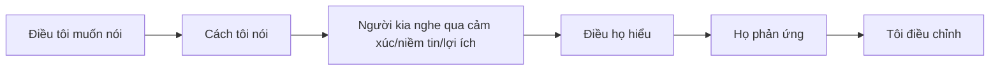

# Tập 6: Tâm Lý Giao Tiếp, Thuyết Phục Và Đàm Phán

**Hiểu cách con người nghe, chống đối, bị thuyết phục, giữ thể diện và đi đến thỏa thuận**  
Giáo trình ngắn gọn cho người trưởng thành, cấp quản lý/C-level

---

## 0. Vì Sao C-level Cần Học Giao Tiếp Và Đàm Phán?

### Bản chất

Ở cấp cao, công việc không chỉ là nghĩ đúng.  
Công việc là làm cho người khác **hiểu đúng, tin đủ, hành động cùng hướng và cam kết đủ lâu**.

Nhiều thất bại không đến từ chiến lược sai, mà từ:

- Nói đúng nhưng người khác không nghe
- Người nghe phòng vệ
- Thông điệp quá mơ hồ
- Lợi ích thật không được nói ra
- Xung đột bị né quá lâu
- Đàm phán chỉ tập trung vào giá
- Lãnh đạo nhầm im lặng với đồng thuận

### Một câu cần nhớ

> Giao tiếp không phải là nói điều mình nghĩ. Giao tiếp là tạo ra hiểu biết, niềm tin và hành động ở người nghe.

### Mục tiêu tập này

Sau tập này, bạn cần làm được 5 việc:

| Năng lực | Ý nghĩa thực tế |
|---|---|
| Nghe đúng tầng | Không chỉ nghe chữ, mà nghe nhu cầu và nỗi sợ |
| Nói rõ | Giảm mơ hồ, giảm hiểu nhầm |
| Thuyết phục | Làm người khác tự nguyện thấy hợp lý |
| Xử lý phản kháng | Không kích hoạt phòng vệ không cần thiết |
| Đàm phán | Tìm thỏa thuận tốt hơn thắng-thua bề mặt |

---

## 1. First Principles: Giao Tiếp Là Gì?

### Bản chất

Giao tiếp là quá trình chuyển một thực tại trong đầu người này thành một thực tại đủ giống trong đầu người khác.

```text
Giao tiếp = Ý định + Thông điệp + Bối cảnh + Cảm xúc + Diễn giải + Phản hồi
```

Nếu thiếu phản hồi, bạn không biết người kia đã hiểu gì.

### Vì sao nói rồi mà người khác vẫn không hiểu?

Vì người nghe không nhận thông điệp trống rỗng.  
Họ nghe qua:

- Kinh nghiệm cũ
- Lợi ích hiện tại
- Cảm xúc lúc đó
- Niềm tin về bạn
- Nỗi sợ mất mát
- Vị trí quyền lực
- Câu chuyện họ đang tin

### Mô hình đơn giản



### Câu hỏi gốc

```text
1. Tôi muốn người kia hiểu điều gì?
2. Tôi muốn họ cảm thấy gì?
3. Tôi muốn họ làm gì sau cuộc nói chuyện?
4. Điều gì có thể khiến họ phòng vệ?
5. Tôi có kiểm tra lại họ đã hiểu đúng chưa?
```

---

## 2. Ba Tầng Của Mọi Cuộc Giao Tiếp

### Bản chất

Mỗi cuộc nói chuyện thường có 3 tầng:

| Tầng | Nội dung | Ví dụ |
|---|---|---|
| Sự việc | Ta đang nói về chuyện gì? | Deadline trễ |
| Cảm xúc/lợi ích | Ai đang lo, muốn, sợ gì? | Sợ bị quy trách nhiệm |
| Bản sắc/vị thế | Ai đang sợ bị nhìn là gì? | Sợ bị xem là kém năng lực |

### Sai lầm phổ biến

Chỉ xử lý tầng sự việc trong khi vấn đề thật nằm ở tầng cảm xúc hoặc bản sắc.

Ví dụ:

> "Tại sao báo cáo trễ?"

Bề mặt là deadline.  
Tầng sâu có thể là:

- Người đó không đủ nguồn lực
- Không dám báo rủi ro sớm
- Sợ bị phê bình
- Không hiểu ưu tiên
- Không tin deadline có ý nghĩa

### Câu hỏi đọc tầng sâu

```text
1. Bề mặt họ đang nói gì?
2. Họ thật sự đang lo điều gì?
3. Họ muốn bảo vệ lợi ích nào?
4. Họ sợ bị nhìn nhận là người thế nào?
5. Tôi đang phản ứng với tầng nào?
```

### Nguyên tắc

> Khi tầng sâu chưa được chạm tới, tầng bề mặt sẽ lặp lại nhiều lần.

---

## 3. Lắng Nghe: Không Phải Im Lặng, Mà Là Làm Người Khác Rõ Hơn

### Bản chất

Lắng nghe tốt không chỉ là để người khác nói.  
Lắng nghe tốt là giúp người khác tự làm rõ suy nghĩ, cảm xúc, lợi ích và rủi ro của họ.

### Các cấp độ nghe

| Cấp | Biểu hiện |
|---|---|
| Nghe để đáp | Chờ đến lượt phản biện |
| Nghe để bắt lỗi | Tìm điểm yếu trong lời nói |
| Nghe để hiểu | Tò mò về logic của họ |
| Nghe để làm rõ | Giúp họ nói rõ điều chưa rõ |
| Nghe hệ thống | Nghe cả điều người đó đại diện trong tổ chức |

### Dấu hiệu bạn chưa thật sự nghe

- Đã chuẩn bị câu trả lời khi người kia chưa nói xong
- Muốn thắng cuộc nói chuyện
- Chỉ nhớ điểm mình không đồng ý
- Không hỏi thêm câu nào
- Tóm tắt lại sai ý người kia

### Công cụ: Tóm tắt phản chiếu

```text
Nếu tôi hiểu đúng, ý anh/chị là...
Điều anh/chị lo nhất là...
Điểm quan trọng với anh/chị là...
Tôi có hiểu sai phần nào không?
```

### Tác dụng

Người khác thường dịu xuống khi họ cảm thấy:

- Được nghe
- Được hiểu
- Không bị bóp méo ý
- Không bị vội phán xét

### Nguyên tắc

> Người chưa cảm thấy được hiểu thường chưa sẵn sàng bị thuyết phục.

---

## 4. Nói Rõ: Ít Chữ Hơn, Ít Mơ Hồ Hơn

### Bản chất

Nói rõ là giảm số cách hiểu sai.

Ở cấp cao, mơ hồ tạo chi phí lớn:

- Người hiểu khác nhau
- Quyết định chậm
- Trách nhiệm mờ
- Kỳ vọng lệch
- Xung đột tăng
- Chính trị nội bộ xuất hiện

### Công thức nói rõ

```text
Bối cảnh + Vấn đề + Ý nghĩa + Kỳ vọng + Mốc thời gian + Chủ sở hữu
```

### Ví dụ

Mơ hồ:

> Team cần chủ động hơn.

Rõ hơn:

> Trong quý này, tôi cần team chủ động báo rủi ro trước deadline ít nhất 48 giờ, kèm 2 phương án xử lý. Owner là từng trưởng bộ phận.

### Các từ dễ gây mơ hồ

| Từ mơ hồ | Nên làm rõ thành |
|---|---|
| Sớm | Ngày/giờ cụ thể |
| Tốt hơn | Tiêu chuẩn đo được |
| Chủ động | Hành vi cụ thể |
| Ưu tiên | Thứ tự và điều bị hy sinh |
| Chịu trách nhiệm | Kết quả, quyền, hậu quả |
| Cẩn thận | Rủi ro cần kiểm soát |

### Câu hỏi kiểm tra độ rõ

```text
1. Người nghe biết chính xác cần làm gì không?
2. Họ biết khi nào xong không?
3. Họ biết tiêu chuẩn tốt là gì không?
4. Họ biết ai quyết cuối không?
5. Họ biết nếu lệch thì báo ai không?
```

---

## 5. Framing: Cách Đóng Khung Làm Thay Đổi Cách Người Khác Nghĩ

### Bản chất

Con người không phản ứng chỉ với sự kiện.  
Con người phản ứng với cách sự kiện được đóng khung.

### Ví dụ

Cùng một thay đổi:

| Frame | Người nghe dễ cảm thấy |
|---|---|
| "Cắt giảm chi phí" | Mất mát, sợ hãi |
| "Tập trung nguồn lực vào phần có tương lai" | Rõ hướng, có ý nghĩa |
| "Tái cấu trúc" | Bất định |
| "Thiết kế lại để tăng tốc quyết định" | Có mục tiêu |

### Các frame hữu ích

| Frame | Dùng khi |
|---|---|
| Rủi ro | Cần làm rõ cái giá nếu không hành động |
| Cơ hội | Cần tạo năng lượng tiến lên |
| Công bằng | Cần xử lý xung đột lợi ích |
| Học hỏi | Cần giảm sợ sai |
| Trách nhiệm | Cần tăng ownership |
| Ý nghĩa | Cần kết nối với mục tiêu lớn |

### Câu hỏi trước khi nói

```text
1. Nếu nói theo cách này, người kia sẽ thấy mất hay được?
2. Frame này tạo sợ hãi hay tạo trách nhiệm?
3. Tôi có đang che giấu sự thật bằng frame đẹp không?
4. Frame nào vừa thật vừa giúp người nghe hành động tốt hơn?
```

### Nguyên tắc

> Frame tốt không bóp méo sự thật. Frame tốt giúp sự thật trở nên có thể hiểu và có thể hành động.

---

## 6. Thuyết Phục: Không Phải Ép Người Khác Tin

### Bản chất

Thuyết phục là làm cho người khác thấy một hướng đi là hợp lý, đáng tin và có liên quan đến điều họ quan tâm.

```text
Thuyết phục = Logic + Niềm tin + Lợi ích + Cảm xúc + Thời điểm
```

### Vì sao lập luận đúng vẫn không thuyết phục?

Vì người nghe có thể:

- Không tin bạn
- Sợ mất thứ gì đó
- Không thấy lợi ích của mình
- Cảm thấy bị xem thường
- Chưa sẵn sàng đổi niềm tin
- Bị buộc phải nhận mình sai

### Năm cửa vào của thuyết phục

| Cửa | Câu hỏi |
|---|---|
| Logic | Điều này có hợp lý không? |
| Niềm tin | Tôi có tin người nói không? |
| Lợi ích | Điều này liên quan gì đến tôi? |
| Cảm xúc | Tôi có thấy an toàn/được tôn trọng không? |
| Bản sắc | Nếu đồng ý, tôi có mất mặt không? |

### Cấu trúc thuyết phục thực dụng

```text
1. Bắt đầu từ điều người kia quan tâm.
2. Công nhận rủi ro/nỗi lo thật.
3. Trình bày dữ kiện ngắn.
4. Nêu lựa chọn và hậu quả.
5. Gắn phương án với lợi ích chung.
6. Mời phản biện.
```

### Nguyên tắc

> Muốn thuyết phục người khác, trước hết phải hiểu điều gì đang giữ họ lại.

---

## 7. Phản Biện Mà Không Làm Người Khác Phòng Vệ

### Bản chất

Phản biện tốt là tấn công vào giả định, rủi ro và logic, không tấn công vào phẩm giá con người.

### Vì sao người ta phòng vệ?

Vì họ cảm thấy:

- Bị xem là ngu
- Bị mất mặt
- Bị hạ vị thế
- Bị phủ nhận công sức
- Bị đe dọa quyền lợi
- Bị ép nhận sai trước nhóm

### Cách phản biện tốt

| Thay vì | Hãy nói |
|---|---|
| "Cái này sai rồi" | "Giả định nào khiến phương án này đúng?" |
| "Anh không hiểu vấn đề" | "Có một góc nhìn khác cần kiểm tra." |
| "Không thực tế" | "Điểm nghẽn thực thi có thể nằm ở đâu?" |
| "Tôi không đồng ý" | "Tôi đồng ý mục tiêu, nhưng lo về cách đi." |
| "Ai nghĩ ra cái này?" | "Ta cùng nhìn vào rủi ro lớn nhất." |

### Công thức phản biện

```text
Tôi đồng ý với mục tiêu...
Điểm tôi lo là...
Giả định cần kiểm chứng là...
Nếu giả định sai, hậu quả là...
Ta có thể thử/kiểm tra bằng...
```

### Nguyên tắc

> Giữ phẩm giá cho người khác không làm phản biện yếu đi. Nó làm phản biện dễ được nghe hơn.

---

## 8. Cuộc Nói Chuyện Khó

### Bản chất

Cuộc nói chuyện khó thường khó vì nó chạm vào:

- Sợ mất quan hệ
- Sợ làm người khác đau
- Sợ bị phản công
- Sợ mất mặt
- Sợ hậu quả chính trị
- Sợ phải nói sự thật không dễ nghe

### Sai lầm phổ biến

| Sai lầm | Hậu quả |
|---|---|
| Né quá lâu | Vấn đề lớn hơn |
| Nói khi đang giận | Gây tổn thương |
| Nói vòng vo | Người kia không hiểu mức độ nghiêm trọng |
| Chỉ nêu cảm giác | Thiếu dữ kiện |
| Chỉ nêu lỗi | Người kia phòng vệ |
| Không chốt hành động | Cuộc nói chuyện không tạo thay đổi |

### Cấu trúc cuộc nói chuyện khó

```text
1. Mục đích: Tôi muốn nói chuyện để xử lý vấn đề, không phải đổ lỗi.
2. Dữ kiện: Điều tôi quan sát được là...
3. Tác động: Việc này ảnh hưởng đến...
4. Góc nhìn: Tôi muốn nghe cách anh/chị nhìn vấn đề.
5. Kỳ vọng: Từ nay cần thay đổi...
6. Hỗ trợ/ranh giới: Tôi có thể hỗ trợ..., nhưng điều không thể tiếp tục là...
7. Mốc kiểm tra: Ta sẽ review lại vào...
```

### Câu mở đầu tốt

```text
Tôi muốn trao đổi thẳng nhưng giữ sự tôn trọng.
Mục tiêu của tôi là làm rõ vấn đề để cùng xử lý.
Có một điểm khó nói, nhưng nếu không nói thì không công bằng với anh/chị và với đội ngũ.
```

### Nguyên tắc

> Sự tử tế không nằm ở việc tránh sự thật. Sự tử tế là nói sự thật theo cách người khác có cơ hội trưởng thành.

---

## 9. Xung Đột: Không Phải Lúc Nào Cũng Xấu

### Bản chất

Xung đột là dấu hiệu có khác biệt về:

- Mục tiêu
- Lợi ích
- Giá trị
- Thông tin
- Quyền lực
- Cách nhìn rủi ro
- Nhu cầu được tôn trọng

### Xung đột tốt và xấu

| Xung đột tốt | Xung đột xấu |
|---|---|
| Tập trung vào vấn đề | Tấn công cá nhân |
| Có dữ kiện | Có suy diễn |
| Tăng rõ ràng | Tăng phe nhóm |
| Có tiêu chuẩn | Có quyền lực ngầm |
| Kết thúc bằng quyết định | Kéo dài bằng cảm xúc |

### Bản đồ xử lý xung đột

```text
1. Xung đột thật sự là về điều gì?
2. Các bên muốn gì?
3. Các bên sợ mất gì?
4. Dữ kiện chung là gì?
5. Tiêu chí quyết định là gì?
6. Ai có quyền quyết cuối?
7. Sau quyết định, cần cam kết hành vi nào?
```

### Nguyên tắc

> Xung đột không được xử lý sẽ chuyển thành chính trị, im lặng hoặc chống đối thụ động.

---

## 10. Đàm Phán: Không Phải Chỉ Là Chia Phần

### Bản chất

Đàm phán là quá trình các bên có khác biệt về lợi ích tìm cách đi đến thỏa thuận.

Đàm phán tốt không chỉ hỏi:

> Ai được bao nhiêu?

Mà hỏi:

> Có cách nào tạo thêm giá trị trước khi chia giá trị không?

### Hai kiểu đàm phán

| Kiểu | Tư duy | Khi nào hay gặp |
|---|---|---|
| Chia bánh | Tổng giá trị cố định | Giá, tỷ lệ, điều khoản đơn |
| Mở rộng bánh | Tạo thêm lựa chọn | Đối tác dài hạn, M&A, JV, tuyển dụng cấp cao |

### Các tầng trong đàm phán

| Tầng | Ví dụ |
|---|---|
| Vị trí | "Tôi muốn giá X" |
| Lợi ích | "Tôi cần bảo vệ margin" |
| Ràng buộc | "Tôi bị giới hạn bởi cashflow" |
| Nỗi sợ | "Tôi sợ bị ép sau khi ký" |
| Giá trị ẩn | "Tôi cần tốc độ, uy tín, độc quyền, linh hoạt" |

### Câu hỏi mở rộng giá trị

```text
Ngoài giá, điều gì quan trọng với anh/chị?
Điều khoản nào linh hoạt, điều khoản nào không?
Nếu tăng giá trị tổng thể, có biến số nào ta chưa bàn?
Rủi ro lớn nhất của anh/chị sau khi ký là gì?
Điều gì khiến thỏa thuận này đáng tin hơn?
```

---

## 11. Chuẩn Bị Đàm Phán

### Bản chất

Đàm phán thường thắng trước khi vào phòng.

Chuẩn bị tốt giúp bạn không bị kéo bởi cảm xúc, áp lực hoặc con số đầu tiên.

### Checklist chuẩn bị

```text
1. Mục tiêu lý tưởng là gì?
2. Mức chấp nhận được là gì?
3. Điểm rời bàn là gì?
4. BATNA của tôi là gì?
5. BATNA của họ có thể là gì?
6. Họ thật sự quan tâm điều gì?
7. Họ sợ rủi ro nào?
8. Biến số nào ngoài giá có thể trao đổi?
9. Điều gì tôi không được nhượng?
10. Tôi sẽ mở đầu bằng frame nào?
```

### BATNA là gì?

BATNA là phương án tốt nhất nếu không đạt thỏa thuận.

> Người không biết BATNA của mình dễ nhượng bộ vì sợ mất deal.

### Biến số ngoài giá

| Biến số | Ví dụ |
|---|---|
| Thời gian | Thanh toán sớm/chậm |
| Phạm vi | Bao gồm/không bao gồm dịch vụ |
| Rủi ro | Bảo hành, điều kiện thoát |
| Độc quyền | Khu vực, ngành, thời hạn |
| Uy tín | Case study, truyền thông |
| Linh hoạt | Điều chỉnh theo kết quả |
| Quan hệ | Cam kết dài hạn |

---

## 12. Neo Giá Và Hiệu Ứng Con Số Đầu Tiên

### Bản chất

Con số đầu tiên thường tạo neo tâm lý.  
Các bên có xu hướng điều chỉnh quanh con số đó, dù nó không hoàn toàn hợp lý.

### Khi nào nên đưa neo trước?

Nên đưa trước khi:

- Bạn có thông tin tốt
- Bạn có căn cứ mạnh
- Bạn muốn định hình vùng thảo luận
- Bạn không sợ làm đối phương rời bàn

Không nên đưa trước khi:

- Bạn thiếu thông tin
- Đối phương biết thị trường hơn bạn
- Khoảng giá có thể rộng hơn bạn tưởng

### Cách neo tốt

```text
1. Neo bằng logic, không chỉ con số.
2. Gắn với tiêu chí khách quan.
3. Chừa không gian trao đổi.
4. Nói tự tin, không phòng vệ.
```

### Ví dụ

> Với phạm vi triển khai, rủi ro cam kết và benchmark thị trường, vùng hợp lý của chúng tôi là X-Y. Nếu cần tối ưu ngân sách, ta có thể điều chỉnh phạm vi hoặc mốc thanh toán.

### Nguyên tắc

> Giá là một con số. Giá trị là câu chuyện làm con số đó hợp lý.

---

## 13. Xử Lý Bế Tắc

### Bản chất

Bế tắc thường xảy ra khi các bên bị kẹt ở vị trí, không còn khám phá lợi ích.

Ví dụ:

> "Tôi chỉ trả X."  
> "Tôi không thể dưới Y."

### Cách mở bế tắc

| Cách | Câu hỏi |
|---|---|
| Quay lại lợi ích | Điều gì khiến mức này quan trọng với anh/chị? |
| Thêm biến số | Ngoài giá, biến nào có thể thay đổi? |
| Chia nhỏ vấn đề | Phần nào đã đồng ý, phần nào còn kẹt? |
| Đổi thời gian | Nếu chia theo giai đoạn thì sao? |
| Dùng tiêu chí khách quan | Benchmark nào hai bên cùng tin? |
| Tạm dừng | Ta cần thêm dữ kiện gì trước khi chốt? |

### Câu nói hữu ích

```text
Có vẻ ta đang kẹt ở con số. Tôi muốn hiểu điều gì phía sau con số đó.
Nếu chưa chốt được giá, ta thử bàn về phạm vi và rủi ro trước.
Điều gì phải đúng để mức này trở nên hợp lý với anh/chị?
```

### Nguyên tắc

> Khi kẹt ở vị trí, hãy quay lại lợi ích, ràng buộc và rủi ro.

---

## 14. Đàm Phán Với Người Có Quyền Lực Cao

### Bản chất

Người quyền lực cao thường quan tâm không chỉ đến lợi ích, mà còn đến:

- Thể diện
- Kiểm soát
- Tốc độ
- Rủi ro danh tiếng
- Không bị ép
- Không bị dạy đời
- Cảm giác quyết định thuộc về họ

### Cách tiếp cận

| Không nên | Nên |
|---|---|
| Dồn họ vào góc | Cho lựa chọn có kiểm soát |
| Chứng minh họ sai trước mặt người khác | Giữ thể diện |
| Nói quá dài | Đi thẳng vào điều họ quan tâm |
| Chỉ nói lợi ích của mình | Gắn với rủi ro/lợi ích của họ |
| Ép quyết ngay khi họ phòng vệ | Tạo lối ra hợp lý |

### Cấu trúc đề xuất

```text
1. Thừa nhận ưu tiên của họ.
2. Nêu thực tế ngắn.
3. Đưa 2-3 lựa chọn.
4. Nói rõ trade-off từng lựa chọn.
5. Để họ chọn trong khung đã thiết kế.
```

### Nguyên tắc

> Với người quyền lực cao, thuyết phục tốt là giúp họ thấy lựa chọn đúng vẫn giữ được quyền chủ động và thể diện.

---

## 15. Giao Tiếp Trong Tổ Chức

### Bản chất

Thông điệp trong tổ chức luôn bị biến dạng khi đi qua nhiều tầng.

Nó bị ảnh hưởng bởi:

- Nỗi sợ
- Chính trị
- Lợi ích phòng ban
- Niềm tin vào lãnh đạo
- Cách quản lý cấp trung diễn giải
- Kinh nghiệm cũ của tổ chức

### Công thức thông điệp tổ chức

```text
1. Chuyện gì đang xảy ra?
2. Vì sao quan trọng?
3. Điều gì thay đổi?
4. Điều gì không thay đổi?
5. Ai bị ảnh hưởng?
6. Hành vi nào cần từ mọi người?
7. Khi nào cập nhật tiếp?
```

### Sai lầm phổ biến

| Sai lầm | Hậu quả |
|---|---|
| Nói quá chung | Mỗi người hiểu một kiểu |
| Chỉ nói lý do của lãnh đạo | Nhân viên không thấy mình trong đó |
| Không nói điều chưa biết | Tin đồn lấp khoảng trống |
| Nói một lần rồi thôi | Thông điệp không ngấm |
| Không trang bị cho cấp trung | Cấp trung truyền sai hoặc né |

### Nguyên tắc

> Nếu lãnh đạo không lấp khoảng trống thông tin bằng sự rõ ràng, tổ chức sẽ lấp bằng tin đồn.

---

## 16. Giao Tiếp Với Chính Mình

### Bản chất

Cách bạn nói với chính mình ảnh hưởng đến cảm xúc, quyết định và hành vi.

Người cấp cao thường có đối thoại nội tâm rất khắt khe:

- Tôi không được sai
- Tôi phải chịu hết
- Tôi không được yếu
- Tôi phải kiểm soát mọi thứ
- Nếu dừng lại, tôi sẽ tụt lại

### Tự đối thoại trưởng thành

Không phải tự an ủi rỗng.  
Mà là nói với mình theo cách vừa thật, vừa giúp hành động tốt hơn.

| Câu cũ | Câu trưởng thành hơn |
|---|---|
| Tôi không được sai | Tôi cần phát hiện sai sớm và sửa nhanh |
| Tôi phải tự xử hết | Tôi cần thiết kế hệ thống chịu trách nhiệm |
| Tôi yếu khi cần giúp | Biết dùng hỗ trợ là năng lực lãnh đạo |
| Tôi phải thắng cuộc này | Tôi cần bảo vệ mục tiêu dài hạn |
| Họ chống tôi | Có thể họ đang sợ mất điều gì đó |

### Câu hỏi tự thoại

```text
1. Câu chuyện trong đầu tôi đang làm tôi sáng hơn hay hẹp hơn?
2. Tôi đang nói với mình như lãnh đạo trưởng thành hay như người đang sợ?
3. Cách diễn giải nào vừa thật hơn vừa hữu ích hơn?
```

---

## 17. Công Cụ Thực Hành

### Công cụ 1: Chuẩn bị cuộc nói chuyện quan trọng

```text
Mục tiêu cuộc nói chuyện:
Người kia quan tâm điều gì:
Người kia có thể sợ mất gì:
Thông điệp chính:
Dữ kiện cần nói:
Điều cần lắng nghe:
Điểm có thể gây phòng vệ:
Câu mở đầu:
Kết quả cần chốt:
```

### Công cụ 2: Tách tầng giao tiếp

| Tầng | Nội dung |
|---|---|
| Sự việc đang nói |  |
| Cảm xúc/lợi ích phía sau |  |
| Bản sắc/vị thế bị đe dọa |  |
| Câu hỏi nên hỏi tiếp |  |

### Công cụ 3: Checklist thuyết phục

```text
Tôi đã hiểu điều người kia quan tâm chưa?
Tôi đã công nhận nỗi lo thật chưa?
Tôi có dữ kiện ngắn và rõ chưa?
Tôi có nói lợi ích của họ không?
Tôi có giữ thể diện cho họ không?
Tôi có mời phản biện không?
```

### Công cụ 4: Chuẩn bị đàm phán

```text
Mục tiêu lý tưởng:
Mức chấp nhận:
Điểm rời bàn:
BATNA của tôi:
BATNA của họ:
Lợi ích thật của họ:
Nỗi sợ của họ:
Biến số ngoài giá:
Điều không nhượng:
Frame mở đầu:
```

### Công cụ 5: Sau cuộc nói chuyện

```text
Người kia thật sự hiểu gì?
Điều gì chưa rõ?
Cảm xúc nào xuất hiện?
Cam kết cụ thể là gì?
Ai làm gì, khi nào?
Cần follow-up lúc nào?
Tôi học gì về cách giao tiếp của mình?
```

---

## 18. Lộ Trình Thực Hành 4 Tuần

### Tuần 1: Nghe sâu hơn

Mục tiêu:

- Không vội phản biện
- Nghe được nhu cầu và nỗi sợ phía sau lời nói

Bài tập:

- Trong 3 cuộc nói chuyện, dùng câu: "Nếu tôi hiểu đúng, ý anh/chị là..."
- Ghi lại người kia có dịu xuống hoặc rõ hơn không.

### Tuần 2: Nói rõ hơn

Mục tiêu:

- Giảm mơ hồ trong kỳ vọng và trách nhiệm

Bài tập:

- Chọn 3 thông điệp mơ hồ thường dùng.
- Viết lại thành: hành vi, tiêu chuẩn, deadline, owner.

### Tuần 3: Phản biện và cuộc nói chuyện khó

Mục tiêu:

- Nói thật mà không làm người khác mất phẩm giá

Bài tập:

- Chuẩn bị một cuộc nói chuyện khó bằng cấu trúc 7 bước.
- Sau đó review: mình nói rõ chưa, có giữ tôn trọng không?

### Tuần 4: Đàm phán

Mục tiêu:

- Không chỉ mặc cả vị trí
- Nhìn được lợi ích, ràng buộc, BATNA và biến số ngoài giá

Bài tập:

- Chọn một cuộc đàm phán thật.
- Điền công cụ chuẩn bị đàm phán trước khi vào cuộc.

---

## 19. Bảng Tóm Tắt First Principles

| Chủ đề | Bản chất | Câu hỏi áp dụng |
|---|---|---|
| Giao tiếp | Tạo hiểu biết đủ giống trong đầu người khác | Họ đã hiểu đúng chưa? |
| Ba tầng | Sự việc, cảm xúc/lợi ích, bản sắc/vị thế | Vấn đề đang nằm ở tầng nào? |
| Lắng nghe | Làm người khác rõ hơn | Tôi đang nghe để hiểu hay để đáp? |
| Nói rõ | Giảm số cách hiểu sai | Hành vi, tiêu chuẩn, deadline, owner là gì? |
| Framing | Cách đóng khung làm đổi phản ứng | Frame này tạo sợ hãi hay trách nhiệm? |
| Thuyết phục | Logic + niềm tin + lợi ích + cảm xúc | Điều gì đang giữ họ lại? |
| Phản biện | Kiểm tra giả định mà giữ phẩm giá | Tôi đang tấn công vấn đề hay con người? |
| Cuộc nói chuyện khó | Nói sự thật có cấu trúc và tôn trọng | Tôi đang né vì sợ điều gì? |
| Xung đột | Khác biệt về mục tiêu/lợi ích/giá trị | Các bên sợ mất gì? |
| Đàm phán | Tìm thỏa thuận giữa lợi ích khác nhau | Có thể tạo thêm giá trị trước khi chia không? |
| BATNA | Phương án tốt nhất nếu không thỏa thuận | Nếu rời bàn, tôi có gì? |

---

## 20. Một Câu Để Nhớ Toàn Bộ Tập 6

> Giao tiếp trưởng thành là làm sự thật trở nên rõ, người khác được tôn trọng, lợi ích thật được nhìn thấy và hành động tiếp theo được chốt cụ thể.

Người giao tiếp giỏi không phải là người nói hay nhất.  
Người giao tiếp giỏi là người làm cho vấn đề rõ hơn, con người bớt phòng vệ hơn và thỏa thuận trở nên khả thi hơn.

