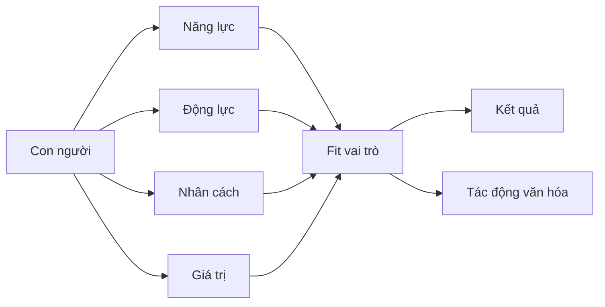

# Tập 7: Tâm Lý Nhân Sự Và Dùng Người

**Hiểu động lực, năng lực, nhân cách, sự phù hợp vai trò và cách xây đội ngũ mạnh**  
Giáo trình ngắn gọn cho người trưởng thành, cấp quản lý/C-level

---

## 0. Vì Sao C-level Cần Học Tâm Lý Nhân Sự?

### Bản chất

Ở cấp cao, một trong những đòn bẩy lớn nhất không phải là tự làm nhiều hơn.  
Đó là **đặt đúng người vào đúng việc, đúng môi trường, đúng kỳ vọng và đúng mức quyền hạn**.

Nhiều tổ chức không thất bại vì thiếu người giỏi.  
Họ thất bại vì:

- Tuyển sai người cho sai giai đoạn
- Giữ người không còn phù hợp quá lâu
- Đánh giá nhầm năng lực với sự tự tin
- Nhầm trung thành với hiệu quả
- Giao việc không đúng cấu hình con người
- Không phát hiện người giỏi nhưng độc hại
- Không xây được lớp lãnh đạo kế cận

### Một câu cần nhớ

> Dùng người không phải là hỏi người này tốt hay dở. Dùng người là hỏi người này phù hợp với vai trò, giai đoạn, văn hóa và mức trách nhiệm nào.

### Mục tiêu tập này

Sau tập này, bạn cần làm được 5 việc:

| Năng lực | Ý nghĩa thực tế |
|---|---|
| Đọc năng lực thật | Không bị đánh lừa bởi ấn tượng |
| Hiểu động lực | Biết điều gì làm người đó hành động |
| Đánh giá fit | Đặt người đúng vai trò/giai đoạn |
| Quản trị người khó | Không né vấn đề nhân sự nhạy cảm |
| Xây đội ngũ kế cận | Giảm phụ thuộc vào cá nhân |

---

## 1. First Principles: Dùng Người Là Gì?

### Bản chất

Dùng người là thiết kế sự phù hợp giữa con người và nhiệm vụ.

```text
Dùng người = Năng lực + Động lực + Nhân cách + Giá trị + Vai trò + Môi trường + Giai đoạn
```

Nếu chỉ nhìn một yếu tố, dễ sai.

| Chỉ nhìn | Rủi ro |
|---|---|
| Năng lực | Người giỏi nhưng phá văn hóa |
| Thái độ | Người dễ chịu nhưng không tạo kết quả |
| Kinh nghiệm | Kinh nghiệm cũ không fit bối cảnh mới |
| Trung thành | Giữ người không còn phù hợp |
| Thành tích quá khứ | Không dự báo được vai trò mới |
| Sự tự tin | Nhầm nói hay với làm được |

### Mô hình tổng quát



### Câu hỏi gốc

```text
1. Người này tạo ra kết quả thật nào?
2. Họ tạo kết quả bằng cách nào?
3. Họ mạnh trong môi trường nào?
4. Họ yếu trong môi trường nào?
5. Cái giá văn hóa khi dùng người này là gì?
```

---

## 2. Năng Lực Thật: Không Phải Nói Hay, Mà Là Tạo Kết Quả

### Bản chất

Năng lực thật là khả năng tạo kết quả lặp lại trong điều kiện thực tế.

Nó gồm:

- Hiểu vấn đề
- Chọn ưu tiên
- Ra quyết định
- Huy động nguồn lực
- Thực thi
- Học từ phản hồi
- Tạo kết quả qua người khác

### Năm tầng năng lực

| Tầng | Biểu hiện |
|---|---|
| Biết | Có kiến thức |
| Làm | Tự làm được |
| Làm ổn định | Lặp lại kết quả |
| Làm qua người khác | Dẫn đội tạo kết quả |
| Xây hệ thống | Tạo năng lực tổ chức |

### Sai lầm khi đánh giá năng lực

| Sai lầm | Hậu quả |
|---|---|
| Nghe nói hay | Tuyển người thuyết trình tốt nhưng thực thi yếu |
| Nhìn công ty cũ | Nhầm thương hiệu công ty với năng lực cá nhân |
| Tin thành tích chung | Không biết người đó đóng góp thật bao nhiêu |
| Đánh giá qua cảm tình | Thiếu công bằng |
| Không kiểm tra bối cảnh | Người từng thành công ở scale khác có thể fail |

### Câu hỏi kiểm tra năng lực thật

```text
1. Kết quả cụ thể người này tạo ra là gì?
2. Vai trò thật của họ trong kết quả đó là gì?
3. Họ có tự thiết kế cách làm hay chỉ vận hành hệ thống có sẵn?
4. Họ xử lý thất bại thế nào?
5. Nếu chuyển sang bối cảnh ít nguồn lực hơn, họ còn tạo kết quả không?
```

---

## 3. Động Lực: Người Ta Làm Việc Vì Điều Gì?

### Bản chất

Động lực là năng lượng khiến con người hành động.

Người khác nhau bị kéo bởi những thứ khác nhau:

- Tiền
- Thành tựu
- Học hỏi
- Ảnh hưởng
- Tự chủ
- An toàn
- Công nhận
- Sứ mệnh
- Quyền lực
- Quan hệ

### Bản đồ động lực

| Động lực | Khi phù hợp | Khi lệch |
|---|---|---|
| Thành tựu | Tạo kết quả mạnh | Dễ hy sinh con người |
| Học hỏi | Phát triển nhanh | Chán việc lặp lại |
| Quyền lực | Dẫn dắt, mở ảnh hưởng | Chính trị, kiểm soát |
| An toàn | Ổn định, bền bỉ | Ngại đổi mới |
| Công nhận | Nhiệt tình, muốn đóng góp | Dễ tổn thương vì feedback |
| Tự chủ | Chủ động, sáng tạo | Khó chịu với kiểm soát |
| Sứ mệnh | Bền với việc khó | Dễ thất vọng nếu giá trị lệch |

### Câu hỏi đọc động lực

```text
1. Người này tự nhiên có năng lượng với việc gì?
2. Họ chịu khổ vì điều gì?
3. Họ thường phàn nàn khi mất điều gì?
4. Họ muốn được công nhận vì điều gì?
5. Khi không bị ép, họ vẫn chọn làm gì?
```

### Nguyên tắc

> Một người có năng lực nhưng động lực lệch vai trò sẽ xuống năng lượng rất nhanh.

---

## 4. Nhân Cách: Cấu Hình Phản Ứng Ổn Định

### Bản chất

Nhân cách là khuynh hướng phản ứng tương đối ổn định trước thế giới.

Không có kiểu nhân cách đúng tuyệt đối.  
Chỉ có fit hoặc không fit với vai trò, văn hóa và giai đoạn.

### Big Five ứng dụng trong dùng người

| Yếu tố | Cao thường | Thấp thường | Lưu ý dùng người |
|---|---|---|---|
| Cởi mở | Sáng tạo, thích cái mới | Thực tế, ổn định | Vai trò đổi mới cần cao hơn |
| Kỷ luật | Có tổ chức, đáng tin | Linh hoạt, tùy hứng | Vai trò vận hành cần cao hơn |
| Hướng ngoại | Giao tiếp, năng lượng xã hội | Tập trung, sâu | Đừng nhầm hướng ngoại với lãnh đạo |
| Dễ hợp tác | Mềm, hòa hợp | Thẳng, cạnh tranh | Vai trò đàm phán có thể cần thấp vừa phải |
| Nhạy cảm cảm xúc | Nhìn rủi ro, tinh tế | Bình tĩnh, ít dao động | Áp lực cao cần biết tự điều chỉnh |

### Ví dụ fit vai trò

| Vai trò | Cần nổi bật |
|---|---|
| COO | Kỷ luật, ổn định, chịu hệ thống |
| CPO đổi mới | Cởi mở, tò mò, chịu mơ hồ |
| CRO | Thành tựu, năng lượng xã hội, cạnh tranh lành mạnh |
| CFO | Kỷ luật, thận trọng, chính trực |
| CHRO | Đọc người, chính trực, cân bằng đồng cảm và tiêu chuẩn |
| Chief of Staff | Tổ chức, kín đáo, đọc hệ thống, xử lý mơ hồ |

### Câu hỏi thực tế

```text
1. Vai trò này cần tính cách nào để thành công?
2. Tính cách tự nhiên của người này hỗ trợ hay cản vai trò?
3. Điểm mạnh của họ khi quá mức sẽ thành điểm yếu gì?
4. Môi trường nào làm họ tốt nhất?
```

---

## 5. Giá Trị Và Chính Trực: Tầng Không Thể Bù Bằng Năng Lực

### Bản chất

Giá trị là điều một người xem là quan trọng khi phải lựa chọn.

Chính trực là mức độ người đó hành động nhất quán với điều họ nói là quan trọng, đặc biệt khi có áp lực.

### Vì sao tầng này quan trọng?

Người có năng lực cao nhưng giá trị lệch có thể tạo kết quả ngắn hạn và phá tổ chức dài hạn.

### Dấu hiệu rủi ro giá trị

| Dấu hiệu | Ý nghĩa |
|---|---|
| Nhận công, đẩy lỗi | Thiếu ownership |
| Nói khác nhau với từng người | Thiếu nhất quán |
| Coi thường người yếu thế | Rủi ro quyền lực |
| Giỏi thao túng câu chuyện | Rủi ro chính trị |
| Đạt kết quả bằng cách đốt đội | Chi phí văn hóa cao |
| Không giữ cam kết nhỏ | Khó tin ở cam kết lớn |

### Câu hỏi kiểm tra chính trực

```text
1. Khi có áp lực, người này hy sinh điều gì đầu tiên?
2. Họ đối xử với người không có quyền lực thế nào?
3. Họ nói về thất bại cũ ra sao?
4. Họ có nhận phần trách nhiệm của mình không?
5. Người từng làm cùng họ nói gì khi không cần xã giao?
```

### Nguyên tắc

> Năng lực có thể phát triển. Chính trực thấp ở vị trí quyền lực cao là rủi ro hệ thống.

---

## 6. Fit Vai Trò: Người Giỏi Sai Vai Vẫn Thất Bại

### Bản chất

Fit vai trò là mức phù hợp giữa cấu hình con người và yêu cầu thật của công việc.

Một người có thể rất giỏi nhưng vẫn fail nếu:

- Sai giai đoạn công ty
- Sai mức mơ hồ
- Sai tốc độ
- Sai văn hóa
- Sai mức quyền lực
- Sai loại vấn đề
- Sai kiểu đội ngũ

### Giai đoạn công ty và kiểu người

| Giai đoạn | Cần kiểu người |
|---|---|
| 0-1 | Chịu mơ hồ, tự tạo đường, tốc độ cao |
| 1-10 | Biết xây quy trình vừa đủ, scale đội nhỏ |
| 10-100 | Xây hệ thống, quản trị middle layer |
| Tái cấu trúc | Dám cắt bỏ, chịu xung đột, rõ ưu tiên |
| Ổn định | Kỷ luật, tối ưu, giữ chất lượng |

### Câu hỏi fit vai trò

```text
1. Vai trò này cần tạo kết quả gì trong 12 tháng?
2. Mức mơ hồ của vai trò cao hay thấp?
3. Vai trò cần builder, scaler, optimizer hay fixer?
4. Người này đã từng thành công ở bối cảnh tương tự chưa?
5. Điểm mạnh tự nhiên của họ có khớp với việc khó nhất của vai trò không?
```

### Nguyên tắc

> Tuyển người theo danh tiếng quá khứ mà không kiểm tra fit bối cảnh là một trong những lỗi đắt nhất.

---

## 7. Tuyển Dụng Cấp Cao

### Bản chất

Tuyển dụng cấp cao là quyết định chiến lược, không phải chỉ là lấp vị trí.

Người cấp cao ảnh hưởng đến:

- Chất lượng quyết định
- Văn hóa
- Tốc độ tổ chức
- Chuẩn tuyển người sau đó
- Niềm tin của đội ngũ
- Cách quyền lực được dùng

### Sai lầm phổ biến

| Sai lầm | Hậu quả |
|---|---|
| Tuyển vì logo công ty cũ | Không fit bối cảnh |
| Bị hấp dẫn bởi sự tự tin | Nhầm tự tin với năng lực |
| Không kiểm tra giá trị | Có người giỏi nhưng độc hại |
| Không làm reference sâu | Bỏ qua tín hiệu đỏ |
| Không rõ scorecard | Mỗi người phỏng vấn một kiểu |
| Tuyển người giống mình | Thiếu đa dạng năng lực |

### Scorecard tuyển dụng

```text
Vai trò:
Kết quả cần tạo trong 12 tháng:
Năng lực bắt buộc:
Năng lực cộng thêm:
Kiểu bối cảnh đã từng trải qua:
Giá trị không thỏa hiệp:
Điểm đỏ cần loại:
Mức quyền hạn:
Môi trường phù hợp:
```

### Câu hỏi phỏng vấn tốt

```text
1. Kể về một kết quả lớn anh/chị tạo ra. Vai trò thật của anh/chị là gì?
2. Một lần anh/chị thất bại do đánh giá sai con người?
3. Khi team không đạt chuẩn, anh/chị xử lý thế nào?
4. Anh/chị đã từng xây hệ thống gì tồn tại sau khi mình rời đi?
5. Người từng làm dưới anh/chị sẽ nói điểm khó nhất khi làm với anh/chị là gì?
```

---

## 8. Reference Check: Nghe Điều Người Ứng Viên Không Tự Nói

### Bản chất

Reference check tốt không chỉ xác minh CV.  
Nó tìm hiểu mô hình hành vi lặp lại trong thực tế.

### Câu hỏi reference sâu

```text
1. Người này tạo giá trị lớn nhất ở đâu?
2. Họ cần môi trường nào để phát huy?
3. Khi áp lực, họ thay đổi thế nào?
4. Điểm mù lớn nhất là gì?
5. Ai không nên làm việc với người này?
6. Nếu được làm lại, anh/chị có tuyển lại không?
7. Tôi cần quản trị người này thế nào để họ thành công?
```

### Cách nghe reference

| Tín hiệu | Ý nghĩa |
|---|---|
| Trả lời quá chung | Có thể né nói thật |
| Khen năng lực nhưng im về giá trị | Cần hỏi sâu |
| "Rất mạnh nhưng..." | Phần sau chữ nhưng thường quan trọng |
| Không muốn tuyển lại | Tín hiệu đỏ mạnh |
| Nhiều người nói cùng một điểm mù | Mô hình lặp lại |

### Nguyên tắc

> Đừng chỉ hỏi người này giỏi không. Hỏi cái giá khi dùng người này là gì.

---

## 9. Onboarding: Người Giỏi Cũng Cần Được Đặt Vào Hệ Thống Đúng

### Bản chất

Onboarding không phải là giới thiệu công ty.  
Onboarding là giúp người mới hiểu thực tại, quyền lực, kỳ vọng, văn hóa và cách tạo kết quả.

### Người cấp cao mới cần biết

| Chủ đề | Câu hỏi |
|---|---|
| Chiến lược | Điều gì thật sự quan trọng? |
| Quyền lực | Ai ảnh hưởng đến quyết định? |
| Văn hóa | Điều gì được thưởng/phạt thật? |
| Người | Ai là nhân sự then chốt? |
| Rủi ro | Vấn đề nào đang bị né? |
| Kỳ vọng | 30-60-90 ngày cần gì? |

### Checklist 90 ngày

```text
30 ngày: Hiểu thực tại, người, dữ kiện, văn hóa.
60 ngày: Chẩn đoán vấn đề, tạo vài thắng lợi nhỏ.
90 ngày: Chốt ưu tiên, cấu trúc đội, cam kết kế hoạch.
```

### Sai lầm

| Sai lầm | Hậu quả |
|---|---|
| Vào là thay đổi mạnh | Kích hoạt phản kháng |
| Tin dữ kiện từ một phe | Bị kéo vào chính trị |
| Không rõ kỳ vọng CEO | Lệch ưu tiên |
| Không xây quan hệ ngang hàng | Khó phối hợp |
| Không phát hiện văn hóa ngầm | Quyết định sai |

---

## 10. Đánh Giá Hiệu Suất: Kết Quả Và Cách Tạo Kết Quả

### Bản chất

Đánh giá người không chỉ nhìn kết quả.  
Phải nhìn cả cách họ tạo kết quả.

```text
Đánh giá = Kết quả + Cách làm + Tác động lên đội ngũ + Khả năng học
```

### Ma trận đánh giá

|  | Giá trị/văn hóa tốt | Giá trị/văn hóa xấu |
|---|---|---|
| Kết quả cao | Giữ và phát triển | Rủi ro độc hại |
| Kết quả thấp | Coach hoặc đổi vai | Cần xử lý nhanh |

### Người giỏi nhưng độc hại

Biểu hiện:

- Tạo kết quả bằng sợ hãi
- Làm đội ngũ kiệt sức
- Giữ thông tin để có quyền lực
- Hạ thấp người khác
- Tạo phe nhóm
- Khiến người giỏi rời đi

### Câu hỏi đánh giá

```text
1. Người này tạo kết quả gì?
2. Kết quả đó có bền không?
3. Đội ngũ dưới họ mạnh lên hay yếu đi?
4. Họ có làm tăng niềm tin trong tổ chức không?
5. Nếu giữ cách làm hiện tại 12 tháng nữa, cái giá là gì?
```

---

## 11. Giao Việc Và Quản Trị Kỳ Vọng

### Bản chất

Giao việc tốt là làm rõ:

- Kết quả
- Tiêu chuẩn
- Quyền hạn
- Ranh giới
- Mốc kiểm tra
- Cách báo rủi ro

### Công thức giao việc

```text
1. Kết quả cần đạt:
2. Vì sao quan trọng:
3. Tiêu chuẩn tốt:
4. Quyền quyết định:
5. Ranh giới không vượt:
6. Mốc kiểm tra:
7. Khi gặp rủi ro, báo thế nào:
```

### Sai lầm phổ biến

| Sai lầm | Hậu quả |
|---|---|
| Chỉ nói việc, không nói kết quả | Người làm sai trọng tâm |
| Không nói tiêu chuẩn | Mỗi người hiểu một kiểu |
| Không giao quyền | Người làm không thể chịu trách nhiệm |
| Không có mốc check | Phát hiện lệch quá muộn |
| Micromanage | Người giỏi mất động lực |

### Nguyên tắc

> Giao trách nhiệm mà không giao quyền là tạo thất bại có tổ chức.

---

## 12. Giữ Người: Không Chỉ Là Lương

### Bản chất

Người giỏi ở lại khi họ thấy:

- Có ý nghĩa
- Có tăng trưởng
- Có công bằng
- Có người lãnh đạo đáng tin
- Có quyền làm việc đúng
- Có tương lai đáng để đầu tư
- Có môi trường không làm họ nhỏ đi

### Lý do người giỏi rời đi

| Lý do bề mặt | Bản chất có thể là |
|---|---|
| Lương | Cảm thấy giá trị không được công nhận |
| Cơ hội mới | Ở đây không còn tăng trưởng |
| Không hợp văn hóa | Mất niềm tin vào cách vận hành |
| Sếp trực tiếp | Không được tôn trọng/phát triển |
| Burnout | Hệ thống dùng người quá mức |
| Muốn thử thách | Vai trò hiện tại quá nhỏ |

### Câu hỏi giữ người

```text
1. Người này còn đang học và lớn lên không?
2. Họ có được dùng đúng điểm mạnh không?
3. Họ có thấy công bằng không?
4. Họ có tin lãnh đạo không?
5. Điều gì nếu không đổi sẽ khiến họ rời đi?
```

### Nguyên tắc

> Giữ người giỏi bắt đầu trước khi họ muốn nghỉ.

---

## 13. Sa Thải Và Chia Tay Trưởng Thành

### Bản chất

Không phải ai cũng nên ở lại.  
Chia tay đúng lúc có thể tốt cho tổ chức và cho chính người đó.

### Khi nào cần xử lý nhanh?

- Giá trị lệch nghiêm trọng
- Phá niềm tin
- Lặp lại hành vi độc hại
- Không còn fit vai trò sau nhiều hỗ trợ
- Tạo chi phí lớn cho đội ngũ
- Không nhận trách nhiệm

### Sai lầm thường gặp

| Sai lầm | Hậu quả |
|---|---|
| Chờ quá lâu | Đội ngũ mất niềm tin |
| Không nói thật | Người đó không có cơ hội sửa |
| Để cảm xúc dẫn dắt | Thiếu công bằng |
| Làm mất phẩm giá | Tổn thương văn hóa |
| Không truyền thông hợp lý | Tin đồn |

### Nguyên tắc chia tay

```text
Rõ lý do.
Tôn trọng phẩm giá.
Không công kích con người.
Tuân thủ pháp lý/quy trình.
Giữ thông tin cần bảo mật.
Truyền thông đủ để đội ngũ hiểu tiêu chuẩn.
```

### Nguyên tắc

> Giữ một người sai quá lâu là một quyết định nhân sự tác động đến nhiều người đúng.

---

## 14. Phát Triển Lãnh Đạo Kế Cận

### Bản chất

Lãnh đạo kế cận không tự xuất hiện.  
Họ được phát hiện, thử thách, phản hồi và trao quyền có chủ đích.

### Dấu hiệu tiềm năng lãnh đạo

| Dấu hiệu | Ý nghĩa |
|---|---|
| Học nhanh | Chuyển hóa phản hồi thành hành vi |
| Nhận trách nhiệm | Không đổ lỗi |
| Nghĩ hệ thống | Không chỉ xử lý việc trước mắt |
| Tạo người khác mạnh lên | Có năng lực nhân rộng |
| Chịu được mơ hồ | Không cần chỉ dẫn quá chi tiết |
| Chính trực khi áp lực | Đáng tin khi có quyền |

### Cách phát triển

```text
1. Giao bài toán thật, không chỉ việc nhỏ.
2. Cho quyền hạn vừa đủ.
3. Đặt mốc review rõ.
4. Feedback thẳng và sớm.
5. Cho tiếp xúc với vấn đề cross-functional.
6. Quan sát cách họ dùng quyền lực.
```

### Sai lầm

| Sai lầm | Hậu quả |
|---|---|
| Chỉ phát triển người giống mình | Thiếu đa dạng lãnh đạo |
| Giao việc nhưng không giao quyền | Không học được lãnh đạo thật |
| Không cho thất bại có kiểm soát | Người kế cận thiếu bản lĩnh |
| Chỉ nhìn thành tích cá nhân | Bỏ qua năng lực xây đội |

---

## 15. Đội Ngũ Lãnh Đạo: Không Chỉ Là Tập Hợp Người Giỏi

### Bản chất

Một leadership team mạnh không phải là 5-7 cá nhân giỏi đứng cạnh nhau.  
Nó là một hệ thống ra quyết định và chịu trách nhiệm chung.

### Dấu hiệu team lãnh đạo yếu

- Ai cũng bảo vệ phòng ban mình
- Cuộc họp chính im, ngoài họp mới nói
- Không có phản biện thật
- Quyết định chung nhưng thực thi riêng
- Đổ lỗi ngang hàng
- CEO phải làm trọng tài liên tục

### Dấu hiệu team lãnh đạo mạnh

| Dấu hiệu | Ý nghĩa |
|---|---|
| Tranh luận thẳng | Có an toàn và tiêu chuẩn |
| Chốt rồi cam kết | Không phá ngầm |
| Ưu tiên công ty trước phòng ban | Có maturity |
| Báo rủi ro sớm | Có niềm tin |
| Tự xử lý xung đột ngang hàng | CEO không thành nút cổ chai |

### Câu hỏi xây team lãnh đạo

```text
1. Team này có mục tiêu chung thật không?
2. Mọi người có dám phản biện nhau không?
3. Quyết định xong có cam kết thật không?
4. Ai đang tối ưu phòng ban hơn công ty?
5. Xung đột nào đang bị né?
```

---

## 16. Công Cụ Thực Hành

### Công cụ 1: Bản đồ đánh giá nhân sự

```text
Tên:
Vai trò:
Kết quả 12 tháng:
Năng lực lõi:
Động lực chính:
Điểm mạnh:
Điểm mù:
Fit vai trò:
Tác động lên đội ngũ:
Rủi ro văn hóa:
Quyết định: giữ/phát triển/đổi vai/xử lý
```

### Công cụ 2: Scorecard vai trò

```text
Vai trò:
Kết quả cần đạt:
Giai đoạn công ty:
Mức mơ hồ:
Năng lực bắt buộc:
Nhân cách phù hợp:
Giá trị không thỏa hiệp:
Điểm đỏ:
Môi trường để thành công:
```

### Công cụ 3: 1-1 giữ người

```text
Điều gì đang làm bạn có năng lượng nhất?
Điều gì đang hút năng lượng nhất?
Bạn còn đang học được điều gì?
Bạn muốn vai trò của mình lớn lên theo hướng nào?
Điều gì nếu không đổi sẽ khiến bạn cân nhắc rời đi?
Tôi có thể hỗ trợ gì để bạn tạo kết quả tốt hơn?
```

### Công cụ 4: Review leadership team

```text
Mục tiêu chung có rõ không?
Xung đột nào chưa được nói?
Ai đang tối ưu cục bộ?
Quyết định nào bị kéo dài?
Tin xấu có đi lên sớm không?
Team này làm tổ chức mạnh lên hay phụ thuộc CEO hơn?
```

### Công cụ 5: Kế hoạch phát triển kế cận

```text
Người tiềm năng:
Vai trò tương lai:
Năng lực cần phát triển:
Bài toán thật cần giao:
Quyền hạn được trao:
Người mentor:
Mốc review:
Rủi ro cần quan sát:
```

---

## 17. Lộ Trình Thực Hành 4 Tuần

### Tuần 1: Đánh giá lại người chủ chốt

Mục tiêu:

- Nhìn người qua kết quả, cách tạo kết quả và fit vai trò

Bài tập:

- Chọn 5 nhân sự chủ chốt.
- Điền bản đồ đánh giá nhân sự cho từng người.

### Tuần 2: Làm rõ scorecard vai trò

Mục tiêu:

- Không tuyển/giao việc bằng cảm giác

Bài tập:

- Chọn 1 vai trò quan trọng.
- Viết scorecard: kết quả 12 tháng, năng lực, giá trị, điểm đỏ.

### Tuần 3: Giữ người và xử lý người sai

Mục tiêu:

- Không để vấn đề nhân sự kéo dài vì né cảm xúc

Bài tập:

- Có một cuộc 1-1 giữ người với nhân sự quan trọng.
- Xác định một người/vai trò đang cần quyết định rõ hơn.

### Tuần 4: Xây kế cận

Mục tiêu:

- Giảm phụ thuộc vào một vài cá nhân

Bài tập:

- Chọn 2 người có tiềm năng kế cận.
- Thiết kế bài toán thật và quyền hạn để họ lớn lên.

---

## 18. Bảng Tóm Tắt First Principles

| Chủ đề | Bản chất | Câu hỏi áp dụng |
|---|---|---|
| Dùng người | Fit giữa người và nhiệm vụ | Người này fit vai trò/giai đoạn nào? |
| Năng lực | Tạo kết quả lặp lại trong thực tế | Kết quả thật là gì? |
| Động lực | Năng lượng khiến người đó hành động | Người này chịu khổ vì điều gì? |
| Nhân cách | Cấu hình phản ứng ổn định | Điểm mạnh quá mức thành điểm yếu gì? |
| Giá trị | Điều được chọn khi có áp lực | Khi áp lực, họ hy sinh điều gì trước? |
| Fit vai trò | Khớp giữa người và bối cảnh | Vai trò cần builder, scaler hay optimizer? |
| Tuyển dụng | Quyết định chiến lược về con người | Scorecard có rõ không? |
| Đánh giá | Kết quả + cách làm + tác động đội ngũ | Đội dưới họ mạnh lên hay yếu đi? |
| Giữ người | Giữ bằng tăng trưởng, công bằng, niềm tin | Điều gì nếu không đổi sẽ khiến họ rời đi? |
| Sa thải | Bảo vệ tiêu chuẩn và tổ chức | Giữ người này thêm 12 tháng có giá gì? |
| Kế cận | Phát triển lãnh đạo có chủ đích | Ai có thể lớn lên nếu được trao bài toán thật? |

---

## 19. Một Câu Để Nhớ Toàn Bộ Tập 7

> Dùng người trưởng thành là nhìn con người như một hệ năng lực, động lực, giá trị, nhân cách và bối cảnh, rồi thiết kế vai trò để họ tạo kết quả mà không phá hệ thống.

Người lãnh đạo giỏi không chỉ tìm người giỏi.  
Người lãnh đạo giỏi biết ai phù hợp với việc gì, ở giai đoạn nào, với quyền hạn nào, và cái giá văn hóa khi dùng sai người là gì.

