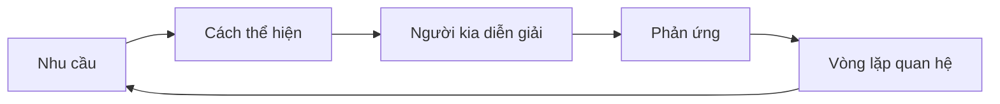
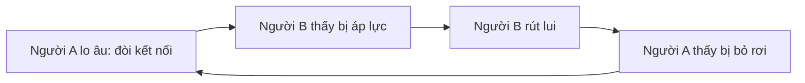

# Tập 8: Tâm Lý Quan Hệ Và Gia Đình

**Hiểu gắn bó, yêu thương, kiểm soát, tổn thương và xung đột trong các mối quan hệ sâu**  
Giáo trình ngắn gọn cho người trưởng thành, cấp quản lý/C-level

---

## 0. Vì Sao C-level Cần Học Tâm Lý Quan Hệ?

### Bản chất

Người càng thành công càng dễ giỏi xử lý công việc nhưng lúng túng trong quan hệ thân mật.

Vì công việc thường dùng:

- Logic
- Quyền hạn
- KPI
- Quyết định
- Kiểm soát

Quan hệ sâu lại cần:

- Lắng nghe
- An toàn
- Tin cậy
- Thấu hiểu
- Ranh giới
- Khả năng yếu mềm

### Một câu cần nhớ

> Quan hệ không hỏng vì thiếu tình cảm một lần. Quan hệ hỏng vì các nhu cầu sâu không được nhìn thấy trong thời gian dài.

### Mục tiêu tập này

| Năng lực | Ý nghĩa thực tế |
|---|---|
| Hiểu nhu cầu gắn bó | Biết vì sao người thân phản ứng mạnh |
| Nhận ra vòng lặp xung đột | Không chỉ tranh luận đúng sai |
| Biết yêu mà không kiểm soát | Giữ kết nối và tự do |
| Đặt ranh giới | Không hy sinh bản thân hoặc áp đặt người khác |
| Chữa lành quan hệ | Biết sửa chữa sau tổn thương |

---

## 1. First Principles: Quan Hệ Là Gì?

### Bản chất

Quan hệ là không gian trao đổi giữa hai con người về:

- An toàn
- Kết nối
- Tin cậy
- Tôn trọng
- Nhu cầu
- Ranh giới
- Ý nghĩa

```text
Quan hệ = Kết nối + Tin cậy + Ranh giới + Giao tiếp + Sửa chữa
```

Nếu chỉ có kết nối mà không có ranh giới, dễ thành lệ thuộc.  
Nếu chỉ có ranh giới mà không có kết nối, dễ thành xa cách.

### Mô hình quan hệ sâu



### Câu hỏi gốc

```text
1. Người này đang cần điều gì?
2. Người này đang sợ mất điều gì?
3. Tôi đang bảo vệ điều gì?
4. Vòng lặp giữa chúng tôi là gì?
5. Tôi có muốn đúng hơn hay muốn hiểu hơn?
```

---

## 2. Nhu Cầu Gắn Bó: Ai Cũng Cần Cảm Thấy Mình Quan Trọng

### Bản chất

Con người cần cảm thấy:

- Được thấy
- Được nghe
- Được chọn
- Được ưu tiên
- Được an toàn
- Được chấp nhận

Trong quan hệ thân mật, nhiều phản ứng mạnh thật ra là câu hỏi ngầm:

> Tôi có còn quan trọng với bạn không?

### Biểu hiện thường gặp

| Bề mặt | Câu hỏi sâu |
|---|---|
| Sao anh/em không nhắn? | Tôi có được ưu tiên không? |
| Anh/em lúc nào cũng bận | Tôi có còn chỗ trong đời bạn không? |
| Em/anh không hiểu tôi | Tôi có được nhìn thấy không? |
| Con không nghe lời | Con có đang cần được chú ý không? |
| Cha mẹ kiểm soát | Họ có đang sợ mất kết nối/ảnh hưởng không? |

### Nguyên tắc

> Trong quan hệ sâu, sự kiện nhỏ có thể kích hoạt nỗi sợ lớn.

---

## 3. Các Kiểu Gắn Bó

### Bản chất

Kiểu gắn bó là cách một người phản ứng với gần gũi, xa cách, xung đột và nguy cơ bị bỏ rơi.

| Kiểu | Khi an toàn | Khi bị kích hoạt |
|---|---|---|
| An toàn | Gần gũi, nói rõ nhu cầu | Có thể bình tĩnh sửa chữa |
| Lo âu | Cần nhiều tín hiệu yêu thương | Bám, hỏi nhiều, sợ bị bỏ |
| Né tránh | Cần tự do, không gian | Rút lui, im lặng, lạnh |
| Hỗn loạn | Vừa muốn gần vừa sợ gần | Phản ứng thất thường |

### Vòng lặp phổ biến

Một người lo âu càng đòi gần.  
Một người né tránh càng rút lui.  
Người rút lui làm người kia càng lo.  
Người đòi hỏi làm người kia càng ngộp.



### Câu hỏi áp dụng

```text
1. Khi xung đột, tôi bám vào hay rút lui?
2. Người kia bám vào hay rút lui?
3. Phản ứng của tôi đang làm nỗi sợ của họ tăng hay giảm?
```

---

## 4. Yêu Thương Khác Kiểm Soát

### Bản chất

Yêu thương là muốn điều tốt cho người kia và cho quan hệ.  
Kiểm soát là dùng áp lực để giảm lo âu của mình.

| Yêu thương | Kiểm soát |
|---|---|
| Tôn trọng tự do | Muốn người kia theo ý mình |
| Nói rõ nhu cầu | Ép bằng giận/im lặng/tội lỗi |
| Có ranh giới | Theo dõi, kiểm tra, áp đặt |
| Muốn hiểu | Muốn thắng |
| Cho người kia lớn lên | Giữ người kia trong khuôn mình cần |

### Câu hỏi tự soi

```text
1. Tôi đang thật sự quan tâm hay đang giảm lo của mình?
2. Tôi có cho người kia quyền khác mình không?
3. Tôi đang yêu người thật hay hình ảnh tôi muốn họ trở thành?
```

---

## 5. Xung Đột Trong Quan Hệ

### Bản chất

Xung đột thân mật thường không chỉ là chuyện đang cãi.

Nó thường là va chạm giữa:

- Nhu cầu kết nối
- Nhu cầu tự do
- Nhu cầu tôn trọng
- Nhu cầu công bằng
- Nhu cầu được công nhận
- Nỗi sợ bị bỏ rơi
- Nỗi sợ bị kiểm soát

### Bốn kiểu phá quan hệ

| Kiểu | Biểu hiện | Tác hại |
|---|---|---|
| Chỉ trích | "Anh/em lúc nào cũng..." | Đánh vào con người |
| Khinh thường | Mỉa mai, coi thường | Phá phẩm giá |
| Phòng vệ | Đổ lỗi, biện minh | Không ai chịu trách nhiệm |
| Im lặng/rút lui | Không phản hồi | Làm người kia bất an |

### Cấu trúc nói chuyện tốt hơn

```text
Khi việc A xảy ra,
tôi cảm thấy B,
vì nhu cầu C của tôi chưa được đáp ứng.
Điều tôi mong là D.
Tôi cũng muốn hiểu góc nhìn của bạn.
```

### Nguyên tắc

> Mục tiêu của xung đột trong quan hệ không phải là thắng. Mục tiêu là hiểu vòng lặp và sửa cách kết nối.

---

## 6. Ranh Giới: Điều Kiện Của Quan Hệ Lành Mạnh

### Bản chất

Ranh giới là sự rõ ràng về điều gì thuộc trách nhiệm của tôi và điều gì thuộc trách nhiệm của người khác.

Ranh giới không phải là lạnh lùng.  
Ranh giới là cách yêu mà không đánh mất mình.

### Các loại ranh giới

| Loại | Ví dụ |
|---|---|
| Thời gian | Tôi cần thời gian nghỉ sau 22h |
| Cảm xúc | Tôi có thể lắng nghe, nhưng không nhận trách nhiệm thay cảm xúc của bạn |
| Tài chính | Khoản này cần thống nhất trước |
| Công việc | Tôi không mang mọi áp lực công ty về nhà |
| Gia đình | Cha mẹ có thể góp ý, nhưng quyết định là của vợ chồng |

### Câu đặt ranh giới

```text
Tôi hiểu điều này quan trọng với bạn.
Điều tôi có thể làm là...
Điều tôi không thể tiếp tục là...
Từ bây giờ, tôi cần...
```

---

## 7. Gia Đình Và Vai Trò Cũ

### Bản chất

Trong gia đình, người trưởng thành vẫn dễ bị kéo về vai cũ:

- Đứa con ngoan
- Người phải gánh vác
- Người hòa giải
- Người thành công để gia đình tự hào
- Người không được yếu
- Người phải làm cha/mẹ hài lòng

### Dấu hiệu vai cũ đang điều khiển

- Khó nói không với cha mẹ
- Thấy tội lỗi khi chọn đời sống riêng
- Thành công nhưng vẫn cần được công nhận
- Dễ nổi nóng với người thân hơn người ngoài
- Cảm thấy mình luôn phải cứu mọi người

### Câu hỏi tự soi

```text
1. Trong gia đình, tôi đang đóng vai gì?
2. Vai này từng giúp tôi sống sót hoặc được yêu thế nào?
3. Bây giờ vai này còn phù hợp không?
4. Tôi cần trưởng thành ra khỏi vai nào?
```

---

## 8. Làm Cha/Mẹ Với Con Cái

### Bản chất

Nuôi con không chỉ là dạy đúng sai.  
Đó là tạo nền an toàn để con phát triển tự chủ, cảm xúc và trách nhiệm.

### Con cần gì?

| Nhu cầu | Nghĩa thực tế |
|---|---|
| An toàn | Con được yêu cả khi sai |
| Ranh giới | Con biết giới hạn |
| Tự chủ | Con được lựa chọn trong khung phù hợp |
| Công nhận | Con được thấy nỗ lực |
| Gương mẫu | Con học từ cách cha mẹ sống |

### Sai lầm của cha mẹ thành đạt

| Sai lầm | Hậu quả |
|---|---|
| Quản trị con như quản trị nhân sự | Con thấy bị kiểm soát |
| Lấy thành tích làm thước đo yêu thương | Con sợ sai |
| Bù đắp bằng vật chất | Thiếu kết nối thật |
| Không cho con thất bại | Con thiếu năng lực chịu khó |
| Áp giấc mơ của mình lên con | Con mất tự chủ |

### Câu hỏi trước khi phản ứng với con

```text
1. Con đang cần dạy kỹ năng hay cần kết nối?
2. Tôi đang phản ứng vì con hay vì nỗi sợ của tôi?
3. Tôi đang muốn con trưởng thành hay muốn con làm tôi yên tâm?
```

---

## 9. Sửa Chữa Sau Tổn Thương

### Bản chất

Quan hệ bền không phải là quan hệ không có tổn thương.  
Quan hệ bền là quan hệ có khả năng sửa chữa.

### Công thức sửa chữa

```text
1. Gọi tên việc đã xảy ra.
2. Nhận phần trách nhiệm của mình.
3. Công nhận tác động lên người kia.
4. Không biện minh ngay.
5. Nói điều sẽ thay đổi.
6. Lặp lại hành vi mới đủ lâu.
```

### Lời xin lỗi yếu và mạnh

| Yếu | Mạnh |
|---|---|
| Nếu em/anh thấy vậy thì xin lỗi | Tôi xin lỗi vì việc tôi đã làm |
| Nhưng lúc đó tôi... | Tôi hiểu việc đó làm bạn tổn thương |
| Thôi bỏ qua đi | Tôi muốn sửa lại niềm tin bằng hành động |

### Nguyên tắc

> Xin lỗi là mở cửa. Hành vi nhất quán mới xây lại niềm tin.

---

## 10. Công Cụ Thực Hành

### Công cụ 1: Bản đồ vòng lặp quan hệ

```text
Tình huống lặp lại:
Tôi thường phản ứng:
Người kia thường phản ứng:
Nỗi sợ của tôi:
Nỗi sợ của họ:
Nhu cầu thật của tôi:
Nhu cầu thật của họ:
Một phản ứng mới tôi có thể thử:
```

### Công cụ 2: Trước cuộc nói chuyện khó với người thân

```text
Tôi muốn kết nối hay muốn thắng?
Điều tôi cần nói rõ là gì?
Tôi đang sợ điều gì?
Người kia có thể sợ điều gì?
Câu mở đầu giữ tôn trọng:
Điều tôi mong sau cuộc nói chuyện:
```

### Công cụ 3: Review quan hệ

| Câu hỏi | Trả lời |
|---|---|
| Quan hệ này đang thiếu điều gì? |  |
| Tôi đang lặp lại vai cũ nào? |  |
| Tôi cần đặt ranh giới nào? |  |
| Tôi cần xin lỗi/sửa chữa điều gì? |  |
| Tôi cần công nhận người kia ở điểm nào? |  |

---

## 11. Lộ Trình Thực Hành 4 Tuần

### Tuần 1: Nhìn vòng lặp

- Chọn một quan hệ quan trọng.
- Viết vòng lặp xung đột thường lặp lại.

### Tuần 2: Nói nhu cầu thay vì chỉ trích

- Dùng cấu trúc: "Khi A, tôi cảm thấy B, vì tôi cần C."
- Không dùng "lúc nào cũng", "không bao giờ".

### Tuần 3: Đặt ranh giới

- Chọn một ranh giới nhỏ cần nói rõ.
- Nói bằng giọng tôn trọng, không trừng phạt.

### Tuần 4: Sửa chữa

- Chọn một tổn thương mình có phần trách nhiệm.
- Xin lỗi đúng cấu trúc và chọn một hành vi mới để lặp lại.

---

## 12. Bảng Tóm Tắt First Principles

| Chủ đề | Bản chất | Câu hỏi áp dụng |
|---|---|---|
| Quan hệ | Kết nối + tin cậy + ranh giới + sửa chữa | Vòng lặp giữa chúng tôi là gì? |
| Gắn bó | Nhu cầu được quan trọng và an toàn | Người này đang sợ mất kết nối không? |
| Kiểm soát | Giảm lo của mình bằng áp lực lên người khác | Tôi đang yêu hay đang kiểm soát? |
| Xung đột | Va chạm nhu cầu và nỗi sợ | Nhu cầu sâu là gì? |
| Ranh giới | Rõ điều thuộc về tôi và người khác | Điều gì tôi không thể tiếp tục? |
| Gia đình | Dễ kéo ta về vai cũ | Tôi đang đóng vai nào? |
| Nuôi con | Tạo an toàn, ranh giới, tự chủ | Tôi đang dạy con hay xả nỗi sợ? |
| Sửa chữa | Nhận trách nhiệm và lặp hành vi mới | Tôi cần sửa bằng hành động nào? |

---

## 13. Một Câu Để Nhớ Toàn Bộ Tập 8

> Quan hệ trưởng thành là nơi con người vừa được kết nối, vừa được là chính mình, vừa có khả năng sửa chữa khi làm nhau tổn thương.

