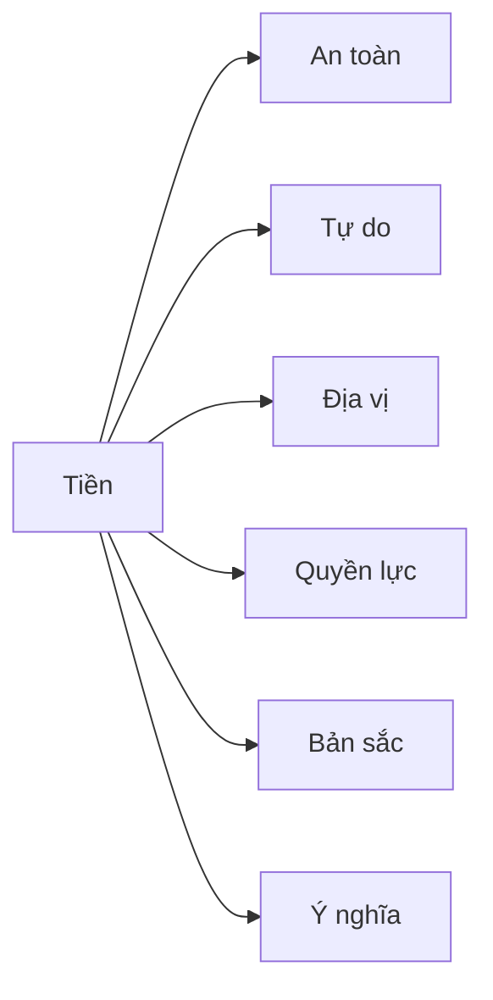
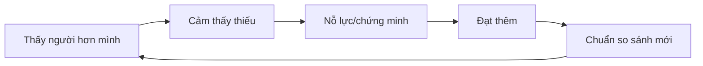

# Tập 9: Tâm Lý Tiền Bạc, Thành Công Và Địa Vị

**Hiểu tham vọng, so sánh, sợ mất, lòng tham, bản sắc thành tựu và tự do nội tâm**  
Giáo trình ngắn gọn cho người trưởng thành, cấp quản lý/C-level

---

## 0. Vì Sao C-level Cần Học Tâm Lý Tiền Bạc Và Thành Công?

### Bản chất

Tiền, thành công và địa vị không chỉ là vấn đề kinh tế.  
Chúng là vấn đề tâm lý rất sâu vì chạm vào:

- An toàn
- Tự do
- Giá trị bản thân
- Quyền lực
- Được công nhận
- So sánh xã hội
- Nỗi sợ mất mát
- Ý nghĩa cuộc đời

### Một câu cần nhớ

> Tiền khuếch đại tâm lý. Nó không tự làm con người tự do nếu bên trong vẫn bị sợ hãi, so sánh và bản sắc thành tựu điều khiển.

### Mục tiêu tập này

| Năng lực | Ý nghĩa thực tế |
|---|---|
| Hiểu quan hệ cá nhân với tiền | Biết tiền đang đại diện cho điều gì |
| Nhận ra so sánh và địa vị | Không bị cuộc chơi xã hội kéo mù |
| Quản trị tham vọng | Thành công mà không tự đốt mình |
| Ra quyết định tài chính tỉnh | Giảm sợ mất, lòng tham và ego |
| Tách giá trị bản thân khỏi thành tựu | Sống tự do hơn |

---

## 1. First Principles: Tiền Là Gì Về Mặt Tâm Lý?

### Bản chất

Tiền là công cụ trao đổi giá trị.  
Nhưng trong tâm lý, tiền thường đại diện cho nhiều thứ khác.

| Tiền đại diện cho | Biểu hiện |
|---|---|
| An toàn | Càng nhiều vẫn sợ thiếu |
| Tự do | Muốn không phụ thuộc ai |
| Quyền lực | Muốn có tiếng nói |
| Công nhận | Muốn chứng minh mình giỏi |
| Tình yêu | Dùng tiền để được cần/được thương |
| Bù đắp | Kiếm tiền để lấp cảm giác thua kém |

### Mô hình



### Câu hỏi gốc

```text
1. Với tôi, tiền chủ yếu đại diện cho điều gì?
2. Tôi đang kiếm tiền để tạo tự do hay để giảm sợ?
3. Tôi có đang dùng tiền để chứng minh giá trị bản thân không?
```

---

## 2. Kịch Bản Tiền Bạc Từ Quá Khứ

### Bản chất

Mỗi người có một "kịch bản tiền bạc" học từ gia đình, văn hóa và trải nghiệm cũ.

Ví dụ:

- Tiền rất khó kiếm
- Có tiền mới được tôn trọng
- Người giàu không đáng tin
- Không bao giờ được thiếu tiền
- Tiền là cách thể hiện yêu thương
- Nói về tiền là xấu hổ

### Các kiểu kịch bản

| Kịch bản | Mặt mạnh | Mặt tối |
|---|---|---|
| Tiền là an toàn | Biết tích lũy | Không bao giờ thấy đủ |
| Tiền là địa vị | Có động lực mạnh | Dễ so sánh |
| Tiền là tự do | Chủ động | Dễ né cam kết |
| Tiền là tình yêu | Rộng rãi | Dễ mua quan hệ |
| Tiền là nguy hiểm | Khiêm tốn | Tự giới hạn |

### Bài tập

```text
Trong nhà tôi ngày xưa, tiền được nói như thế nào?
Cha/mẹ tôi sợ điều gì về tiền?
Tôi đang lặp lại hay chống lại kịch bản đó?
Kịch bản nào không còn phục vụ tôi?
```

---

## 3. Thành Công Và Bản Sắc

### Bản chất

Thành công nguy hiểm khi nó chuyển từ kết quả thành bản sắc.

Khác biệt:

| Lành mạnh | Nguy hiểm |
|---|---|
| Tôi tạo ra thành công | Tôi là thành công của tôi |
| Tôi học từ thất bại | Thất bại làm tôi vô giá trị |
| Tôi có nhiều vai trò | Tôi chỉ là chức danh/thành tựu |
| Tôi dùng thành công để phục vụ giá trị | Tôi dùng thành công để lấp trống |

### Dấu hiệu bị bản sắc thành tựu điều khiển

- Khó nghỉ
- Sợ bị xem là tụt lại
- Không chịu nổi thất bại nhỏ
- Luôn cần mục tiêu lớn hơn
- Thành công xong thấy trống
- Đánh giá mình qua thành tích mới nhất

### Câu hỏi tự soi

```text
1. Nếu không còn chức danh hiện tại, tôi là ai?
2. Tôi có thể cảm thấy có giá trị khi không tạo kết quả không?
3. Tôi đang theo đuổi mục tiêu này vì giá trị hay vì sợ bị xem thường?
```

---

## 4. So Sánh Xã Hội Và Địa Vị

### Bản chất

Con người tự nhiên so sánh vì địa vị từng ảnh hưởng đến cơ hội sống sót, bạn đời, nguồn lực và sự bảo vệ của nhóm.

Nhưng trong xã hội hiện đại, so sánh không có điểm dừng.

### Vòng lặp so sánh



### So sánh hữu ích và độc hại

| Hữu ích | Độc hại |
|---|---|
| Học chiến lược của người giỏi | Tự hạ thấp mình |
| Thấy chuẩn mới | Không bao giờ đủ |
| Tạo động lực | Mất bình an |
| Chọn benchmark phù hợp | So với người ở cuộc chơi khác |

### Câu hỏi

```text
1. Tôi đang so với ai?
2. Người đó có cùng giá trị và cái giá phải trả với tôi không?
3. So sánh này giúp tôi học hay làm tôi mất tự do?
```

---

## 5. Tham Vọng: Nhiên Liệu Và Ngọn Lửa

### Bản chất

Tham vọng là năng lượng muốn vươn lên, tạo tác động, vượt giới hạn hiện tại.

Tham vọng tốt:

- Tạo giá trị
- Phát triển năng lực
- Mở rộng khả năng
- Dẫn dắt người khác

Tham vọng méo:

- Chứng minh bản thân
- Không bao giờ đủ
- Hy sinh sức khỏe/quan hệ
- Coi người khác là công cụ

### Câu hỏi lọc tham vọng

```text
1. Tham vọng này phục vụ giá trị nào?
2. Cái giá của nó là gì?
3. Ai phải trả giá cùng tôi?
4. Nếu không cần chứng minh gì với ai, tôi còn muốn điều này không?
```

### Nguyên tắc

> Tham vọng cần được dẫn bởi giá trị, nếu không nó sẽ bị dẫn bởi sợ hãi và so sánh.

---

## 6. Sợ Mất Và Lòng Tham Trong Quyết Định Tài Chính

### Bản chất

Tiền kích hoạt hai lực mạnh:

- Sợ mất
- Ham được thêm

Cả hai đều có thể làm méo quyết định.

### Biểu hiện

| Cảm xúc | Quyết định méo |
|---|---|
| Sợ mất | Không dám cắt lỗ |
| Tham | Vào deal không hiểu |
| FOMO | Chạy theo cơ hội nóng |
| Tự tin quá mức | Dùng đòn bẩy quá cao |
| Xấu hổ | Giấu sai lầm tài chính |
| Ego | Không nhận mình đánh giá sai |

### Checklist trước quyết định tài chính lớn

```text
1. Tôi hiểu rõ mình đang mua/đầu tư gì không?
2. Nếu sai, downside tối đa là gì?
3. Tôi có đang bị FOMO không?
4. Tôi có kế hoạch thoát không?
5. Tôi có đang dùng tiền để chứng minh mình đúng không?
6. Nếu mất khoản này, đời sống cốt lõi có bị ảnh hưởng không?
```

---

## 7. Tự Do Tài Chính Và Tự Do Nội Tâm

### Bản chất

Tự do tài chính là có đủ nguồn lực để không bị ép bởi sinh tồn ngắn hạn.  
Tự do nội tâm là không bị sợ hãi, so sánh và ham muốn vô hạn điều khiển.

| Có tiền nhưng chưa tự do | Tự do hơn |
|---|---|
| Không dám nghỉ | Biết đủ cho từng giai đoạn |
| Luôn sợ mất | Có hệ thống rủi ro |
| Cần khoe | Không cần chứng minh |
| Bị lifestyle kéo | Chi tiêu theo giá trị |
| Không biết điểm dừng | Có định nghĩa đủ |

### Câu hỏi về "đủ"

```text
1. Với tôi, đủ là gì?
2. Đủ cho an toàn là bao nhiêu?
3. Đủ cho tự do là bao nhiêu?
4. Đủ cho ý nghĩa là gì?
5. Tôi đang vượt qua điểm đủ vì giá trị hay vì sợ?
```

---

## 8. Tiền Và Quan Hệ

### Bản chất

Tiền trong quan hệ không chỉ là tiền.  
Nó có thể là quyền lực, công bằng, kiểm soát, yêu thương, trách nhiệm hoặc tổn thương.

### Vấn đề thường gặp

| Bề mặt | Tầng sâu |
|---|---|
| Ai trả tiền? | Ai có quyền quyết? |
| Tiêu nhiều/quá tiết kiệm | An toàn vs tận hưởng |
| Giúp người thân | Yêu thương vs ranh giới |
| Vợ/chồng bất đồng tài chính | Giá trị và nỗi sợ khác nhau |
| Cho con tiền | Hỗ trợ vs làm yếu tự chủ |

### Câu hỏi trong gia đình

```text
1. Tiền đang đại diện cho điều gì trong quan hệ này?
2. Có ai dùng tiền để kiểm soát hoặc mua sự yên ổn không?
3. Ranh giới tài chính nào cần rõ hơn?
```

---

## 9. Thành Công Có Ý Nghĩa

### Bản chất

Thành công bền cần kết nối với giá trị.

Nếu không, thành công dễ thành vòng lặp:

> Đạt được -> vui ngắn -> quen -> trống -> đặt mục tiêu lớn hơn.

### Bốn câu hỏi ý nghĩa

```text
1. Tôi đang xây điều gì đáng tự hào sau 10 năm?
2. Thành công này phục vụ ai ngoài tôi?
3. Tôi muốn người thân nhớ gì về cách tôi sống?
4. Nếu đã đủ tiền, tôi còn muốn đóng góp gì?
```

### Nguyên tắc

> Thành công không gắn với giá trị sẽ cần được tăng liều liên tục.

---

## 10. Công Cụ Thực Hành

### Công cụ 1: Bản đồ tâm lý tiền bạc

```text
Với tôi, tiền đại diện cho:
Nỗi sợ lớn nhất về tiền:
Kịch bản tiền bạc từ gia đình:
Tôi đang lặp lại điều gì:
Tôi muốn viết lại kịch bản nào:
```

### Công cụ 2: Audit thành công

```text
Mục tiêu tôi đang theo đuổi:
Giá trị thật phía sau:
Nỗi sợ phía sau:
Cái giá phải trả:
Ai bị ảnh hưởng:
Nếu không cần chứng minh, tôi còn chọn không?
```

### Công cụ 3: Định nghĩa đủ

| Tầng | Định nghĩa của tôi |
|---|---|
| Đủ an toàn |  |
| Đủ tự do |  |
| Đủ cho gia đình |  |
| Đủ cho ý nghĩa |  |
| Điểm không đánh đổi |  |

---

## 11. Lộ Trình Thực Hành 4 Tuần

### Tuần 1: Hiểu kịch bản tiền bạc

- Viết lại những câu gia đình/văn hóa từng nói về tiền.
- Chọn một kịch bản không còn phù hợp.

### Tuần 2: Quan sát so sánh

- Mỗi lần so sánh, ghi: tôi so với ai, tôi thấy thiếu gì, tôi học được gì?

### Tuần 3: Audit tham vọng

- Chọn một mục tiêu lớn.
- Phân tích giá trị, nỗi sợ, cái giá, người bị ảnh hưởng.

### Tuần 4: Định nghĩa đủ

- Viết định nghĩa "đủ" cho tiền, thành công, gia đình và sức khỏe.

---

## 12. Bảng Tóm Tắt First Principles

| Chủ đề | Bản chất | Câu hỏi áp dụng |
|---|---|---|
| Tiền | Công cụ nhưng mang ý nghĩa tâm lý | Tiền đại diện cho điều gì với tôi? |
| Kịch bản tiền bạc | Niềm tin học từ quá khứ | Tôi đang lặp lại câu chuyện nào? |
| Thành công | Kết quả, không phải toàn bộ bản sắc | Nếu mất chức danh, tôi là ai? |
| Địa vị | So sánh vị trí xã hội | So sánh này giúp học hay làm mất tự do? |
| Tham vọng | Năng lượng vươn lên | Nó phục vụ giá trị hay sợ hãi? |
| FOMO | Sợ bị bỏ lỡ cơ hội | Tôi hiểu thật hay chỉ sợ lỡ? |
| Tự do | Có nguồn lực và không bị sợ điều khiển | Tôi đã định nghĩa đủ chưa? |
| Ý nghĩa | Thành công gắn với giá trị | Thành công này phục vụ ai? |

---

## 13. Một Câu Để Nhớ Toàn Bộ Tập 9

> Tiền và thành công chỉ thật sự phục vụ bạn khi chúng được dẫn bởi giá trị, không phải bởi sợ hãi, so sánh và nhu cầu chứng minh bản thân.

